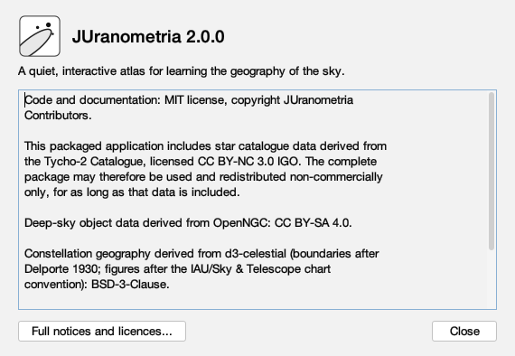
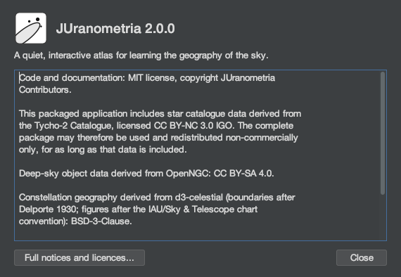
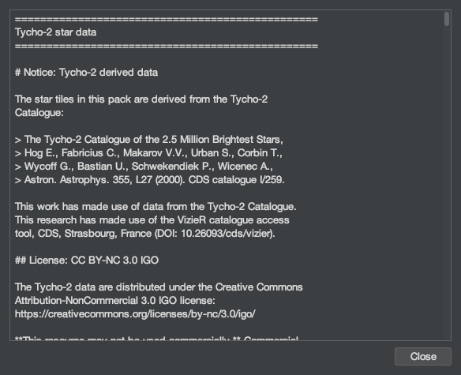
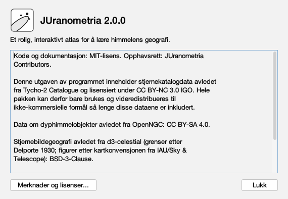
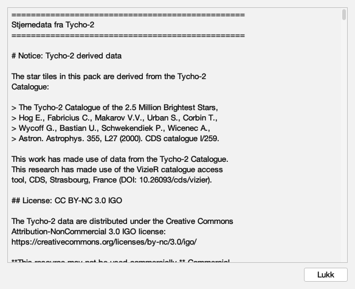
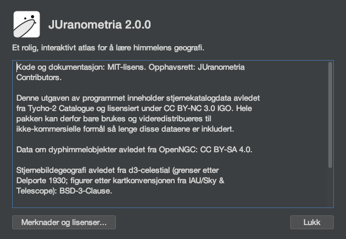

# Every word About says

Issue #350, **draft**. Generated by
`juranometria.tool.AboutSheetMain` from compiled
application classes and their classpath resources.
Packaged acceptance separately verifies that the
interface language resources ship in the application
image.

## Three kinds of words, kept apart

| kind | what happens to it |
|---|---|
| application prose | translated: twelve values and seven headings |
| identity and fact | exact in every language: the name, the version, the source and project names, every licence identifier |
| bundled legal documents | **never translated, never reflowed**: 25 235 characters of upstream text, passed through untouched |

The compact summary sits between the first two: it is
JUranometria's own account of its legal position, so it
is translated - as a **whole document**, held to the
same licensing map as the English one, never mixed
with it paragraph by paragraph.

## English (`en`)

### Application prose

| channel | words |
|---|---|
| window title | About JUranometria |
| window, spoken | Application identity, version, and licensing information |
| heading | JUranometria 2.0.0 |
| description | A quiet, interactive atlas for learning the geography of the sky. |
| summary, spoken name | Licensing summary |
| summary, explanation | The short form of the atlas's licensing. The bundled data and icon notices are behind the button below. |
| notices button | Full notices and licences... |
| notices button, spoken | Full notices and licences |
| notices button, explanation | Opens the complete notices and licence texts for the data and icons bundled with the atlas. |
| notices view, spoken name | Bundled notices and licence texts |
| notices view, explanation | The notices and licence texts for the data and icons bundled with the atlas, in full. |
| close | Close |
| close, explanation | Closes this window and returns to the chart |

### Section headings

| document | heading |
|---|---|
| `tycho2` | Tycho-2 star data |
| `openngc` | OpenNGC deep-sky data |
| `ccbysa` | CC BY-SA 4.0 licence text |
| `constellations` | Constellation geography |
| `staridentities` | Star identities |
| `bsd3` | BSD-3-Clause licence text |
| `tabler` | Tabler icons licence |

### Light

#### Compact



570 × 394 px, `en`.

| channel | words |
|---|---|
| window title | About JUranometria |
| window, spoken | Application identity, version, and licensing information |
| shown | *(the application mark: decorative, no text, no spoken name)* |
| shown | JUranometria 2.0.0 |
| shown | A quiet, interactive atlas for learning the geography of the sky. |
| shown | *(read-only document, 684 characters — printed in full below or listed by path)* |
| shown | Full notices and licences... |
| shown | Close |

#### Full notices and licences


584 × 475 px, `en` — the **viewport**: the stream behind it is 25 235 characters and is accounted for by the table below and by the exact-composition contract, not by this picture.

| channel | words |
|---|---|
| window title | About JUranometria |
| window, spoken | Application identity, version, and licensing information |
| shown | *(read-only document, 26048 characters — printed in full below or listed by path)* |
| shown | Close |


### Dark

#### Compact



570 × 394 px, `en`.

| channel | words |
|---|---|
| window title | About JUranometria |
| window, spoken | Application identity, version, and licensing information |
| shown | *(the application mark: decorative, no text, no spoken name)* |
| shown | JUranometria 2.0.0 |
| shown | A quiet, interactive atlas for learning the geography of the sky. |
| shown | *(read-only document, 684 characters — printed in full below or listed by path)* |
| shown | Full notices and licences... |
| shown | Close |

#### Full notices and licences



584 × 475 px, `en` — the **viewport**: the stream behind it is 25 235 characters and is accounted for by the table below and by the exact-composition contract, not by this picture.

| channel | words |
|---|---|
| window title | About JUranometria |
| window, spoken | Application identity, version, and licensing information |
| shown | *(read-only document, 26048 characters — printed in full below or listed by path)* |
| shown | Close |


### The compact licensing summary, in full

Its own document (684 characters), the canonical English one, used whole because this language has not written its own. Every licence identifier below is exact and untranslated.

```
Code and documentation: MIT license, copyright JUranometria
Contributors.

This packaged application includes star catalogue data derived from
the Tycho-2 Catalogue, licensed CC BY-NC 3.0 IGO. The complete
package may therefore be used and redistributed non-commercially
only, for as long as that data is included.

Deep-sky object data derived from OpenNGC: CC BY-SA 4.0.

Constellation geography derived from d3-celestial (boundaries after
Delporte 1930; figures after the IAU/Sky & Telescope chart
convention): BSD-3-Clause.

Traditional star names and Bayer and Flamsteed designations derived
from d3-celestial: BSD-3-Clause.

Toolbar icons from the Tabler icon set: MIT license.
```

## Norsk bokmål (`nb-NO`)

### Application prose

| channel | words |
|---|---|
| window title | Om JUranometria |
| window, spoken | Programmets navn, versjon og lisensopplysninger |
| heading | JUranometria 2.0.0 |
| description | Et rolig, interaktivt atlas for å lære himmelens geografi. |
| summary, spoken name | Lisenssammendrag |
| summary, explanation | Et sammendrag av lisensene for atlaset. Lisensmerknadene for data og ikoner ligger bak knappen nedenfor. |
| notices button | Merknader og lisenser... |
| notices button, spoken | Merknader og lisenser |
| notices button, explanation | Åpner fullstendige lisensmerknader og lisenstekster for dataene og ikonene som følger med atlaset. |
| notices view, spoken name | Lisensmerknader og lisenstekster |
| notices view, explanation | Fullstendige lisensmerknader og lisenstekster for dataene og ikonene som følger med atlaset. |
| close | Lukk |
| close, explanation | Lukker dette vinduet og går tilbake til kartet |

### Section headings

| document | heading |
|---|---|
| `tycho2` | Stjernedata fra Tycho-2 |
| `openngc` | Dyphimmeldata fra OpenNGC |
| `ccbysa` | Lisensteksten for CC BY-SA 4.0 |
| `constellations` | Stjernebildegeografi |
| `staridentities` | Stjerneidentiteter |
| `bsd3` | Lisensteksten for BSD-3-Clause |
| `tabler` | Lisens for Tabler-ikonene |

### Light

#### Compact



570 × 394 px, `nb-NO`.

| channel | words |
|---|---|
| window title | Om JUranometria |
| window, spoken | Programmets navn, versjon og lisensopplysninger |
| shown | *(the application mark: decorative, no text, no spoken name)* |
| shown | JUranometria 2.0.0 |
| shown | Et rolig, interaktivt atlas for å lære himmelens geografi. |
| shown | *(read-only document, 694 characters — printed in full below or listed by path)* |
| shown | Merknader og lisenser... |
| shown | Lukk |

#### Full notices and licences



584 × 475 px, `nb-NO` — the **viewport**: the stream behind it is 25 235 characters and is accounted for by the table below and by the exact-composition contract, not by this picture.

| channel | words |
|---|---|
| window title | Om JUranometria |
| window, spoken | Programmets navn, versjon og lisensopplysninger |
| shown | *(read-only document, 26073 characters — printed in full below or listed by path)* |
| shown | Lukk |


### Dark

#### Compact



570 × 394 px, `nb-NO`.

| channel | words |
|---|---|
| window title | Om JUranometria |
| window, spoken | Programmets navn, versjon og lisensopplysninger |
| shown | *(the application mark: decorative, no text, no spoken name)* |
| shown | JUranometria 2.0.0 |
| shown | Et rolig, interaktivt atlas for å lære himmelens geografi. |
| shown | *(read-only document, 694 characters — printed in full below or listed by path)* |
| shown | Merknader og lisenser... |
| shown | Lukk |

#### Full notices and licences


584 × 475 px, `nb-NO` — the **viewport**: the stream behind it is 25 235 characters and is accounted for by the table below and by the exact-composition contract, not by this picture.

| channel | words |
|---|---|
| window title | Om JUranometria |
| window, spoken | Programmets navn, versjon og lisensopplysninger |
| shown | *(read-only document, 26073 characters — printed in full below or listed by path)* |
| shown | Lukk |


### The compact licensing summary, in full

Its own document (694 characters), written in this language. Every licence identifier below is exact and untranslated.

```
Kode og dokumentasjon: MIT-lisens. Opphavsrett: JUranometria
Contributors.

Denne utgaven av programmet inneholder stjernekatalogdata avledet
fra Tycho-2 Catalogue og lisensiert under CC BY-NC 3.0 IGO. Hele
pakken kan derfor bare brukes og videredistribueres til
ikke-kommersielle formål så lenge disse dataene er inkludert.

Data om dyphimmelobjekter avledet fra OpenNGC: CC BY-SA 4.0.

Stjernebildegeografi avledet fra d3-celestial (grenser etter
Delporte 1930; figurer etter kartkonvensjonen fra IAU/Sky &
Telescope): BSD-3-Clause.

Tradisjonelle stjernenavn samt Bayer- og Flamsteed-betegnelser
avledet fra d3-celestial: BSD-3-Clause.

Verktøylinjeikoner fra ikonsettet Tabler: MIT-lisens.
```

## The bundled documents

Not reproduced here: they are upstream text, and a copy in a study is a copy that can drift. `AboutTextTest` rebuilds the whole notices view from these and compares it entire, so a document trimmed or reflowed on its way to a reader fails there.

| document | path | characters |
|---|---|---|
| `tycho2` | `/resources/catalog/bright-sky/NOTICE-tycho2.md` | 983 |
| `openngc` | `/resources/catalog/bright-sky/NOTICE-openngc.md` | 800 |
| `ccbysa` | `/resources/catalog/bright-sky/LICENSE-CC-BY-SA-4.0.txt` | 18329 |
| `constellations` | `/resources/geo/constellations/NOTICE-constellations.md` | 1258 |
| `staridentities` | `/resources/catalog/star-identities/NOTICE-star-identities.md` | 1266 |
| `bsd3` | `/resources/geo/constellations/LICENSE-BSD-3-Clause.txt` | 1480 |
| `tabler` | `/resources/icons/LICENSE` | 1072 |
| **seven** | | **25188** |

## The application mark

The mark beside the name is **decorative and
deliberately silent**: no text, no accessible name, no
accessible description. A screen reader is told the
application's name, in words, immediately beside it,
and gains nothing from the position of three stars.

It is recorded here because a channel that is empty by
decision and a channel that was missed look identical
in a report that omits both.
