# Every word the chart's keyboard says

Issue #350. Generated by
`juranometria.tool.ChartKeyboardSheetMain` from
compiled application classes and their classpath
resources. Packaged acceptance separately verifies
that the interface language resources ship in the
application image.

Norwegian is **draft**.

## A palette, not a window

`ChartKeyboard` is a panel added to the frame's
layered pane, so it has **no window and no title**.
Its outer channel is its own accessible context, and
both halves of it are listed with every capture.

It carries **no hover text at all**: not one
`setToolTipText` in the class. That channel is empty
rather than unread, and is recorded as empty.

## What is language here, and what is not

The letter beside each row and the prefix `⌘K` are
notation and are identical in both languages. What is
**between** two keystrokes is not: `ChartKeys.Toggle`
joined them with the English word "then" until this
issue, and it now comes from `ShortcutText` like every
other shortcut sentence in the atlas.

The three notes are **language-specific by design**.
They explain why the letter here differs from the one
on the switch's own control in Chart Options, which is
a fact about a particular language's collisions - so a
language declares a note or declares `!none`, and a
key simply missing is a fault rather than a silence.

## English (`en`)

### The palette itself

| channel | words |
|---|---|
| accessible name | Chart keyboard |
| accessible description, **before any press** | The chart's layers, their shortcuts where available, and their current state. Press a listed letter to switch a layer, or Escape or ⌘K to close. |
| heading | Show on the chart |
| instruction | Press a letter to switch a layer. Escape or ⌘K closes the palette. |
| refused row, shown | Zenith — controlled in Place and Time — no independent shortcut |
| refused row, spoken | Zenith, controlled in Place and Time — no independent shortcut |

### The notes this language gives

| switch | note |
|---|---|
| Flamsteed numbers | F names the figures |
| Stellar-magnitude key | K darkens the sky |
| Black sky | B bounds the constellations |

3 of 20 switches carry a note; the rest declare `!none`, which is a decision rather than a gap.

### What it says as it acts

Three patterns, six rendered forms. After any of them the palette's accessible **description** carries the sentence below instead of the standing instruction - see the deferred finding at the end.

| occasion | words |
|---|---|
| a remembered switch, on | Equatorial grid on — saved. |
| a remembered switch, off | Equatorial grid off — saved. |
| a session-only switch, on | Your meridian on — for this session. |
| a session-only switch, off | Your meridian off — for this session. |
| a letter that reaches a waiting switch | Galaxies unavailable — enable deep-sky objects first. |
| and the other master | Constellation names unavailable — enable constellation figures first. |

### Light

#### Everything off

Every switch clear. All seven dependent rows are unavailable and each names the master it waits for - the state that proves the dependency sentence, which is the one no language can keep in English order.

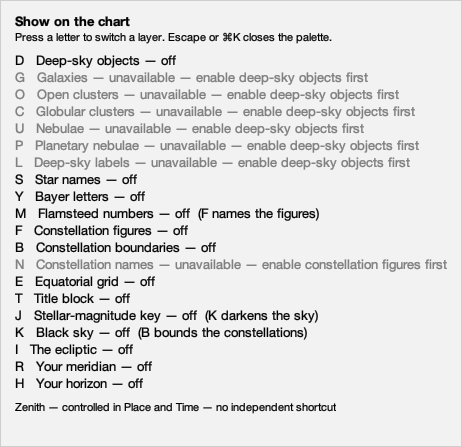

462 × 447 px, `en`.

| shown | spoken |
|---|---|
| Show on the chart | Show on the chart |
| Press a letter to switch a layer. Escape or ⌘K closes the palette. | Press a letter to switch a layer. Escape or ⌘K closes the palette. |
| D Deep-sky objects — off | Deep-sky objects, off, ⌘K then D |
| G Galaxies — unavailable — enable deep-sky objects first  [greyed] | Galaxies, unavailable until deep-sky objects are on, ⌘K then G |
| O Open clusters — unavailable — enable deep-sky objects first  [greyed] | Open clusters, unavailable until deep-sky objects are on, ⌘K then O |
| C Globular clusters — unavailable — enable deep-sky objects first  [greyed] | Globular clusters, unavailable until deep-sky objects are on, ⌘K then C |
| U Nebulae — unavailable — enable deep-sky objects first  [greyed] | Nebulae, unavailable until deep-sky objects are on, ⌘K then U |
| P Planetary nebulae — unavailable — enable deep-sky objects first  [greyed] | Planetary nebulae, unavailable until deep-sky objects are on, ⌘K then P |
| L Deep-sky labels — unavailable — enable deep-sky objects first  [greyed] | Deep-sky labels, unavailable until deep-sky objects are on, ⌘K then L |
| S Star names — off | Star names, off, ⌘K then S |
| Y Bayer letters — off | Bayer letters, off, ⌘K then Y |
| M Flamsteed numbers — off (F names the figures) | Flamsteed numbers, off, ⌘K then M |
| F Constellation figures — off | Constellation figures, off, ⌘K then F |
| B Constellation boundaries — off | Constellation boundaries, off, ⌘K then B |
| N Constellation names — unavailable — enable constellation figures first  [greyed] | Constellation names, unavailable until constellation figures are on, ⌘K then N |
| E Equatorial grid — off | Equatorial grid, off, ⌘K then E |
| T Title block — off | Title block, off, ⌘K then T |
| J Stellar-magnitude key — off (K darkens the sky) | Stellar-magnitude key, off, ⌘K then J |
| K Black sky — off (B bounds the constellations) | Black sky, off, ⌘K then K |
| I The ecliptic — off | The ecliptic, off, ⌘K then I |
| R Your meridian — off | Your meridian, off, ⌘K then R |
| H Your horizon — off | Your horizon, off, ⌘K then H |
| Zenith — controlled in Place and Time — no independent shortcut | Zenith — controlled in Place and Time — no independent shortcut |
|  | Zenith, controlled in Place and Time — no independent shortcut |

#### Everything on

Every switch set, including the three whose letter differs from the one on their own control - so all three notes are visible at once.

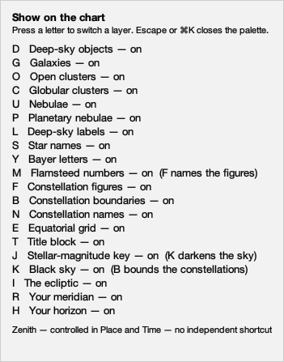

351 × 447 px, `en`.

| shown | spoken |
|---|---|
| Show on the chart | Show on the chart |
| Press a letter to switch a layer. Escape or ⌘K closes the palette. | Press a letter to switch a layer. Escape or ⌘K closes the palette. |
| D Deep-sky objects — on | Deep-sky objects, on, ⌘K then D |
| G Galaxies — on | Galaxies, on, ⌘K then G |
| O Open clusters — on | Open clusters, on, ⌘K then O |
| C Globular clusters — on | Globular clusters, on, ⌘K then C |
| U Nebulae — on | Nebulae, on, ⌘K then U |
| P Planetary nebulae — on | Planetary nebulae, on, ⌘K then P |
| L Deep-sky labels — on | Deep-sky labels, on, ⌘K then L |
| S Star names — on | Star names, on, ⌘K then S |
| Y Bayer letters — on | Bayer letters, on, ⌘K then Y |
| M Flamsteed numbers — on (F names the figures) | Flamsteed numbers, on, ⌘K then M |
| F Constellation figures — on | Constellation figures, on, ⌘K then F |
| B Constellation boundaries — on | Constellation boundaries, on, ⌘K then B |
| N Constellation names — on | Constellation names, on, ⌘K then N |
| E Equatorial grid — on | Equatorial grid, on, ⌘K then E |
| T Title block — on | Title block, on, ⌘K then T |
| J Stellar-magnitude key — on (K darkens the sky) | Stellar-magnitude key, on, ⌘K then J |
| K Black sky — on (B bounds the constellations) | Black sky, on, ⌘K then K |
| I The ecliptic — on | The ecliptic, on, ⌘K then I |
| R Your meridian — on | Your meridian, on, ⌘K then R |
| H Your horizon — on | Your horizon, on, ⌘K then H |
| Zenith — controlled in Place and Time — no independent shortcut | Zenith — controlled in Place and Time — no independent shortcut |
|  | Zenith, controlled in Place and Time — no independent shortcut |

#### The deep-sky master off

Six families and the deep-sky names wait on one switch. Greyed, and said in words as well as in colour, because a reader who cannot see the grey needs the same answer.

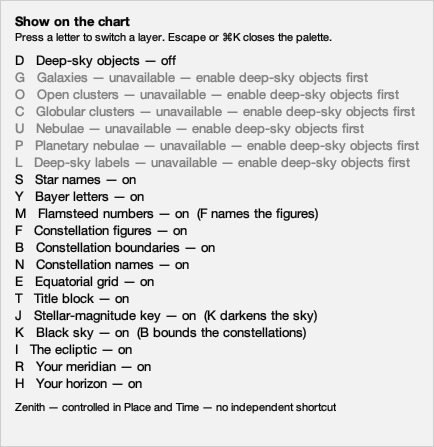

434 × 447 px, `en`.

| shown | spoken |
|---|---|
| Show on the chart | Show on the chart |
| Press a letter to switch a layer. Escape or ⌘K closes the palette. | Press a letter to switch a layer. Escape or ⌘K closes the palette. |
| D Deep-sky objects — off | Deep-sky objects, off, ⌘K then D |
| G Galaxies — unavailable — enable deep-sky objects first  [greyed] | Galaxies, unavailable until deep-sky objects are on, ⌘K then G |
| O Open clusters — unavailable — enable deep-sky objects first  [greyed] | Open clusters, unavailable until deep-sky objects are on, ⌘K then O |
| C Globular clusters — unavailable — enable deep-sky objects first  [greyed] | Globular clusters, unavailable until deep-sky objects are on, ⌘K then C |
| U Nebulae — unavailable — enable deep-sky objects first  [greyed] | Nebulae, unavailable until deep-sky objects are on, ⌘K then U |
| P Planetary nebulae — unavailable — enable deep-sky objects first  [greyed] | Planetary nebulae, unavailable until deep-sky objects are on, ⌘K then P |
| L Deep-sky labels — unavailable — enable deep-sky objects first  [greyed] | Deep-sky labels, unavailable until deep-sky objects are on, ⌘K then L |
| S Star names — on | Star names, on, ⌘K then S |
| Y Bayer letters — on | Bayer letters, on, ⌘K then Y |
| M Flamsteed numbers — on (F names the figures) | Flamsteed numbers, on, ⌘K then M |
| F Constellation figures — on | Constellation figures, on, ⌘K then F |
| B Constellation boundaries — on | Constellation boundaries, on, ⌘K then B |
| N Constellation names — on | Constellation names, on, ⌘K then N |
| E Equatorial grid — on | Equatorial grid, on, ⌘K then E |
| T Title block — on | Title block, on, ⌘K then T |
| J Stellar-magnitude key — on (K darkens the sky) | Stellar-magnitude key, on, ⌘K then J |
| K Black sky — on (B bounds the constellations) | Black sky, on, ⌘K then K |
| I The ecliptic — on | The ecliptic, on, ⌘K then I |
| R Your meridian — on | Your meridian, on, ⌘K then R |
| H Your horizon — on | Your horizon, on, ⌘K then H |
| Zenith — controlled in Place and Time — no independent shortcut | Zenith — controlled in Place and Time — no independent shortcut |
|  | Zenith, controlled in Place and Time — no independent shortcut |

#### The figures master off

The second dependency, with a different master: the constellation names ride the figures.

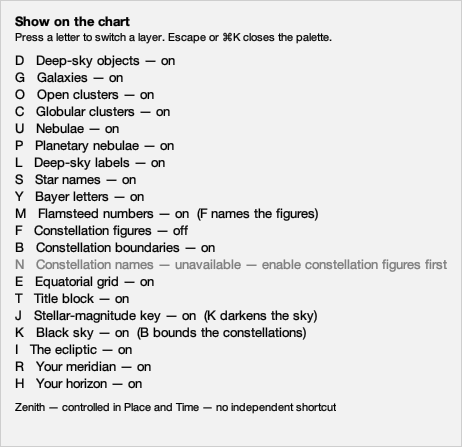

462 × 447 px, `en`.

| shown | spoken |
|---|---|
| Show on the chart | Show on the chart |
| Press a letter to switch a layer. Escape or ⌘K closes the palette. | Press a letter to switch a layer. Escape or ⌘K closes the palette. |
| D Deep-sky objects — on | Deep-sky objects, on, ⌘K then D |
| G Galaxies — on | Galaxies, on, ⌘K then G |
| O Open clusters — on | Open clusters, on, ⌘K then O |
| C Globular clusters — on | Globular clusters, on, ⌘K then C |
| U Nebulae — on | Nebulae, on, ⌘K then U |
| P Planetary nebulae — on | Planetary nebulae, on, ⌘K then P |
| L Deep-sky labels — on | Deep-sky labels, on, ⌘K then L |
| S Star names — on | Star names, on, ⌘K then S |
| Y Bayer letters — on | Bayer letters, on, ⌘K then Y |
| M Flamsteed numbers — on (F names the figures) | Flamsteed numbers, on, ⌘K then M |
| F Constellation figures — off | Constellation figures, off, ⌘K then F |
| B Constellation boundaries — on | Constellation boundaries, on, ⌘K then B |
| N Constellation names — unavailable — enable constellation figures first  [greyed] | Constellation names, unavailable until constellation figures are on, ⌘K then N |
| E Equatorial grid — on | Equatorial grid, on, ⌘K then E |
| T Title block — on | Title block, on, ⌘K then T |
| J Stellar-magnitude key — on (K darkens the sky) | Stellar-magnitude key, on, ⌘K then J |
| K Black sky — on (B bounds the constellations) | Black sky, on, ⌘K then K |
| I The ecliptic — on | The ecliptic, on, ⌘K then I |
| R Your meridian — on | Your meridian, on, ⌘K then R |
| H Your horizon — on | Your horizon, on, ⌘K then H |
| Zenith — controlled in Place and Time — no independent shortcut | Zenith — controlled in Place and Time — no independent shortcut |
|  | Zenith, controlled in Place and Time — no independent shortcut |

### Dark

#### Everything off

Every switch clear. All seven dependent rows are unavailable and each names the master it waits for - the state that proves the dependency sentence, which is the one no language can keep in English order.

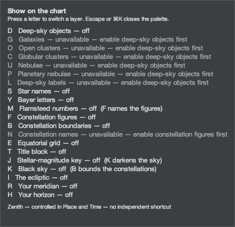

462 × 447 px, `en`.

| shown | spoken |
|---|---|
| Show on the chart | Show on the chart |
| Press a letter to switch a layer. Escape or ⌘K closes the palette. | Press a letter to switch a layer. Escape or ⌘K closes the palette. |
| D Deep-sky objects — off | Deep-sky objects, off, ⌘K then D |
| G Galaxies — unavailable — enable deep-sky objects first  [greyed] | Galaxies, unavailable until deep-sky objects are on, ⌘K then G |
| O Open clusters — unavailable — enable deep-sky objects first  [greyed] | Open clusters, unavailable until deep-sky objects are on, ⌘K then O |
| C Globular clusters — unavailable — enable deep-sky objects first  [greyed] | Globular clusters, unavailable until deep-sky objects are on, ⌘K then C |
| U Nebulae — unavailable — enable deep-sky objects first  [greyed] | Nebulae, unavailable until deep-sky objects are on, ⌘K then U |
| P Planetary nebulae — unavailable — enable deep-sky objects first  [greyed] | Planetary nebulae, unavailable until deep-sky objects are on, ⌘K then P |
| L Deep-sky labels — unavailable — enable deep-sky objects first  [greyed] | Deep-sky labels, unavailable until deep-sky objects are on, ⌘K then L |
| S Star names — off | Star names, off, ⌘K then S |
| Y Bayer letters — off | Bayer letters, off, ⌘K then Y |
| M Flamsteed numbers — off (F names the figures) | Flamsteed numbers, off, ⌘K then M |
| F Constellation figures — off | Constellation figures, off, ⌘K then F |
| B Constellation boundaries — off | Constellation boundaries, off, ⌘K then B |
| N Constellation names — unavailable — enable constellation figures first  [greyed] | Constellation names, unavailable until constellation figures are on, ⌘K then N |
| E Equatorial grid — off | Equatorial grid, off, ⌘K then E |
| T Title block — off | Title block, off, ⌘K then T |
| J Stellar-magnitude key — off (K darkens the sky) | Stellar-magnitude key, off, ⌘K then J |
| K Black sky — off (B bounds the constellations) | Black sky, off, ⌘K then K |
| I The ecliptic — off | The ecliptic, off, ⌘K then I |
| R Your meridian — off | Your meridian, off, ⌘K then R |
| H Your horizon — off | Your horizon, off, ⌘K then H |
| Zenith — controlled in Place and Time — no independent shortcut | Zenith — controlled in Place and Time — no independent shortcut |
|  | Zenith, controlled in Place and Time — no independent shortcut |

#### Everything on

Every switch set, including the three whose letter differs from the one on their own control - so all three notes are visible at once.

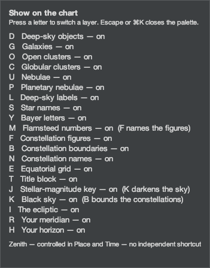

351 × 447 px, `en`.

| shown | spoken |
|---|---|
| Show on the chart | Show on the chart |
| Press a letter to switch a layer. Escape or ⌘K closes the palette. | Press a letter to switch a layer. Escape or ⌘K closes the palette. |
| D Deep-sky objects — on | Deep-sky objects, on, ⌘K then D |
| G Galaxies — on | Galaxies, on, ⌘K then G |
| O Open clusters — on | Open clusters, on, ⌘K then O |
| C Globular clusters — on | Globular clusters, on, ⌘K then C |
| U Nebulae — on | Nebulae, on, ⌘K then U |
| P Planetary nebulae — on | Planetary nebulae, on, ⌘K then P |
| L Deep-sky labels — on | Deep-sky labels, on, ⌘K then L |
| S Star names — on | Star names, on, ⌘K then S |
| Y Bayer letters — on | Bayer letters, on, ⌘K then Y |
| M Flamsteed numbers — on (F names the figures) | Flamsteed numbers, on, ⌘K then M |
| F Constellation figures — on | Constellation figures, on, ⌘K then F |
| B Constellation boundaries — on | Constellation boundaries, on, ⌘K then B |
| N Constellation names — on | Constellation names, on, ⌘K then N |
| E Equatorial grid — on | Equatorial grid, on, ⌘K then E |
| T Title block — on | Title block, on, ⌘K then T |
| J Stellar-magnitude key — on (K darkens the sky) | Stellar-magnitude key, on, ⌘K then J |
| K Black sky — on (B bounds the constellations) | Black sky, on, ⌘K then K |
| I The ecliptic — on | The ecliptic, on, ⌘K then I |
| R Your meridian — on | Your meridian, on, ⌘K then R |
| H Your horizon — on | Your horizon, on, ⌘K then H |
| Zenith — controlled in Place and Time — no independent shortcut | Zenith — controlled in Place and Time — no independent shortcut |
|  | Zenith, controlled in Place and Time — no independent shortcut |

#### The deep-sky master off

Six families and the deep-sky names wait on one switch. Greyed, and said in words as well as in colour, because a reader who cannot see the grey needs the same answer.

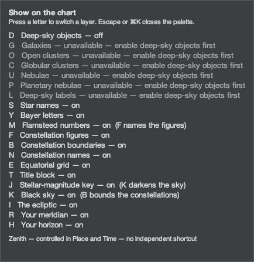

434 × 447 px, `en`.

| shown | spoken |
|---|---|
| Show on the chart | Show on the chart |
| Press a letter to switch a layer. Escape or ⌘K closes the palette. | Press a letter to switch a layer. Escape or ⌘K closes the palette. |
| D Deep-sky objects — off | Deep-sky objects, off, ⌘K then D |
| G Galaxies — unavailable — enable deep-sky objects first  [greyed] | Galaxies, unavailable until deep-sky objects are on, ⌘K then G |
| O Open clusters — unavailable — enable deep-sky objects first  [greyed] | Open clusters, unavailable until deep-sky objects are on, ⌘K then O |
| C Globular clusters — unavailable — enable deep-sky objects first  [greyed] | Globular clusters, unavailable until deep-sky objects are on, ⌘K then C |
| U Nebulae — unavailable — enable deep-sky objects first  [greyed] | Nebulae, unavailable until deep-sky objects are on, ⌘K then U |
| P Planetary nebulae — unavailable — enable deep-sky objects first  [greyed] | Planetary nebulae, unavailable until deep-sky objects are on, ⌘K then P |
| L Deep-sky labels — unavailable — enable deep-sky objects first  [greyed] | Deep-sky labels, unavailable until deep-sky objects are on, ⌘K then L |
| S Star names — on | Star names, on, ⌘K then S |
| Y Bayer letters — on | Bayer letters, on, ⌘K then Y |
| M Flamsteed numbers — on (F names the figures) | Flamsteed numbers, on, ⌘K then M |
| F Constellation figures — on | Constellation figures, on, ⌘K then F |
| B Constellation boundaries — on | Constellation boundaries, on, ⌘K then B |
| N Constellation names — on | Constellation names, on, ⌘K then N |
| E Equatorial grid — on | Equatorial grid, on, ⌘K then E |
| T Title block — on | Title block, on, ⌘K then T |
| J Stellar-magnitude key — on (K darkens the sky) | Stellar-magnitude key, on, ⌘K then J |
| K Black sky — on (B bounds the constellations) | Black sky, on, ⌘K then K |
| I The ecliptic — on | The ecliptic, on, ⌘K then I |
| R Your meridian — on | Your meridian, on, ⌘K then R |
| H Your horizon — on | Your horizon, on, ⌘K then H |
| Zenith — controlled in Place and Time — no independent shortcut | Zenith — controlled in Place and Time — no independent shortcut |
|  | Zenith, controlled in Place and Time — no independent shortcut |

#### The figures master off

The second dependency, with a different master: the constellation names ride the figures.

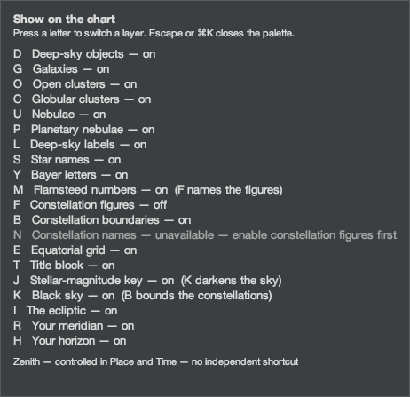

462 × 447 px, `en`.

| shown | spoken |
|---|---|
| Show on the chart | Show on the chart |
| Press a letter to switch a layer. Escape or ⌘K closes the palette. | Press a letter to switch a layer. Escape or ⌘K closes the palette. |
| D Deep-sky objects — on | Deep-sky objects, on, ⌘K then D |
| G Galaxies — on | Galaxies, on, ⌘K then G |
| O Open clusters — on | Open clusters, on, ⌘K then O |
| C Globular clusters — on | Globular clusters, on, ⌘K then C |
| U Nebulae — on | Nebulae, on, ⌘K then U |
| P Planetary nebulae — on | Planetary nebulae, on, ⌘K then P |
| L Deep-sky labels — on | Deep-sky labels, on, ⌘K then L |
| S Star names — on | Star names, on, ⌘K then S |
| Y Bayer letters — on | Bayer letters, on, ⌘K then Y |
| M Flamsteed numbers — on (F names the figures) | Flamsteed numbers, on, ⌘K then M |
| F Constellation figures — off | Constellation figures, off, ⌘K then F |
| B Constellation boundaries — on | Constellation boundaries, on, ⌘K then B |
| N Constellation names — unavailable — enable constellation figures first  [greyed] | Constellation names, unavailable until constellation figures are on, ⌘K then N |
| E Equatorial grid — on | Equatorial grid, on, ⌘K then E |
| T Title block — on | Title block, on, ⌘K then T |
| J Stellar-magnitude key — on (K darkens the sky) | Stellar-magnitude key, on, ⌘K then J |
| K Black sky — on (B bounds the constellations) | Black sky, on, ⌘K then K |
| I The ecliptic — on | The ecliptic, on, ⌘K then I |
| R Your meridian — on | Your meridian, on, ⌘K then R |
| H Your horizon — on | Your horizon, on, ⌘K then H |
| Zenith — controlled in Place and Time — no independent shortcut | Zenith — controlled in Place and Time — no independent shortcut |
|  | Zenith, controlled in Place and Time — no independent shortcut |

## Norsk bokmål (`nb-NO`)

### The palette itself

| channel | words |
|---|---|
| accessible name | Karttastatur |
| accessible description, **before any press** | Kartlagene, tilgjengelige hurtigtaster og hva som er slått på nå. Trykk en bokstav fra listen for å slå et lag av eller på, eller Escape eller ⌘K for å lukke. |
| heading | Vis på kartet |
| instruction | Trykk en bokstav for å slå et lag av eller på. Escape eller ⌘K lukker panelet. |
| refused row, shown | Senit — styres i Sted og tid — ingen egen hurtigtast |
| refused row, spoken | Senit, styres i Sted og tid — ingen egen hurtigtast |

### The notes this language gives

| switch | note |
|---|---|
| Flamsteed-numre | F brukes for stjernebildefigurer |
| Magnitudeforklaring | K brukes for svart himmel |
| Svart himmel | B brukes for stjernebildegrenser |

3 of 20 switches carry a note; the rest declare `!none`, which is a decision rather than a gap.

### What it says as it acts

Three patterns, six rendered forms. After any of them the palette's accessible **description** carries the sentence below instead of the standing instruction - see the deferred finding at the end.

| occasion | words |
|---|---|
| a remembered switch, on | Ekvatorialt rutenett på — lagret. |
| a remembered switch, off | Ekvatorialt rutenett av — lagret. |
| a session-only switch, on | Meridianen din på — for denne økten. |
| a session-only switch, off | Meridianen din av — for denne økten. |
| a letter that reaches a waiting switch | Galakser utilgjengelig — slå på dyphimmelobjekter først. |
| and the other master | Stjernebildenavn utilgjengelig — slå på stjernebildefigurer først. |

### Light

#### Everything off

Every switch clear. All seven dependent rows are unavailable and each names the master it waits for - the state that proves the dependency sentence, which is the one no language can keep in English order.

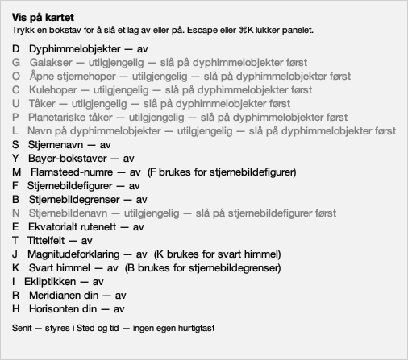

506 × 447 px, `nb-NO`.

| shown | spoken |
|---|---|
| Vis på kartet | Vis på kartet |
| Trykk en bokstav for å slå et lag av eller på. Escape eller ⌘K lukker panelet. | Trykk en bokstav for å slå et lag av eller på. Escape eller ⌘K lukker panelet. |
| D Dyphimmelobjekter — av | Dyphimmelobjekter, av, ⌘K deretter D |
| G Galakser — utilgjengelig — slå på dyphimmelobjekter først  [greyed] | Galakser, utilgjengelig før dyphimmelobjekter er slått på, ⌘K deretter G |
| O Åpne stjernehoper — utilgjengelig — slå på dyphimmelobjekter først  [greyed] | Åpne stjernehoper, utilgjengelig før dyphimmelobjekter er slått på, ⌘K deretter O |
| C Kulehoper — utilgjengelig — slå på dyphimmelobjekter først  [greyed] | Kulehoper, utilgjengelig før dyphimmelobjekter er slått på, ⌘K deretter C |
| U Tåker — utilgjengelig — slå på dyphimmelobjekter først  [greyed] | Tåker, utilgjengelig før dyphimmelobjekter er slått på, ⌘K deretter U |
| P Planetariske tåker — utilgjengelig — slå på dyphimmelobjekter først  [greyed] | Planetariske tåker, utilgjengelig før dyphimmelobjekter er slått på, ⌘K deretter P |
| L Navn på dyphimmelobjekter — utilgjengelig — slå på dyphimmelobjekter først  [greyed] | Navn på dyphimmelobjekter, utilgjengelig før dyphimmelobjekter er slått på, ⌘K deretter L |
| S Stjernenavn — av | Stjernenavn, av, ⌘K deretter S |
| Y Bayer-bokstaver — av | Bayer-bokstaver, av, ⌘K deretter Y |
| M Flamsteed-numre — av (F brukes for stjernebildefigurer) | Flamsteed-numre, av, ⌘K deretter M |
| F Stjernebildefigurer — av | Stjernebildefigurer, av, ⌘K deretter F |
| B Stjernebildegrenser — av | Stjernebildegrenser, av, ⌘K deretter B |
| N Stjernebildenavn — utilgjengelig — slå på stjernebildefigurer først  [greyed] | Stjernebildenavn, utilgjengelig før stjernebildefigurene er slått på, ⌘K deretter N |
| E Ekvatorialt rutenett — av | Ekvatorialt rutenett, av, ⌘K deretter E |
| T Tittelfelt — av | Tittelfelt, av, ⌘K deretter T |
| J Magnitudeforklaring — av (K brukes for svart himmel) | Magnitudeforklaring, av, ⌘K deretter J |
| K Svart himmel — av (B brukes for stjernebildegrenser) | Svart himmel, av, ⌘K deretter K |
| I Ekliptikken — av | Ekliptikken, av, ⌘K deretter I |
| R Meridianen din — av | Meridianen din, av, ⌘K deretter R |
| H Horisonten din — av | Horisonten din, av, ⌘K deretter H |
| Senit — styres i Sted og tid — ingen egen hurtigtast | Senit — styres i Sted og tid — ingen egen hurtigtast |
|  | Senit, styres i Sted og tid — ingen egen hurtigtast |

#### Everything on

Every switch set, including the three whose letter differs from the one on their own control - so all three notes are visible at once.

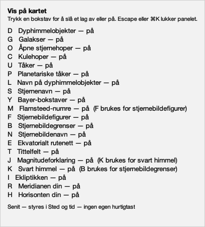

404 × 447 px, `nb-NO`.

| shown | spoken |
|---|---|
| Vis på kartet | Vis på kartet |
| Trykk en bokstav for å slå et lag av eller på. Escape eller ⌘K lukker panelet. | Trykk en bokstav for å slå et lag av eller på. Escape eller ⌘K lukker panelet. |
| D Dyphimmelobjekter — på | Dyphimmelobjekter, på, ⌘K deretter D |
| G Galakser — på | Galakser, på, ⌘K deretter G |
| O Åpne stjernehoper — på | Åpne stjernehoper, på, ⌘K deretter O |
| C Kulehoper — på | Kulehoper, på, ⌘K deretter C |
| U Tåker — på | Tåker, på, ⌘K deretter U |
| P Planetariske tåker — på | Planetariske tåker, på, ⌘K deretter P |
| L Navn på dyphimmelobjekter — på | Navn på dyphimmelobjekter, på, ⌘K deretter L |
| S Stjernenavn — på | Stjernenavn, på, ⌘K deretter S |
| Y Bayer-bokstaver — på | Bayer-bokstaver, på, ⌘K deretter Y |
| M Flamsteed-numre — på (F brukes for stjernebildefigurer) | Flamsteed-numre, på, ⌘K deretter M |
| F Stjernebildefigurer — på | Stjernebildefigurer, på, ⌘K deretter F |
| B Stjernebildegrenser — på | Stjernebildegrenser, på, ⌘K deretter B |
| N Stjernebildenavn — på | Stjernebildenavn, på, ⌘K deretter N |
| E Ekvatorialt rutenett — på | Ekvatorialt rutenett, på, ⌘K deretter E |
| T Tittelfelt — på | Tittelfelt, på, ⌘K deretter T |
| J Magnitudeforklaring — på (K brukes for svart himmel) | Magnitudeforklaring, på, ⌘K deretter J |
| K Svart himmel — på (B brukes for stjernebildegrenser) | Svart himmel, på, ⌘K deretter K |
| I Ekliptikken — på | Ekliptikken, på, ⌘K deretter I |
| R Meridianen din — på | Meridianen din, på, ⌘K deretter R |
| H Horisonten din — på | Horisonten din, på, ⌘K deretter H |
| Senit — styres i Sted og tid — ingen egen hurtigtast | Senit — styres i Sted og tid — ingen egen hurtigtast |
|  | Senit, styres i Sted og tid — ingen egen hurtigtast |

#### The deep-sky master off

Six families and the deep-sky names wait on one switch. Greyed, and said in words as well as in colour, because a reader who cannot see the grey needs the same answer.

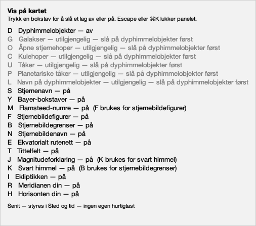

506 × 447 px, `nb-NO`.

| shown | spoken |
|---|---|
| Vis på kartet | Vis på kartet |
| Trykk en bokstav for å slå et lag av eller på. Escape eller ⌘K lukker panelet. | Trykk en bokstav for å slå et lag av eller på. Escape eller ⌘K lukker panelet. |
| D Dyphimmelobjekter — av | Dyphimmelobjekter, av, ⌘K deretter D |
| G Galakser — utilgjengelig — slå på dyphimmelobjekter først  [greyed] | Galakser, utilgjengelig før dyphimmelobjekter er slått på, ⌘K deretter G |
| O Åpne stjernehoper — utilgjengelig — slå på dyphimmelobjekter først  [greyed] | Åpne stjernehoper, utilgjengelig før dyphimmelobjekter er slått på, ⌘K deretter O |
| C Kulehoper — utilgjengelig — slå på dyphimmelobjekter først  [greyed] | Kulehoper, utilgjengelig før dyphimmelobjekter er slått på, ⌘K deretter C |
| U Tåker — utilgjengelig — slå på dyphimmelobjekter først  [greyed] | Tåker, utilgjengelig før dyphimmelobjekter er slått på, ⌘K deretter U |
| P Planetariske tåker — utilgjengelig — slå på dyphimmelobjekter først  [greyed] | Planetariske tåker, utilgjengelig før dyphimmelobjekter er slått på, ⌘K deretter P |
| L Navn på dyphimmelobjekter — utilgjengelig — slå på dyphimmelobjekter først  [greyed] | Navn på dyphimmelobjekter, utilgjengelig før dyphimmelobjekter er slått på, ⌘K deretter L |
| S Stjernenavn — på | Stjernenavn, på, ⌘K deretter S |
| Y Bayer-bokstaver — på | Bayer-bokstaver, på, ⌘K deretter Y |
| M Flamsteed-numre — på (F brukes for stjernebildefigurer) | Flamsteed-numre, på, ⌘K deretter M |
| F Stjernebildefigurer — på | Stjernebildefigurer, på, ⌘K deretter F |
| B Stjernebildegrenser — på | Stjernebildegrenser, på, ⌘K deretter B |
| N Stjernebildenavn — på | Stjernebildenavn, på, ⌘K deretter N |
| E Ekvatorialt rutenett — på | Ekvatorialt rutenett, på, ⌘K deretter E |
| T Tittelfelt — på | Tittelfelt, på, ⌘K deretter T |
| J Magnitudeforklaring — på (K brukes for svart himmel) | Magnitudeforklaring, på, ⌘K deretter J |
| K Svart himmel — på (B brukes for stjernebildegrenser) | Svart himmel, på, ⌘K deretter K |
| I Ekliptikken — på | Ekliptikken, på, ⌘K deretter I |
| R Meridianen din — på | Meridianen din, på, ⌘K deretter R |
| H Horisonten din — på | Horisonten din, på, ⌘K deretter H |
| Senit — styres i Sted og tid — ingen egen hurtigtast | Senit — styres i Sted og tid — ingen egen hurtigtast |
|  | Senit, styres i Sted og tid — ingen egen hurtigtast |

#### The figures master off

The second dependency, with a different master: the constellation names ride the figures.

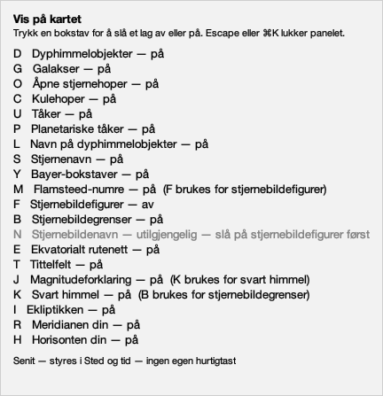

432 × 447 px, `nb-NO`.

| shown | spoken |
|---|---|
| Vis på kartet | Vis på kartet |
| Trykk en bokstav for å slå et lag av eller på. Escape eller ⌘K lukker panelet. | Trykk en bokstav for å slå et lag av eller på. Escape eller ⌘K lukker panelet. |
| D Dyphimmelobjekter — på | Dyphimmelobjekter, på, ⌘K deretter D |
| G Galakser — på | Galakser, på, ⌘K deretter G |
| O Åpne stjernehoper — på | Åpne stjernehoper, på, ⌘K deretter O |
| C Kulehoper — på | Kulehoper, på, ⌘K deretter C |
| U Tåker — på | Tåker, på, ⌘K deretter U |
| P Planetariske tåker — på | Planetariske tåker, på, ⌘K deretter P |
| L Navn på dyphimmelobjekter — på | Navn på dyphimmelobjekter, på, ⌘K deretter L |
| S Stjernenavn — på | Stjernenavn, på, ⌘K deretter S |
| Y Bayer-bokstaver — på | Bayer-bokstaver, på, ⌘K deretter Y |
| M Flamsteed-numre — på (F brukes for stjernebildefigurer) | Flamsteed-numre, på, ⌘K deretter M |
| F Stjernebildefigurer — av | Stjernebildefigurer, av, ⌘K deretter F |
| B Stjernebildegrenser — på | Stjernebildegrenser, på, ⌘K deretter B |
| N Stjernebildenavn — utilgjengelig — slå på stjernebildefigurer først  [greyed] | Stjernebildenavn, utilgjengelig før stjernebildefigurene er slått på, ⌘K deretter N |
| E Ekvatorialt rutenett — på | Ekvatorialt rutenett, på, ⌘K deretter E |
| T Tittelfelt — på | Tittelfelt, på, ⌘K deretter T |
| J Magnitudeforklaring — på (K brukes for svart himmel) | Magnitudeforklaring, på, ⌘K deretter J |
| K Svart himmel — på (B brukes for stjernebildegrenser) | Svart himmel, på, ⌘K deretter K |
| I Ekliptikken — på | Ekliptikken, på, ⌘K deretter I |
| R Meridianen din — på | Meridianen din, på, ⌘K deretter R |
| H Horisonten din — på | Horisonten din, på, ⌘K deretter H |
| Senit — styres i Sted og tid — ingen egen hurtigtast | Senit — styres i Sted og tid — ingen egen hurtigtast |
|  | Senit, styres i Sted og tid — ingen egen hurtigtast |

### Dark

#### Everything off

Every switch clear. All seven dependent rows are unavailable and each names the master it waits for - the state that proves the dependency sentence, which is the one no language can keep in English order.

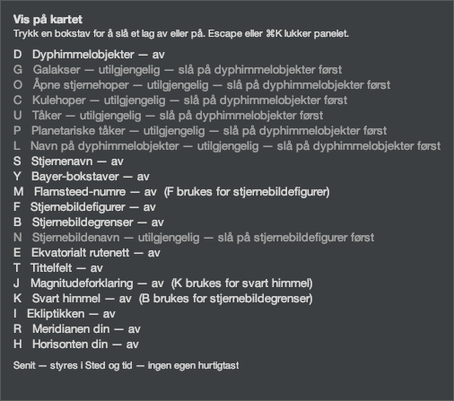

506 × 447 px, `nb-NO`.

| shown | spoken |
|---|---|
| Vis på kartet | Vis på kartet |
| Trykk en bokstav for å slå et lag av eller på. Escape eller ⌘K lukker panelet. | Trykk en bokstav for å slå et lag av eller på. Escape eller ⌘K lukker panelet. |
| D Dyphimmelobjekter — av | Dyphimmelobjekter, av, ⌘K deretter D |
| G Galakser — utilgjengelig — slå på dyphimmelobjekter først  [greyed] | Galakser, utilgjengelig før dyphimmelobjekter er slått på, ⌘K deretter G |
| O Åpne stjernehoper — utilgjengelig — slå på dyphimmelobjekter først  [greyed] | Åpne stjernehoper, utilgjengelig før dyphimmelobjekter er slått på, ⌘K deretter O |
| C Kulehoper — utilgjengelig — slå på dyphimmelobjekter først  [greyed] | Kulehoper, utilgjengelig før dyphimmelobjekter er slått på, ⌘K deretter C |
| U Tåker — utilgjengelig — slå på dyphimmelobjekter først  [greyed] | Tåker, utilgjengelig før dyphimmelobjekter er slått på, ⌘K deretter U |
| P Planetariske tåker — utilgjengelig — slå på dyphimmelobjekter først  [greyed] | Planetariske tåker, utilgjengelig før dyphimmelobjekter er slått på, ⌘K deretter P |
| L Navn på dyphimmelobjekter — utilgjengelig — slå på dyphimmelobjekter først  [greyed] | Navn på dyphimmelobjekter, utilgjengelig før dyphimmelobjekter er slått på, ⌘K deretter L |
| S Stjernenavn — av | Stjernenavn, av, ⌘K deretter S |
| Y Bayer-bokstaver — av | Bayer-bokstaver, av, ⌘K deretter Y |
| M Flamsteed-numre — av (F brukes for stjernebildefigurer) | Flamsteed-numre, av, ⌘K deretter M |
| F Stjernebildefigurer — av | Stjernebildefigurer, av, ⌘K deretter F |
| B Stjernebildegrenser — av | Stjernebildegrenser, av, ⌘K deretter B |
| N Stjernebildenavn — utilgjengelig — slå på stjernebildefigurer først  [greyed] | Stjernebildenavn, utilgjengelig før stjernebildefigurene er slått på, ⌘K deretter N |
| E Ekvatorialt rutenett — av | Ekvatorialt rutenett, av, ⌘K deretter E |
| T Tittelfelt — av | Tittelfelt, av, ⌘K deretter T |
| J Magnitudeforklaring — av (K brukes for svart himmel) | Magnitudeforklaring, av, ⌘K deretter J |
| K Svart himmel — av (B brukes for stjernebildegrenser) | Svart himmel, av, ⌘K deretter K |
| I Ekliptikken — av | Ekliptikken, av, ⌘K deretter I |
| R Meridianen din — av | Meridianen din, av, ⌘K deretter R |
| H Horisonten din — av | Horisonten din, av, ⌘K deretter H |
| Senit — styres i Sted og tid — ingen egen hurtigtast | Senit — styres i Sted og tid — ingen egen hurtigtast |
|  | Senit, styres i Sted og tid — ingen egen hurtigtast |

#### Everything on

Every switch set, including the three whose letter differs from the one on their own control - so all three notes are visible at once.

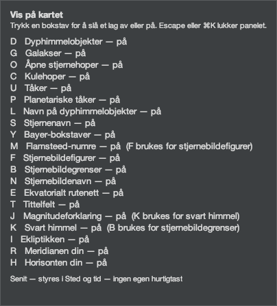

404 × 447 px, `nb-NO`.

| shown | spoken |
|---|---|
| Vis på kartet | Vis på kartet |
| Trykk en bokstav for å slå et lag av eller på. Escape eller ⌘K lukker panelet. | Trykk en bokstav for å slå et lag av eller på. Escape eller ⌘K lukker panelet. |
| D Dyphimmelobjekter — på | Dyphimmelobjekter, på, ⌘K deretter D |
| G Galakser — på | Galakser, på, ⌘K deretter G |
| O Åpne stjernehoper — på | Åpne stjernehoper, på, ⌘K deretter O |
| C Kulehoper — på | Kulehoper, på, ⌘K deretter C |
| U Tåker — på | Tåker, på, ⌘K deretter U |
| P Planetariske tåker — på | Planetariske tåker, på, ⌘K deretter P |
| L Navn på dyphimmelobjekter — på | Navn på dyphimmelobjekter, på, ⌘K deretter L |
| S Stjernenavn — på | Stjernenavn, på, ⌘K deretter S |
| Y Bayer-bokstaver — på | Bayer-bokstaver, på, ⌘K deretter Y |
| M Flamsteed-numre — på (F brukes for stjernebildefigurer) | Flamsteed-numre, på, ⌘K deretter M |
| F Stjernebildefigurer — på | Stjernebildefigurer, på, ⌘K deretter F |
| B Stjernebildegrenser — på | Stjernebildegrenser, på, ⌘K deretter B |
| N Stjernebildenavn — på | Stjernebildenavn, på, ⌘K deretter N |
| E Ekvatorialt rutenett — på | Ekvatorialt rutenett, på, ⌘K deretter E |
| T Tittelfelt — på | Tittelfelt, på, ⌘K deretter T |
| J Magnitudeforklaring — på (K brukes for svart himmel) | Magnitudeforklaring, på, ⌘K deretter J |
| K Svart himmel — på (B brukes for stjernebildegrenser) | Svart himmel, på, ⌘K deretter K |
| I Ekliptikken — på | Ekliptikken, på, ⌘K deretter I |
| R Meridianen din — på | Meridianen din, på, ⌘K deretter R |
| H Horisonten din — på | Horisonten din, på, ⌘K deretter H |
| Senit — styres i Sted og tid — ingen egen hurtigtast | Senit — styres i Sted og tid — ingen egen hurtigtast |
|  | Senit, styres i Sted og tid — ingen egen hurtigtast |

#### The deep-sky master off

Six families and the deep-sky names wait on one switch. Greyed, and said in words as well as in colour, because a reader who cannot see the grey needs the same answer.

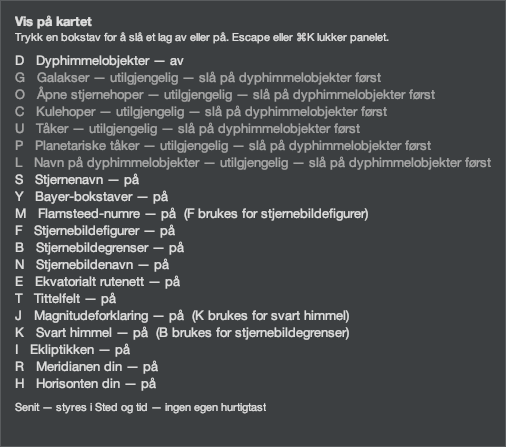

506 × 447 px, `nb-NO`.

| shown | spoken |
|---|---|
| Vis på kartet | Vis på kartet |
| Trykk en bokstav for å slå et lag av eller på. Escape eller ⌘K lukker panelet. | Trykk en bokstav for å slå et lag av eller på. Escape eller ⌘K lukker panelet. |
| D Dyphimmelobjekter — av | Dyphimmelobjekter, av, ⌘K deretter D |
| G Galakser — utilgjengelig — slå på dyphimmelobjekter først  [greyed] | Galakser, utilgjengelig før dyphimmelobjekter er slått på, ⌘K deretter G |
| O Åpne stjernehoper — utilgjengelig — slå på dyphimmelobjekter først  [greyed] | Åpne stjernehoper, utilgjengelig før dyphimmelobjekter er slått på, ⌘K deretter O |
| C Kulehoper — utilgjengelig — slå på dyphimmelobjekter først  [greyed] | Kulehoper, utilgjengelig før dyphimmelobjekter er slått på, ⌘K deretter C |
| U Tåker — utilgjengelig — slå på dyphimmelobjekter først  [greyed] | Tåker, utilgjengelig før dyphimmelobjekter er slått på, ⌘K deretter U |
| P Planetariske tåker — utilgjengelig — slå på dyphimmelobjekter først  [greyed] | Planetariske tåker, utilgjengelig før dyphimmelobjekter er slått på, ⌘K deretter P |
| L Navn på dyphimmelobjekter — utilgjengelig — slå på dyphimmelobjekter først  [greyed] | Navn på dyphimmelobjekter, utilgjengelig før dyphimmelobjekter er slått på, ⌘K deretter L |
| S Stjernenavn — på | Stjernenavn, på, ⌘K deretter S |
| Y Bayer-bokstaver — på | Bayer-bokstaver, på, ⌘K deretter Y |
| M Flamsteed-numre — på (F brukes for stjernebildefigurer) | Flamsteed-numre, på, ⌘K deretter M |
| F Stjernebildefigurer — på | Stjernebildefigurer, på, ⌘K deretter F |
| B Stjernebildegrenser — på | Stjernebildegrenser, på, ⌘K deretter B |
| N Stjernebildenavn — på | Stjernebildenavn, på, ⌘K deretter N |
| E Ekvatorialt rutenett — på | Ekvatorialt rutenett, på, ⌘K deretter E |
| T Tittelfelt — på | Tittelfelt, på, ⌘K deretter T |
| J Magnitudeforklaring — på (K brukes for svart himmel) | Magnitudeforklaring, på, ⌘K deretter J |
| K Svart himmel — på (B brukes for stjernebildegrenser) | Svart himmel, på, ⌘K deretter K |
| I Ekliptikken — på | Ekliptikken, på, ⌘K deretter I |
| R Meridianen din — på | Meridianen din, på, ⌘K deretter R |
| H Horisonten din — på | Horisonten din, på, ⌘K deretter H |
| Senit — styres i Sted og tid — ingen egen hurtigtast | Senit — styres i Sted og tid — ingen egen hurtigtast |
|  | Senit, styres i Sted og tid — ingen egen hurtigtast |

#### The figures master off

The second dependency, with a different master: the constellation names ride the figures.

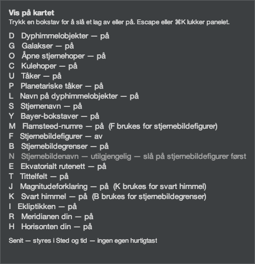

432 × 447 px, `nb-NO`.

| shown | spoken |
|---|---|
| Vis på kartet | Vis på kartet |
| Trykk en bokstav for å slå et lag av eller på. Escape eller ⌘K lukker panelet. | Trykk en bokstav for å slå et lag av eller på. Escape eller ⌘K lukker panelet. |
| D Dyphimmelobjekter — på | Dyphimmelobjekter, på, ⌘K deretter D |
| G Galakser — på | Galakser, på, ⌘K deretter G |
| O Åpne stjernehoper — på | Åpne stjernehoper, på, ⌘K deretter O |
| C Kulehoper — på | Kulehoper, på, ⌘K deretter C |
| U Tåker — på | Tåker, på, ⌘K deretter U |
| P Planetariske tåker — på | Planetariske tåker, på, ⌘K deretter P |
| L Navn på dyphimmelobjekter — på | Navn på dyphimmelobjekter, på, ⌘K deretter L |
| S Stjernenavn — på | Stjernenavn, på, ⌘K deretter S |
| Y Bayer-bokstaver — på | Bayer-bokstaver, på, ⌘K deretter Y |
| M Flamsteed-numre — på (F brukes for stjernebildefigurer) | Flamsteed-numre, på, ⌘K deretter M |
| F Stjernebildefigurer — av | Stjernebildefigurer, av, ⌘K deretter F |
| B Stjernebildegrenser — på | Stjernebildegrenser, på, ⌘K deretter B |
| N Stjernebildenavn — utilgjengelig — slå på stjernebildefigurer først  [greyed] | Stjernebildenavn, utilgjengelig før stjernebildefigurene er slått på, ⌘K deretter N |
| E Ekvatorialt rutenett — på | Ekvatorialt rutenett, på, ⌘K deretter E |
| T Tittelfelt — på | Tittelfelt, på, ⌘K deretter T |
| J Magnitudeforklaring — på (K brukes for svart himmel) | Magnitudeforklaring, på, ⌘K deretter J |
| K Svart himmel — på (B brukes for stjernebildegrenser) | Svart himmel, på, ⌘K deretter K |
| I Ekliptikken — på | Ekliptikken, på, ⌘K deretter I |
| R Meridianen din — på | Meridianen din, på, ⌘K deretter R |
| H Horisonten din — på | Horisonten din, på, ⌘K deretter H |
| Senit — styres i Sted og tid — ingen egen hurtigtast | Senit — styres i Sted og tid — ingen egen hurtigtast |
|  | Senit, styres i Sted og tid — ingen egen hurtigtast |

## Deferred, and not fixed here

After a reader's first keystroke the palette's
accessible **description** stops carrying its standing
instructions and carries the last announcement
instead. One accessible property is doing two jobs -
stable help, and transient status - so the help is
gone for the rest of the session.

Both are translated here and **neither behaviour
changes**. Separating them needs an announcement seam
proved to reach a screen reader, which is an
accessibility question rather than a localisation one.
This checkpoint does not fix it, and the tables above
mark which description is which so that nothing here
reads as though it had.
