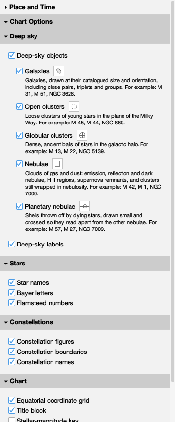
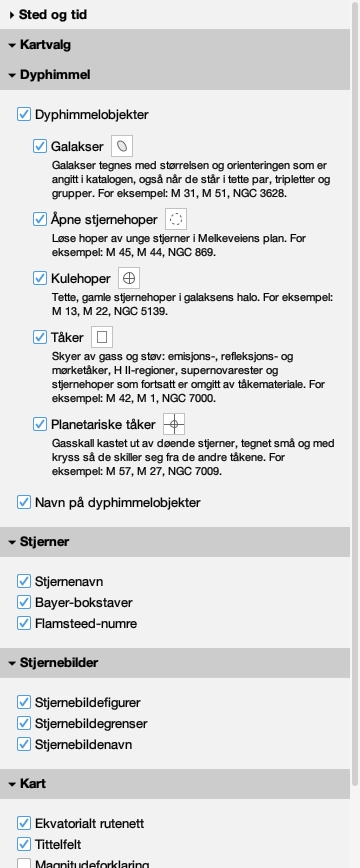

# Every word the companion says

Issue #434. Generated by
`juranometria.tool.CompanionSheetMain` from compiled
application classes and their classpath resources.

The production companion window, holding its one
production section - the same `PlaceAndTimePanel` the
Place and Time dialog holds - in a real window at the
size the companion's own policy states. Place and Time
is `PlaceAndTimeSheetMain`'s Oslo arrangement at its
frozen instant.

**Norsk bokmål — reviewed.** A person who reads the language has been through these surfaces and said these are the words an atlas should use. This is linguistic judgement, not corroboration against a source: unlike the constellation names next door, these are original translations written for this application and there is no citation to check them against. Recorded in `nb-NO.manifest`, and read from there rather than written here.

## English (`en`)

### open

| shown | hovered | spoken as | read out |
|---|---|---|---|
| Controls | — | Controls | Controls you can keep beside the chart while you read it |
| ▾ Place and Time | Show or hide this section | Place and Time, expanded | A hidden section keeps everything it is set to; whether it is hidden is remembered. |
| Latitude | — | Latitude | — |
| 59.913 | Degrees north of the equator, e.g. 59.913; south is negative, -90 to 90 | Latitude | Degrees north of the equator, negative south, -90 to 90 |
| Longitude, east positive | — | Longitude, east positive | — |
| 10.752 | Degrees east of Greenwich, e.g. 10.752; west is negative | Longitude, east positive | Degrees east of Greenwich; west is negative |
| Instant (UTC) | — | Instant (UTC) | — |
| 2026-03-20 21:33:00 | The moment the lines are drawn for, as 2026-03-20 21:33:00 | Instant (UTC) | The instant used to draw the reference lines. Time does not advance until you change it. |
| The chart is drawn for that instant and stays there. Nothing ticks. | — | The chart is drawn for that instant and stays there. Nothing ticks. | — |
| Meridian | Draw the great circle through both celestial poles and your zenith (⌘K then R) | Show Meridian | Draws the line that runs from due north, through the point overhead, to due south. It lasts as long as this session. |
| Mathematical horizon | Draw where the sky meets a perfectly flat, transparent Earth (⌘K then H) | Show Mathematical horizon | Draws the circle where the sky would meet a flat and transparent Earth; your own horizon has hills and air in it. It lasts as long as this session. |
| Zenith | Mark the point overhead | Show Zenith | Marks the point directly above you. It is drawn with the observer's lines and has no shortcut of its own. |
| Now | Reads the clock once and freezes the chart at that instant | Now | Freezes the reference lines at the present moment. The clock is read once; nothing moves afterwards. |
| Centre on zenith | Move the chart to the point overhead | Centre on zenith | Moves the page to the point directly above you. This is the only control in this window that moves the chart. |
| ▾ Chart Options | Show or hide this section | Chart Options, expanded | A hidden section keeps everything it is set to; whether it is hidden is remembered. |
| ▸ Deep sky | Show or hide this section | Deep sky, collapsed | A hidden section keeps everything it is set to; whether it is hidden is remembered. |
| ▾ Stars | Show or hide this section | Stars, expanded | A hidden section keeps everything it is set to; whether it is hidden is remembered. |
| Star names | Traditional proper names such as Betelgeuse. Shortcut: ⌘K then S. | Star names | Traditional proper names such as Betelgeuse. Switch it here or from the chart with ⌘K then S. |
| Bayer letters | Greek and Latin Bayer designations such as alpha Orionis. Shortcut: ⌘K then Y. | Bayer letters | Greek and Latin Bayer designations such as alpha Orionis. Switch it here or from the chart with ⌘K then Y. |
| Flamsteed numbers | Flamsteed catalogue numbers on the regional charts. Shortcut: ⌘K then M. | Flamsteed numbers | Flamsteed catalogue numbers on the regional charts. Switch it here or from the chart with ⌘K then M. |
| ▾ Constellations | Show or hide this section | Constellations, expanded | A hidden section keeps everything it is set to; whether it is hidden is remembered. |
| Constellation figures | The joined stick figures of the constellations. Shortcut: ⌘K then F. | Constellation figures | The joined stick figures of the constellations. Switch it here or from the chart with ⌘K then F. |
| Constellation boundaries | The IAU boundaries, precessed from B1875. Shortcut: ⌘K then B. | Constellation boundaries | The IAU boundaries, precessed from B1875. Switch it here or from the chart with ⌘K then B. |
| Constellation names | The figure's name, drawn where the figure is. Shortcut: ⌘K then N. | Constellation names | The figure's name, drawn where the figure is. Switch it here or from the chart with ⌘K then N. Requires constellation figures to be on. |
| ▾ Chart | Show or hide this section | Chart, expanded | A hidden section keeps everything it is set to; whether it is hidden is remembered. |
| Equatorial coordinate grid | ICRS/J2000 right-ascension and declination grid lines with coordinate labels. Shortcut: ⌘K then E. | Equatorial coordinate grid | ICRS/J2000 right-ascension and declination grid lines with coordinate labels. Switch it here or from the chart with ⌘K then E. |
| Title block | The panel in the lower left stating the target, centre, frame, field width, limiting magnitude and orientation. Shortcut: ⌘K then T. | Title block | The panel in the lower left stating the target, centre, frame, field width, limiting magnitude and orientation. Switch it here or from the chart with ⌘K then T. |
| Stellar-magnitude key | A key in the upper right showing the circle size the chart draws for three visual magnitudes, including this page's limit. Shortcut: ⌘K then J. | Stellar-magnitude key | A key in the upper right showing the circle size the chart draws for three visual magnitudes, including this page's limit. Switch it here or from the chart with ⌘K then J. |
| Black sky | White stars and restrained light ink on a black ground, instead of the white-paper chart; a chart choice, independent of the application's light or dark appearance. Shortcut: ⌘K then K. | Black sky | White stars and restrained light ink on a black ground, instead of the white-paper chart; a chart choice, independent of the application's light or dark appearance. Switch it here or from the chart with ⌘K then K. |
| Restore Defaults | Return to the atlas defaults: every layer and deep-sky family in this window on, the title block on, the magnitude key off, and the chart on white paper. You are asked first. | Restore Defaults | Returns every choice in this window to the atlas defaults, on the chart at once and remembered. Because nothing takes it back, you are asked first. |

### dark

| shown | hovered | spoken as | read out |
|---|---|---|---|
| Controls | — | Controls | Controls you can keep beside the chart while you read it |
| ▾ Place and Time | Show or hide this section | Place and Time, expanded | A hidden section keeps everything it is set to; whether it is hidden is remembered. |
| Latitude | — | Latitude | — |
| 59.913 | Degrees north of the equator, e.g. 59.913; south is negative, -90 to 90 | Latitude | Degrees north of the equator, negative south, -90 to 90 |
| Longitude, east positive | — | Longitude, east positive | — |
| 10.752 | Degrees east of Greenwich, e.g. 10.752; west is negative | Longitude, east positive | Degrees east of Greenwich; west is negative |
| Instant (UTC) | — | Instant (UTC) | — |
| 2026-03-20 21:33:00 | The moment the lines are drawn for, as 2026-03-20 21:33:00 | Instant (UTC) | The instant used to draw the reference lines. Time does not advance until you change it. |
| The chart is drawn for that instant and stays there. Nothing ticks. | — | The chart is drawn for that instant and stays there. Nothing ticks. | — |
| Meridian | Draw the great circle through both celestial poles and your zenith (⌘K then R) | Show Meridian | Draws the line that runs from due north, through the point overhead, to due south. It lasts as long as this session. |
| Mathematical horizon | Draw where the sky meets a perfectly flat, transparent Earth (⌘K then H) | Show Mathematical horizon | Draws the circle where the sky would meet a flat and transparent Earth; your own horizon has hills and air in it. It lasts as long as this session. |
| Zenith | Mark the point overhead | Show Zenith | Marks the point directly above you. It is drawn with the observer's lines and has no shortcut of its own. |
| Now | Reads the clock once and freezes the chart at that instant | Now | Freezes the reference lines at the present moment. The clock is read once; nothing moves afterwards. |
| Centre on zenith | Move the chart to the point overhead | Centre on zenith | Moves the page to the point directly above you. This is the only control in this window that moves the chart. |
| ▾ Chart Options | Show or hide this section | Chart Options, expanded | A hidden section keeps everything it is set to; whether it is hidden is remembered. |
| ▸ Deep sky | Show or hide this section | Deep sky, collapsed | A hidden section keeps everything it is set to; whether it is hidden is remembered. |
| ▾ Stars | Show or hide this section | Stars, expanded | A hidden section keeps everything it is set to; whether it is hidden is remembered. |
| Star names | Traditional proper names such as Betelgeuse. Shortcut: ⌘K then S. | Star names | Traditional proper names such as Betelgeuse. Switch it here or from the chart with ⌘K then S. |
| Bayer letters | Greek and Latin Bayer designations such as alpha Orionis. Shortcut: ⌘K then Y. | Bayer letters | Greek and Latin Bayer designations such as alpha Orionis. Switch it here or from the chart with ⌘K then Y. |
| Flamsteed numbers | Flamsteed catalogue numbers on the regional charts. Shortcut: ⌘K then M. | Flamsteed numbers | Flamsteed catalogue numbers on the regional charts. Switch it here or from the chart with ⌘K then M. |
| ▾ Constellations | Show or hide this section | Constellations, expanded | A hidden section keeps everything it is set to; whether it is hidden is remembered. |
| Constellation figures | The joined stick figures of the constellations. Shortcut: ⌘K then F. | Constellation figures | The joined stick figures of the constellations. Switch it here or from the chart with ⌘K then F. |
| Constellation boundaries | The IAU boundaries, precessed from B1875. Shortcut: ⌘K then B. | Constellation boundaries | The IAU boundaries, precessed from B1875. Switch it here or from the chart with ⌘K then B. |
| Constellation names | The figure's name, drawn where the figure is. Shortcut: ⌘K then N. | Constellation names | The figure's name, drawn where the figure is. Switch it here or from the chart with ⌘K then N. Requires constellation figures to be on. |
| ▾ Chart | Show or hide this section | Chart, expanded | A hidden section keeps everything it is set to; whether it is hidden is remembered. |
| Equatorial coordinate grid | ICRS/J2000 right-ascension and declination grid lines with coordinate labels. Shortcut: ⌘K then E. | Equatorial coordinate grid | ICRS/J2000 right-ascension and declination grid lines with coordinate labels. Switch it here or from the chart with ⌘K then E. |
| Title block | The panel in the lower left stating the target, centre, frame, field width, limiting magnitude and orientation. Shortcut: ⌘K then T. | Title block | The panel in the lower left stating the target, centre, frame, field width, limiting magnitude and orientation. Switch it here or from the chart with ⌘K then T. |
| Stellar-magnitude key | A key in the upper right showing the circle size the chart draws for three visual magnitudes, including this page's limit. Shortcut: ⌘K then J. | Stellar-magnitude key | A key in the upper right showing the circle size the chart draws for three visual magnitudes, including this page's limit. Switch it here or from the chart with ⌘K then J. |
| Black sky | White stars and restrained light ink on a black ground, instead of the white-paper chart; a chart choice, independent of the application's light or dark appearance. Shortcut: ⌘K then K. | Black sky | White stars and restrained light ink on a black ground, instead of the white-paper chart; a chart choice, independent of the application's light or dark appearance. Switch it here or from the chart with ⌘K then K. |
| Restore Defaults | Return to the atlas defaults: every layer and deep-sky family in this window on, the title block on, the magnitude key off, and the chart on white paper. You are asked first. | Restore Defaults | Returns every choice in this window to the atlas defaults, on the chart at once and remembered. Because nothing takes it back, you are asked first. |

### collapsed

| shown | hovered | spoken as | read out |
|---|---|---|---|
| Controls | — | Controls | Controls you can keep beside the chart while you read it |
| ▸ Place and Time | Show or hide this section | Place and Time, collapsed | A hidden section keeps everything it is set to; whether it is hidden is remembered. |
| ▾ Chart Options | Show or hide this section | Chart Options, expanded | A hidden section keeps everything it is set to; whether it is hidden is remembered. |
| ▸ Deep sky | Show or hide this section | Deep sky, collapsed | A hidden section keeps everything it is set to; whether it is hidden is remembered. |
| ▾ Stars | Show or hide this section | Stars, expanded | A hidden section keeps everything it is set to; whether it is hidden is remembered. |
| Star names | Traditional proper names such as Betelgeuse. Shortcut: ⌘K then S. | Star names | Traditional proper names such as Betelgeuse. Switch it here or from the chart with ⌘K then S. |
| Bayer letters | Greek and Latin Bayer designations such as alpha Orionis. Shortcut: ⌘K then Y. | Bayer letters | Greek and Latin Bayer designations such as alpha Orionis. Switch it here or from the chart with ⌘K then Y. |
| Flamsteed numbers | Flamsteed catalogue numbers on the regional charts. Shortcut: ⌘K then M. | Flamsteed numbers | Flamsteed catalogue numbers on the regional charts. Switch it here or from the chart with ⌘K then M. |
| ▾ Constellations | Show or hide this section | Constellations, expanded | A hidden section keeps everything it is set to; whether it is hidden is remembered. |
| Constellation figures | The joined stick figures of the constellations. Shortcut: ⌘K then F. | Constellation figures | The joined stick figures of the constellations. Switch it here or from the chart with ⌘K then F. |
| Constellation boundaries | The IAU boundaries, precessed from B1875. Shortcut: ⌘K then B. | Constellation boundaries | The IAU boundaries, precessed from B1875. Switch it here or from the chart with ⌘K then B. |
| Constellation names | The figure's name, drawn where the figure is. Shortcut: ⌘K then N. | Constellation names | The figure's name, drawn where the figure is. Switch it here or from the chart with ⌘K then N. Requires constellation figures to be on. |
| ▾ Chart | Show or hide this section | Chart, expanded | A hidden section keeps everything it is set to; whether it is hidden is remembered. |
| Equatorial coordinate grid | ICRS/J2000 right-ascension and declination grid lines with coordinate labels. Shortcut: ⌘K then E. | Equatorial coordinate grid | ICRS/J2000 right-ascension and declination grid lines with coordinate labels. Switch it here or from the chart with ⌘K then E. |
| Title block | The panel in the lower left stating the target, centre, frame, field width, limiting magnitude and orientation. Shortcut: ⌘K then T. | Title block | The panel in the lower left stating the target, centre, frame, field width, limiting magnitude and orientation. Switch it here or from the chart with ⌘K then T. |
| Stellar-magnitude key | A key in the upper right showing the circle size the chart draws for three visual magnitudes, including this page's limit. Shortcut: ⌘K then J. | Stellar-magnitude key | A key in the upper right showing the circle size the chart draws for three visual magnitudes, including this page's limit. Switch it here or from the chart with ⌘K then J. |
| Black sky | White stars and restrained light ink on a black ground, instead of the white-paper chart; a chart choice, independent of the application's light or dark appearance. Shortcut: ⌘K then K. | Black sky | White stars and restrained light ink on a black ground, instead of the white-paper chart; a chart choice, independent of the application's light or dark appearance. Switch it here or from the chart with ⌘K then K. |
| Restore Defaults | Return to the atlas defaults: every layer and deep-sky family in this window on, the title block on, the magnitude key off, and the chart on white paper. You are asked first. | Restore Defaults | Returns every choice in this window to the atlas defaults, on the chart at once and remembered. Because nothing takes it back, you are asked first. |

### refused

| shown | hovered | spoken as | read out |
|---|---|---|---|
| Controls | — | Controls | Controls you can keep beside the chart while you read it |
| ▾ Place and Time | Show or hide this section | Place and Time, expanded | A hidden section keeps everything it is set to; whether it is hidden is remembered. |
| Latitude | — | Latitude | — |
| 59.913 | Degrees north of the equator, e.g. 59.913; south is negative, -90 to 90 | Latitude | Latitude must be between −90° and 90°. Kept 59.913. |
| Longitude, east positive | — | Longitude, east positive | — |
| 10.752 | Degrees east of Greenwich, e.g. 10.752; west is negative | Longitude, east positive | Degrees east of Greenwich; west is negative |
| Instant (UTC) | — | Instant (UTC) | — |
| 2026-03-20 21:33:00 | The moment the lines are drawn for, as 2026-03-20 21:33:00 | Instant (UTC) | The instant used to draw the reference lines. Time does not advance until you change it. |
| The chart is drawn for that instant and stays there. Nothing ticks. | — | The chart is drawn for that instant and stays there. Nothing ticks. | — |
| Meridian | Draw the great circle through both celestial poles and your zenith (⌘K then R) | Show Meridian | Draws the line that runs from due north, through the point overhead, to due south. It lasts as long as this session. |
| Mathematical horizon | Draw where the sky meets a perfectly flat, transparent Earth (⌘K then H) | Show Mathematical horizon | Draws the circle where the sky would meet a flat and transparent Earth; your own horizon has hills and air in it. It lasts as long as this session. |
| Zenith | Mark the point overhead | Show Zenith | Marks the point directly above you. It is drawn with the observer's lines and has no shortcut of its own. |
| Now | Reads the clock once and freezes the chart at that instant | Now | Freezes the reference lines at the present moment. The clock is read once; nothing moves afterwards. |
| Centre on zenith | Move the chart to the point overhead | Centre on zenith | Moves the page to the point directly above you. This is the only control in this window that moves the chart. |
| Latitude must be between −90° and 90°. Kept 59.913. | — | Latitude must be between −90° and 90°. Kept 59.913. | — |
| ▾ Chart Options | Show or hide this section | Chart Options, expanded | A hidden section keeps everything it is set to; whether it is hidden is remembered. |
| ▸ Deep sky | Show or hide this section | Deep sky, collapsed | A hidden section keeps everything it is set to; whether it is hidden is remembered. |
| ▾ Stars | Show or hide this section | Stars, expanded | A hidden section keeps everything it is set to; whether it is hidden is remembered. |
| Star names | Traditional proper names such as Betelgeuse. Shortcut: ⌘K then S. | Star names | Traditional proper names such as Betelgeuse. Switch it here or from the chart with ⌘K then S. |
| Bayer letters | Greek and Latin Bayer designations such as alpha Orionis. Shortcut: ⌘K then Y. | Bayer letters | Greek and Latin Bayer designations such as alpha Orionis. Switch it here or from the chart with ⌘K then Y. |
| Flamsteed numbers | Flamsteed catalogue numbers on the regional charts. Shortcut: ⌘K then M. | Flamsteed numbers | Flamsteed catalogue numbers on the regional charts. Switch it here or from the chart with ⌘K then M. |
| ▾ Constellations | Show or hide this section | Constellations, expanded | A hidden section keeps everything it is set to; whether it is hidden is remembered. |
| Constellation figures | The joined stick figures of the constellations. Shortcut: ⌘K then F. | Constellation figures | The joined stick figures of the constellations. Switch it here or from the chart with ⌘K then F. |
| Constellation boundaries | The IAU boundaries, precessed from B1875. Shortcut: ⌘K then B. | Constellation boundaries | The IAU boundaries, precessed from B1875. Switch it here or from the chart with ⌘K then B. |
| Constellation names | The figure's name, drawn where the figure is. Shortcut: ⌘K then N. | Constellation names | The figure's name, drawn where the figure is. Switch it here or from the chart with ⌘K then N. Requires constellation figures to be on. |
| ▾ Chart | Show or hide this section | Chart, expanded | A hidden section keeps everything it is set to; whether it is hidden is remembered. |
| Equatorial coordinate grid | ICRS/J2000 right-ascension and declination grid lines with coordinate labels. Shortcut: ⌘K then E. | Equatorial coordinate grid | ICRS/J2000 right-ascension and declination grid lines with coordinate labels. Switch it here or from the chart with ⌘K then E. |
| Title block | The panel in the lower left stating the target, centre, frame, field width, limiting magnitude and orientation. Shortcut: ⌘K then T. | Title block | The panel in the lower left stating the target, centre, frame, field width, limiting magnitude and orientation. Switch it here or from the chart with ⌘K then T. |
| Stellar-magnitude key | A key in the upper right showing the circle size the chart draws for three visual magnitudes, including this page's limit. Shortcut: ⌘K then J. | Stellar-magnitude key | A key in the upper right showing the circle size the chart draws for three visual magnitudes, including this page's limit. Switch it here or from the chart with ⌘K then J. |
| Black sky | White stars and restrained light ink on a black ground, instead of the white-paper chart; a chart choice, independent of the application's light or dark appearance. Shortcut: ⌘K then K. | Black sky | White stars and restrained light ink on a black ground, instead of the white-paper chart; a chart choice, independent of the application's light or dark appearance. Switch it here or from the chart with ⌘K then K. |
| Restore Defaults | Return to the atlas defaults: every layer and deep-sky family in this window on, the title block on, the magnitude key off, and the chart on white paper. You are asked first. | Restore Defaults | Returns every choice in this window to the atlas defaults, on the chart at once and remembered. Because nothing takes it back, you are asked first. |

### deep-sky-open

| shown | hovered | spoken as | read out |
|---|---|---|---|
| Controls | — | Controls | Controls you can keep beside the chart while you read it |
| ▸ Place and Time | Show or hide this section | Place and Time, collapsed | A hidden section keeps everything it is set to; whether it is hidden is remembered. |
| ▾ Chart Options | Show or hide this section | Chart Options, expanded | A hidden section keeps everything it is set to; whether it is hidden is remembered. |
| ▾ Deep sky | Show or hide this section | Deep sky, expanded | A hidden section keeps everything it is set to; whether it is hidden is remembered. |
| Deep-sky objects | Draw deep-sky objects on the chart at all. Shortcut: ⌘K then D. | Deep-sky objects | Draw deep-sky objects on the chart at all. Switch it here or from the chart with ⌘K then D. |
| Galaxies | Galaxies, drawn at their catalogued size and orientation, including close pairs, triplets and groups. For example: M 31, M 51, NGC 3628. Shortcut: ⌘K then G. | Galaxies | Galaxies, drawn at their catalogued size and orientation, including close pairs, triplets and groups. For example: M 31, M 51, NGC 3628. Switch it here or from the chart with ⌘K then G. Requires deep-sky objects to be on. |
| — | — | The symbol the chart draws for Galaxies | Galaxies, drawn at their catalogued size and orientation, including close pairs, triplets and groups. For example: M 31, M 51, NGC 3628. |
| Galaxies, drawn at their catalogued size and orientation, including close pairs, triplets and groups. For example: M 31, M 51, NGC 3628. | — | — | — |
| Open clusters | Loose clusters of young stars in the plane of the Milky Way. For example: M 45, M 44, NGC 869. Shortcut: ⌘K then O. | Open clusters | Loose clusters of young stars in the plane of the Milky Way. For example: M 45, M 44, NGC 869. Switch it here or from the chart with ⌘K then O. Requires deep-sky objects to be on. |
| — | — | The symbol the chart draws for Open clusters | Loose clusters of young stars in the plane of the Milky Way. For example: M 45, M 44, NGC 869. |
| Loose clusters of young stars in the plane of the Milky Way. For example: M 45, M 44, NGC 869. | — | — | — |
| Globular clusters | Dense, ancient balls of stars in the galactic halo. For example: M 13, M 22, NGC 5139. Shortcut: ⌘K then C. | Globular clusters | Dense, ancient balls of stars in the galactic halo. For example: M 13, M 22, NGC 5139. Switch it here or from the chart with ⌘K then C. Requires deep-sky objects to be on. |
| — | — | The symbol the chart draws for Globular clusters | Dense, ancient balls of stars in the galactic halo. For example: M 13, M 22, NGC 5139. |
| Dense, ancient balls of stars in the galactic halo. For example: M 13, M 22, NGC 5139. | — | — | — |
| Nebulae | Clouds of gas and dust: emission, reflection and dark nebulae, H II regions, supernova remnants, and clusters still wrapped in nebulosity. For example: M 42, M 1, NGC 7000. Shortcut: ⌘K then U. | Nebulae | Clouds of gas and dust: emission, reflection and dark nebulae, H II regions, supernova remnants, and clusters still wrapped in nebulosity. For example: M 42, M 1, NGC 7000. Switch it here or from the chart with ⌘K then U. Requires deep-sky objects to be on. |
| — | — | The symbol the chart draws for Nebulae | Clouds of gas and dust: emission, reflection and dark nebulae, H II regions, supernova remnants, and clusters still wrapped in nebulosity. For example: M 42, M 1, NGC 7000. |
| Clouds of gas and dust: emission, reflection and dark nebulae, H II regions, supernova remnants, and clusters still wrapped in nebulosity. For example: M 42, M 1, NGC 7000. | — | — | — |
| Planetary nebulae | Shells thrown off by dying stars, drawn small and crossed so they read apart from the other nebulae. For example: M 57, M 27, NGC 7009. Shortcut: ⌘K then P. | Planetary nebulae | Shells thrown off by dying stars, drawn small and crossed so they read apart from the other nebulae. For example: M 57, M 27, NGC 7009. Switch it here or from the chart with ⌘K then P. Requires deep-sky objects to be on. |
| — | — | The symbol the chart draws for Planetary nebulae | Shells thrown off by dying stars, drawn small and crossed so they read apart from the other nebulae. For example: M 57, M 27, NGC 7009. |
| Shells thrown off by dying stars, drawn small and crossed so they read apart from the other nebulae. For example: M 57, M 27, NGC 7009. | — | — | — |
| Deep-sky labels | Name the deep-sky objects the chart draws. Shortcut: ⌘K then L. | Deep-sky labels | Name the deep-sky objects the chart draws. Switch it here or from the chart with ⌘K then L. Requires deep-sky objects to be on. |
| ▾ Stars | Show or hide this section | Stars, expanded | A hidden section keeps everything it is set to; whether it is hidden is remembered. |
| Star names | Traditional proper names such as Betelgeuse. Shortcut: ⌘K then S. | Star names | Traditional proper names such as Betelgeuse. Switch it here or from the chart with ⌘K then S. |
| Bayer letters | Greek and Latin Bayer designations such as alpha Orionis. Shortcut: ⌘K then Y. | Bayer letters | Greek and Latin Bayer designations such as alpha Orionis. Switch it here or from the chart with ⌘K then Y. |
| Flamsteed numbers | Flamsteed catalogue numbers on the regional charts. Shortcut: ⌘K then M. | Flamsteed numbers | Flamsteed catalogue numbers on the regional charts. Switch it here or from the chart with ⌘K then M. |
| ▾ Constellations | Show or hide this section | Constellations, expanded | A hidden section keeps everything it is set to; whether it is hidden is remembered. |
| Constellation figures | The joined stick figures of the constellations. Shortcut: ⌘K then F. | Constellation figures | The joined stick figures of the constellations. Switch it here or from the chart with ⌘K then F. |
| Constellation boundaries | The IAU boundaries, precessed from B1875. Shortcut: ⌘K then B. | Constellation boundaries | The IAU boundaries, precessed from B1875. Switch it here or from the chart with ⌘K then B. |
| Constellation names | The figure's name, drawn where the figure is. Shortcut: ⌘K then N. | Constellation names | The figure's name, drawn where the figure is. Switch it here or from the chart with ⌘K then N. Requires constellation figures to be on. |
| ▾ Chart | Show or hide this section | Chart, expanded | A hidden section keeps everything it is set to; whether it is hidden is remembered. |
| Equatorial coordinate grid | ICRS/J2000 right-ascension and declination grid lines with coordinate labels. Shortcut: ⌘K then E. | Equatorial coordinate grid | ICRS/J2000 right-ascension and declination grid lines with coordinate labels. Switch it here or from the chart with ⌘K then E. |
| Title block | The panel in the lower left stating the target, centre, frame, field width, limiting magnitude and orientation. Shortcut: ⌘K then T. | Title block | The panel in the lower left stating the target, centre, frame, field width, limiting magnitude and orientation. Switch it here or from the chart with ⌘K then T. |
| Stellar-magnitude key | A key in the upper right showing the circle size the chart draws for three visual magnitudes, including this page's limit. Shortcut: ⌘K then J. | Stellar-magnitude key | A key in the upper right showing the circle size the chart draws for three visual magnitudes, including this page's limit. Switch it here or from the chart with ⌘K then J. |
| Black sky | White stars and restrained light ink on a black ground, instead of the white-paper chart; a chart choice, independent of the application's light or dark appearance. Shortcut: ⌘K then K. | Black sky | White stars and restrained light ink on a black ground, instead of the white-paper chart; a chart choice, independent of the application's light or dark appearance. Switch it here or from the chart with ⌘K then K. |
| Restore Defaults | Return to the atlas defaults: every layer and deep-sky family in this window on, the title block on, the magnitude key off, and the chart on white paper. You are asked first. | Restore Defaults | Returns every choice in this window to the atlas defaults, on the chart at once and remembered. Because nothing takes it back, you are asked first. |

## Norsk bokmål (`nb-NO`)

### open

| shown | hovered | spoken as | read out |
|---|---|---|---|
| Kontroller | — | Kontroller | Kontroller du kan ha ved siden av kartet mens du leser det |
| ▾ Sted og tid | Vis eller skjul denne delen | Sted og tid, utvidet | En skjult del beholder alt den er satt til, og det huskes om den er skjult. |
| Breddegrad | — | Breddegrad | — |
| 59.913 | Grader nord for ekvator, f.eks. 59.913; sørlige breddegrader er negative, -90 til 90 | Breddegrad | Grader nord for ekvator; sørlige breddegrader er negative, -90 til 90 |
| Lengdegrad, øst positiv | — | Lengdegrad, øst positiv | — |
| 10.752 | Grader øst for Greenwich, f.eks. 10.752; vestlige lengdegrader er negative | Lengdegrad, øst positiv | Grader øst for Greenwich; vestlige lengdegrader er negative |
| Tidspunkt (UTC) | — | Tidspunkt (UTC) | — |
| 2026-03-20 21:33:00 | Tidspunktet linjene tegnes for, som 2026-03-20 21:33:00 | Tidspunkt (UTC) | Tidspunktet som brukes til å tegne referanselinjene. Tiden går ikke videre før du endrer tidspunktet. |
| Kartet tegnes for dette tidspunktet. Tiden går ikke videre av seg selv. | — | Kartet tegnes for dette tidspunktet. Tiden går ikke videre av seg selv. | — |
| Meridian | Tegn storsirkelen gjennom begge himmelpolene og senit (⌘K deretter R) | Vis meridianen | Tegner linjen som går fra rett nord, gjennom punktet rett over deg, til rett sør. Valget gjelder ut denne økten. |
| Matematisk horisont | Tegn der himmelen møter en helt flat og gjennomsiktig jord (⌘K deretter H) | Vis matematisk horisont | Tegner sirkelen der himmelen ville ha møtt en flat og gjennomsiktig jord; din egen horisont har åser og luft i seg. Valget gjelder ut denne økten. |
| Senit | Marker punktet rett over deg | Vis senit | Markerer punktet rett over deg. Det tegnes sammen med observatørens linjer og har ingen egen hurtigtast. |
| Nå | Les klokken én gang og sett kartets tidspunkt til nå | Nå | Tegner referanselinjene for tidspunktet nå. Klokken leses én gang; tiden går ikke videre etterpå. |
| Sentrer på senit | Flytt kartet til punktet rett over deg | Sentrer på senit | Flytter siden til punktet rett over deg. Dette er den eneste knappen i dette vinduet som flytter kartet. |
| ▾ Kartvalg | Vis eller skjul denne delen | Kartvalg, utvidet | En skjult del beholder alt den er satt til, og det huskes om den er skjult. |
| ▸ Dyphimmel | Vis eller skjul denne delen | Dyphimmel, skjult | En skjult del beholder alt den er satt til, og det huskes om den er skjult. |
| ▾ Stjerner | Vis eller skjul denne delen | Stjerner, utvidet | En skjult del beholder alt den er satt til, og det huskes om den er skjult. |
| Stjernenavn | Tradisjonelle egennavn som Betelgeuse. Snarvei: ⌘K deretter S. | Stjernenavn | Tradisjonelle egennavn som Betelgeuse. Slå det av eller på her eller fra kartet med ⌘K deretter S. |
| Bayer-bokstaver | Greske og latinske Bayer-betegnelser som alpha Orionis. Snarvei: ⌘K deretter Y. | Bayer-bokstaver | Greske og latinske Bayer-betegnelser som alpha Orionis. Slå det av eller på her eller fra kartet med ⌘K deretter Y. |
| Flamsteed-numre | Flamsteed-katalognumre på regionkartene. Snarvei: ⌘K deretter M. | Flamsteed-numre | Flamsteed-katalognumre på regionkartene. Slå det av eller på her eller fra kartet med ⌘K deretter M. |
| ▾ Stjernebilder | Vis eller skjul denne delen | Stjernebilder, utvidet | En skjult del beholder alt den er satt til, og det huskes om den er skjult. |
| Stjernebildefigurer | Strekfigurene som binder sammen stjernene i stjernebildene. Snarvei: ⌘K deretter F. | Stjernebildefigurer | Strekfigurene som binder sammen stjernene i stjernebildene. Slå det av eller på her eller fra kartet med ⌘K deretter F. |
| Stjernebildegrenser | IAUs grenser, presesjonsjustert fra B1875. Snarvei: ⌘K deretter B. | Stjernebildegrenser | IAUs grenser, presesjonsjustert fra B1875. Slå det av eller på her eller fra kartet med ⌘K deretter B. |
| Stjernebildenavn | Navnet på stjernebildet, plassert ved figuren. Snarvei: ⌘K deretter N. | Stjernebildenavn | Navnet på stjernebildet, plassert ved figuren. Slå det av eller på her eller fra kartet med ⌘K deretter N. Stjernebildefigurer må være slått på. |
| ▾ Kart | Vis eller skjul denne delen | Kart, utvidet | En skjult del beholder alt den er satt til, og det huskes om den er skjult. |
| Ekvatorialt rutenett | Rutenett for rektascensjon og deklinasjon i ICRS/J2000, med koordinatmerking. Snarvei: ⌘K deretter E. | Ekvatorialt rutenett | Rutenett for rektascensjon og deklinasjon i ICRS/J2000, med koordinatmerking. Slå det av eller på her eller fra kartet med ⌘K deretter E. |
| Tittelfelt | Feltet nede til venstre som oppgir mål, sentrum, referansesystem, synsfelt, grensemagnitude og orientering. Snarvei: ⌘K deretter T. | Tittelfelt | Feltet nede til venstre som oppgir mål, sentrum, referansesystem, synsfelt, grensemagnitude og orientering. Slå det av eller på her eller fra kartet med ⌘K deretter T. |
| Magnitudeforklaring | En forklaring oppe til høyre som viser sirkelstørrelsen kartet tegner for tre visuelle magnituder, deriblant grensen for denne siden. Snarvei: ⌘K deretter J. | Magnitudeforklaring | En forklaring oppe til høyre som viser sirkelstørrelsen kartet tegner for tre visuelle magnituder, deriblant grensen for denne siden. Slå det av eller på her eller fra kartet med ⌘K deretter J. |
| Svart himmel | Hvite stjerner og dempet, lyst blekk på svart bunn i stedet for kartet på hvitt papir; et kartvalg, uavhengig av om programmet har lyst eller mørkt utseende. Snarvei: ⌘K deretter K. | Svart himmel | Hvite stjerner og dempet, lyst blekk på svart bunn i stedet for kartet på hvitt papir; et kartvalg, uavhengig av om programmet har lyst eller mørkt utseende. Slå det av eller på her eller fra kartet med ⌘K deretter K. |
| Gjenopprett standardvalg | Gå tilbake til atlasets standardvalg: alle lag og dyphimmelfamilier i dette vinduet på, tittelfeltet på, magnitudeforklaringen av og kartet på hvitt papir. Du blir spurt først. | Gjenopprett standardvalg | Setter alle valgene i vinduet tilbake til atlasets standardvalg, på kartet med en gang og husket. Fordi ingenting angrer det, blir du spurt først. |

### dark

| shown | hovered | spoken as | read out |
|---|---|---|---|
| Kontroller | — | Kontroller | Kontroller du kan ha ved siden av kartet mens du leser det |
| ▾ Sted og tid | Vis eller skjul denne delen | Sted og tid, utvidet | En skjult del beholder alt den er satt til, og det huskes om den er skjult. |
| Breddegrad | — | Breddegrad | — |
| 59.913 | Grader nord for ekvator, f.eks. 59.913; sørlige breddegrader er negative, -90 til 90 | Breddegrad | Grader nord for ekvator; sørlige breddegrader er negative, -90 til 90 |
| Lengdegrad, øst positiv | — | Lengdegrad, øst positiv | — |
| 10.752 | Grader øst for Greenwich, f.eks. 10.752; vestlige lengdegrader er negative | Lengdegrad, øst positiv | Grader øst for Greenwich; vestlige lengdegrader er negative |
| Tidspunkt (UTC) | — | Tidspunkt (UTC) | — |
| 2026-03-20 21:33:00 | Tidspunktet linjene tegnes for, som 2026-03-20 21:33:00 | Tidspunkt (UTC) | Tidspunktet som brukes til å tegne referanselinjene. Tiden går ikke videre før du endrer tidspunktet. |
| Kartet tegnes for dette tidspunktet. Tiden går ikke videre av seg selv. | — | Kartet tegnes for dette tidspunktet. Tiden går ikke videre av seg selv. | — |
| Meridian | Tegn storsirkelen gjennom begge himmelpolene og senit (⌘K deretter R) | Vis meridianen | Tegner linjen som går fra rett nord, gjennom punktet rett over deg, til rett sør. Valget gjelder ut denne økten. |
| Matematisk horisont | Tegn der himmelen møter en helt flat og gjennomsiktig jord (⌘K deretter H) | Vis matematisk horisont | Tegner sirkelen der himmelen ville ha møtt en flat og gjennomsiktig jord; din egen horisont har åser og luft i seg. Valget gjelder ut denne økten. |
| Senit | Marker punktet rett over deg | Vis senit | Markerer punktet rett over deg. Det tegnes sammen med observatørens linjer og har ingen egen hurtigtast. |
| Nå | Les klokken én gang og sett kartets tidspunkt til nå | Nå | Tegner referanselinjene for tidspunktet nå. Klokken leses én gang; tiden går ikke videre etterpå. |
| Sentrer på senit | Flytt kartet til punktet rett over deg | Sentrer på senit | Flytter siden til punktet rett over deg. Dette er den eneste knappen i dette vinduet som flytter kartet. |
| ▾ Kartvalg | Vis eller skjul denne delen | Kartvalg, utvidet | En skjult del beholder alt den er satt til, og det huskes om den er skjult. |
| ▸ Dyphimmel | Vis eller skjul denne delen | Dyphimmel, skjult | En skjult del beholder alt den er satt til, og det huskes om den er skjult. |
| ▾ Stjerner | Vis eller skjul denne delen | Stjerner, utvidet | En skjult del beholder alt den er satt til, og det huskes om den er skjult. |
| Stjernenavn | Tradisjonelle egennavn som Betelgeuse. Snarvei: ⌘K deretter S. | Stjernenavn | Tradisjonelle egennavn som Betelgeuse. Slå det av eller på her eller fra kartet med ⌘K deretter S. |
| Bayer-bokstaver | Greske og latinske Bayer-betegnelser som alpha Orionis. Snarvei: ⌘K deretter Y. | Bayer-bokstaver | Greske og latinske Bayer-betegnelser som alpha Orionis. Slå det av eller på her eller fra kartet med ⌘K deretter Y. |
| Flamsteed-numre | Flamsteed-katalognumre på regionkartene. Snarvei: ⌘K deretter M. | Flamsteed-numre | Flamsteed-katalognumre på regionkartene. Slå det av eller på her eller fra kartet med ⌘K deretter M. |
| ▾ Stjernebilder | Vis eller skjul denne delen | Stjernebilder, utvidet | En skjult del beholder alt den er satt til, og det huskes om den er skjult. |
| Stjernebildefigurer | Strekfigurene som binder sammen stjernene i stjernebildene. Snarvei: ⌘K deretter F. | Stjernebildefigurer | Strekfigurene som binder sammen stjernene i stjernebildene. Slå det av eller på her eller fra kartet med ⌘K deretter F. |
| Stjernebildegrenser | IAUs grenser, presesjonsjustert fra B1875. Snarvei: ⌘K deretter B. | Stjernebildegrenser | IAUs grenser, presesjonsjustert fra B1875. Slå det av eller på her eller fra kartet med ⌘K deretter B. |
| Stjernebildenavn | Navnet på stjernebildet, plassert ved figuren. Snarvei: ⌘K deretter N. | Stjernebildenavn | Navnet på stjernebildet, plassert ved figuren. Slå det av eller på her eller fra kartet med ⌘K deretter N. Stjernebildefigurer må være slått på. |
| ▾ Kart | Vis eller skjul denne delen | Kart, utvidet | En skjult del beholder alt den er satt til, og det huskes om den er skjult. |
| Ekvatorialt rutenett | Rutenett for rektascensjon og deklinasjon i ICRS/J2000, med koordinatmerking. Snarvei: ⌘K deretter E. | Ekvatorialt rutenett | Rutenett for rektascensjon og deklinasjon i ICRS/J2000, med koordinatmerking. Slå det av eller på her eller fra kartet med ⌘K deretter E. |
| Tittelfelt | Feltet nede til venstre som oppgir mål, sentrum, referansesystem, synsfelt, grensemagnitude og orientering. Snarvei: ⌘K deretter T. | Tittelfelt | Feltet nede til venstre som oppgir mål, sentrum, referansesystem, synsfelt, grensemagnitude og orientering. Slå det av eller på her eller fra kartet med ⌘K deretter T. |
| Magnitudeforklaring | En forklaring oppe til høyre som viser sirkelstørrelsen kartet tegner for tre visuelle magnituder, deriblant grensen for denne siden. Snarvei: ⌘K deretter J. | Magnitudeforklaring | En forklaring oppe til høyre som viser sirkelstørrelsen kartet tegner for tre visuelle magnituder, deriblant grensen for denne siden. Slå det av eller på her eller fra kartet med ⌘K deretter J. |
| Svart himmel | Hvite stjerner og dempet, lyst blekk på svart bunn i stedet for kartet på hvitt papir; et kartvalg, uavhengig av om programmet har lyst eller mørkt utseende. Snarvei: ⌘K deretter K. | Svart himmel | Hvite stjerner og dempet, lyst blekk på svart bunn i stedet for kartet på hvitt papir; et kartvalg, uavhengig av om programmet har lyst eller mørkt utseende. Slå det av eller på her eller fra kartet med ⌘K deretter K. |
| Gjenopprett standardvalg | Gå tilbake til atlasets standardvalg: alle lag og dyphimmelfamilier i dette vinduet på, tittelfeltet på, magnitudeforklaringen av og kartet på hvitt papir. Du blir spurt først. | Gjenopprett standardvalg | Setter alle valgene i vinduet tilbake til atlasets standardvalg, på kartet med en gang og husket. Fordi ingenting angrer det, blir du spurt først. |

### collapsed

| shown | hovered | spoken as | read out |
|---|---|---|---|
| Kontroller | — | Kontroller | Kontroller du kan ha ved siden av kartet mens du leser det |
| ▸ Sted og tid | Vis eller skjul denne delen | Sted og tid, skjult | En skjult del beholder alt den er satt til, og det huskes om den er skjult. |
| ▾ Kartvalg | Vis eller skjul denne delen | Kartvalg, utvidet | En skjult del beholder alt den er satt til, og det huskes om den er skjult. |
| ▸ Dyphimmel | Vis eller skjul denne delen | Dyphimmel, skjult | En skjult del beholder alt den er satt til, og det huskes om den er skjult. |
| ▾ Stjerner | Vis eller skjul denne delen | Stjerner, utvidet | En skjult del beholder alt den er satt til, og det huskes om den er skjult. |
| Stjernenavn | Tradisjonelle egennavn som Betelgeuse. Snarvei: ⌘K deretter S. | Stjernenavn | Tradisjonelle egennavn som Betelgeuse. Slå det av eller på her eller fra kartet med ⌘K deretter S. |
| Bayer-bokstaver | Greske og latinske Bayer-betegnelser som alpha Orionis. Snarvei: ⌘K deretter Y. | Bayer-bokstaver | Greske og latinske Bayer-betegnelser som alpha Orionis. Slå det av eller på her eller fra kartet med ⌘K deretter Y. |
| Flamsteed-numre | Flamsteed-katalognumre på regionkartene. Snarvei: ⌘K deretter M. | Flamsteed-numre | Flamsteed-katalognumre på regionkartene. Slå det av eller på her eller fra kartet med ⌘K deretter M. |
| ▾ Stjernebilder | Vis eller skjul denne delen | Stjernebilder, utvidet | En skjult del beholder alt den er satt til, og det huskes om den er skjult. |
| Stjernebildefigurer | Strekfigurene som binder sammen stjernene i stjernebildene. Snarvei: ⌘K deretter F. | Stjernebildefigurer | Strekfigurene som binder sammen stjernene i stjernebildene. Slå det av eller på her eller fra kartet med ⌘K deretter F. |
| Stjernebildegrenser | IAUs grenser, presesjonsjustert fra B1875. Snarvei: ⌘K deretter B. | Stjernebildegrenser | IAUs grenser, presesjonsjustert fra B1875. Slå det av eller på her eller fra kartet med ⌘K deretter B. |
| Stjernebildenavn | Navnet på stjernebildet, plassert ved figuren. Snarvei: ⌘K deretter N. | Stjernebildenavn | Navnet på stjernebildet, plassert ved figuren. Slå det av eller på her eller fra kartet med ⌘K deretter N. Stjernebildefigurer må være slått på. |
| ▾ Kart | Vis eller skjul denne delen | Kart, utvidet | En skjult del beholder alt den er satt til, og det huskes om den er skjult. |
| Ekvatorialt rutenett | Rutenett for rektascensjon og deklinasjon i ICRS/J2000, med koordinatmerking. Snarvei: ⌘K deretter E. | Ekvatorialt rutenett | Rutenett for rektascensjon og deklinasjon i ICRS/J2000, med koordinatmerking. Slå det av eller på her eller fra kartet med ⌘K deretter E. |
| Tittelfelt | Feltet nede til venstre som oppgir mål, sentrum, referansesystem, synsfelt, grensemagnitude og orientering. Snarvei: ⌘K deretter T. | Tittelfelt | Feltet nede til venstre som oppgir mål, sentrum, referansesystem, synsfelt, grensemagnitude og orientering. Slå det av eller på her eller fra kartet med ⌘K deretter T. |
| Magnitudeforklaring | En forklaring oppe til høyre som viser sirkelstørrelsen kartet tegner for tre visuelle magnituder, deriblant grensen for denne siden. Snarvei: ⌘K deretter J. | Magnitudeforklaring | En forklaring oppe til høyre som viser sirkelstørrelsen kartet tegner for tre visuelle magnituder, deriblant grensen for denne siden. Slå det av eller på her eller fra kartet med ⌘K deretter J. |
| Svart himmel | Hvite stjerner og dempet, lyst blekk på svart bunn i stedet for kartet på hvitt papir; et kartvalg, uavhengig av om programmet har lyst eller mørkt utseende. Snarvei: ⌘K deretter K. | Svart himmel | Hvite stjerner og dempet, lyst blekk på svart bunn i stedet for kartet på hvitt papir; et kartvalg, uavhengig av om programmet har lyst eller mørkt utseende. Slå det av eller på her eller fra kartet med ⌘K deretter K. |
| Gjenopprett standardvalg | Gå tilbake til atlasets standardvalg: alle lag og dyphimmelfamilier i dette vinduet på, tittelfeltet på, magnitudeforklaringen av og kartet på hvitt papir. Du blir spurt først. | Gjenopprett standardvalg | Setter alle valgene i vinduet tilbake til atlasets standardvalg, på kartet med en gang og husket. Fordi ingenting angrer det, blir du spurt først. |

### refused

| shown | hovered | spoken as | read out |
|---|---|---|---|
| Kontroller | — | Kontroller | Kontroller du kan ha ved siden av kartet mens du leser det |
| ▾ Sted og tid | Vis eller skjul denne delen | Sted og tid, utvidet | En skjult del beholder alt den er satt til, og det huskes om den er skjult. |
| Breddegrad | — | Breddegrad | — |
| 59.913 | Grader nord for ekvator, f.eks. 59.913; sørlige breddegrader er negative, -90 til 90 | Breddegrad | Breddegraden må ligge mellom −90° og 90°. Beholdt 59.913. |
| Lengdegrad, øst positiv | — | Lengdegrad, øst positiv | — |
| 10.752 | Grader øst for Greenwich, f.eks. 10.752; vestlige lengdegrader er negative | Lengdegrad, øst positiv | Grader øst for Greenwich; vestlige lengdegrader er negative |
| Tidspunkt (UTC) | — | Tidspunkt (UTC) | — |
| 2026-03-20 21:33:00 | Tidspunktet linjene tegnes for, som 2026-03-20 21:33:00 | Tidspunkt (UTC) | Tidspunktet som brukes til å tegne referanselinjene. Tiden går ikke videre før du endrer tidspunktet. |
| Kartet tegnes for dette tidspunktet. Tiden går ikke videre av seg selv. | — | Kartet tegnes for dette tidspunktet. Tiden går ikke videre av seg selv. | — |
| Meridian | Tegn storsirkelen gjennom begge himmelpolene og senit (⌘K deretter R) | Vis meridianen | Tegner linjen som går fra rett nord, gjennom punktet rett over deg, til rett sør. Valget gjelder ut denne økten. |
| Matematisk horisont | Tegn der himmelen møter en helt flat og gjennomsiktig jord (⌘K deretter H) | Vis matematisk horisont | Tegner sirkelen der himmelen ville ha møtt en flat og gjennomsiktig jord; din egen horisont har åser og luft i seg. Valget gjelder ut denne økten. |
| Senit | Marker punktet rett over deg | Vis senit | Markerer punktet rett over deg. Det tegnes sammen med observatørens linjer og har ingen egen hurtigtast. |
| Nå | Les klokken én gang og sett kartets tidspunkt til nå | Nå | Tegner referanselinjene for tidspunktet nå. Klokken leses én gang; tiden går ikke videre etterpå. |
| Sentrer på senit | Flytt kartet til punktet rett over deg | Sentrer på senit | Flytter siden til punktet rett over deg. Dette er den eneste knappen i dette vinduet som flytter kartet. |
| Breddegraden må ligge mellom −90° og 90°. Beholdt 59.913. | — | Breddegraden må ligge mellom −90° og 90°. Beholdt 59.913. | — |
| ▾ Kartvalg | Vis eller skjul denne delen | Kartvalg, utvidet | En skjult del beholder alt den er satt til, og det huskes om den er skjult. |
| ▸ Dyphimmel | Vis eller skjul denne delen | Dyphimmel, skjult | En skjult del beholder alt den er satt til, og det huskes om den er skjult. |
| ▾ Stjerner | Vis eller skjul denne delen | Stjerner, utvidet | En skjult del beholder alt den er satt til, og det huskes om den er skjult. |
| Stjernenavn | Tradisjonelle egennavn som Betelgeuse. Snarvei: ⌘K deretter S. | Stjernenavn | Tradisjonelle egennavn som Betelgeuse. Slå det av eller på her eller fra kartet med ⌘K deretter S. |
| Bayer-bokstaver | Greske og latinske Bayer-betegnelser som alpha Orionis. Snarvei: ⌘K deretter Y. | Bayer-bokstaver | Greske og latinske Bayer-betegnelser som alpha Orionis. Slå det av eller på her eller fra kartet med ⌘K deretter Y. |
| Flamsteed-numre | Flamsteed-katalognumre på regionkartene. Snarvei: ⌘K deretter M. | Flamsteed-numre | Flamsteed-katalognumre på regionkartene. Slå det av eller på her eller fra kartet med ⌘K deretter M. |
| ▾ Stjernebilder | Vis eller skjul denne delen | Stjernebilder, utvidet | En skjult del beholder alt den er satt til, og det huskes om den er skjult. |
| Stjernebildefigurer | Strekfigurene som binder sammen stjernene i stjernebildene. Snarvei: ⌘K deretter F. | Stjernebildefigurer | Strekfigurene som binder sammen stjernene i stjernebildene. Slå det av eller på her eller fra kartet med ⌘K deretter F. |
| Stjernebildegrenser | IAUs grenser, presesjonsjustert fra B1875. Snarvei: ⌘K deretter B. | Stjernebildegrenser | IAUs grenser, presesjonsjustert fra B1875. Slå det av eller på her eller fra kartet med ⌘K deretter B. |
| Stjernebildenavn | Navnet på stjernebildet, plassert ved figuren. Snarvei: ⌘K deretter N. | Stjernebildenavn | Navnet på stjernebildet, plassert ved figuren. Slå det av eller på her eller fra kartet med ⌘K deretter N. Stjernebildefigurer må være slått på. |
| ▾ Kart | Vis eller skjul denne delen | Kart, utvidet | En skjult del beholder alt den er satt til, og det huskes om den er skjult. |
| Ekvatorialt rutenett | Rutenett for rektascensjon og deklinasjon i ICRS/J2000, med koordinatmerking. Snarvei: ⌘K deretter E. | Ekvatorialt rutenett | Rutenett for rektascensjon og deklinasjon i ICRS/J2000, med koordinatmerking. Slå det av eller på her eller fra kartet med ⌘K deretter E. |
| Tittelfelt | Feltet nede til venstre som oppgir mål, sentrum, referansesystem, synsfelt, grensemagnitude og orientering. Snarvei: ⌘K deretter T. | Tittelfelt | Feltet nede til venstre som oppgir mål, sentrum, referansesystem, synsfelt, grensemagnitude og orientering. Slå det av eller på her eller fra kartet med ⌘K deretter T. |
| Magnitudeforklaring | En forklaring oppe til høyre som viser sirkelstørrelsen kartet tegner for tre visuelle magnituder, deriblant grensen for denne siden. Snarvei: ⌘K deretter J. | Magnitudeforklaring | En forklaring oppe til høyre som viser sirkelstørrelsen kartet tegner for tre visuelle magnituder, deriblant grensen for denne siden. Slå det av eller på her eller fra kartet med ⌘K deretter J. |
| Svart himmel | Hvite stjerner og dempet, lyst blekk på svart bunn i stedet for kartet på hvitt papir; et kartvalg, uavhengig av om programmet har lyst eller mørkt utseende. Snarvei: ⌘K deretter K. | Svart himmel | Hvite stjerner og dempet, lyst blekk på svart bunn i stedet for kartet på hvitt papir; et kartvalg, uavhengig av om programmet har lyst eller mørkt utseende. Slå det av eller på her eller fra kartet med ⌘K deretter K. |
| Gjenopprett standardvalg | Gå tilbake til atlasets standardvalg: alle lag og dyphimmelfamilier i dette vinduet på, tittelfeltet på, magnitudeforklaringen av og kartet på hvitt papir. Du blir spurt først. | Gjenopprett standardvalg | Setter alle valgene i vinduet tilbake til atlasets standardvalg, på kartet med en gang og husket. Fordi ingenting angrer det, blir du spurt først. |

### deep-sky-open

| shown | hovered | spoken as | read out |
|---|---|---|---|
| Kontroller | — | Kontroller | Kontroller du kan ha ved siden av kartet mens du leser det |
| ▸ Sted og tid | Vis eller skjul denne delen | Sted og tid, skjult | En skjult del beholder alt den er satt til, og det huskes om den er skjult. |
| ▾ Kartvalg | Vis eller skjul denne delen | Kartvalg, utvidet | En skjult del beholder alt den er satt til, og det huskes om den er skjult. |
| ▾ Dyphimmel | Vis eller skjul denne delen | Dyphimmel, utvidet | En skjult del beholder alt den er satt til, og det huskes om den er skjult. |
| Dyphimmelobjekter | Vis eller skjul alle dyphimmelobjekter på kartet. Snarvei: ⌘K deretter D. | Dyphimmelobjekter | Vis eller skjul alle dyphimmelobjekter på kartet. Slå det av eller på her eller fra kartet med ⌘K deretter D. |
| Galakser | Galakser tegnes med størrelsen og orienteringen som er angitt i katalogen, også når de står i tette par, tripletter og grupper. For eksempel: M 31, M 51, NGC 3628. Snarvei: ⌘K deretter G. | Galakser | Galakser tegnes med størrelsen og orienteringen som er angitt i katalogen, også når de står i tette par, tripletter og grupper. For eksempel: M 31, M 51, NGC 3628. Slå det av eller på her eller fra kartet med ⌘K deretter G. Dyphimmelobjekter må være slått på. |
| — | — | Symbolet kartet tegner for Galakser | Galakser tegnes med størrelsen og orienteringen som er angitt i katalogen, også når de står i tette par, tripletter og grupper. For eksempel: M 31, M 51, NGC 3628. |
| Galakser tegnes med størrelsen og orienteringen som er angitt i katalogen, også når de står i tette par, tripletter og grupper. For eksempel: M 31, M 51, NGC 3628. | — | — | — |
| Åpne stjernehoper | Løse hoper av unge stjerner i Melkeveiens plan. For eksempel: M 45, M 44, NGC 869. Snarvei: ⌘K deretter O. | Åpne stjernehoper | Løse hoper av unge stjerner i Melkeveiens plan. For eksempel: M 45, M 44, NGC 869. Slå det av eller på her eller fra kartet med ⌘K deretter O. Dyphimmelobjekter må være slått på. |
| — | — | Symbolet kartet tegner for Åpne stjernehoper | Løse hoper av unge stjerner i Melkeveiens plan. For eksempel: M 45, M 44, NGC 869. |
| Løse hoper av unge stjerner i Melkeveiens plan. For eksempel: M 45, M 44, NGC 869. | — | — | — |
| Kulehoper | Tette, gamle stjernehoper i galaksens halo. For eksempel: M 13, M 22, NGC 5139. Snarvei: ⌘K deretter C. | Kulehoper | Tette, gamle stjernehoper i galaksens halo. For eksempel: M 13, M 22, NGC 5139. Slå det av eller på her eller fra kartet med ⌘K deretter C. Dyphimmelobjekter må være slått på. |
| — | — | Symbolet kartet tegner for Kulehoper | Tette, gamle stjernehoper i galaksens halo. For eksempel: M 13, M 22, NGC 5139. |
| Tette, gamle stjernehoper i galaksens halo. For eksempel: M 13, M 22, NGC 5139. | — | — | — |
| Tåker | Skyer av gass og støv: emisjons-, refleksjons- og mørketåker, H II-regioner, supernovarester og stjernehoper som fortsatt er omgitt av tåkemateriale. For eksempel: M 42, M 1, NGC 7000. Snarvei: ⌘K deretter U. | Tåker | Skyer av gass og støv: emisjons-, refleksjons- og mørketåker, H II-regioner, supernovarester og stjernehoper som fortsatt er omgitt av tåkemateriale. For eksempel: M 42, M 1, NGC 7000. Slå det av eller på her eller fra kartet med ⌘K deretter U. Dyphimmelobjekter må være slått på. |
| — | — | Symbolet kartet tegner for Tåker | Skyer av gass og støv: emisjons-, refleksjons- og mørketåker, H II-regioner, supernovarester og stjernehoper som fortsatt er omgitt av tåkemateriale. For eksempel: M 42, M 1, NGC 7000. |
| Skyer av gass og støv: emisjons-, refleksjons- og mørketåker, H II-regioner, supernovarester og stjernehoper som fortsatt er omgitt av tåkemateriale. For eksempel: M 42, M 1, NGC 7000. | — | — | — |
| Planetariske tåker | Gasskall kastet ut av døende stjerner, tegnet små og med kryss så de skiller seg fra de andre tåkene. For eksempel: M 57, M 27, NGC 7009. Snarvei: ⌘K deretter P. | Planetariske tåker | Gasskall kastet ut av døende stjerner, tegnet små og med kryss så de skiller seg fra de andre tåkene. For eksempel: M 57, M 27, NGC 7009. Slå det av eller på her eller fra kartet med ⌘K deretter P. Dyphimmelobjekter må være slått på. |
| — | — | Symbolet kartet tegner for Planetariske tåker | Gasskall kastet ut av døende stjerner, tegnet små og med kryss så de skiller seg fra de andre tåkene. For eksempel: M 57, M 27, NGC 7009. |
| Gasskall kastet ut av døende stjerner, tegnet små og med kryss så de skiller seg fra de andre tåkene. For eksempel: M 57, M 27, NGC 7009. | — | — | — |
| Navn på dyphimmelobjekter | Sett navn på dyphimmelobjektene kartet tegner. Snarvei: ⌘K deretter L. | Navn på dyphimmelobjekter | Sett navn på dyphimmelobjektene kartet tegner. Slå det av eller på her eller fra kartet med ⌘K deretter L. Dyphimmelobjekter må være slått på. |
| ▾ Stjerner | Vis eller skjul denne delen | Stjerner, utvidet | En skjult del beholder alt den er satt til, og det huskes om den er skjult. |
| Stjernenavn | Tradisjonelle egennavn som Betelgeuse. Snarvei: ⌘K deretter S. | Stjernenavn | Tradisjonelle egennavn som Betelgeuse. Slå det av eller på her eller fra kartet med ⌘K deretter S. |
| Bayer-bokstaver | Greske og latinske Bayer-betegnelser som alpha Orionis. Snarvei: ⌘K deretter Y. | Bayer-bokstaver | Greske og latinske Bayer-betegnelser som alpha Orionis. Slå det av eller på her eller fra kartet med ⌘K deretter Y. |
| Flamsteed-numre | Flamsteed-katalognumre på regionkartene. Snarvei: ⌘K deretter M. | Flamsteed-numre | Flamsteed-katalognumre på regionkartene. Slå det av eller på her eller fra kartet med ⌘K deretter M. |
| ▾ Stjernebilder | Vis eller skjul denne delen | Stjernebilder, utvidet | En skjult del beholder alt den er satt til, og det huskes om den er skjult. |
| Stjernebildefigurer | Strekfigurene som binder sammen stjernene i stjernebildene. Snarvei: ⌘K deretter F. | Stjernebildefigurer | Strekfigurene som binder sammen stjernene i stjernebildene. Slå det av eller på her eller fra kartet med ⌘K deretter F. |
| Stjernebildegrenser | IAUs grenser, presesjonsjustert fra B1875. Snarvei: ⌘K deretter B. | Stjernebildegrenser | IAUs grenser, presesjonsjustert fra B1875. Slå det av eller på her eller fra kartet med ⌘K deretter B. |
| Stjernebildenavn | Navnet på stjernebildet, plassert ved figuren. Snarvei: ⌘K deretter N. | Stjernebildenavn | Navnet på stjernebildet, plassert ved figuren. Slå det av eller på her eller fra kartet med ⌘K deretter N. Stjernebildefigurer må være slått på. |
| ▾ Kart | Vis eller skjul denne delen | Kart, utvidet | En skjult del beholder alt den er satt til, og det huskes om den er skjult. |
| Ekvatorialt rutenett | Rutenett for rektascensjon og deklinasjon i ICRS/J2000, med koordinatmerking. Snarvei: ⌘K deretter E. | Ekvatorialt rutenett | Rutenett for rektascensjon og deklinasjon i ICRS/J2000, med koordinatmerking. Slå det av eller på her eller fra kartet med ⌘K deretter E. |
| Tittelfelt | Feltet nede til venstre som oppgir mål, sentrum, referansesystem, synsfelt, grensemagnitude og orientering. Snarvei: ⌘K deretter T. | Tittelfelt | Feltet nede til venstre som oppgir mål, sentrum, referansesystem, synsfelt, grensemagnitude og orientering. Slå det av eller på her eller fra kartet med ⌘K deretter T. |
| Magnitudeforklaring | En forklaring oppe til høyre som viser sirkelstørrelsen kartet tegner for tre visuelle magnituder, deriblant grensen for denne siden. Snarvei: ⌘K deretter J. | Magnitudeforklaring | En forklaring oppe til høyre som viser sirkelstørrelsen kartet tegner for tre visuelle magnituder, deriblant grensen for denne siden. Slå det av eller på her eller fra kartet med ⌘K deretter J. |
| Svart himmel | Hvite stjerner og dempet, lyst blekk på svart bunn i stedet for kartet på hvitt papir; et kartvalg, uavhengig av om programmet har lyst eller mørkt utseende. Snarvei: ⌘K deretter K. | Svart himmel | Hvite stjerner og dempet, lyst blekk på svart bunn i stedet for kartet på hvitt papir; et kartvalg, uavhengig av om programmet har lyst eller mørkt utseende. Slå det av eller på her eller fra kartet med ⌘K deretter K. |
| Gjenopprett standardvalg | Gå tilbake til atlasets standardvalg: alle lag og dyphimmelfamilier i dette vinduet på, tittelfeltet på, magnitudeforklaringen av og kartet på hvitt papir. Du blir spurt først. | Gjenopprett standardvalg | Setter alle valgene i vinduet tilbake til atlasets standardvalg, på kartet med en gang og husket. Fordi ingenting angrer det, blir du spurt først. |

