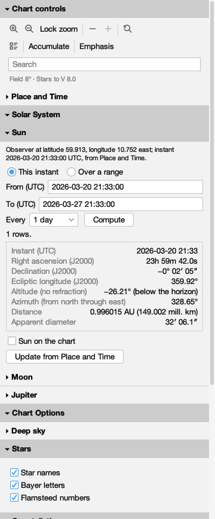
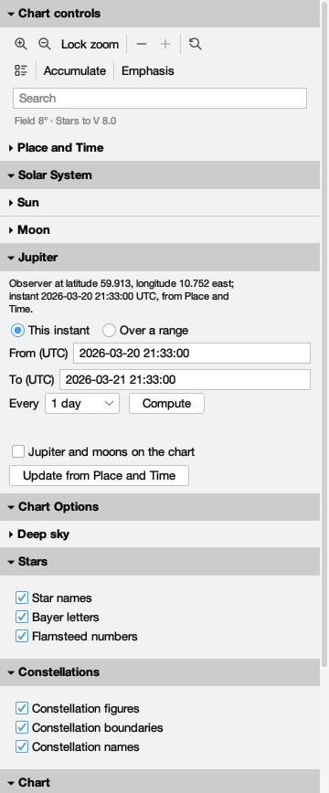
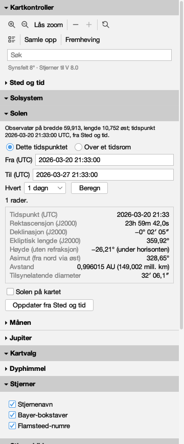
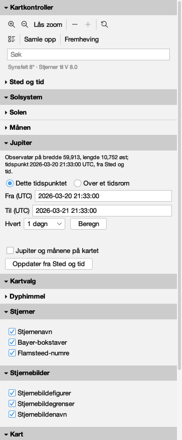

# Every word the companion says

Issue #434. Generated by
`juranometria.tool.CompanionSheetMain` from compiled
application classes and their classpath resources.

The production companion window, holding its four
production sections - the chart's controls, the same
class the toolbar hosts; the same `PlaceAndTimePanel`
the Place and Time dialog holds; Solar System, the same
controls the Sun and Moon dialogs host; and Chart
Options - in
a real window at the size the companion's own policy
states. Place and Time is `PlaceAndTimeSheetMain`'s Oslo
arrangement at its frozen instant.

**Norsk bokmål — reviewed.** A person who reads the language has been through these surfaces and said these are the words an atlas should use. This is linguistic judgement, not corroboration against a source: unlike the constellation names next door, these are original translations written for this application and there is no citation to check them against. Recorded in `nb-NO.manifest`, and read from there rather than written here.

## English (`en`)

### open

| shown | hovered | spoken as | read out |
|---|---|---|---|
| JUranometria Controller | — | JUranometria Controller | Controls you can keep beside the chart while you read it |
| ▾ Chart controls | Show or hide this section | Chart controls, expanded | A hidden section keeps everything it is set to; whether it is hidden is remembered. |
| — | Zoom in (⌘=) | Zoom in | Shows a narrower field, with fainter stars on it |
| — | Zoom out (⌘-) | Zoom out | Shows a wider field, with fewer stars on it |
| Lock zoom | When on, the mouse wheel and the trackpad do not change the field. The zoom buttons and View's zoom items still do. | Lock zoom | Off, scrolling over the chart zooms in and out; on, it does nothing, so a careless wheel or trackpad cannot change the field. Zoom In, Zoom Out and their keys still change it, and the choice is remembered. |
| — | Show fewer stars with a brighter magnitude limit | Fewer stars | Draws only the brighter stars, one step at a time |
| — | Unavailable: V 8.0 is the faintest magnitude limit | More stars | Unavailable: V 8.0 is the faintest magnitude limit the atlas draws |
| — | Reset view: back to the atlas's first page | Reset view | Returns the chart to where every reader begins, and clears the search; what the chart draws is left as you chose it |
| — | Show the Inspector: what the selected mark is (⌘I) | Inspector | Hidden; press to open the panel that identifies what you selected and lists what is on this page. |
| Accumulate | When on, choosing objects adds them to the working selection and choosing them again removes them, instead of replacing the selection. The platform's add-to-selection modifier always works. | Accumulate selection | Off, each object you choose replaces the working selection; on, it is added to it, and choosing it again takes it out. Holding the platform's add-to-selection modifier does the same whether this is on or off. |
| Emphasis | Let one or more chart structures rise from the page | Emphasis | Temporarily strengthens chosen structures so they are easy to follow — the meridian, the ecliptic, the grid, the horizon, or the constellations’ own lines. Normal settles the chart back to its ordinary design. |
| — | Find an object or coordinates, e.g. M 31, NGC 224, TYC 2801-2090-1, or 0:42:44 +41:16:09 | Search the atlas | Type a Messier or NGC number, a star's catalogue identity, or a right ascension and declination, then press Enter; the chart goes there and marks it |
| Field 8° · Stars to V 8.0 | — | Field 8° · Stars to V 8.0 | — |
| ▾ Place and Time | Show or hide this section | Place and Time, expanded | A hidden section keeps everything it is set to; whether it is hidden is remembered. |
| Latitude | — | Latitude | — |
| 59.913 | Degrees north of the equator, e.g. 59.913; south is negative, -90 to 90 | Latitude | Degrees north of the equator, negative south, -90 to 90 |
| Longitude, east positive | — | Longitude, east positive | — |
| 10.752 | Degrees east of Greenwich, e.g. 10.752; west is negative | Longitude, east positive | Degrees east of Greenwich; west is negative |
| Instant (UTC) | — | Instant (UTC) | — |
| 2026-03-20 21:33:00 | The moment the lines are drawn for, as 2026-03-20 21:33:00 | Instant (UTC) | The instant used to draw the reference lines. Time does not advance until you change it. |
| The chart is drawn for that instant and stays there. Nothing ticks. | — | The chart is drawn for that instant and stays there. Nothing ticks. | — |
| Meridian | Draw the great circle through both celestial poles and your zenith (⌘K then R) | Show Meridian | Draws the line that runs from due north, through the point overhead, to due south. It lasts as long as this session. |
| Mathematical horizon | Draw where the sky meets a perfectly flat, transparent Earth (⌘K then H) | Show Mathematical horizon | Draws the circle where the sky would meet a flat and transparent Earth; your own horizon has hills and air in it. It lasts as long as this session. |
| Zenith | Mark the point overhead | Show Zenith | Marks the point directly above you. It is drawn with the observer's lines and has no shortcut of its own. |
| Now | Reads the clock once and freezes the chart at that instant | Now | Freezes the reference lines at the present moment. The clock is read once; nothing moves afterwards. |
| Centre on zenith | Move the chart to the point overhead | Centre on zenith | Moves the page to the point directly above you. This is the only control in this window that moves the chart. |
| ▸ Solar System | Show or hide this section | Solar System, collapsed | A hidden section keeps everything it is set to; whether it is hidden is remembered. |
| ▾ Chart Options | Show or hide this section | Chart Options, expanded | A hidden section keeps everything it is set to; whether it is hidden is remembered. |
| ▸ Deep sky | Show or hide this section | Deep sky, collapsed | A hidden section keeps everything it is set to; whether it is hidden is remembered. |
| ▾ Stars | Show or hide this section | Stars, expanded | A hidden section keeps everything it is set to; whether it is hidden is remembered. |
| Star names | Traditional proper names such as Betelgeuse. Shortcut: ⌘K then S. | Star names | Traditional proper names such as Betelgeuse. Switch it here or from the chart with ⌘K then S. |
| Bayer letters | Greek and Latin Bayer designations such as alpha Orionis. Shortcut: ⌘K then Y. | Bayer letters | Greek and Latin Bayer designations such as alpha Orionis. Switch it here or from the chart with ⌘K then Y. |
| Flamsteed numbers | Flamsteed catalogue numbers on the regional charts. Shortcut: ⌘K then M. | Flamsteed numbers | Flamsteed catalogue numbers on the regional charts. Switch it here or from the chart with ⌘K then M. |
| ▾ Constellations | Show or hide this section | Constellations, expanded | A hidden section keeps everything it is set to; whether it is hidden is remembered. |
| Constellation figures | The joined stick figures of the constellations. Shortcut: ⌘K then F. | Constellation figures | The joined stick figures of the constellations. Switch it here or from the chart with ⌘K then F. |
| Constellation boundaries | The IAU boundaries, precessed from B1875. Shortcut: ⌘K then B. | Constellation boundaries | The IAU boundaries, precessed from B1875. Switch it here or from the chart with ⌘K then B. |
| Constellation names | The figure's name, drawn where the figure is. Shortcut: ⌘K then N. | Constellation names | The figure's name, drawn where the figure is. Switch it here or from the chart with ⌘K then N. Requires constellation figures to be on. |
| ▾ Chart | Show or hide this section | Chart, expanded | A hidden section keeps everything it is set to; whether it is hidden is remembered. |
| Equatorial coordinate grid | ICRS/J2000 right-ascension and declination grid lines with coordinate labels. Shortcut: ⌘K then E. | Equatorial coordinate grid | ICRS/J2000 right-ascension and declination grid lines with coordinate labels. Switch it here or from the chart with ⌘K then E. |
| Title block | The panel in the lower left stating the target, centre, frame, field width, limiting magnitude and orientation. Shortcut: ⌘K then T. | Title block | The panel in the lower left stating the target, centre, frame, field width, limiting magnitude and orientation. Switch it here or from the chart with ⌘K then T. |
| Stellar-magnitude key | A key in the upper right showing the circle size the chart draws for three visual magnitudes, including this page's limit. Shortcut: ⌘K then J. | Stellar-magnitude key | A key in the upper right showing the circle size the chart draws for three visual magnitudes, including this page's limit. Switch it here or from the chart with ⌘K then J. |
| Black sky | White stars and restrained light ink on a black ground, instead of the white-paper chart; a chart choice, independent of the application's light or dark appearance. Shortcut: ⌘K then K. | Black sky | White stars and restrained light ink on a black ground, instead of the white-paper chart; a chart choice, independent of the application's light or dark appearance. Switch it here or from the chart with ⌘K then K. |
| Restore Defaults | Return to the atlas defaults: every layer and deep-sky family in this window on, the title block on, the magnitude key off, and the chart on white paper. You are asked first. | Restore Defaults | Returns every choice in this window to the atlas defaults, on the chart at once and remembered. Because nothing takes it back, you are asked first. |

### dark

| shown | hovered | spoken as | read out |
|---|---|---|---|
| JUranometria Controller | — | JUranometria Controller | Controls you can keep beside the chart while you read it |
| ▾ Chart controls | Show or hide this section | Chart controls, expanded | A hidden section keeps everything it is set to; whether it is hidden is remembered. |
| — | Zoom in (⌘=) | Zoom in | Shows a narrower field, with fainter stars on it |
| — | Zoom out (⌘-) | Zoom out | Shows a wider field, with fewer stars on it |
| Lock zoom | When on, the mouse wheel and the trackpad do not change the field. The zoom buttons and View's zoom items still do. | Lock zoom | Off, scrolling over the chart zooms in and out; on, it does nothing, so a careless wheel or trackpad cannot change the field. Zoom In, Zoom Out and their keys still change it, and the choice is remembered. |
| — | Show fewer stars with a brighter magnitude limit | Fewer stars | Draws only the brighter stars, one step at a time |
| — | Unavailable: V 8.0 is the faintest magnitude limit | More stars | Unavailable: V 8.0 is the faintest magnitude limit the atlas draws |
| — | Reset view: back to the atlas's first page | Reset view | Returns the chart to where every reader begins, and clears the search; what the chart draws is left as you chose it |
| — | Show the Inspector: what the selected mark is (⌘I) | Inspector | Hidden; press to open the panel that identifies what you selected and lists what is on this page. |
| Accumulate | When on, choosing objects adds them to the working selection and choosing them again removes them, instead of replacing the selection. The platform's add-to-selection modifier always works. | Accumulate selection | Off, each object you choose replaces the working selection; on, it is added to it, and choosing it again takes it out. Holding the platform's add-to-selection modifier does the same whether this is on or off. |
| Emphasis | Let one or more chart structures rise from the page | Emphasis | Temporarily strengthens chosen structures so they are easy to follow — the meridian, the ecliptic, the grid, the horizon, or the constellations’ own lines. Normal settles the chart back to its ordinary design. |
| — | Find an object or coordinates, e.g. M 31, NGC 224, TYC 2801-2090-1, or 0:42:44 +41:16:09 | Search the atlas | Type a Messier or NGC number, a star's catalogue identity, or a right ascension and declination, then press Enter; the chart goes there and marks it |
| Field 8° · Stars to V 8.0 | — | Field 8° · Stars to V 8.0 | — |
| ▾ Place and Time | Show or hide this section | Place and Time, expanded | A hidden section keeps everything it is set to; whether it is hidden is remembered. |
| Latitude | — | Latitude | — |
| 59.913 | Degrees north of the equator, e.g. 59.913; south is negative, -90 to 90 | Latitude | Degrees north of the equator, negative south, -90 to 90 |
| Longitude, east positive | — | Longitude, east positive | — |
| 10.752 | Degrees east of Greenwich, e.g. 10.752; west is negative | Longitude, east positive | Degrees east of Greenwich; west is negative |
| Instant (UTC) | — | Instant (UTC) | — |
| 2026-03-20 21:33:00 | The moment the lines are drawn for, as 2026-03-20 21:33:00 | Instant (UTC) | The instant used to draw the reference lines. Time does not advance until you change it. |
| The chart is drawn for that instant and stays there. Nothing ticks. | — | The chart is drawn for that instant and stays there. Nothing ticks. | — |
| Meridian | Draw the great circle through both celestial poles and your zenith (⌘K then R) | Show Meridian | Draws the line that runs from due north, through the point overhead, to due south. It lasts as long as this session. |
| Mathematical horizon | Draw where the sky meets a perfectly flat, transparent Earth (⌘K then H) | Show Mathematical horizon | Draws the circle where the sky would meet a flat and transparent Earth; your own horizon has hills and air in it. It lasts as long as this session. |
| Zenith | Mark the point overhead | Show Zenith | Marks the point directly above you. It is drawn with the observer's lines and has no shortcut of its own. |
| Now | Reads the clock once and freezes the chart at that instant | Now | Freezes the reference lines at the present moment. The clock is read once; nothing moves afterwards. |
| Centre on zenith | Move the chart to the point overhead | Centre on zenith | Moves the page to the point directly above you. This is the only control in this window that moves the chart. |
| ▸ Solar System | Show or hide this section | Solar System, collapsed | A hidden section keeps everything it is set to; whether it is hidden is remembered. |
| ▾ Chart Options | Show or hide this section | Chart Options, expanded | A hidden section keeps everything it is set to; whether it is hidden is remembered. |
| ▸ Deep sky | Show or hide this section | Deep sky, collapsed | A hidden section keeps everything it is set to; whether it is hidden is remembered. |
| ▾ Stars | Show or hide this section | Stars, expanded | A hidden section keeps everything it is set to; whether it is hidden is remembered. |
| Star names | Traditional proper names such as Betelgeuse. Shortcut: ⌘K then S. | Star names | Traditional proper names such as Betelgeuse. Switch it here or from the chart with ⌘K then S. |
| Bayer letters | Greek and Latin Bayer designations such as alpha Orionis. Shortcut: ⌘K then Y. | Bayer letters | Greek and Latin Bayer designations such as alpha Orionis. Switch it here or from the chart with ⌘K then Y. |
| Flamsteed numbers | Flamsteed catalogue numbers on the regional charts. Shortcut: ⌘K then M. | Flamsteed numbers | Flamsteed catalogue numbers on the regional charts. Switch it here or from the chart with ⌘K then M. |
| ▾ Constellations | Show or hide this section | Constellations, expanded | A hidden section keeps everything it is set to; whether it is hidden is remembered. |
| Constellation figures | The joined stick figures of the constellations. Shortcut: ⌘K then F. | Constellation figures | The joined stick figures of the constellations. Switch it here or from the chart with ⌘K then F. |
| Constellation boundaries | The IAU boundaries, precessed from B1875. Shortcut: ⌘K then B. | Constellation boundaries | The IAU boundaries, precessed from B1875. Switch it here or from the chart with ⌘K then B. |
| Constellation names | The figure's name, drawn where the figure is. Shortcut: ⌘K then N. | Constellation names | The figure's name, drawn where the figure is. Switch it here or from the chart with ⌘K then N. Requires constellation figures to be on. |
| ▾ Chart | Show or hide this section | Chart, expanded | A hidden section keeps everything it is set to; whether it is hidden is remembered. |
| Equatorial coordinate grid | ICRS/J2000 right-ascension and declination grid lines with coordinate labels. Shortcut: ⌘K then E. | Equatorial coordinate grid | ICRS/J2000 right-ascension and declination grid lines with coordinate labels. Switch it here or from the chart with ⌘K then E. |
| Title block | The panel in the lower left stating the target, centre, frame, field width, limiting magnitude and orientation. Shortcut: ⌘K then T. | Title block | The panel in the lower left stating the target, centre, frame, field width, limiting magnitude and orientation. Switch it here or from the chart with ⌘K then T. |
| Stellar-magnitude key | A key in the upper right showing the circle size the chart draws for three visual magnitudes, including this page's limit. Shortcut: ⌘K then J. | Stellar-magnitude key | A key in the upper right showing the circle size the chart draws for three visual magnitudes, including this page's limit. Switch it here or from the chart with ⌘K then J. |
| Black sky | White stars and restrained light ink on a black ground, instead of the white-paper chart; a chart choice, independent of the application's light or dark appearance. Shortcut: ⌘K then K. | Black sky | White stars and restrained light ink on a black ground, instead of the white-paper chart; a chart choice, independent of the application's light or dark appearance. Switch it here or from the chart with ⌘K then K. |
| Restore Defaults | Return to the atlas defaults: every layer and deep-sky family in this window on, the title block on, the magnitude key off, and the chart on white paper. You are asked first. | Restore Defaults | Returns every choice in this window to the atlas defaults, on the chart at once and remembered. Because nothing takes it back, you are asked first. |

### collapsed

| shown | hovered | spoken as | read out |
|---|---|---|---|
| JUranometria Controller | — | JUranometria Controller | Controls you can keep beside the chart while you read it |
| ▾ Chart controls | Show or hide this section | Chart controls, expanded | A hidden section keeps everything it is set to; whether it is hidden is remembered. |
| — | Zoom in (⌘=) | Zoom in | Shows a narrower field, with fainter stars on it |
| — | Zoom out (⌘-) | Zoom out | Shows a wider field, with fewer stars on it |
| Lock zoom | When on, the mouse wheel and the trackpad do not change the field. The zoom buttons and View's zoom items still do. | Lock zoom | Off, scrolling over the chart zooms in and out; on, it does nothing, so a careless wheel or trackpad cannot change the field. Zoom In, Zoom Out and their keys still change it, and the choice is remembered. |
| — | Show fewer stars with a brighter magnitude limit | Fewer stars | Draws only the brighter stars, one step at a time |
| — | Unavailable: V 8.0 is the faintest magnitude limit | More stars | Unavailable: V 8.0 is the faintest magnitude limit the atlas draws |
| — | Reset view: back to the atlas's first page | Reset view | Returns the chart to where every reader begins, and clears the search; what the chart draws is left as you chose it |
| — | Show the Inspector: what the selected mark is (⌘I) | Inspector | Hidden; press to open the panel that identifies what you selected and lists what is on this page. |
| Accumulate | When on, choosing objects adds them to the working selection and choosing them again removes them, instead of replacing the selection. The platform's add-to-selection modifier always works. | Accumulate selection | Off, each object you choose replaces the working selection; on, it is added to it, and choosing it again takes it out. Holding the platform's add-to-selection modifier does the same whether this is on or off. |
| Emphasis | Let one or more chart structures rise from the page | Emphasis | Temporarily strengthens chosen structures so they are easy to follow — the meridian, the ecliptic, the grid, the horizon, or the constellations’ own lines. Normal settles the chart back to its ordinary design. |
| — | Find an object or coordinates, e.g. M 31, NGC 224, TYC 2801-2090-1, or 0:42:44 +41:16:09 | Search the atlas | Type a Messier or NGC number, a star's catalogue identity, or a right ascension and declination, then press Enter; the chart goes there and marks it |
| Field 8° · Stars to V 8.0 | — | Field 8° · Stars to V 8.0 | — |
| ▸ Place and Time | Show or hide this section | Place and Time, collapsed | A hidden section keeps everything it is set to; whether it is hidden is remembered. |
| ▸ Solar System | Show or hide this section | Solar System, collapsed | A hidden section keeps everything it is set to; whether it is hidden is remembered. |
| ▾ Chart Options | Show or hide this section | Chart Options, expanded | A hidden section keeps everything it is set to; whether it is hidden is remembered. |
| ▸ Deep sky | Show or hide this section | Deep sky, collapsed | A hidden section keeps everything it is set to; whether it is hidden is remembered. |
| ▾ Stars | Show or hide this section | Stars, expanded | A hidden section keeps everything it is set to; whether it is hidden is remembered. |
| Star names | Traditional proper names such as Betelgeuse. Shortcut: ⌘K then S. | Star names | Traditional proper names such as Betelgeuse. Switch it here or from the chart with ⌘K then S. |
| Bayer letters | Greek and Latin Bayer designations such as alpha Orionis. Shortcut: ⌘K then Y. | Bayer letters | Greek and Latin Bayer designations such as alpha Orionis. Switch it here or from the chart with ⌘K then Y. |
| Flamsteed numbers | Flamsteed catalogue numbers on the regional charts. Shortcut: ⌘K then M. | Flamsteed numbers | Flamsteed catalogue numbers on the regional charts. Switch it here or from the chart with ⌘K then M. |
| ▾ Constellations | Show or hide this section | Constellations, expanded | A hidden section keeps everything it is set to; whether it is hidden is remembered. |
| Constellation figures | The joined stick figures of the constellations. Shortcut: ⌘K then F. | Constellation figures | The joined stick figures of the constellations. Switch it here or from the chart with ⌘K then F. |
| Constellation boundaries | The IAU boundaries, precessed from B1875. Shortcut: ⌘K then B. | Constellation boundaries | The IAU boundaries, precessed from B1875. Switch it here or from the chart with ⌘K then B. |
| Constellation names | The figure's name, drawn where the figure is. Shortcut: ⌘K then N. | Constellation names | The figure's name, drawn where the figure is. Switch it here or from the chart with ⌘K then N. Requires constellation figures to be on. |
| ▾ Chart | Show or hide this section | Chart, expanded | A hidden section keeps everything it is set to; whether it is hidden is remembered. |
| Equatorial coordinate grid | ICRS/J2000 right-ascension and declination grid lines with coordinate labels. Shortcut: ⌘K then E. | Equatorial coordinate grid | ICRS/J2000 right-ascension and declination grid lines with coordinate labels. Switch it here or from the chart with ⌘K then E. |
| Title block | The panel in the lower left stating the target, centre, frame, field width, limiting magnitude and orientation. Shortcut: ⌘K then T. | Title block | The panel in the lower left stating the target, centre, frame, field width, limiting magnitude and orientation. Switch it here or from the chart with ⌘K then T. |
| Stellar-magnitude key | A key in the upper right showing the circle size the chart draws for three visual magnitudes, including this page's limit. Shortcut: ⌘K then J. | Stellar-magnitude key | A key in the upper right showing the circle size the chart draws for three visual magnitudes, including this page's limit. Switch it here or from the chart with ⌘K then J. |
| Black sky | White stars and restrained light ink on a black ground, instead of the white-paper chart; a chart choice, independent of the application's light or dark appearance. Shortcut: ⌘K then K. | Black sky | White stars and restrained light ink on a black ground, instead of the white-paper chart; a chart choice, independent of the application's light or dark appearance. Switch it here or from the chart with ⌘K then K. |
| Restore Defaults | Return to the atlas defaults: every layer and deep-sky family in this window on, the title block on, the magnitude key off, and the chart on white paper. You are asked first. | Restore Defaults | Returns every choice in this window to the atlas defaults, on the chart at once and remembered. Because nothing takes it back, you are asked first. |

### refused

| shown | hovered | spoken as | read out |
|---|---|---|---|
| JUranometria Controller | — | JUranometria Controller | Controls you can keep beside the chart while you read it |
| ▾ Chart controls | Show or hide this section | Chart controls, expanded | A hidden section keeps everything it is set to; whether it is hidden is remembered. |
| — | Zoom in (⌘=) | Zoom in | Shows a narrower field, with fainter stars on it |
| — | Zoom out (⌘-) | Zoom out | Shows a wider field, with fewer stars on it |
| Lock zoom | When on, the mouse wheel and the trackpad do not change the field. The zoom buttons and View's zoom items still do. | Lock zoom | Off, scrolling over the chart zooms in and out; on, it does nothing, so a careless wheel or trackpad cannot change the field. Zoom In, Zoom Out and their keys still change it, and the choice is remembered. |
| — | Show fewer stars with a brighter magnitude limit | Fewer stars | Draws only the brighter stars, one step at a time |
| — | Unavailable: V 8.0 is the faintest magnitude limit | More stars | Unavailable: V 8.0 is the faintest magnitude limit the atlas draws |
| — | Reset view: back to the atlas's first page | Reset view | Returns the chart to where every reader begins, and clears the search; what the chart draws is left as you chose it |
| — | Show the Inspector: what the selected mark is (⌘I) | Inspector | Hidden; press to open the panel that identifies what you selected and lists what is on this page. |
| Accumulate | When on, choosing objects adds them to the working selection and choosing them again removes them, instead of replacing the selection. The platform's add-to-selection modifier always works. | Accumulate selection | Off, each object you choose replaces the working selection; on, it is added to it, and choosing it again takes it out. Holding the platform's add-to-selection modifier does the same whether this is on or off. |
| Emphasis | Let one or more chart structures rise from the page | Emphasis | Temporarily strengthens chosen structures so they are easy to follow — the meridian, the ecliptic, the grid, the horizon, or the constellations’ own lines. Normal settles the chart back to its ordinary design. |
| — | Find an object or coordinates, e.g. M 31, NGC 224, TYC 2801-2090-1, or 0:42:44 +41:16:09 | Search the atlas | Type a Messier or NGC number, a star's catalogue identity, or a right ascension and declination, then press Enter; the chart goes there and marks it |
| Field 8° · Stars to V 8.0 | — | Field 8° · Stars to V 8.0 | — |
| ▾ Place and Time | Show or hide this section | Place and Time, expanded | A hidden section keeps everything it is set to; whether it is hidden is remembered. |
| Latitude | — | Latitude | — |
| 59.913 | Degrees north of the equator, e.g. 59.913; south is negative, -90 to 90 | Latitude | Latitude must be between −90° and 90°. Kept 59.913. |
| Longitude, east positive | — | Longitude, east positive | — |
| 10.752 | Degrees east of Greenwich, e.g. 10.752; west is negative | Longitude, east positive | Degrees east of Greenwich; west is negative |
| Instant (UTC) | — | Instant (UTC) | — |
| 2026-03-20 21:33:00 | The moment the lines are drawn for, as 2026-03-20 21:33:00 | Instant (UTC) | The instant used to draw the reference lines. Time does not advance until you change it. |
| The chart is drawn for that instant and stays there. Nothing ticks. | — | The chart is drawn for that instant and stays there. Nothing ticks. | — |
| Meridian | Draw the great circle through both celestial poles and your zenith (⌘K then R) | Show Meridian | Draws the line that runs from due north, through the point overhead, to due south. It lasts as long as this session. |
| Mathematical horizon | Draw where the sky meets a perfectly flat, transparent Earth (⌘K then H) | Show Mathematical horizon | Draws the circle where the sky would meet a flat and transparent Earth; your own horizon has hills and air in it. It lasts as long as this session. |
| Zenith | Mark the point overhead | Show Zenith | Marks the point directly above you. It is drawn with the observer's lines and has no shortcut of its own. |
| Now | Reads the clock once and freezes the chart at that instant | Now | Freezes the reference lines at the present moment. The clock is read once; nothing moves afterwards. |
| Centre on zenith | Move the chart to the point overhead | Centre on zenith | Moves the page to the point directly above you. This is the only control in this window that moves the chart. |
| Latitude must be between −90° and 90°. Kept 59.913. | — | Latitude must be between −90° and 90°. Kept 59.913. | — |
| ▸ Solar System | Show or hide this section | Solar System, collapsed | A hidden section keeps everything it is set to; whether it is hidden is remembered. |
| ▾ Chart Options | Show or hide this section | Chart Options, expanded | A hidden section keeps everything it is set to; whether it is hidden is remembered. |
| ▸ Deep sky | Show or hide this section | Deep sky, collapsed | A hidden section keeps everything it is set to; whether it is hidden is remembered. |
| ▾ Stars | Show or hide this section | Stars, expanded | A hidden section keeps everything it is set to; whether it is hidden is remembered. |
| Star names | Traditional proper names such as Betelgeuse. Shortcut: ⌘K then S. | Star names | Traditional proper names such as Betelgeuse. Switch it here or from the chart with ⌘K then S. |
| Bayer letters | Greek and Latin Bayer designations such as alpha Orionis. Shortcut: ⌘K then Y. | Bayer letters | Greek and Latin Bayer designations such as alpha Orionis. Switch it here or from the chart with ⌘K then Y. |
| Flamsteed numbers | Flamsteed catalogue numbers on the regional charts. Shortcut: ⌘K then M. | Flamsteed numbers | Flamsteed catalogue numbers on the regional charts. Switch it here or from the chart with ⌘K then M. |
| ▾ Constellations | Show or hide this section | Constellations, expanded | A hidden section keeps everything it is set to; whether it is hidden is remembered. |
| Constellation figures | The joined stick figures of the constellations. Shortcut: ⌘K then F. | Constellation figures | The joined stick figures of the constellations. Switch it here or from the chart with ⌘K then F. |
| Constellation boundaries | The IAU boundaries, precessed from B1875. Shortcut: ⌘K then B. | Constellation boundaries | The IAU boundaries, precessed from B1875. Switch it here or from the chart with ⌘K then B. |
| Constellation names | The figure's name, drawn where the figure is. Shortcut: ⌘K then N. | Constellation names | The figure's name, drawn where the figure is. Switch it here or from the chart with ⌘K then N. Requires constellation figures to be on. |
| ▾ Chart | Show or hide this section | Chart, expanded | A hidden section keeps everything it is set to; whether it is hidden is remembered. |
| Equatorial coordinate grid | ICRS/J2000 right-ascension and declination grid lines with coordinate labels. Shortcut: ⌘K then E. | Equatorial coordinate grid | ICRS/J2000 right-ascension and declination grid lines with coordinate labels. Switch it here or from the chart with ⌘K then E. |
| Title block | The panel in the lower left stating the target, centre, frame, field width, limiting magnitude and orientation. Shortcut: ⌘K then T. | Title block | The panel in the lower left stating the target, centre, frame, field width, limiting magnitude and orientation. Switch it here or from the chart with ⌘K then T. |
| Stellar-magnitude key | A key in the upper right showing the circle size the chart draws for three visual magnitudes, including this page's limit. Shortcut: ⌘K then J. | Stellar-magnitude key | A key in the upper right showing the circle size the chart draws for three visual magnitudes, including this page's limit. Switch it here or from the chart with ⌘K then J. |
| Black sky | White stars and restrained light ink on a black ground, instead of the white-paper chart; a chart choice, independent of the application's light or dark appearance. Shortcut: ⌘K then K. | Black sky | White stars and restrained light ink on a black ground, instead of the white-paper chart; a chart choice, independent of the application's light or dark appearance. Switch it here or from the chart with ⌘K then K. |
| Restore Defaults | Return to the atlas defaults: every layer and deep-sky family in this window on, the title block on, the magnitude key off, and the chart on white paper. You are asked first. | Restore Defaults | Returns every choice in this window to the atlas defaults, on the chart at once and remembered. Because nothing takes it back, you are asked first. |

### deep-sky-open

| shown | hovered | spoken as | read out |
|---|---|---|---|
| JUranometria Controller | — | JUranometria Controller | Controls you can keep beside the chart while you read it |
| ▾ Chart controls | Show or hide this section | Chart controls, expanded | A hidden section keeps everything it is set to; whether it is hidden is remembered. |
| — | Zoom in (⌘=) | Zoom in | Shows a narrower field, with fainter stars on it |
| — | Zoom out (⌘-) | Zoom out | Shows a wider field, with fewer stars on it |
| Lock zoom | When on, the mouse wheel and the trackpad do not change the field. The zoom buttons and View's zoom items still do. | Lock zoom | Off, scrolling over the chart zooms in and out; on, it does nothing, so a careless wheel or trackpad cannot change the field. Zoom In, Zoom Out and their keys still change it, and the choice is remembered. |
| — | Show fewer stars with a brighter magnitude limit | Fewer stars | Draws only the brighter stars, one step at a time |
| — | Unavailable: V 8.0 is the faintest magnitude limit | More stars | Unavailable: V 8.0 is the faintest magnitude limit the atlas draws |
| — | Reset view: back to the atlas's first page | Reset view | Returns the chart to where every reader begins, and clears the search; what the chart draws is left as you chose it |
| — | Show the Inspector: what the selected mark is (⌘I) | Inspector | Hidden; press to open the panel that identifies what you selected and lists what is on this page. |
| Accumulate | When on, choosing objects adds them to the working selection and choosing them again removes them, instead of replacing the selection. The platform's add-to-selection modifier always works. | Accumulate selection | Off, each object you choose replaces the working selection; on, it is added to it, and choosing it again takes it out. Holding the platform's add-to-selection modifier does the same whether this is on or off. |
| Emphasis | Let one or more chart structures rise from the page | Emphasis | Temporarily strengthens chosen structures so they are easy to follow — the meridian, the ecliptic, the grid, the horizon, or the constellations’ own lines. Normal settles the chart back to its ordinary design. |
| — | Find an object or coordinates, e.g. M 31, NGC 224, TYC 2801-2090-1, or 0:42:44 +41:16:09 | Search the atlas | Type a Messier or NGC number, a star's catalogue identity, or a right ascension and declination, then press Enter; the chart goes there and marks it |
| Field 8° · Stars to V 8.0 | — | Field 8° · Stars to V 8.0 | — |
| ▸ Place and Time | Show or hide this section | Place and Time, collapsed | A hidden section keeps everything it is set to; whether it is hidden is remembered. |
| ▸ Solar System | Show or hide this section | Solar System, collapsed | A hidden section keeps everything it is set to; whether it is hidden is remembered. |
| ▾ Chart Options | Show or hide this section | Chart Options, expanded | A hidden section keeps everything it is set to; whether it is hidden is remembered. |
| ▾ Deep sky | Show or hide this section | Deep sky, expanded | A hidden section keeps everything it is set to; whether it is hidden is remembered. |
| Deep-sky objects | Draw deep-sky objects on the chart at all. Shortcut: ⌘K then D. | Deep-sky objects | Draw deep-sky objects on the chart at all. Switch it here or from the chart with ⌘K then D. |
| Galaxies | Galaxies, drawn at their catalogued size and orientation, including close pairs, triplets and groups. For example: M 31, M 51, NGC 3628. Shortcut: ⌘K then G. | Galaxies | Galaxies, drawn at their catalogued size and orientation, including close pairs, triplets and groups. For example: M 31, M 51, NGC 3628. Switch it here or from the chart with ⌘K then G. Requires deep-sky objects to be on. |
| — | — | The symbol the chart draws for Galaxies | Galaxies, drawn at their catalogued size and orientation, including close pairs, triplets and groups. For example: M 31, M 51, NGC 3628. |
| Galaxies, drawn at their catalogued size and orientation, including close pairs, triplets and groups. For example: M 31, M 51, NGC 3628. | — | — | — |
| Open clusters | Loose clusters of young stars in the plane of the Milky Way. For example: M 45, M 44, NGC 869. Shortcut: ⌘K then O. | Open clusters | Loose clusters of young stars in the plane of the Milky Way. For example: M 45, M 44, NGC 869. Switch it here or from the chart with ⌘K then O. Requires deep-sky objects to be on. |
| — | — | The symbol the chart draws for Open clusters | Loose clusters of young stars in the plane of the Milky Way. For example: M 45, M 44, NGC 869. |
| Loose clusters of young stars in the plane of the Milky Way. For example: M 45, M 44, NGC 869. | — | — | — |
| Globular clusters | Dense, ancient balls of stars in the galactic halo. For example: M 13, M 22, NGC 5139. Shortcut: ⌘K then C. | Globular clusters | Dense, ancient balls of stars in the galactic halo. For example: M 13, M 22, NGC 5139. Switch it here or from the chart with ⌘K then C. Requires deep-sky objects to be on. |
| — | — | The symbol the chart draws for Globular clusters | Dense, ancient balls of stars in the galactic halo. For example: M 13, M 22, NGC 5139. |
| Dense, ancient balls of stars in the galactic halo. For example: M 13, M 22, NGC 5139. | — | — | — |
| Nebulae | Clouds of gas and dust: emission, reflection and dark nebulae, H II regions, supernova remnants, and clusters still wrapped in nebulosity. For example: M 42, M 1, NGC 7000. Shortcut: ⌘K then U. | Nebulae | Clouds of gas and dust: emission, reflection and dark nebulae, H II regions, supernova remnants, and clusters still wrapped in nebulosity. For example: M 42, M 1, NGC 7000. Switch it here or from the chart with ⌘K then U. Requires deep-sky objects to be on. |
| — | — | The symbol the chart draws for Nebulae | Clouds of gas and dust: emission, reflection and dark nebulae, H II regions, supernova remnants, and clusters still wrapped in nebulosity. For example: M 42, M 1, NGC 7000. |
| Clouds of gas and dust: emission, reflection and dark nebulae, H II regions, supernova remnants, and clusters still wrapped in nebulosity. For example: M 42, M 1, NGC 7000. | — | — | — |
| Planetary nebulae | Shells thrown off by dying stars, drawn small and crossed so they read apart from the other nebulae. For example: M 57, M 27, NGC 7009. Shortcut: ⌘K then P. | Planetary nebulae | Shells thrown off by dying stars, drawn small and crossed so they read apart from the other nebulae. For example: M 57, M 27, NGC 7009. Switch it here or from the chart with ⌘K then P. Requires deep-sky objects to be on. |
| — | — | The symbol the chart draws for Planetary nebulae | Shells thrown off by dying stars, drawn small and crossed so they read apart from the other nebulae. For example: M 57, M 27, NGC 7009. |
| Shells thrown off by dying stars, drawn small and crossed so they read apart from the other nebulae. For example: M 57, M 27, NGC 7009. | — | — | — |
| Deep-sky labels | Name the deep-sky objects the chart draws. Shortcut: ⌘K then L. | Deep-sky labels | Name the deep-sky objects the chart draws. Switch it here or from the chart with ⌘K then L. Requires deep-sky objects to be on. |
| ▾ Stars | Show or hide this section | Stars, expanded | A hidden section keeps everything it is set to; whether it is hidden is remembered. |
| Star names | Traditional proper names such as Betelgeuse. Shortcut: ⌘K then S. | Star names | Traditional proper names such as Betelgeuse. Switch it here or from the chart with ⌘K then S. |
| Bayer letters | Greek and Latin Bayer designations such as alpha Orionis. Shortcut: ⌘K then Y. | Bayer letters | Greek and Latin Bayer designations such as alpha Orionis. Switch it here or from the chart with ⌘K then Y. |
| Flamsteed numbers | Flamsteed catalogue numbers on the regional charts. Shortcut: ⌘K then M. | Flamsteed numbers | Flamsteed catalogue numbers on the regional charts. Switch it here or from the chart with ⌘K then M. |
| ▾ Constellations | Show or hide this section | Constellations, expanded | A hidden section keeps everything it is set to; whether it is hidden is remembered. |
| Constellation figures | The joined stick figures of the constellations. Shortcut: ⌘K then F. | Constellation figures | The joined stick figures of the constellations. Switch it here or from the chart with ⌘K then F. |
| Constellation boundaries | The IAU boundaries, precessed from B1875. Shortcut: ⌘K then B. | Constellation boundaries | The IAU boundaries, precessed from B1875. Switch it here or from the chart with ⌘K then B. |
| Constellation names | The figure's name, drawn where the figure is. Shortcut: ⌘K then N. | Constellation names | The figure's name, drawn where the figure is. Switch it here or from the chart with ⌘K then N. Requires constellation figures to be on. |
| ▾ Chart | Show or hide this section | Chart, expanded | A hidden section keeps everything it is set to; whether it is hidden is remembered. |
| Equatorial coordinate grid | ICRS/J2000 right-ascension and declination grid lines with coordinate labels. Shortcut: ⌘K then E. | Equatorial coordinate grid | ICRS/J2000 right-ascension and declination grid lines with coordinate labels. Switch it here or from the chart with ⌘K then E. |
| Title block | The panel in the lower left stating the target, centre, frame, field width, limiting magnitude and orientation. Shortcut: ⌘K then T. | Title block | The panel in the lower left stating the target, centre, frame, field width, limiting magnitude and orientation. Switch it here or from the chart with ⌘K then T. |
| Stellar-magnitude key | A key in the upper right showing the circle size the chart draws for three visual magnitudes, including this page's limit. Shortcut: ⌘K then J. | Stellar-magnitude key | A key in the upper right showing the circle size the chart draws for three visual magnitudes, including this page's limit. Switch it here or from the chart with ⌘K then J. |
| Black sky | White stars and restrained light ink on a black ground, instead of the white-paper chart; a chart choice, independent of the application's light or dark appearance. Shortcut: ⌘K then K. | Black sky | White stars and restrained light ink on a black ground, instead of the white-paper chart; a chart choice, independent of the application's light or dark appearance. Switch it here or from the chart with ⌘K then K. |
| Restore Defaults | Return to the atlas defaults: every layer and deep-sky family in this window on, the title block on, the magnitude key off, and the chart on white paper. You are asked first. | Restore Defaults | Returns every choice in this window to the atlas defaults, on the chart at once and remembered. Because nothing takes it back, you are asked first. |

### solar-system-open

| shown | hovered | spoken as | read out |
|---|---|---|---|
| JUranometria Controller | — | JUranometria Controller | Controls you can keep beside the chart while you read it |
| ▾ Chart controls | Show or hide this section | Chart controls, expanded | A hidden section keeps everything it is set to; whether it is hidden is remembered. |
| — | Zoom in (⌘=) | Zoom in | Shows a narrower field, with fainter stars on it |
| — | Zoom out (⌘-) | Zoom out | Shows a wider field, with fewer stars on it |
| Lock zoom | When on, the mouse wheel and the trackpad do not change the field. The zoom buttons and View's zoom items still do. | Lock zoom | Off, scrolling over the chart zooms in and out; on, it does nothing, so a careless wheel or trackpad cannot change the field. Zoom In, Zoom Out and their keys still change it, and the choice is remembered. |
| — | Show fewer stars with a brighter magnitude limit | Fewer stars | Draws only the brighter stars, one step at a time |
| — | Unavailable: V 8.0 is the faintest magnitude limit | More stars | Unavailable: V 8.0 is the faintest magnitude limit the atlas draws |
| — | Reset view: back to the atlas's first page | Reset view | Returns the chart to where every reader begins, and clears the search; what the chart draws is left as you chose it |
| — | Show the Inspector: what the selected mark is (⌘I) | Inspector | Hidden; press to open the panel that identifies what you selected and lists what is on this page. |
| Accumulate | When on, choosing objects adds them to the working selection and choosing them again removes them, instead of replacing the selection. The platform's add-to-selection modifier always works. | Accumulate selection | Off, each object you choose replaces the working selection; on, it is added to it, and choosing it again takes it out. Holding the platform's add-to-selection modifier does the same whether this is on or off. |
| Emphasis | Let one or more chart structures rise from the page | Emphasis | Temporarily strengthens chosen structures so they are easy to follow — the meridian, the ecliptic, the grid, the horizon, or the constellations’ own lines. Normal settles the chart back to its ordinary design. |
| — | Find an object or coordinates, e.g. M 31, NGC 224, TYC 2801-2090-1, or 0:42:44 +41:16:09 | Search the atlas | Type a Messier or NGC number, a star's catalogue identity, or a right ascension and declination, then press Enter; the chart goes there and marks it |
| Field 8° · Stars to V 8.0 | — | Field 8° · Stars to V 8.0 | — |
| ▸ Place and Time | Show or hide this section | Place and Time, collapsed | A hidden section keeps everything it is set to; whether it is hidden is remembered. |
| ▾ Solar System | Show or hide this section | Solar System, expanded | A hidden section keeps everything it is set to; whether it is hidden is remembered. |
| ▾ Sun | Show or hide this section | Sun, expanded | A hidden section keeps everything it is set to; whether it is hidden is remembered. |
| Observer at latitude 59.913, longitude 10.752 east; instant 2026-03-20 21:33:00 UTC, from Place and Time. | — | Observer at latitude 59.913, longitude 10.752 east; instant 2026-03-20 21:33:00 UTC, from Place and Time. | — |
| This instant | One row, at the instant set in Place and Time | Show the Sun at the instant set in Place and Time | Shows a single row: the Sun at the observing instant set in Place and Time. |
| Over a range | A row for every step from a start to an end | Show the Sun over a range of instants | Shows a row for every step from the start to the end, both included; an end that is not on the grid is added as the last row and marked. |
| From (UTC) | — | From (UTC) | — |
| 2026-03-20 21:33:00 | yyyy-mm-dd hh:mm or hh:mm:ss, in UTC | From (UTC) | The first instant of the range, in UTC. Starts at the instant set in Place and Time. |
| To (UTC) | — | To (UTC) | — |
| 2026-03-27 21:33:00 | yyyy-mm-dd hh:mm or hh:mm:ss, in UTC | To (UTC) | The last instant of the range, in UTC, included; if it is not on the grid it is added as the last row and marked. |
| Every | — | Every | — |
| — | The elapsed time between rows | Step between rows | The elapsed time between rows, on the UTC timeline, so a daily range does not drift across a change of civil clock. |
| — | The elapsed time between rows | — | The elapsed time between rows |
| Compute | Fill the table for the range above | Compute the range | Computes a row for every step of the range above. |
| 1 rows. | — | 1 rows. | — |
| — | — | The Sun's computed quantities | — |
| Instant (UTC) | The instant in UTC, to the minute. "est." marks an instant whose clock correction is estimated; † marks a range end that was not on the grid. | Instant (UTC) | The instant in UTC, to the minute. "est." marks an instant whose clock correction is estimated; † marks a range end that was not on the grid. |
| 2026-03-20 21:33 | — | Instant (UTC): 2026-03-20 21:33 | — |
| Right ascension (J2000) | Hours, minutes and seconds of time, in the ICRS/J2000 frame the chart is drawn in: where the Sun is among the fixed stars, as seen from the observing place, without aberration. | Right ascension (J2000) | Hours, minutes and seconds of time, in the ICRS/J2000 frame the chart is drawn in: where the Sun is among the fixed stars, as seen from the observing place, without aberration. |
| 23h 59m 42.0s | — | Right ascension (J2000): 23h 59m 42.0s | — |
| Declination (J2000) | Degrees, minutes and seconds of arc, in the same frame. | Declination (J2000) | Degrees, minutes and seconds of arc, in the same frame. |
| −0° 02′ 05″ | — | Declination (J2000): −0° 02′ 05″ | — |
| Ecliptic longitude (J2000) | Degrees along the J2000 ecliptic, measured from the fixed J2000 equinox. The equinoxes and solstices of a later year fall near, not exactly at, 0°, 90°, 180° and 270°, because the equinox itself moves. | Ecliptic longitude (J2000) | Degrees along the J2000 ecliptic, measured from the fixed J2000 equinox. The equinoxes and solstices of a later year fall near, not exactly at, 0°, 90°, 180° and 270°, because the equinox itself moves. |
| 359.92° | — | Ecliptic longitude (J2000): 359.92° | — |
| Altitude (no refraction) | Degrees above the mathematical horizon, without atmospheric refraction; below the horizon the number is kept and the status is added. | Altitude (no refraction) | Degrees above the mathematical horizon, without atmospheric refraction; below the horizon the number is kept and the status is added. |
| −26.21° (below the horizon) | — | Altitude (no refraction): −26.21° (below the horizon) | — |
| Azimuth (from north through east) | Degrees from north through east: 90° is east, 180° south, 270° west. | Azimuth (from north through east) | Degrees from north through east: 90° is east, 180° south, 270° west. |
| 328.65° | — | Azimuth (from north through east): 328.65° | — |
| Distance | From the observer to the Sun's centre, in astronomical units and in millions of kilometres. | Distance | From the observer to the Sun's centre, in astronomical units and in millions of kilometres. |
| 0.996015 AU (149.002 mill. km) | — | Distance: 0.996015 AU (149.002 mill. km) | — |
| Apparent diameter | How large the Sun's disc looks, in minutes and seconds of arc. | Apparent diameter | How large the Sun's disc looks, in minutes and seconds of arc. |
| 32′ 06.1″ | — | Apparent diameter: 32′ 06.1″ | — |
| Sun on the chart | — | Sun on the chart | Shows or hides the Sun on the chart, drawn at its true size where it stands for the place and instant set in Place and Time; the same choice as View's. |
| Update from Place and Time | Read the place and instant from Place and Time again | Read the observer and instant from Place and Time again | Reads the observing place and instant from Place and Time again and recomputes. The table also does this when it opens and whenever it comes to the front. |
| ▸ Moon | Show or hide this section | Moon, collapsed | A hidden section keeps everything it is set to; whether it is hidden is remembered. |
| ▸ Jupiter | Show or hide this section | Jupiter, collapsed | A hidden section keeps everything it is set to; whether it is hidden is remembered. |
| ▾ Chart Options | Show or hide this section | Chart Options, expanded | A hidden section keeps everything it is set to; whether it is hidden is remembered. |
| ▸ Deep sky | Show or hide this section | Deep sky, collapsed | A hidden section keeps everything it is set to; whether it is hidden is remembered. |
| ▾ Stars | Show or hide this section | Stars, expanded | A hidden section keeps everything it is set to; whether it is hidden is remembered. |
| Star names | Traditional proper names such as Betelgeuse. Shortcut: ⌘K then S. | Star names | Traditional proper names such as Betelgeuse. Switch it here or from the chart with ⌘K then S. |
| Bayer letters | Greek and Latin Bayer designations such as alpha Orionis. Shortcut: ⌘K then Y. | Bayer letters | Greek and Latin Bayer designations such as alpha Orionis. Switch it here or from the chart with ⌘K then Y. |
| Flamsteed numbers | Flamsteed catalogue numbers on the regional charts. Shortcut: ⌘K then M. | Flamsteed numbers | Flamsteed catalogue numbers on the regional charts. Switch it here or from the chart with ⌘K then M. |
| ▾ Constellations | Show or hide this section | Constellations, expanded | A hidden section keeps everything it is set to; whether it is hidden is remembered. |
| Constellation figures | The joined stick figures of the constellations. Shortcut: ⌘K then F. | Constellation figures | The joined stick figures of the constellations. Switch it here or from the chart with ⌘K then F. |
| Constellation boundaries | The IAU boundaries, precessed from B1875. Shortcut: ⌘K then B. | Constellation boundaries | The IAU boundaries, precessed from B1875. Switch it here or from the chart with ⌘K then B. |
| Constellation names | The figure's name, drawn where the figure is. Shortcut: ⌘K then N. | Constellation names | The figure's name, drawn where the figure is. Switch it here or from the chart with ⌘K then N. Requires constellation figures to be on. |
| ▾ Chart | Show or hide this section | Chart, expanded | A hidden section keeps everything it is set to; whether it is hidden is remembered. |
| Equatorial coordinate grid | ICRS/J2000 right-ascension and declination grid lines with coordinate labels. Shortcut: ⌘K then E. | Equatorial coordinate grid | ICRS/J2000 right-ascension and declination grid lines with coordinate labels. Switch it here or from the chart with ⌘K then E. |
| Title block | The panel in the lower left stating the target, centre, frame, field width, limiting magnitude and orientation. Shortcut: ⌘K then T. | Title block | The panel in the lower left stating the target, centre, frame, field width, limiting magnitude and orientation. Switch it here or from the chart with ⌘K then T. |
| Stellar-magnitude key | A key in the upper right showing the circle size the chart draws for three visual magnitudes, including this page's limit. Shortcut: ⌘K then J. | Stellar-magnitude key | A key in the upper right showing the circle size the chart draws for three visual magnitudes, including this page's limit. Switch it here or from the chart with ⌘K then J. |
| Black sky | White stars and restrained light ink on a black ground, instead of the white-paper chart; a chart choice, independent of the application's light or dark appearance. Shortcut: ⌘K then K. | Black sky | White stars and restrained light ink on a black ground, instead of the white-paper chart; a chart choice, independent of the application's light or dark appearance. Switch it here or from the chart with ⌘K then K. |
| Restore Defaults | Return to the atlas defaults: every layer and deep-sky family in this window on, the title block on, the magnitude key off, and the chart on white paper. You are asked first. | Restore Defaults | Returns every choice in this window to the atlas defaults, on the chart at once and remembered. Because nothing takes it back, you are asked first. |

### jupiter-open

| shown | hovered | spoken as | read out |
|---|---|---|---|
| JUranometria Controller | — | JUranometria Controller | Controls you can keep beside the chart while you read it |
| ▾ Chart controls | Show or hide this section | Chart controls, expanded | A hidden section keeps everything it is set to; whether it is hidden is remembered. |
| — | Zoom in (⌘=) | Zoom in | Shows a narrower field, with fainter stars on it |
| — | Zoom out (⌘-) | Zoom out | Shows a wider field, with fewer stars on it |
| Lock zoom | When on, the mouse wheel and the trackpad do not change the field. The zoom buttons and View's zoom items still do. | Lock zoom | Off, scrolling over the chart zooms in and out; on, it does nothing, so a careless wheel or trackpad cannot change the field. Zoom In, Zoom Out and their keys still change it, and the choice is remembered. |
| — | Show fewer stars with a brighter magnitude limit | Fewer stars | Draws only the brighter stars, one step at a time |
| — | Unavailable: V 8.0 is the faintest magnitude limit | More stars | Unavailable: V 8.0 is the faintest magnitude limit the atlas draws |
| — | Reset view: back to the atlas's first page | Reset view | Returns the chart to where every reader begins, and clears the search; what the chart draws is left as you chose it |
| — | Show the Inspector: what the selected mark is (⌘I) | Inspector | Hidden; press to open the panel that identifies what you selected and lists what is on this page. |
| Accumulate | When on, choosing objects adds them to the working selection and choosing them again removes them, instead of replacing the selection. The platform's add-to-selection modifier always works. | Accumulate selection | Off, each object you choose replaces the working selection; on, it is added to it, and choosing it again takes it out. Holding the platform's add-to-selection modifier does the same whether this is on or off. |
| Emphasis | Let one or more chart structures rise from the page | Emphasis | Temporarily strengthens chosen structures so they are easy to follow — the meridian, the ecliptic, the grid, the horizon, or the constellations’ own lines. Normal settles the chart back to its ordinary design. |
| — | Find an object or coordinates, e.g. M 31, NGC 224, TYC 2801-2090-1, or 0:42:44 +41:16:09 | Search the atlas | Type a Messier or NGC number, a star's catalogue identity, or a right ascension and declination, then press Enter; the chart goes there and marks it |
| Field 8° · Stars to V 8.0 | — | Field 8° · Stars to V 8.0 | — |
| ▸ Place and Time | Show or hide this section | Place and Time, collapsed | A hidden section keeps everything it is set to; whether it is hidden is remembered. |
| ▾ Solar System | Show or hide this section | Solar System, expanded | A hidden section keeps everything it is set to; whether it is hidden is remembered. |
| ▸ Sun | Show or hide this section | Sun, collapsed | A hidden section keeps everything it is set to; whether it is hidden is remembered. |
| ▸ Moon | Show or hide this section | Moon, collapsed | A hidden section keeps everything it is set to; whether it is hidden is remembered. |
| ▾ Jupiter | Show or hide this section | Jupiter, expanded | A hidden section keeps everything it is set to; whether it is hidden is remembered. |
| Observer at latitude 59.913, longitude 10.752 east; instant 2026-03-20 21:33:00 UTC, from Place and Time. | — | Observer at latitude 59.913, longitude 10.752 east; instant 2026-03-20 21:33:00 UTC, from Place and Time. | — |
| This instant | One row, at the instant set in Place and Time | Show Jupiter and its moons at the instant set in Place and Time | Shows Jupiter at the observing instant set in Place and Time, and below it the four moons in a fixed order. |
| Over a range | A row for every step from a start to an end | Show the four moons over a range of instants | Shows the four moons for every step from the start to the end, both included, grouped under each instant; an end that is not on the grid is added as the last group and marked. This samples the range; it does not search for the moment a moon enters or leaves Jupiter's disc. |
| From (UTC) | — | From (UTC) | — |
| 2026-03-20 21:33:00 | yyyy-mm-dd hh:mm or hh:mm:ss, in UTC | From (UTC) | The first instant of the range, in UTC. Starts at the instant set in Place and Time. |
| To (UTC) | — | To (UTC) | — |
| 2026-03-21 21:33:00 | yyyy-mm-dd hh:mm or hh:mm:ss, in UTC | To (UTC) | The last instant of the range, in UTC, included; if it is not on the grid it is added as the last row and marked. |
| Every | — | Every | — |
| — | The elapsed time between rows | Step between rows | The elapsed time between rows, on the UTC timeline, so a daily range does not drift across a change of civil clock. |
| — | The elapsed time between rows | — | The elapsed time between rows |
| Compute | Fill the table for the range above | Compute the range | Computes a row for every step of the range above. |
| Jupiter and moons on the chart | — | Jupiter and moons on the chart | Shows or hides Jupiter on the chart where it stands for the place and instant set in Place and Time, at its true size or as a 6-pixel cartographic symbol, whichever is larger; the same choice as View's. Io, Europa, Ganymede and Callisto are drawn as 3-pixel symbols at their own places: a filled dot clear of Jupiter, a dot ringed in the page's ground in front of it, a hollow ring in its shadow, and nothing behind it; at wider fields only the moons whose marks can be told apart are drawn. |
| Update from Place and Time | Read the place and instant from Place and Time again | Read the observer and instant from Place and Time again | Reads the observing place and instant from Place and Time again and recomputes. The table also does this when it opens and whenever it comes to the front. |
| ▾ Chart Options | Show or hide this section | Chart Options, expanded | A hidden section keeps everything it is set to; whether it is hidden is remembered. |
| ▸ Deep sky | Show or hide this section | Deep sky, collapsed | A hidden section keeps everything it is set to; whether it is hidden is remembered. |
| ▾ Stars | Show or hide this section | Stars, expanded | A hidden section keeps everything it is set to; whether it is hidden is remembered. |
| Star names | Traditional proper names such as Betelgeuse. Shortcut: ⌘K then S. | Star names | Traditional proper names such as Betelgeuse. Switch it here or from the chart with ⌘K then S. |
| Bayer letters | Greek and Latin Bayer designations such as alpha Orionis. Shortcut: ⌘K then Y. | Bayer letters | Greek and Latin Bayer designations such as alpha Orionis. Switch it here or from the chart with ⌘K then Y. |
| Flamsteed numbers | Flamsteed catalogue numbers on the regional charts. Shortcut: ⌘K then M. | Flamsteed numbers | Flamsteed catalogue numbers on the regional charts. Switch it here or from the chart with ⌘K then M. |
| ▾ Constellations | Show or hide this section | Constellations, expanded | A hidden section keeps everything it is set to; whether it is hidden is remembered. |
| Constellation figures | The joined stick figures of the constellations. Shortcut: ⌘K then F. | Constellation figures | The joined stick figures of the constellations. Switch it here or from the chart with ⌘K then F. |
| Constellation boundaries | The IAU boundaries, precessed from B1875. Shortcut: ⌘K then B. | Constellation boundaries | The IAU boundaries, precessed from B1875. Switch it here or from the chart with ⌘K then B. |
| Constellation names | The figure's name, drawn where the figure is. Shortcut: ⌘K then N. | Constellation names | The figure's name, drawn where the figure is. Switch it here or from the chart with ⌘K then N. Requires constellation figures to be on. |
| ▾ Chart | Show or hide this section | Chart, expanded | A hidden section keeps everything it is set to; whether it is hidden is remembered. |
| Equatorial coordinate grid | ICRS/J2000 right-ascension and declination grid lines with coordinate labels. Shortcut: ⌘K then E. | Equatorial coordinate grid | ICRS/J2000 right-ascension and declination grid lines with coordinate labels. Switch it here or from the chart with ⌘K then E. |
| Title block | The panel in the lower left stating the target, centre, frame, field width, limiting magnitude and orientation. Shortcut: ⌘K then T. | Title block | The panel in the lower left stating the target, centre, frame, field width, limiting magnitude and orientation. Switch it here or from the chart with ⌘K then T. |
| Stellar-magnitude key | A key in the upper right showing the circle size the chart draws for three visual magnitudes, including this page's limit. Shortcut: ⌘K then J. | Stellar-magnitude key | A key in the upper right showing the circle size the chart draws for three visual magnitudes, including this page's limit. Switch it here or from the chart with ⌘K then J. |
| Black sky | White stars and restrained light ink on a black ground, instead of the white-paper chart; a chart choice, independent of the application's light or dark appearance. Shortcut: ⌘K then K. | Black sky | White stars and restrained light ink on a black ground, instead of the white-paper chart; a chart choice, independent of the application's light or dark appearance. Switch it here or from the chart with ⌘K then K. |
| Restore Defaults | Return to the atlas defaults: every layer and deep-sky family in this window on, the title block on, the magnitude key off, and the chart on white paper. You are asked first. | Restore Defaults | Returns every choice in this window to the atlas defaults, on the chart at once and remembered. Because nothing takes it back, you are asked first. |

## Norsk bokmål (`nb-NO`)

### open

| shown | hovered | spoken as | read out |
|---|---|---|---|
| JUranometria Kontroller | — | JUranometria Kontroller | Kontroller du kan ha ved siden av kartet mens du leser det |
| ▾ Kartkontroller | Vis eller skjul denne delen | Kartkontroller, utvidet | En skjult del beholder alt den er satt til, og det huskes om den er skjult. |
| — | Zoom inn (⌘=) | Zoom inn | Viser et smalere synsfelt med svakere stjerner |
| — | Zoom ut (⌘-) | Zoom ut | Viser et større synsfelt med færre stjerner |
| Lås zoom | Når denne er på, endrer ikke musehjulet og styreflaten synsfeltet. Zoomknappene og zoompunktene under Vis gjør det fortsatt. | Lås zoom | Når denne er av, zoomer du inn og ut ved å rulle over kartet; når den er på, skjer ingenting, så et uforsiktig musehjul eller en styreflate kan ikke endre synsfeltet. Zoom inn, Zoom ut og tastene deres endrer det fortsatt, og valget huskes. |
| — | Vis færre stjerner med en lysere grensemagnitude | Færre stjerner | Tegner bare lysere stjerner, ett steg om gangen |
| — | Utilgjengelig: V 8.0 er den svakeste grensemagnituden | Flere stjerner | Utilgjengelig: V 8.0 er atlasets svakeste grensemagnitude |
| — | Tilbakestill visningen: tilbake til atlasets første side | Tilbakestill visningen | Fører kartet tilbake til startsiden og tømmer søket; det du har valgt å vise på kartet, endres ikke |
| — | Vis utforskeren: hva det valgte merket er (⌘I) | Utforskeren | Skjult; trykk for å åpne panelet som viser hva du har valgt og hva som finnes på denne siden |
| Samle opp | Når denne er på, legges objektene du velger til i arbeidsutvalget. Velger du et objekt på nytt, tas det ut. Plattformens tast for å legge til i utvalget virker alltid. | Samle opp valgte objekter | Når denne er av, erstatter hvert nytt objekt arbeidsutvalget. Når den er på, legges objektet til; velger du det på nytt, tas det ut. Plattformens tast for å legge til i utvalget virker i begge tilfeller. |
| Fremheving | La én eller flere kartstrukturer løfte seg fra siden | Fremheving | Forsterker midlertidig valgte strukturer så de er lette å følge — meridianen, ekliptikken, rutenettet, horisonten eller stjernebildenes egne streker. Normal roer kartet tilbake til sin vanlige utforming. |
| — | Finn et objekt eller koordinater, f.eks. M 31, NGC 224, TYC 2801-2090-1 eller 0:42:44 +41:16:09 | Søk i atlaset | Skriv et Messier- eller NGC-nummer, en stjernes katalogidentitet eller en rektascensjon og deklinasjon, og trykk Enter. Kartet flyttes dit og objektet markeres. |
| Synsfelt 8° · Stjerner til V 8.0 | — | Synsfelt 8° · Stjerner til V 8.0 | — |
| ▾ Sted og tid | Vis eller skjul denne delen | Sted og tid, utvidet | En skjult del beholder alt den er satt til, og det huskes om den er skjult. |
| Breddegrad | — | Breddegrad | — |
| 59.913 | Grader nord for ekvator, f.eks. 59.913; sørlige breddegrader er negative, -90 til 90 | Breddegrad | Grader nord for ekvator; sørlige breddegrader er negative, -90 til 90 |
| Lengdegrad, øst positiv | — | Lengdegrad, øst positiv | — |
| 10.752 | Grader øst for Greenwich, f.eks. 10.752; vestlige lengdegrader er negative | Lengdegrad, øst positiv | Grader øst for Greenwich; vestlige lengdegrader er negative |
| Tidspunkt (UTC) | — | Tidspunkt (UTC) | — |
| 2026-03-20 21:33:00 | Tidspunktet linjene tegnes for, som 2026-03-20 21:33:00 | Tidspunkt (UTC) | Tidspunktet som brukes til å tegne referanselinjene. Tiden går ikke videre før du endrer tidspunktet. |
| Kartet tegnes for dette tidspunktet. Tiden går ikke videre av seg selv. | — | Kartet tegnes for dette tidspunktet. Tiden går ikke videre av seg selv. | — |
| Meridian | Tegn storsirkelen gjennom begge himmelpolene og senit (⌘K deretter R) | Vis meridianen | Tegner linjen som går fra rett nord, gjennom punktet rett over deg, til rett sør. Valget gjelder ut denne økten. |
| Matematisk horisont | Tegn der himmelen møter en helt flat og gjennomsiktig jord (⌘K deretter H) | Vis matematisk horisont | Tegner sirkelen der himmelen ville ha møtt en flat og gjennomsiktig jord; din egen horisont har åser og luft i seg. Valget gjelder ut denne økten. |
| Senit | Marker punktet rett over deg | Vis senit | Markerer punktet rett over deg. Det tegnes sammen med observatørens linjer og har ingen egen hurtigtast. |
| Nå | Les klokken én gang og sett kartets tidspunkt til nå | Nå | Tegner referanselinjene for tidspunktet nå. Klokken leses én gang; tiden går ikke videre etterpå. |
| Sentrer på senit | Flytt kartet til punktet rett over deg | Sentrer på senit | Flytter siden til punktet rett over deg. Dette er den eneste knappen i dette vinduet som flytter kartet. |
| ▸ Solsystem | Vis eller skjul denne delen | Solsystem, skjult | En skjult del beholder alt den er satt til, og det huskes om den er skjult. |
| ▾ Kartvalg | Vis eller skjul denne delen | Kartvalg, utvidet | En skjult del beholder alt den er satt til, og det huskes om den er skjult. |
| ▸ Dyphimmel | Vis eller skjul denne delen | Dyphimmel, skjult | En skjult del beholder alt den er satt til, og det huskes om den er skjult. |
| ▾ Stjerner | Vis eller skjul denne delen | Stjerner, utvidet | En skjult del beholder alt den er satt til, og det huskes om den er skjult. |
| Stjernenavn | Tradisjonelle egennavn som Betelgeuse. Snarvei: ⌘K deretter S. | Stjernenavn | Tradisjonelle egennavn som Betelgeuse. Slå det av eller på her eller fra kartet med ⌘K deretter S. |
| Bayer-bokstaver | Greske og latinske Bayer-betegnelser som alpha Orionis. Snarvei: ⌘K deretter Y. | Bayer-bokstaver | Greske og latinske Bayer-betegnelser som alpha Orionis. Slå det av eller på her eller fra kartet med ⌘K deretter Y. |
| Flamsteed-numre | Flamsteed-katalognumre på regionkartene. Snarvei: ⌘K deretter M. | Flamsteed-numre | Flamsteed-katalognumre på regionkartene. Slå det av eller på her eller fra kartet med ⌘K deretter M. |
| ▾ Stjernebilder | Vis eller skjul denne delen | Stjernebilder, utvidet | En skjult del beholder alt den er satt til, og det huskes om den er skjult. |
| Stjernebildefigurer | Strekfigurene som binder sammen stjernene i stjernebildene. Snarvei: ⌘K deretter F. | Stjernebildefigurer | Strekfigurene som binder sammen stjernene i stjernebildene. Slå det av eller på her eller fra kartet med ⌘K deretter F. |
| Stjernebildegrenser | IAUs grenser, presesjonsjustert fra B1875. Snarvei: ⌘K deretter B. | Stjernebildegrenser | IAUs grenser, presesjonsjustert fra B1875. Slå det av eller på her eller fra kartet med ⌘K deretter B. |
| Stjernebildenavn | Navnet på stjernebildet, plassert ved figuren. Snarvei: ⌘K deretter N. | Stjernebildenavn | Navnet på stjernebildet, plassert ved figuren. Slå det av eller på her eller fra kartet med ⌘K deretter N. Stjernebildefigurer må være slått på. |
| ▾ Kart | Vis eller skjul denne delen | Kart, utvidet | En skjult del beholder alt den er satt til, og det huskes om den er skjult. |
| Ekvatorialt rutenett | Rutenett for rektascensjon og deklinasjon i ICRS/J2000, med koordinatmerking. Snarvei: ⌘K deretter E. | Ekvatorialt rutenett | Rutenett for rektascensjon og deklinasjon i ICRS/J2000, med koordinatmerking. Slå det av eller på her eller fra kartet med ⌘K deretter E. |
| Tittelfelt | Feltet nede til venstre som oppgir mål, sentrum, referansesystem, synsfelt, grensemagnitude og orientering. Snarvei: ⌘K deretter T. | Tittelfelt | Feltet nede til venstre som oppgir mål, sentrum, referansesystem, synsfelt, grensemagnitude og orientering. Slå det av eller på her eller fra kartet med ⌘K deretter T. |
| Magnitudeforklaring | En forklaring oppe til høyre som viser sirkelstørrelsen kartet tegner for tre visuelle magnituder, deriblant grensen for denne siden. Snarvei: ⌘K deretter J. | Magnitudeforklaring | En forklaring oppe til høyre som viser sirkelstørrelsen kartet tegner for tre visuelle magnituder, deriblant grensen for denne siden. Slå det av eller på her eller fra kartet med ⌘K deretter J. |
| Svart himmel | Hvite stjerner og dempet, lyst blekk på svart bunn i stedet for kartet på hvitt papir; et kartvalg, uavhengig av om programmet har lyst eller mørkt utseende. Snarvei: ⌘K deretter K. | Svart himmel | Hvite stjerner og dempet, lyst blekk på svart bunn i stedet for kartet på hvitt papir; et kartvalg, uavhengig av om programmet har lyst eller mørkt utseende. Slå det av eller på her eller fra kartet med ⌘K deretter K. |
| Gjenopprett standardvalg | Gå tilbake til atlasets standardvalg: alle lag og dyphimmelfamilier i dette vinduet på, tittelfeltet på, magnitudeforklaringen av og kartet på hvitt papir. Du blir spurt først. | Gjenopprett standardvalg | Setter alle valgene i vinduet tilbake til atlasets standardvalg, på kartet med en gang og husket. Fordi ingenting angrer det, blir du spurt først. |

### dark

| shown | hovered | spoken as | read out |
|---|---|---|---|
| JUranometria Kontroller | — | JUranometria Kontroller | Kontroller du kan ha ved siden av kartet mens du leser det |
| ▾ Kartkontroller | Vis eller skjul denne delen | Kartkontroller, utvidet | En skjult del beholder alt den er satt til, og det huskes om den er skjult. |
| — | Zoom inn (⌘=) | Zoom inn | Viser et smalere synsfelt med svakere stjerner |
| — | Zoom ut (⌘-) | Zoom ut | Viser et større synsfelt med færre stjerner |
| Lås zoom | Når denne er på, endrer ikke musehjulet og styreflaten synsfeltet. Zoomknappene og zoompunktene under Vis gjør det fortsatt. | Lås zoom | Når denne er av, zoomer du inn og ut ved å rulle over kartet; når den er på, skjer ingenting, så et uforsiktig musehjul eller en styreflate kan ikke endre synsfeltet. Zoom inn, Zoom ut og tastene deres endrer det fortsatt, og valget huskes. |
| — | Vis færre stjerner med en lysere grensemagnitude | Færre stjerner | Tegner bare lysere stjerner, ett steg om gangen |
| — | Utilgjengelig: V 8.0 er den svakeste grensemagnituden | Flere stjerner | Utilgjengelig: V 8.0 er atlasets svakeste grensemagnitude |
| — | Tilbakestill visningen: tilbake til atlasets første side | Tilbakestill visningen | Fører kartet tilbake til startsiden og tømmer søket; det du har valgt å vise på kartet, endres ikke |
| — | Vis utforskeren: hva det valgte merket er (⌘I) | Utforskeren | Skjult; trykk for å åpne panelet som viser hva du har valgt og hva som finnes på denne siden |
| Samle opp | Når denne er på, legges objektene du velger til i arbeidsutvalget. Velger du et objekt på nytt, tas det ut. Plattformens tast for å legge til i utvalget virker alltid. | Samle opp valgte objekter | Når denne er av, erstatter hvert nytt objekt arbeidsutvalget. Når den er på, legges objektet til; velger du det på nytt, tas det ut. Plattformens tast for å legge til i utvalget virker i begge tilfeller. |
| Fremheving | La én eller flere kartstrukturer løfte seg fra siden | Fremheving | Forsterker midlertidig valgte strukturer så de er lette å følge — meridianen, ekliptikken, rutenettet, horisonten eller stjernebildenes egne streker. Normal roer kartet tilbake til sin vanlige utforming. |
| — | Finn et objekt eller koordinater, f.eks. M 31, NGC 224, TYC 2801-2090-1 eller 0:42:44 +41:16:09 | Søk i atlaset | Skriv et Messier- eller NGC-nummer, en stjernes katalogidentitet eller en rektascensjon og deklinasjon, og trykk Enter. Kartet flyttes dit og objektet markeres. |
| Synsfelt 8° · Stjerner til V 8.0 | — | Synsfelt 8° · Stjerner til V 8.0 | — |
| ▾ Sted og tid | Vis eller skjul denne delen | Sted og tid, utvidet | En skjult del beholder alt den er satt til, og det huskes om den er skjult. |
| Breddegrad | — | Breddegrad | — |
| 59.913 | Grader nord for ekvator, f.eks. 59.913; sørlige breddegrader er negative, -90 til 90 | Breddegrad | Grader nord for ekvator; sørlige breddegrader er negative, -90 til 90 |
| Lengdegrad, øst positiv | — | Lengdegrad, øst positiv | — |
| 10.752 | Grader øst for Greenwich, f.eks. 10.752; vestlige lengdegrader er negative | Lengdegrad, øst positiv | Grader øst for Greenwich; vestlige lengdegrader er negative |
| Tidspunkt (UTC) | — | Tidspunkt (UTC) | — |
| 2026-03-20 21:33:00 | Tidspunktet linjene tegnes for, som 2026-03-20 21:33:00 | Tidspunkt (UTC) | Tidspunktet som brukes til å tegne referanselinjene. Tiden går ikke videre før du endrer tidspunktet. |
| Kartet tegnes for dette tidspunktet. Tiden går ikke videre av seg selv. | — | Kartet tegnes for dette tidspunktet. Tiden går ikke videre av seg selv. | — |
| Meridian | Tegn storsirkelen gjennom begge himmelpolene og senit (⌘K deretter R) | Vis meridianen | Tegner linjen som går fra rett nord, gjennom punktet rett over deg, til rett sør. Valget gjelder ut denne økten. |
| Matematisk horisont | Tegn der himmelen møter en helt flat og gjennomsiktig jord (⌘K deretter H) | Vis matematisk horisont | Tegner sirkelen der himmelen ville ha møtt en flat og gjennomsiktig jord; din egen horisont har åser og luft i seg. Valget gjelder ut denne økten. |
| Senit | Marker punktet rett over deg | Vis senit | Markerer punktet rett over deg. Det tegnes sammen med observatørens linjer og har ingen egen hurtigtast. |
| Nå | Les klokken én gang og sett kartets tidspunkt til nå | Nå | Tegner referanselinjene for tidspunktet nå. Klokken leses én gang; tiden går ikke videre etterpå. |
| Sentrer på senit | Flytt kartet til punktet rett over deg | Sentrer på senit | Flytter siden til punktet rett over deg. Dette er den eneste knappen i dette vinduet som flytter kartet. |
| ▸ Solsystem | Vis eller skjul denne delen | Solsystem, skjult | En skjult del beholder alt den er satt til, og det huskes om den er skjult. |
| ▾ Kartvalg | Vis eller skjul denne delen | Kartvalg, utvidet | En skjult del beholder alt den er satt til, og det huskes om den er skjult. |
| ▸ Dyphimmel | Vis eller skjul denne delen | Dyphimmel, skjult | En skjult del beholder alt den er satt til, og det huskes om den er skjult. |
| ▾ Stjerner | Vis eller skjul denne delen | Stjerner, utvidet | En skjult del beholder alt den er satt til, og det huskes om den er skjult. |
| Stjernenavn | Tradisjonelle egennavn som Betelgeuse. Snarvei: ⌘K deretter S. | Stjernenavn | Tradisjonelle egennavn som Betelgeuse. Slå det av eller på her eller fra kartet med ⌘K deretter S. |
| Bayer-bokstaver | Greske og latinske Bayer-betegnelser som alpha Orionis. Snarvei: ⌘K deretter Y. | Bayer-bokstaver | Greske og latinske Bayer-betegnelser som alpha Orionis. Slå det av eller på her eller fra kartet med ⌘K deretter Y. |
| Flamsteed-numre | Flamsteed-katalognumre på regionkartene. Snarvei: ⌘K deretter M. | Flamsteed-numre | Flamsteed-katalognumre på regionkartene. Slå det av eller på her eller fra kartet med ⌘K deretter M. |
| ▾ Stjernebilder | Vis eller skjul denne delen | Stjernebilder, utvidet | En skjult del beholder alt den er satt til, og det huskes om den er skjult. |
| Stjernebildefigurer | Strekfigurene som binder sammen stjernene i stjernebildene. Snarvei: ⌘K deretter F. | Stjernebildefigurer | Strekfigurene som binder sammen stjernene i stjernebildene. Slå det av eller på her eller fra kartet med ⌘K deretter F. |
| Stjernebildegrenser | IAUs grenser, presesjonsjustert fra B1875. Snarvei: ⌘K deretter B. | Stjernebildegrenser | IAUs grenser, presesjonsjustert fra B1875. Slå det av eller på her eller fra kartet med ⌘K deretter B. |
| Stjernebildenavn | Navnet på stjernebildet, plassert ved figuren. Snarvei: ⌘K deretter N. | Stjernebildenavn | Navnet på stjernebildet, plassert ved figuren. Slå det av eller på her eller fra kartet med ⌘K deretter N. Stjernebildefigurer må være slått på. |
| ▾ Kart | Vis eller skjul denne delen | Kart, utvidet | En skjult del beholder alt den er satt til, og det huskes om den er skjult. |
| Ekvatorialt rutenett | Rutenett for rektascensjon og deklinasjon i ICRS/J2000, med koordinatmerking. Snarvei: ⌘K deretter E. | Ekvatorialt rutenett | Rutenett for rektascensjon og deklinasjon i ICRS/J2000, med koordinatmerking. Slå det av eller på her eller fra kartet med ⌘K deretter E. |
| Tittelfelt | Feltet nede til venstre som oppgir mål, sentrum, referansesystem, synsfelt, grensemagnitude og orientering. Snarvei: ⌘K deretter T. | Tittelfelt | Feltet nede til venstre som oppgir mål, sentrum, referansesystem, synsfelt, grensemagnitude og orientering. Slå det av eller på her eller fra kartet med ⌘K deretter T. |
| Magnitudeforklaring | En forklaring oppe til høyre som viser sirkelstørrelsen kartet tegner for tre visuelle magnituder, deriblant grensen for denne siden. Snarvei: ⌘K deretter J. | Magnitudeforklaring | En forklaring oppe til høyre som viser sirkelstørrelsen kartet tegner for tre visuelle magnituder, deriblant grensen for denne siden. Slå det av eller på her eller fra kartet med ⌘K deretter J. |
| Svart himmel | Hvite stjerner og dempet, lyst blekk på svart bunn i stedet for kartet på hvitt papir; et kartvalg, uavhengig av om programmet har lyst eller mørkt utseende. Snarvei: ⌘K deretter K. | Svart himmel | Hvite stjerner og dempet, lyst blekk på svart bunn i stedet for kartet på hvitt papir; et kartvalg, uavhengig av om programmet har lyst eller mørkt utseende. Slå det av eller på her eller fra kartet med ⌘K deretter K. |
| Gjenopprett standardvalg | Gå tilbake til atlasets standardvalg: alle lag og dyphimmelfamilier i dette vinduet på, tittelfeltet på, magnitudeforklaringen av og kartet på hvitt papir. Du blir spurt først. | Gjenopprett standardvalg | Setter alle valgene i vinduet tilbake til atlasets standardvalg, på kartet med en gang og husket. Fordi ingenting angrer det, blir du spurt først. |

### collapsed

| shown | hovered | spoken as | read out |
|---|---|---|---|
| JUranometria Kontroller | — | JUranometria Kontroller | Kontroller du kan ha ved siden av kartet mens du leser det |
| ▾ Kartkontroller | Vis eller skjul denne delen | Kartkontroller, utvidet | En skjult del beholder alt den er satt til, og det huskes om den er skjult. |
| — | Zoom inn (⌘=) | Zoom inn | Viser et smalere synsfelt med svakere stjerner |
| — | Zoom ut (⌘-) | Zoom ut | Viser et større synsfelt med færre stjerner |
| Lås zoom | Når denne er på, endrer ikke musehjulet og styreflaten synsfeltet. Zoomknappene og zoompunktene under Vis gjør det fortsatt. | Lås zoom | Når denne er av, zoomer du inn og ut ved å rulle over kartet; når den er på, skjer ingenting, så et uforsiktig musehjul eller en styreflate kan ikke endre synsfeltet. Zoom inn, Zoom ut og tastene deres endrer det fortsatt, og valget huskes. |
| — | Vis færre stjerner med en lysere grensemagnitude | Færre stjerner | Tegner bare lysere stjerner, ett steg om gangen |
| — | Utilgjengelig: V 8.0 er den svakeste grensemagnituden | Flere stjerner | Utilgjengelig: V 8.0 er atlasets svakeste grensemagnitude |
| — | Tilbakestill visningen: tilbake til atlasets første side | Tilbakestill visningen | Fører kartet tilbake til startsiden og tømmer søket; det du har valgt å vise på kartet, endres ikke |
| — | Vis utforskeren: hva det valgte merket er (⌘I) | Utforskeren | Skjult; trykk for å åpne panelet som viser hva du har valgt og hva som finnes på denne siden |
| Samle opp | Når denne er på, legges objektene du velger til i arbeidsutvalget. Velger du et objekt på nytt, tas det ut. Plattformens tast for å legge til i utvalget virker alltid. | Samle opp valgte objekter | Når denne er av, erstatter hvert nytt objekt arbeidsutvalget. Når den er på, legges objektet til; velger du det på nytt, tas det ut. Plattformens tast for å legge til i utvalget virker i begge tilfeller. |
| Fremheving | La én eller flere kartstrukturer løfte seg fra siden | Fremheving | Forsterker midlertidig valgte strukturer så de er lette å følge — meridianen, ekliptikken, rutenettet, horisonten eller stjernebildenes egne streker. Normal roer kartet tilbake til sin vanlige utforming. |
| — | Finn et objekt eller koordinater, f.eks. M 31, NGC 224, TYC 2801-2090-1 eller 0:42:44 +41:16:09 | Søk i atlaset | Skriv et Messier- eller NGC-nummer, en stjernes katalogidentitet eller en rektascensjon og deklinasjon, og trykk Enter. Kartet flyttes dit og objektet markeres. |
| Synsfelt 8° · Stjerner til V 8.0 | — | Synsfelt 8° · Stjerner til V 8.0 | — |
| ▸ Sted og tid | Vis eller skjul denne delen | Sted og tid, skjult | En skjult del beholder alt den er satt til, og det huskes om den er skjult. |
| ▸ Solsystem | Vis eller skjul denne delen | Solsystem, skjult | En skjult del beholder alt den er satt til, og det huskes om den er skjult. |
| ▾ Kartvalg | Vis eller skjul denne delen | Kartvalg, utvidet | En skjult del beholder alt den er satt til, og det huskes om den er skjult. |
| ▸ Dyphimmel | Vis eller skjul denne delen | Dyphimmel, skjult | En skjult del beholder alt den er satt til, og det huskes om den er skjult. |
| ▾ Stjerner | Vis eller skjul denne delen | Stjerner, utvidet | En skjult del beholder alt den er satt til, og det huskes om den er skjult. |
| Stjernenavn | Tradisjonelle egennavn som Betelgeuse. Snarvei: ⌘K deretter S. | Stjernenavn | Tradisjonelle egennavn som Betelgeuse. Slå det av eller på her eller fra kartet med ⌘K deretter S. |
| Bayer-bokstaver | Greske og latinske Bayer-betegnelser som alpha Orionis. Snarvei: ⌘K deretter Y. | Bayer-bokstaver | Greske og latinske Bayer-betegnelser som alpha Orionis. Slå det av eller på her eller fra kartet med ⌘K deretter Y. |
| Flamsteed-numre | Flamsteed-katalognumre på regionkartene. Snarvei: ⌘K deretter M. | Flamsteed-numre | Flamsteed-katalognumre på regionkartene. Slå det av eller på her eller fra kartet med ⌘K deretter M. |
| ▾ Stjernebilder | Vis eller skjul denne delen | Stjernebilder, utvidet | En skjult del beholder alt den er satt til, og det huskes om den er skjult. |
| Stjernebildefigurer | Strekfigurene som binder sammen stjernene i stjernebildene. Snarvei: ⌘K deretter F. | Stjernebildefigurer | Strekfigurene som binder sammen stjernene i stjernebildene. Slå det av eller på her eller fra kartet med ⌘K deretter F. |
| Stjernebildegrenser | IAUs grenser, presesjonsjustert fra B1875. Snarvei: ⌘K deretter B. | Stjernebildegrenser | IAUs grenser, presesjonsjustert fra B1875. Slå det av eller på her eller fra kartet med ⌘K deretter B. |
| Stjernebildenavn | Navnet på stjernebildet, plassert ved figuren. Snarvei: ⌘K deretter N. | Stjernebildenavn | Navnet på stjernebildet, plassert ved figuren. Slå det av eller på her eller fra kartet med ⌘K deretter N. Stjernebildefigurer må være slått på. |
| ▾ Kart | Vis eller skjul denne delen | Kart, utvidet | En skjult del beholder alt den er satt til, og det huskes om den er skjult. |
| Ekvatorialt rutenett | Rutenett for rektascensjon og deklinasjon i ICRS/J2000, med koordinatmerking. Snarvei: ⌘K deretter E. | Ekvatorialt rutenett | Rutenett for rektascensjon og deklinasjon i ICRS/J2000, med koordinatmerking. Slå det av eller på her eller fra kartet med ⌘K deretter E. |
| Tittelfelt | Feltet nede til venstre som oppgir mål, sentrum, referansesystem, synsfelt, grensemagnitude og orientering. Snarvei: ⌘K deretter T. | Tittelfelt | Feltet nede til venstre som oppgir mål, sentrum, referansesystem, synsfelt, grensemagnitude og orientering. Slå det av eller på her eller fra kartet med ⌘K deretter T. |
| Magnitudeforklaring | En forklaring oppe til høyre som viser sirkelstørrelsen kartet tegner for tre visuelle magnituder, deriblant grensen for denne siden. Snarvei: ⌘K deretter J. | Magnitudeforklaring | En forklaring oppe til høyre som viser sirkelstørrelsen kartet tegner for tre visuelle magnituder, deriblant grensen for denne siden. Slå det av eller på her eller fra kartet med ⌘K deretter J. |
| Svart himmel | Hvite stjerner og dempet, lyst blekk på svart bunn i stedet for kartet på hvitt papir; et kartvalg, uavhengig av om programmet har lyst eller mørkt utseende. Snarvei: ⌘K deretter K. | Svart himmel | Hvite stjerner og dempet, lyst blekk på svart bunn i stedet for kartet på hvitt papir; et kartvalg, uavhengig av om programmet har lyst eller mørkt utseende. Slå det av eller på her eller fra kartet med ⌘K deretter K. |
| Gjenopprett standardvalg | Gå tilbake til atlasets standardvalg: alle lag og dyphimmelfamilier i dette vinduet på, tittelfeltet på, magnitudeforklaringen av og kartet på hvitt papir. Du blir spurt først. | Gjenopprett standardvalg | Setter alle valgene i vinduet tilbake til atlasets standardvalg, på kartet med en gang og husket. Fordi ingenting angrer det, blir du spurt først. |

### refused

| shown | hovered | spoken as | read out |
|---|---|---|---|
| JUranometria Kontroller | — | JUranometria Kontroller | Kontroller du kan ha ved siden av kartet mens du leser det |
| ▾ Kartkontroller | Vis eller skjul denne delen | Kartkontroller, utvidet | En skjult del beholder alt den er satt til, og det huskes om den er skjult. |
| — | Zoom inn (⌘=) | Zoom inn | Viser et smalere synsfelt med svakere stjerner |
| — | Zoom ut (⌘-) | Zoom ut | Viser et større synsfelt med færre stjerner |
| Lås zoom | Når denne er på, endrer ikke musehjulet og styreflaten synsfeltet. Zoomknappene og zoompunktene under Vis gjør det fortsatt. | Lås zoom | Når denne er av, zoomer du inn og ut ved å rulle over kartet; når den er på, skjer ingenting, så et uforsiktig musehjul eller en styreflate kan ikke endre synsfeltet. Zoom inn, Zoom ut og tastene deres endrer det fortsatt, og valget huskes. |
| — | Vis færre stjerner med en lysere grensemagnitude | Færre stjerner | Tegner bare lysere stjerner, ett steg om gangen |
| — | Utilgjengelig: V 8.0 er den svakeste grensemagnituden | Flere stjerner | Utilgjengelig: V 8.0 er atlasets svakeste grensemagnitude |
| — | Tilbakestill visningen: tilbake til atlasets første side | Tilbakestill visningen | Fører kartet tilbake til startsiden og tømmer søket; det du har valgt å vise på kartet, endres ikke |
| — | Vis utforskeren: hva det valgte merket er (⌘I) | Utforskeren | Skjult; trykk for å åpne panelet som viser hva du har valgt og hva som finnes på denne siden |
| Samle opp | Når denne er på, legges objektene du velger til i arbeidsutvalget. Velger du et objekt på nytt, tas det ut. Plattformens tast for å legge til i utvalget virker alltid. | Samle opp valgte objekter | Når denne er av, erstatter hvert nytt objekt arbeidsutvalget. Når den er på, legges objektet til; velger du det på nytt, tas det ut. Plattformens tast for å legge til i utvalget virker i begge tilfeller. |
| Fremheving | La én eller flere kartstrukturer løfte seg fra siden | Fremheving | Forsterker midlertidig valgte strukturer så de er lette å følge — meridianen, ekliptikken, rutenettet, horisonten eller stjernebildenes egne streker. Normal roer kartet tilbake til sin vanlige utforming. |
| — | Finn et objekt eller koordinater, f.eks. M 31, NGC 224, TYC 2801-2090-1 eller 0:42:44 +41:16:09 | Søk i atlaset | Skriv et Messier- eller NGC-nummer, en stjernes katalogidentitet eller en rektascensjon og deklinasjon, og trykk Enter. Kartet flyttes dit og objektet markeres. |
| Synsfelt 8° · Stjerner til V 8.0 | — | Synsfelt 8° · Stjerner til V 8.0 | — |
| ▾ Sted og tid | Vis eller skjul denne delen | Sted og tid, utvidet | En skjult del beholder alt den er satt til, og det huskes om den er skjult. |
| Breddegrad | — | Breddegrad | — |
| 59.913 | Grader nord for ekvator, f.eks. 59.913; sørlige breddegrader er negative, -90 til 90 | Breddegrad | Breddegraden må ligge mellom −90° og 90°. Beholdt 59.913. |
| Lengdegrad, øst positiv | — | Lengdegrad, øst positiv | — |
| 10.752 | Grader øst for Greenwich, f.eks. 10.752; vestlige lengdegrader er negative | Lengdegrad, øst positiv | Grader øst for Greenwich; vestlige lengdegrader er negative |
| Tidspunkt (UTC) | — | Tidspunkt (UTC) | — |
| 2026-03-20 21:33:00 | Tidspunktet linjene tegnes for, som 2026-03-20 21:33:00 | Tidspunkt (UTC) | Tidspunktet som brukes til å tegne referanselinjene. Tiden går ikke videre før du endrer tidspunktet. |
| Kartet tegnes for dette tidspunktet. Tiden går ikke videre av seg selv. | — | Kartet tegnes for dette tidspunktet. Tiden går ikke videre av seg selv. | — |
| Meridian | Tegn storsirkelen gjennom begge himmelpolene og senit (⌘K deretter R) | Vis meridianen | Tegner linjen som går fra rett nord, gjennom punktet rett over deg, til rett sør. Valget gjelder ut denne økten. |
| Matematisk horisont | Tegn der himmelen møter en helt flat og gjennomsiktig jord (⌘K deretter H) | Vis matematisk horisont | Tegner sirkelen der himmelen ville ha møtt en flat og gjennomsiktig jord; din egen horisont har åser og luft i seg. Valget gjelder ut denne økten. |
| Senit | Marker punktet rett over deg | Vis senit | Markerer punktet rett over deg. Det tegnes sammen med observatørens linjer og har ingen egen hurtigtast. |
| Nå | Les klokken én gang og sett kartets tidspunkt til nå | Nå | Tegner referanselinjene for tidspunktet nå. Klokken leses én gang; tiden går ikke videre etterpå. |
| Sentrer på senit | Flytt kartet til punktet rett over deg | Sentrer på senit | Flytter siden til punktet rett over deg. Dette er den eneste knappen i dette vinduet som flytter kartet. |
| Breddegraden må ligge mellom −90° og 90°. Beholdt 59.913. | — | Breddegraden må ligge mellom −90° og 90°. Beholdt 59.913. | — |
| ▸ Solsystem | Vis eller skjul denne delen | Solsystem, skjult | En skjult del beholder alt den er satt til, og det huskes om den er skjult. |
| ▾ Kartvalg | Vis eller skjul denne delen | Kartvalg, utvidet | En skjult del beholder alt den er satt til, og det huskes om den er skjult. |
| ▸ Dyphimmel | Vis eller skjul denne delen | Dyphimmel, skjult | En skjult del beholder alt den er satt til, og det huskes om den er skjult. |
| ▾ Stjerner | Vis eller skjul denne delen | Stjerner, utvidet | En skjult del beholder alt den er satt til, og det huskes om den er skjult. |
| Stjernenavn | Tradisjonelle egennavn som Betelgeuse. Snarvei: ⌘K deretter S. | Stjernenavn | Tradisjonelle egennavn som Betelgeuse. Slå det av eller på her eller fra kartet med ⌘K deretter S. |
| Bayer-bokstaver | Greske og latinske Bayer-betegnelser som alpha Orionis. Snarvei: ⌘K deretter Y. | Bayer-bokstaver | Greske og latinske Bayer-betegnelser som alpha Orionis. Slå det av eller på her eller fra kartet med ⌘K deretter Y. |
| Flamsteed-numre | Flamsteed-katalognumre på regionkartene. Snarvei: ⌘K deretter M. | Flamsteed-numre | Flamsteed-katalognumre på regionkartene. Slå det av eller på her eller fra kartet med ⌘K deretter M. |
| ▾ Stjernebilder | Vis eller skjul denne delen | Stjernebilder, utvidet | En skjult del beholder alt den er satt til, og det huskes om den er skjult. |
| Stjernebildefigurer | Strekfigurene som binder sammen stjernene i stjernebildene. Snarvei: ⌘K deretter F. | Stjernebildefigurer | Strekfigurene som binder sammen stjernene i stjernebildene. Slå det av eller på her eller fra kartet med ⌘K deretter F. |
| Stjernebildegrenser | IAUs grenser, presesjonsjustert fra B1875. Snarvei: ⌘K deretter B. | Stjernebildegrenser | IAUs grenser, presesjonsjustert fra B1875. Slå det av eller på her eller fra kartet med ⌘K deretter B. |
| Stjernebildenavn | Navnet på stjernebildet, plassert ved figuren. Snarvei: ⌘K deretter N. | Stjernebildenavn | Navnet på stjernebildet, plassert ved figuren. Slå det av eller på her eller fra kartet med ⌘K deretter N. Stjernebildefigurer må være slått på. |
| ▾ Kart | Vis eller skjul denne delen | Kart, utvidet | En skjult del beholder alt den er satt til, og det huskes om den er skjult. |
| Ekvatorialt rutenett | Rutenett for rektascensjon og deklinasjon i ICRS/J2000, med koordinatmerking. Snarvei: ⌘K deretter E. | Ekvatorialt rutenett | Rutenett for rektascensjon og deklinasjon i ICRS/J2000, med koordinatmerking. Slå det av eller på her eller fra kartet med ⌘K deretter E. |
| Tittelfelt | Feltet nede til venstre som oppgir mål, sentrum, referansesystem, synsfelt, grensemagnitude og orientering. Snarvei: ⌘K deretter T. | Tittelfelt | Feltet nede til venstre som oppgir mål, sentrum, referansesystem, synsfelt, grensemagnitude og orientering. Slå det av eller på her eller fra kartet med ⌘K deretter T. |
| Magnitudeforklaring | En forklaring oppe til høyre som viser sirkelstørrelsen kartet tegner for tre visuelle magnituder, deriblant grensen for denne siden. Snarvei: ⌘K deretter J. | Magnitudeforklaring | En forklaring oppe til høyre som viser sirkelstørrelsen kartet tegner for tre visuelle magnituder, deriblant grensen for denne siden. Slå det av eller på her eller fra kartet med ⌘K deretter J. |
| Svart himmel | Hvite stjerner og dempet, lyst blekk på svart bunn i stedet for kartet på hvitt papir; et kartvalg, uavhengig av om programmet har lyst eller mørkt utseende. Snarvei: ⌘K deretter K. | Svart himmel | Hvite stjerner og dempet, lyst blekk på svart bunn i stedet for kartet på hvitt papir; et kartvalg, uavhengig av om programmet har lyst eller mørkt utseende. Slå det av eller på her eller fra kartet med ⌘K deretter K. |
| Gjenopprett standardvalg | Gå tilbake til atlasets standardvalg: alle lag og dyphimmelfamilier i dette vinduet på, tittelfeltet på, magnitudeforklaringen av og kartet på hvitt papir. Du blir spurt først. | Gjenopprett standardvalg | Setter alle valgene i vinduet tilbake til atlasets standardvalg, på kartet med en gang og husket. Fordi ingenting angrer det, blir du spurt først. |

### deep-sky-open

| shown | hovered | spoken as | read out |
|---|---|---|---|
| JUranometria Kontroller | — | JUranometria Kontroller | Kontroller du kan ha ved siden av kartet mens du leser det |
| ▾ Kartkontroller | Vis eller skjul denne delen | Kartkontroller, utvidet | En skjult del beholder alt den er satt til, og det huskes om den er skjult. |
| — | Zoom inn (⌘=) | Zoom inn | Viser et smalere synsfelt med svakere stjerner |
| — | Zoom ut (⌘-) | Zoom ut | Viser et større synsfelt med færre stjerner |
| Lås zoom | Når denne er på, endrer ikke musehjulet og styreflaten synsfeltet. Zoomknappene og zoompunktene under Vis gjør det fortsatt. | Lås zoom | Når denne er av, zoomer du inn og ut ved å rulle over kartet; når den er på, skjer ingenting, så et uforsiktig musehjul eller en styreflate kan ikke endre synsfeltet. Zoom inn, Zoom ut og tastene deres endrer det fortsatt, og valget huskes. |
| — | Vis færre stjerner med en lysere grensemagnitude | Færre stjerner | Tegner bare lysere stjerner, ett steg om gangen |
| — | Utilgjengelig: V 8.0 er den svakeste grensemagnituden | Flere stjerner | Utilgjengelig: V 8.0 er atlasets svakeste grensemagnitude |
| — | Tilbakestill visningen: tilbake til atlasets første side | Tilbakestill visningen | Fører kartet tilbake til startsiden og tømmer søket; det du har valgt å vise på kartet, endres ikke |
| — | Vis utforskeren: hva det valgte merket er (⌘I) | Utforskeren | Skjult; trykk for å åpne panelet som viser hva du har valgt og hva som finnes på denne siden |
| Samle opp | Når denne er på, legges objektene du velger til i arbeidsutvalget. Velger du et objekt på nytt, tas det ut. Plattformens tast for å legge til i utvalget virker alltid. | Samle opp valgte objekter | Når denne er av, erstatter hvert nytt objekt arbeidsutvalget. Når den er på, legges objektet til; velger du det på nytt, tas det ut. Plattformens tast for å legge til i utvalget virker i begge tilfeller. |
| Fremheving | La én eller flere kartstrukturer løfte seg fra siden | Fremheving | Forsterker midlertidig valgte strukturer så de er lette å følge — meridianen, ekliptikken, rutenettet, horisonten eller stjernebildenes egne streker. Normal roer kartet tilbake til sin vanlige utforming. |
| — | Finn et objekt eller koordinater, f.eks. M 31, NGC 224, TYC 2801-2090-1 eller 0:42:44 +41:16:09 | Søk i atlaset | Skriv et Messier- eller NGC-nummer, en stjernes katalogidentitet eller en rektascensjon og deklinasjon, og trykk Enter. Kartet flyttes dit og objektet markeres. |
| Synsfelt 8° · Stjerner til V 8.0 | — | Synsfelt 8° · Stjerner til V 8.0 | — |
| ▸ Sted og tid | Vis eller skjul denne delen | Sted og tid, skjult | En skjult del beholder alt den er satt til, og det huskes om den er skjult. |
| ▸ Solsystem | Vis eller skjul denne delen | Solsystem, skjult | En skjult del beholder alt den er satt til, og det huskes om den er skjult. |
| ▾ Kartvalg | Vis eller skjul denne delen | Kartvalg, utvidet | En skjult del beholder alt den er satt til, og det huskes om den er skjult. |
| ▾ Dyphimmel | Vis eller skjul denne delen | Dyphimmel, utvidet | En skjult del beholder alt den er satt til, og det huskes om den er skjult. |
| Dyphimmelobjekter | Vis eller skjul alle dyphimmelobjekter på kartet. Snarvei: ⌘K deretter D. | Dyphimmelobjekter | Vis eller skjul alle dyphimmelobjekter på kartet. Slå det av eller på her eller fra kartet med ⌘K deretter D. |
| Galakser | Galakser tegnes med størrelsen og orienteringen som er angitt i katalogen, også når de står i tette par, tripletter og grupper. For eksempel: M 31, M 51, NGC 3628. Snarvei: ⌘K deretter G. | Galakser | Galakser tegnes med størrelsen og orienteringen som er angitt i katalogen, også når de står i tette par, tripletter og grupper. For eksempel: M 31, M 51, NGC 3628. Slå det av eller på her eller fra kartet med ⌘K deretter G. Dyphimmelobjekter må være slått på. |
| — | — | Symbolet kartet tegner for Galakser | Galakser tegnes med størrelsen og orienteringen som er angitt i katalogen, også når de står i tette par, tripletter og grupper. For eksempel: M 31, M 51, NGC 3628. |
| Galakser tegnes med størrelsen og orienteringen som er angitt i katalogen, også når de står i tette par, tripletter og grupper. For eksempel: M 31, M 51, NGC 3628. | — | — | — |
| Åpne stjernehoper | Løse hoper av unge stjerner i Melkeveiens plan. For eksempel: M 45, M 44, NGC 869. Snarvei: ⌘K deretter O. | Åpne stjernehoper | Løse hoper av unge stjerner i Melkeveiens plan. For eksempel: M 45, M 44, NGC 869. Slå det av eller på her eller fra kartet med ⌘K deretter O. Dyphimmelobjekter må være slått på. |
| — | — | Symbolet kartet tegner for Åpne stjernehoper | Løse hoper av unge stjerner i Melkeveiens plan. For eksempel: M 45, M 44, NGC 869. |
| Løse hoper av unge stjerner i Melkeveiens plan. For eksempel: M 45, M 44, NGC 869. | — | — | — |
| Kulehoper | Tette, gamle stjernehoper i galaksens halo. For eksempel: M 13, M 22, NGC 5139. Snarvei: ⌘K deretter C. | Kulehoper | Tette, gamle stjernehoper i galaksens halo. For eksempel: M 13, M 22, NGC 5139. Slå det av eller på her eller fra kartet med ⌘K deretter C. Dyphimmelobjekter må være slått på. |
| — | — | Symbolet kartet tegner for Kulehoper | Tette, gamle stjernehoper i galaksens halo. For eksempel: M 13, M 22, NGC 5139. |
| Tette, gamle stjernehoper i galaksens halo. For eksempel: M 13, M 22, NGC 5139. | — | — | — |
| Tåker | Skyer av gass og støv: emisjons-, refleksjons- og mørketåker, H II-regioner, supernovarester og stjernehoper som fortsatt er omgitt av tåkemateriale. For eksempel: M 42, M 1, NGC 7000. Snarvei: ⌘K deretter U. | Tåker | Skyer av gass og støv: emisjons-, refleksjons- og mørketåker, H II-regioner, supernovarester og stjernehoper som fortsatt er omgitt av tåkemateriale. For eksempel: M 42, M 1, NGC 7000. Slå det av eller på her eller fra kartet med ⌘K deretter U. Dyphimmelobjekter må være slått på. |
| — | — | Symbolet kartet tegner for Tåker | Skyer av gass og støv: emisjons-, refleksjons- og mørketåker, H II-regioner, supernovarester og stjernehoper som fortsatt er omgitt av tåkemateriale. For eksempel: M 42, M 1, NGC 7000. |
| Skyer av gass og støv: emisjons-, refleksjons- og mørketåker, H II-regioner, supernovarester og stjernehoper som fortsatt er omgitt av tåkemateriale. For eksempel: M 42, M 1, NGC 7000. | — | — | — |
| Planetariske tåker | Gasskall kastet ut av døende stjerner, tegnet små og med kryss så de skiller seg fra de andre tåkene. For eksempel: M 57, M 27, NGC 7009. Snarvei: ⌘K deretter P. | Planetariske tåker | Gasskall kastet ut av døende stjerner, tegnet små og med kryss så de skiller seg fra de andre tåkene. For eksempel: M 57, M 27, NGC 7009. Slå det av eller på her eller fra kartet med ⌘K deretter P. Dyphimmelobjekter må være slått på. |
| — | — | Symbolet kartet tegner for Planetariske tåker | Gasskall kastet ut av døende stjerner, tegnet små og med kryss så de skiller seg fra de andre tåkene. For eksempel: M 57, M 27, NGC 7009. |
| Gasskall kastet ut av døende stjerner, tegnet små og med kryss så de skiller seg fra de andre tåkene. For eksempel: M 57, M 27, NGC 7009. | — | — | — |
| Navn på dyphimmelobjekter | Sett navn på dyphimmelobjektene kartet tegner. Snarvei: ⌘K deretter L. | Navn på dyphimmelobjekter | Sett navn på dyphimmelobjektene kartet tegner. Slå det av eller på her eller fra kartet med ⌘K deretter L. Dyphimmelobjekter må være slått på. |
| ▾ Stjerner | Vis eller skjul denne delen | Stjerner, utvidet | En skjult del beholder alt den er satt til, og det huskes om den er skjult. |
| Stjernenavn | Tradisjonelle egennavn som Betelgeuse. Snarvei: ⌘K deretter S. | Stjernenavn | Tradisjonelle egennavn som Betelgeuse. Slå det av eller på her eller fra kartet med ⌘K deretter S. |
| Bayer-bokstaver | Greske og latinske Bayer-betegnelser som alpha Orionis. Snarvei: ⌘K deretter Y. | Bayer-bokstaver | Greske og latinske Bayer-betegnelser som alpha Orionis. Slå det av eller på her eller fra kartet med ⌘K deretter Y. |
| Flamsteed-numre | Flamsteed-katalognumre på regionkartene. Snarvei: ⌘K deretter M. | Flamsteed-numre | Flamsteed-katalognumre på regionkartene. Slå det av eller på her eller fra kartet med ⌘K deretter M. |
| ▾ Stjernebilder | Vis eller skjul denne delen | Stjernebilder, utvidet | En skjult del beholder alt den er satt til, og det huskes om den er skjult. |
| Stjernebildefigurer | Strekfigurene som binder sammen stjernene i stjernebildene. Snarvei: ⌘K deretter F. | Stjernebildefigurer | Strekfigurene som binder sammen stjernene i stjernebildene. Slå det av eller på her eller fra kartet med ⌘K deretter F. |
| Stjernebildegrenser | IAUs grenser, presesjonsjustert fra B1875. Snarvei: ⌘K deretter B. | Stjernebildegrenser | IAUs grenser, presesjonsjustert fra B1875. Slå det av eller på her eller fra kartet med ⌘K deretter B. |
| Stjernebildenavn | Navnet på stjernebildet, plassert ved figuren. Snarvei: ⌘K deretter N. | Stjernebildenavn | Navnet på stjernebildet, plassert ved figuren. Slå det av eller på her eller fra kartet med ⌘K deretter N. Stjernebildefigurer må være slått på. |
| ▾ Kart | Vis eller skjul denne delen | Kart, utvidet | En skjult del beholder alt den er satt til, og det huskes om den er skjult. |
| Ekvatorialt rutenett | Rutenett for rektascensjon og deklinasjon i ICRS/J2000, med koordinatmerking. Snarvei: ⌘K deretter E. | Ekvatorialt rutenett | Rutenett for rektascensjon og deklinasjon i ICRS/J2000, med koordinatmerking. Slå det av eller på her eller fra kartet med ⌘K deretter E. |
| Tittelfelt | Feltet nede til venstre som oppgir mål, sentrum, referansesystem, synsfelt, grensemagnitude og orientering. Snarvei: ⌘K deretter T. | Tittelfelt | Feltet nede til venstre som oppgir mål, sentrum, referansesystem, synsfelt, grensemagnitude og orientering. Slå det av eller på her eller fra kartet med ⌘K deretter T. |
| Magnitudeforklaring | En forklaring oppe til høyre som viser sirkelstørrelsen kartet tegner for tre visuelle magnituder, deriblant grensen for denne siden. Snarvei: ⌘K deretter J. | Magnitudeforklaring | En forklaring oppe til høyre som viser sirkelstørrelsen kartet tegner for tre visuelle magnituder, deriblant grensen for denne siden. Slå det av eller på her eller fra kartet med ⌘K deretter J. |
| Svart himmel | Hvite stjerner og dempet, lyst blekk på svart bunn i stedet for kartet på hvitt papir; et kartvalg, uavhengig av om programmet har lyst eller mørkt utseende. Snarvei: ⌘K deretter K. | Svart himmel | Hvite stjerner og dempet, lyst blekk på svart bunn i stedet for kartet på hvitt papir; et kartvalg, uavhengig av om programmet har lyst eller mørkt utseende. Slå det av eller på her eller fra kartet med ⌘K deretter K. |
| Gjenopprett standardvalg | Gå tilbake til atlasets standardvalg: alle lag og dyphimmelfamilier i dette vinduet på, tittelfeltet på, magnitudeforklaringen av og kartet på hvitt papir. Du blir spurt først. | Gjenopprett standardvalg | Setter alle valgene i vinduet tilbake til atlasets standardvalg, på kartet med en gang og husket. Fordi ingenting angrer det, blir du spurt først. |

### solar-system-open

| shown | hovered | spoken as | read out |
|---|---|---|---|
| JUranometria Kontroller | — | JUranometria Kontroller | Kontroller du kan ha ved siden av kartet mens du leser det |
| ▾ Kartkontroller | Vis eller skjul denne delen | Kartkontroller, utvidet | En skjult del beholder alt den er satt til, og det huskes om den er skjult. |
| — | Zoom inn (⌘=) | Zoom inn | Viser et smalere synsfelt med svakere stjerner |
| — | Zoom ut (⌘-) | Zoom ut | Viser et større synsfelt med færre stjerner |
| Lås zoom | Når denne er på, endrer ikke musehjulet og styreflaten synsfeltet. Zoomknappene og zoompunktene under Vis gjør det fortsatt. | Lås zoom | Når denne er av, zoomer du inn og ut ved å rulle over kartet; når den er på, skjer ingenting, så et uforsiktig musehjul eller en styreflate kan ikke endre synsfeltet. Zoom inn, Zoom ut og tastene deres endrer det fortsatt, og valget huskes. |
| — | Vis færre stjerner med en lysere grensemagnitude | Færre stjerner | Tegner bare lysere stjerner, ett steg om gangen |
| — | Utilgjengelig: V 8.0 er den svakeste grensemagnituden | Flere stjerner | Utilgjengelig: V 8.0 er atlasets svakeste grensemagnitude |
| — | Tilbakestill visningen: tilbake til atlasets første side | Tilbakestill visningen | Fører kartet tilbake til startsiden og tømmer søket; det du har valgt å vise på kartet, endres ikke |
| — | Vis utforskeren: hva det valgte merket er (⌘I) | Utforskeren | Skjult; trykk for å åpne panelet som viser hva du har valgt og hva som finnes på denne siden |
| Samle opp | Når denne er på, legges objektene du velger til i arbeidsutvalget. Velger du et objekt på nytt, tas det ut. Plattformens tast for å legge til i utvalget virker alltid. | Samle opp valgte objekter | Når denne er av, erstatter hvert nytt objekt arbeidsutvalget. Når den er på, legges objektet til; velger du det på nytt, tas det ut. Plattformens tast for å legge til i utvalget virker i begge tilfeller. |
| Fremheving | La én eller flere kartstrukturer løfte seg fra siden | Fremheving | Forsterker midlertidig valgte strukturer så de er lette å følge — meridianen, ekliptikken, rutenettet, horisonten eller stjernebildenes egne streker. Normal roer kartet tilbake til sin vanlige utforming. |
| — | Finn et objekt eller koordinater, f.eks. M 31, NGC 224, TYC 2801-2090-1 eller 0:42:44 +41:16:09 | Søk i atlaset | Skriv et Messier- eller NGC-nummer, en stjernes katalogidentitet eller en rektascensjon og deklinasjon, og trykk Enter. Kartet flyttes dit og objektet markeres. |
| Synsfelt 8° · Stjerner til V 8.0 | — | Synsfelt 8° · Stjerner til V 8.0 | — |
| ▸ Sted og tid | Vis eller skjul denne delen | Sted og tid, skjult | En skjult del beholder alt den er satt til, og det huskes om den er skjult. |
| ▾ Solsystem | Vis eller skjul denne delen | Solsystem, utvidet | En skjult del beholder alt den er satt til, og det huskes om den er skjult. |
| ▾ Solen | Vis eller skjul denne delen | Solen, utvidet | En skjult del beholder alt den er satt til, og det huskes om den er skjult. |
| Observatør på bredde 59,913, lengde 10,752 øst; tidspunkt 2026-03-20 21:33:00 UTC, fra Sted og tid. | — | Observatør på bredde 59,913, lengde 10,752 øst; tidspunkt 2026-03-20 21:33:00 UTC, fra Sted og tid. | — |
| Dette tidspunktet | Én rad, ved tidspunktet satt i Sted og tid | Vis Solen ved tidspunktet satt i Sted og tid | Viser én rad: Solen ved observasjonstidspunktet satt i Sted og tid. |
| Over et tidsrom | Én rad for hvert steg fra en start til en slutt | Vis Solen over et tidsrom | Viser én rad for hvert steg fra starten til slutten, begge medregnet; en slutt som ikke ligger på rutenettet, legges til som siste rad og merkes. |
| Fra (UTC) | — | Fra (UTC) | — |
| 2026-03-20 21:33:00 | åååå-mm-dd tt:mm eller tt:mm:ss, i UTC | Fra (UTC) | Første tidspunkt i tidsrommet, i UTC. Starter ved tidspunktet satt i Sted og tid. |
| Til (UTC) | — | Til (UTC) | — |
| 2026-03-27 21:33:00 | åååå-mm-dd tt:mm eller tt:mm:ss, i UTC | Til (UTC) | Siste tidspunkt i tidsrommet, i UTC, medregnet; ligger det ikke på rutenettet, legges det til som siste rad og merkes. |
| Hvert | — | Hvert | — |
| — | Tiden som går mellom radene | Steg mellom radene | Tiden som går mellom radene, på UTC-tidslinjen, så et daglig tidsrom ikke forskyver seg ved skifte av sivil klokke. |
| — | Tiden som går mellom radene | — | Tiden som går mellom radene |
| Beregn | Fyll tabellen for tidsrommet over | Beregn tidsrommet | Beregner én rad for hvert steg i tidsrommet over. |
| 1 rader. | — | 1 rader. | — |
| — | — | Solens beregnede størrelser | — |
| Tidspunkt (UTC) | Tidspunktet i UTC, til nærmeste minutt. «est.» merker et tidspunkt med beregnet klokkekorreksjon; † merker en slutt på tidsrommet som ikke lå på rutenettet. | Tidspunkt (UTC) | Tidspunktet i UTC, til nærmeste minutt. «est.» merker et tidspunkt med beregnet klokkekorreksjon; † merker en slutt på tidsrommet som ikke lå på rutenettet. |
| 2026-03-20 21:33 | — | Tidspunkt (UTC): 2026-03-20 21:33 | — |
| Rektascensjon (J2000) | Timer, minutter og sekunder av tid, i ICRS/J2000-rammen kartet tegnes i: hvor Solen står blant fiksstjernene, sett fra observasjonsstedet, uten aberrasjon. | Rektascensjon (J2000) | Timer, minutter og sekunder av tid, i ICRS/J2000-rammen kartet tegnes i: hvor Solen står blant fiksstjernene, sett fra observasjonsstedet, uten aberrasjon. |
| 23h 59m 42,0s | — | Rektascensjon (J2000): 23h 59m 42,0s | — |
| Deklinasjon (J2000) | Grader, bueminutter og buesekunder, i samme ramme. | Deklinasjon (J2000) | Grader, bueminutter og buesekunder, i samme ramme. |
| −0° 02′ 05″ | — | Deklinasjon (J2000): −0° 02′ 05″ | — |
| Ekliptisk lengde (J2000) | Grader langs J2000-ekliptikken, målt fra det faste J2000-vårjevndøgnspunktet. Jevndøgn og solverv i et senere år faller nær, ikke nøyaktig på, 0°, 90°, 180° og 270°, fordi jevndøgnspunktet selv flytter seg. | Ekliptisk lengde (J2000) | Grader langs J2000-ekliptikken, målt fra det faste J2000-vårjevndøgnspunktet. Jevndøgn og solverv i et senere år faller nær, ikke nøyaktig på, 0°, 90°, 180° og 270°, fordi jevndøgnspunktet selv flytter seg. |
| 359,92° | — | Ekliptisk lengde (J2000): 359,92° | — |
| Høyde (uten refraksjon) | Grader over den matematiske horisonten, uten atmosfærisk refraksjon; under horisonten beholdes tallet og statusen legges til. | Høyde (uten refraksjon) | Grader over den matematiske horisonten, uten atmosfærisk refraksjon; under horisonten beholdes tallet og statusen legges til. |
| −26,21° (under horisonten) | — | Høyde (uten refraksjon): −26,21° (under horisonten) | — |
| Asimut (fra nord via øst) | Grader fra nord via øst: 90° er øst, 180° sør, 270° vest. | Asimut (fra nord via øst) | Grader fra nord via øst: 90° er øst, 180° sør, 270° vest. |
| 328,65° | — | Asimut (fra nord via øst): 328,65° | — |
| Avstand | Fra observatøren til Solens sentrum, i astronomiske enheter og i millioner kilometer. | Avstand | Fra observatøren til Solens sentrum, i astronomiske enheter og i millioner kilometer. |
| 0,996015 AU (149,002 mill. km) | — | Avstand: 0,996015 AU (149,002 mill. km) | — |
| Tilsynelatende diameter | Hvor stor solskiven ser ut, i bueminutter og buesekunder. | Tilsynelatende diameter | Hvor stor solskiven ser ut, i bueminutter og buesekunder. |
| 32′ 06,1″ | — | Tilsynelatende diameter: 32′ 06,1″ | — |
| Solen på kartet | — | Solen på kartet | Viser eller skjuler Solen på kartet, tegnet i sann størrelse der den står for stedet og tidspunktet satt i Sted og tid; samme valg som i Vis-menyen. |
| Oppdater fra Sted og tid | Les sted og tidspunkt fra Sted og tid på nytt | Les observatør og tidspunkt fra Sted og tid på nytt | Leser observasjonsstedet og tidspunktet fra Sted og tid på nytt og beregner om igjen. Tabellen gjør også dette når den åpnes og hver gang den kommer fremst. |
| ▸ Månen | Vis eller skjul denne delen | Månen, skjult | En skjult del beholder alt den er satt til, og det huskes om den er skjult. |
| ▸ Jupiter | Vis eller skjul denne delen | Jupiter, skjult | En skjult del beholder alt den er satt til, og det huskes om den er skjult. |
| ▾ Kartvalg | Vis eller skjul denne delen | Kartvalg, utvidet | En skjult del beholder alt den er satt til, og det huskes om den er skjult. |
| ▸ Dyphimmel | Vis eller skjul denne delen | Dyphimmel, skjult | En skjult del beholder alt den er satt til, og det huskes om den er skjult. |
| ▾ Stjerner | Vis eller skjul denne delen | Stjerner, utvidet | En skjult del beholder alt den er satt til, og det huskes om den er skjult. |
| Stjernenavn | Tradisjonelle egennavn som Betelgeuse. Snarvei: ⌘K deretter S. | Stjernenavn | Tradisjonelle egennavn som Betelgeuse. Slå det av eller på her eller fra kartet med ⌘K deretter S. |
| Bayer-bokstaver | Greske og latinske Bayer-betegnelser som alpha Orionis. Snarvei: ⌘K deretter Y. | Bayer-bokstaver | Greske og latinske Bayer-betegnelser som alpha Orionis. Slå det av eller på her eller fra kartet med ⌘K deretter Y. |
| Flamsteed-numre | Flamsteed-katalognumre på regionkartene. Snarvei: ⌘K deretter M. | Flamsteed-numre | Flamsteed-katalognumre på regionkartene. Slå det av eller på her eller fra kartet med ⌘K deretter M. |
| ▾ Stjernebilder | Vis eller skjul denne delen | Stjernebilder, utvidet | En skjult del beholder alt den er satt til, og det huskes om den er skjult. |
| Stjernebildefigurer | Strekfigurene som binder sammen stjernene i stjernebildene. Snarvei: ⌘K deretter F. | Stjernebildefigurer | Strekfigurene som binder sammen stjernene i stjernebildene. Slå det av eller på her eller fra kartet med ⌘K deretter F. |
| Stjernebildegrenser | IAUs grenser, presesjonsjustert fra B1875. Snarvei: ⌘K deretter B. | Stjernebildegrenser | IAUs grenser, presesjonsjustert fra B1875. Slå det av eller på her eller fra kartet med ⌘K deretter B. |
| Stjernebildenavn | Navnet på stjernebildet, plassert ved figuren. Snarvei: ⌘K deretter N. | Stjernebildenavn | Navnet på stjernebildet, plassert ved figuren. Slå det av eller på her eller fra kartet med ⌘K deretter N. Stjernebildefigurer må være slått på. |
| ▾ Kart | Vis eller skjul denne delen | Kart, utvidet | En skjult del beholder alt den er satt til, og det huskes om den er skjult. |
| Ekvatorialt rutenett | Rutenett for rektascensjon og deklinasjon i ICRS/J2000, med koordinatmerking. Snarvei: ⌘K deretter E. | Ekvatorialt rutenett | Rutenett for rektascensjon og deklinasjon i ICRS/J2000, med koordinatmerking. Slå det av eller på her eller fra kartet med ⌘K deretter E. |
| Tittelfelt | Feltet nede til venstre som oppgir mål, sentrum, referansesystem, synsfelt, grensemagnitude og orientering. Snarvei: ⌘K deretter T. | Tittelfelt | Feltet nede til venstre som oppgir mål, sentrum, referansesystem, synsfelt, grensemagnitude og orientering. Slå det av eller på her eller fra kartet med ⌘K deretter T. |
| Magnitudeforklaring | En forklaring oppe til høyre som viser sirkelstørrelsen kartet tegner for tre visuelle magnituder, deriblant grensen for denne siden. Snarvei: ⌘K deretter J. | Magnitudeforklaring | En forklaring oppe til høyre som viser sirkelstørrelsen kartet tegner for tre visuelle magnituder, deriblant grensen for denne siden. Slå det av eller på her eller fra kartet med ⌘K deretter J. |
| Svart himmel | Hvite stjerner og dempet, lyst blekk på svart bunn i stedet for kartet på hvitt papir; et kartvalg, uavhengig av om programmet har lyst eller mørkt utseende. Snarvei: ⌘K deretter K. | Svart himmel | Hvite stjerner og dempet, lyst blekk på svart bunn i stedet for kartet på hvitt papir; et kartvalg, uavhengig av om programmet har lyst eller mørkt utseende. Slå det av eller på her eller fra kartet med ⌘K deretter K. |
| Gjenopprett standardvalg | Gå tilbake til atlasets standardvalg: alle lag og dyphimmelfamilier i dette vinduet på, tittelfeltet på, magnitudeforklaringen av og kartet på hvitt papir. Du blir spurt først. | Gjenopprett standardvalg | Setter alle valgene i vinduet tilbake til atlasets standardvalg, på kartet med en gang og husket. Fordi ingenting angrer det, blir du spurt først. |

### jupiter-open

| shown | hovered | spoken as | read out |
|---|---|---|---|
| JUranometria Kontroller | — | JUranometria Kontroller | Kontroller du kan ha ved siden av kartet mens du leser det |
| ▾ Kartkontroller | Vis eller skjul denne delen | Kartkontroller, utvidet | En skjult del beholder alt den er satt til, og det huskes om den er skjult. |
| — | Zoom inn (⌘=) | Zoom inn | Viser et smalere synsfelt med svakere stjerner |
| — | Zoom ut (⌘-) | Zoom ut | Viser et større synsfelt med færre stjerner |
| Lås zoom | Når denne er på, endrer ikke musehjulet og styreflaten synsfeltet. Zoomknappene og zoompunktene under Vis gjør det fortsatt. | Lås zoom | Når denne er av, zoomer du inn og ut ved å rulle over kartet; når den er på, skjer ingenting, så et uforsiktig musehjul eller en styreflate kan ikke endre synsfeltet. Zoom inn, Zoom ut og tastene deres endrer det fortsatt, og valget huskes. |
| — | Vis færre stjerner med en lysere grensemagnitude | Færre stjerner | Tegner bare lysere stjerner, ett steg om gangen |
| — | Utilgjengelig: V 8.0 er den svakeste grensemagnituden | Flere stjerner | Utilgjengelig: V 8.0 er atlasets svakeste grensemagnitude |
| — | Tilbakestill visningen: tilbake til atlasets første side | Tilbakestill visningen | Fører kartet tilbake til startsiden og tømmer søket; det du har valgt å vise på kartet, endres ikke |
| — | Vis utforskeren: hva det valgte merket er (⌘I) | Utforskeren | Skjult; trykk for å åpne panelet som viser hva du har valgt og hva som finnes på denne siden |
| Samle opp | Når denne er på, legges objektene du velger til i arbeidsutvalget. Velger du et objekt på nytt, tas det ut. Plattformens tast for å legge til i utvalget virker alltid. | Samle opp valgte objekter | Når denne er av, erstatter hvert nytt objekt arbeidsutvalget. Når den er på, legges objektet til; velger du det på nytt, tas det ut. Plattformens tast for å legge til i utvalget virker i begge tilfeller. |
| Fremheving | La én eller flere kartstrukturer løfte seg fra siden | Fremheving | Forsterker midlertidig valgte strukturer så de er lette å følge — meridianen, ekliptikken, rutenettet, horisonten eller stjernebildenes egne streker. Normal roer kartet tilbake til sin vanlige utforming. |
| — | Finn et objekt eller koordinater, f.eks. M 31, NGC 224, TYC 2801-2090-1 eller 0:42:44 +41:16:09 | Søk i atlaset | Skriv et Messier- eller NGC-nummer, en stjernes katalogidentitet eller en rektascensjon og deklinasjon, og trykk Enter. Kartet flyttes dit og objektet markeres. |
| Synsfelt 8° · Stjerner til V 8.0 | — | Synsfelt 8° · Stjerner til V 8.0 | — |
| ▸ Sted og tid | Vis eller skjul denne delen | Sted og tid, skjult | En skjult del beholder alt den er satt til, og det huskes om den er skjult. |
| ▾ Solsystem | Vis eller skjul denne delen | Solsystem, utvidet | En skjult del beholder alt den er satt til, og det huskes om den er skjult. |
| ▸ Solen | Vis eller skjul denne delen | Solen, skjult | En skjult del beholder alt den er satt til, og det huskes om den er skjult. |
| ▸ Månen | Vis eller skjul denne delen | Månen, skjult | En skjult del beholder alt den er satt til, og det huskes om den er skjult. |
| ▾ Jupiter | Vis eller skjul denne delen | Jupiter, utvidet | En skjult del beholder alt den er satt til, og det huskes om den er skjult. |
| Observatør på bredde 59,913, lengde 10,752 øst; tidspunkt 2026-03-20 21:33:00 UTC, fra Sted og tid. | — | Observatør på bredde 59,913, lengde 10,752 øst; tidspunkt 2026-03-20 21:33:00 UTC, fra Sted og tid. | — |
| Dette tidspunktet | Én rad, ved tidspunktet satt i Sted og tid | Vis Jupiter og månene ved tidspunktet satt i Sted og tid | Viser Jupiter ved observasjonstidspunktet satt i Sted og tid, og under den de fire månene i fast rekkefølge. |
| Over et tidsrom | Én rad for hvert steg fra en start til en slutt | Vis de fire månene over et tidsrom | Viser de fire månene for hvert steg fra starten til slutten, begge medregnet, gruppert under hvert tidspunkt; en slutt som ikke ligger på rutenettet, legges til som siste gruppe og merkes. Dette er utvalgte tidspunkter; tabellen leter ikke etter øyeblikket en måne går inn på eller ut av Jupiterskiven. |
| Fra (UTC) | — | Fra (UTC) | — |
| 2026-03-20 21:33:00 | åååå-mm-dd tt:mm eller tt:mm:ss, i UTC | Fra (UTC) | Første tidspunkt i tidsrommet, i UTC. Starter ved tidspunktet satt i Sted og tid. |
| Til (UTC) | — | Til (UTC) | — |
| 2026-03-21 21:33:00 | åååå-mm-dd tt:mm eller tt:mm:ss, i UTC | Til (UTC) | Siste tidspunkt i tidsrommet, i UTC, medregnet; ligger det ikke på rutenettet, legges det til som siste rad og merkes. |
| Hvert | — | Hvert | — |
| — | Tiden som går mellom radene | Steg mellom radene | Tiden som går mellom radene, på UTC-tidslinjen, så et daglig tidsrom ikke forskyver seg ved skifte av sivil klokke. |
| — | Tiden som går mellom radene | — | Tiden som går mellom radene |
| Beregn | Fyll tabellen for tidsrommet over | Beregn tidsrommet | Beregner én rad for hvert steg i tidsrommet over. |
| Jupiter og månene på kartet | — | Jupiter og månene på kartet | Viser eller skjuler Jupiter på kartet der den står for stedet og tidspunktet satt i Sted og tid, i sann størrelse eller som et kartografisk symbol på 6 piksler, det som er størst; samme valg som i Vis-menyen. Io, Europa, Ganymedes og Callisto tegnes som symboler på 3 piksler der de står: en fylt prikk klar av Jupiter, en prikk med en ring i sidens bunnfarge foran den, en hul ring i skyggen, og ingenting bak den; i videre felt tegnes bare de månene som kan skilles fra hverandre. |
| Oppdater fra Sted og tid | Les sted og tidspunkt fra Sted og tid på nytt | Les observatør og tidspunkt fra Sted og tid på nytt | Leser observasjonsstedet og tidspunktet fra Sted og tid på nytt og beregner om igjen. Tabellen gjør også dette når den åpnes og hver gang den kommer fremst. |
| ▾ Kartvalg | Vis eller skjul denne delen | Kartvalg, utvidet | En skjult del beholder alt den er satt til, og det huskes om den er skjult. |
| ▸ Dyphimmel | Vis eller skjul denne delen | Dyphimmel, skjult | En skjult del beholder alt den er satt til, og det huskes om den er skjult. |
| ▾ Stjerner | Vis eller skjul denne delen | Stjerner, utvidet | En skjult del beholder alt den er satt til, og det huskes om den er skjult. |
| Stjernenavn | Tradisjonelle egennavn som Betelgeuse. Snarvei: ⌘K deretter S. | Stjernenavn | Tradisjonelle egennavn som Betelgeuse. Slå det av eller på her eller fra kartet med ⌘K deretter S. |
| Bayer-bokstaver | Greske og latinske Bayer-betegnelser som alpha Orionis. Snarvei: ⌘K deretter Y. | Bayer-bokstaver | Greske og latinske Bayer-betegnelser som alpha Orionis. Slå det av eller på her eller fra kartet med ⌘K deretter Y. |
| Flamsteed-numre | Flamsteed-katalognumre på regionkartene. Snarvei: ⌘K deretter M. | Flamsteed-numre | Flamsteed-katalognumre på regionkartene. Slå det av eller på her eller fra kartet med ⌘K deretter M. |
| ▾ Stjernebilder | Vis eller skjul denne delen | Stjernebilder, utvidet | En skjult del beholder alt den er satt til, og det huskes om den er skjult. |
| Stjernebildefigurer | Strekfigurene som binder sammen stjernene i stjernebildene. Snarvei: ⌘K deretter F. | Stjernebildefigurer | Strekfigurene som binder sammen stjernene i stjernebildene. Slå det av eller på her eller fra kartet med ⌘K deretter F. |
| Stjernebildegrenser | IAUs grenser, presesjonsjustert fra B1875. Snarvei: ⌘K deretter B. | Stjernebildegrenser | IAUs grenser, presesjonsjustert fra B1875. Slå det av eller på her eller fra kartet med ⌘K deretter B. |
| Stjernebildenavn | Navnet på stjernebildet, plassert ved figuren. Snarvei: ⌘K deretter N. | Stjernebildenavn | Navnet på stjernebildet, plassert ved figuren. Slå det av eller på her eller fra kartet med ⌘K deretter N. Stjernebildefigurer må være slått på. |
| ▾ Kart | Vis eller skjul denne delen | Kart, utvidet | En skjult del beholder alt den er satt til, og det huskes om den er skjult. |
| Ekvatorialt rutenett | Rutenett for rektascensjon og deklinasjon i ICRS/J2000, med koordinatmerking. Snarvei: ⌘K deretter E. | Ekvatorialt rutenett | Rutenett for rektascensjon og deklinasjon i ICRS/J2000, med koordinatmerking. Slå det av eller på her eller fra kartet med ⌘K deretter E. |
| Tittelfelt | Feltet nede til venstre som oppgir mål, sentrum, referansesystem, synsfelt, grensemagnitude og orientering. Snarvei: ⌘K deretter T. | Tittelfelt | Feltet nede til venstre som oppgir mål, sentrum, referansesystem, synsfelt, grensemagnitude og orientering. Slå det av eller på her eller fra kartet med ⌘K deretter T. |
| Magnitudeforklaring | En forklaring oppe til høyre som viser sirkelstørrelsen kartet tegner for tre visuelle magnituder, deriblant grensen for denne siden. Snarvei: ⌘K deretter J. | Magnitudeforklaring | En forklaring oppe til høyre som viser sirkelstørrelsen kartet tegner for tre visuelle magnituder, deriblant grensen for denne siden. Slå det av eller på her eller fra kartet med ⌘K deretter J. |
| Svart himmel | Hvite stjerner og dempet, lyst blekk på svart bunn i stedet for kartet på hvitt papir; et kartvalg, uavhengig av om programmet har lyst eller mørkt utseende. Snarvei: ⌘K deretter K. | Svart himmel | Hvite stjerner og dempet, lyst blekk på svart bunn i stedet for kartet på hvitt papir; et kartvalg, uavhengig av om programmet har lyst eller mørkt utseende. Slå det av eller på her eller fra kartet med ⌘K deretter K. |
| Gjenopprett standardvalg | Gå tilbake til atlasets standardvalg: alle lag og dyphimmelfamilier i dette vinduet på, tittelfeltet på, magnitudeforklaringen av og kartet på hvitt papir. Du blir spurt først. | Gjenopprett standardvalg | Setter alle valgene i vinduet tilbake til atlasets standardvalg, på kartet med en gang og husket. Fordi ingenting angrer det, blir du spurt først. |

