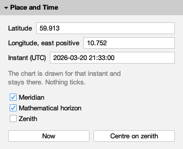
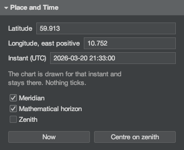
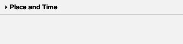
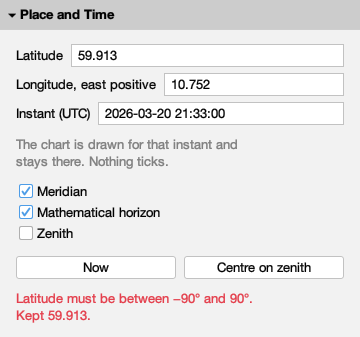
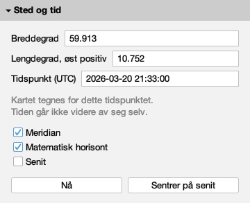
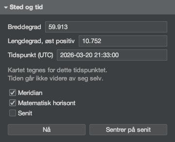
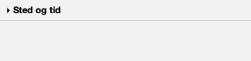
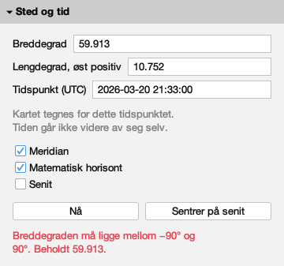

# Every word the companion says

Issue #434. Generated by
`juranometria.tool.CompanionSheetMain` from compiled
application classes and their classpath resources.

The production companion window, holding its one
production section - the same `PlaceAndTimePanel` the
Place and Time dialog holds - in a real window at the
size the companion's own policy states. Place and Time
is `PlaceAndTimeSheetMain`'s Oslo arrangement at its
frozen instant.

**Norsk bokmål — reviewed.** A person who reads the language has been through these surfaces and said these are the words an atlas should use. This is linguistic judgement, not corroboration against a source: unlike the constellation names next door, these are original translations written for this application and there is no citation to check them against. Recorded in `nb-NO.manifest`, and read from there rather than written here.

## English (`en`)

### open

| shown | hovered | spoken as | read out |
|---|---|---|---|
| Controls | — | Controls | Controls you can keep beside the chart while you read it |
| ▾ Place and Time | Show or hide this section | Place and Time, expanded | A hidden section keeps everything it is set to; whether it is hidden is remembered. |
| Latitude | — | Latitude | — |
| 59.913 | Degrees north of the equator, e.g. 59.913; south is negative, -90 to 90 | Latitude | Degrees north of the equator, negative south, -90 to 90 |
| Longitude, east positive | — | Longitude, east positive | — |
| 10.752 | Degrees east of Greenwich, e.g. 10.752; west is negative | Longitude, east positive | Degrees east of Greenwich; west is negative |
| Instant (UTC) | — | Instant (UTC) | — |
| 2026-03-20 21:33:00 | The moment the lines are drawn for, as 2026-03-20 21:33:00 | Instant (UTC) | The instant used to draw the reference lines. Time does not advance until you change it. |
| The chart is drawn for that instant and stays there. Nothing ticks. | — | The chart is drawn for that instant and stays there. Nothing ticks. | — |
| Meridian | Draw the great circle through both celestial poles and your zenith (⌘K then R) | Show Meridian | Draws the line that runs from due north, through the point overhead, to due south. It lasts as long as this session. |
| Mathematical horizon | Draw where the sky meets a perfectly flat, transparent Earth (⌘K then H) | Show Mathematical horizon | Draws the circle where the sky would meet a flat and transparent Earth; your own horizon has hills and air in it. It lasts as long as this session. |
| Zenith | Mark the point overhead | Show Zenith | Marks the point directly above you. It is drawn with the observer's lines and has no shortcut of its own. |
| Now | Reads the clock once and freezes the chart at that instant | Now | Freezes the reference lines at the present moment. The clock is read once; nothing moves afterwards. |
| Centre on zenith | Move the chart to the point overhead | Centre on zenith | Moves the page to the point directly above you. This is the only control in this window that moves the chart. |

### dark

| shown | hovered | spoken as | read out |
|---|---|---|---|
| Controls | — | Controls | Controls you can keep beside the chart while you read it |
| ▾ Place and Time | Show or hide this section | Place and Time, expanded | A hidden section keeps everything it is set to; whether it is hidden is remembered. |
| Latitude | — | Latitude | — |
| 59.913 | Degrees north of the equator, e.g. 59.913; south is negative, -90 to 90 | Latitude | Degrees north of the equator, negative south, -90 to 90 |
| Longitude, east positive | — | Longitude, east positive | — |
| 10.752 | Degrees east of Greenwich, e.g. 10.752; west is negative | Longitude, east positive | Degrees east of Greenwich; west is negative |
| Instant (UTC) | — | Instant (UTC) | — |
| 2026-03-20 21:33:00 | The moment the lines are drawn for, as 2026-03-20 21:33:00 | Instant (UTC) | The instant used to draw the reference lines. Time does not advance until you change it. |
| The chart is drawn for that instant and stays there. Nothing ticks. | — | The chart is drawn for that instant and stays there. Nothing ticks. | — |
| Meridian | Draw the great circle through both celestial poles and your zenith (⌘K then R) | Show Meridian | Draws the line that runs from due north, through the point overhead, to due south. It lasts as long as this session. |
| Mathematical horizon | Draw where the sky meets a perfectly flat, transparent Earth (⌘K then H) | Show Mathematical horizon | Draws the circle where the sky would meet a flat and transparent Earth; your own horizon has hills and air in it. It lasts as long as this session. |
| Zenith | Mark the point overhead | Show Zenith | Marks the point directly above you. It is drawn with the observer's lines and has no shortcut of its own. |
| Now | Reads the clock once and freezes the chart at that instant | Now | Freezes the reference lines at the present moment. The clock is read once; nothing moves afterwards. |
| Centre on zenith | Move the chart to the point overhead | Centre on zenith | Moves the page to the point directly above you. This is the only control in this window that moves the chart. |

### collapsed

| shown | hovered | spoken as | read out |
|---|---|---|---|
| Controls | — | Controls | Controls you can keep beside the chart while you read it |
| ▸ Place and Time | Show or hide this section | Place and Time, collapsed | A hidden section keeps everything it is set to; whether it is hidden is remembered. |

### refused

| shown | hovered | spoken as | read out |
|---|---|---|---|
| Controls | — | Controls | Controls you can keep beside the chart while you read it |
| ▾ Place and Time | Show or hide this section | Place and Time, expanded | A hidden section keeps everything it is set to; whether it is hidden is remembered. |
| Latitude | — | Latitude | — |
| 59.913 | Degrees north of the equator, e.g. 59.913; south is negative, -90 to 90 | Latitude | Latitude must be between −90° and 90°. Kept 59.913. |
| Longitude, east positive | — | Longitude, east positive | — |
| 10.752 | Degrees east of Greenwich, e.g. 10.752; west is negative | Longitude, east positive | Degrees east of Greenwich; west is negative |
| Instant (UTC) | — | Instant (UTC) | — |
| 2026-03-20 21:33:00 | The moment the lines are drawn for, as 2026-03-20 21:33:00 | Instant (UTC) | The instant used to draw the reference lines. Time does not advance until you change it. |
| The chart is drawn for that instant and stays there. Nothing ticks. | — | The chart is drawn for that instant and stays there. Nothing ticks. | — |
| Meridian | Draw the great circle through both celestial poles and your zenith (⌘K then R) | Show Meridian | Draws the line that runs from due north, through the point overhead, to due south. It lasts as long as this session. |
| Mathematical horizon | Draw where the sky meets a perfectly flat, transparent Earth (⌘K then H) | Show Mathematical horizon | Draws the circle where the sky would meet a flat and transparent Earth; your own horizon has hills and air in it. It lasts as long as this session. |
| Zenith | Mark the point overhead | Show Zenith | Marks the point directly above you. It is drawn with the observer's lines and has no shortcut of its own. |
| Now | Reads the clock once and freezes the chart at that instant | Now | Freezes the reference lines at the present moment. The clock is read once; nothing moves afterwards. |
| Centre on zenith | Move the chart to the point overhead | Centre on zenith | Moves the page to the point directly above you. This is the only control in this window that moves the chart. |
| Latitude must be between −90° and 90°. Kept 59.913. | — | Latitude must be between −90° and 90°. Kept 59.913. | — |

## Norsk bokmål (`nb-NO`)

### open

| shown | hovered | spoken as | read out |
|---|---|---|---|
| Kontroller | — | Kontroller | Kontroller du kan ha ved siden av kartet mens du leser det |
| ▾ Sted og tid | Vis eller skjul denne delen | Sted og tid, utvidet | En skjult del beholder alt den er satt til, og det huskes om den er skjult. |
| Breddegrad | — | Breddegrad | — |
| 59.913 | Grader nord for ekvator, f.eks. 59.913; sørlige breddegrader er negative, -90 til 90 | Breddegrad | Grader nord for ekvator; sørlige breddegrader er negative, -90 til 90 |
| Lengdegrad, øst positiv | — | Lengdegrad, øst positiv | — |
| 10.752 | Grader øst for Greenwich, f.eks. 10.752; vestlige lengdegrader er negative | Lengdegrad, øst positiv | Grader øst for Greenwich; vestlige lengdegrader er negative |
| Tidspunkt (UTC) | — | Tidspunkt (UTC) | — |
| 2026-03-20 21:33:00 | Tidspunktet linjene tegnes for, som 2026-03-20 21:33:00 | Tidspunkt (UTC) | Tidspunktet som brukes til å tegne referanselinjene. Tiden går ikke videre før du endrer tidspunktet. |
| Kartet tegnes for dette tidspunktet. Tiden går ikke videre av seg selv. | — | Kartet tegnes for dette tidspunktet. Tiden går ikke videre av seg selv. | — |
| Meridian | Tegn storsirkelen gjennom begge himmelpolene og senit (⌘K deretter R) | Vis meridianen | Tegner linjen som går fra rett nord, gjennom punktet rett over deg, til rett sør. Valget gjelder ut denne økten. |
| Matematisk horisont | Tegn der himmelen møter en helt flat og gjennomsiktig jord (⌘K deretter H) | Vis matematisk horisont | Tegner sirkelen der himmelen ville ha møtt en flat og gjennomsiktig jord; din egen horisont har åser og luft i seg. Valget gjelder ut denne økten. |
| Senit | Marker punktet rett over deg | Vis senit | Markerer punktet rett over deg. Det tegnes sammen med observatørens linjer og har ingen egen hurtigtast. |
| Nå | Les klokken én gang og sett kartets tidspunkt til nå | Nå | Tegner referanselinjene for tidspunktet nå. Klokken leses én gang; tiden går ikke videre etterpå. |
| Sentrer på senit | Flytt kartet til punktet rett over deg | Sentrer på senit | Flytter siden til punktet rett over deg. Dette er den eneste knappen i dette vinduet som flytter kartet. |

### dark

| shown | hovered | spoken as | read out |
|---|---|---|---|
| Kontroller | — | Kontroller | Kontroller du kan ha ved siden av kartet mens du leser det |
| ▾ Sted og tid | Vis eller skjul denne delen | Sted og tid, utvidet | En skjult del beholder alt den er satt til, og det huskes om den er skjult. |
| Breddegrad | — | Breddegrad | — |
| 59.913 | Grader nord for ekvator, f.eks. 59.913; sørlige breddegrader er negative, -90 til 90 | Breddegrad | Grader nord for ekvator; sørlige breddegrader er negative, -90 til 90 |
| Lengdegrad, øst positiv | — | Lengdegrad, øst positiv | — |
| 10.752 | Grader øst for Greenwich, f.eks. 10.752; vestlige lengdegrader er negative | Lengdegrad, øst positiv | Grader øst for Greenwich; vestlige lengdegrader er negative |
| Tidspunkt (UTC) | — | Tidspunkt (UTC) | — |
| 2026-03-20 21:33:00 | Tidspunktet linjene tegnes for, som 2026-03-20 21:33:00 | Tidspunkt (UTC) | Tidspunktet som brukes til å tegne referanselinjene. Tiden går ikke videre før du endrer tidspunktet. |
| Kartet tegnes for dette tidspunktet. Tiden går ikke videre av seg selv. | — | Kartet tegnes for dette tidspunktet. Tiden går ikke videre av seg selv. | — |
| Meridian | Tegn storsirkelen gjennom begge himmelpolene og senit (⌘K deretter R) | Vis meridianen | Tegner linjen som går fra rett nord, gjennom punktet rett over deg, til rett sør. Valget gjelder ut denne økten. |
| Matematisk horisont | Tegn der himmelen møter en helt flat og gjennomsiktig jord (⌘K deretter H) | Vis matematisk horisont | Tegner sirkelen der himmelen ville ha møtt en flat og gjennomsiktig jord; din egen horisont har åser og luft i seg. Valget gjelder ut denne økten. |
| Senit | Marker punktet rett over deg | Vis senit | Markerer punktet rett over deg. Det tegnes sammen med observatørens linjer og har ingen egen hurtigtast. |
| Nå | Les klokken én gang og sett kartets tidspunkt til nå | Nå | Tegner referanselinjene for tidspunktet nå. Klokken leses én gang; tiden går ikke videre etterpå. |
| Sentrer på senit | Flytt kartet til punktet rett over deg | Sentrer på senit | Flytter siden til punktet rett over deg. Dette er den eneste knappen i dette vinduet som flytter kartet. |

### collapsed

| shown | hovered | spoken as | read out |
|---|---|---|---|
| Kontroller | — | Kontroller | Kontroller du kan ha ved siden av kartet mens du leser det |
| ▸ Sted og tid | Vis eller skjul denne delen | Sted og tid, skjult | En skjult del beholder alt den er satt til, og det huskes om den er skjult. |

### refused

| shown | hovered | spoken as | read out |
|---|---|---|---|
| Kontroller | — | Kontroller | Kontroller du kan ha ved siden av kartet mens du leser det |
| ▾ Sted og tid | Vis eller skjul denne delen | Sted og tid, utvidet | En skjult del beholder alt den er satt til, og det huskes om den er skjult. |
| Breddegrad | — | Breddegrad | — |
| 59.913 | Grader nord for ekvator, f.eks. 59.913; sørlige breddegrader er negative, -90 til 90 | Breddegrad | Breddegraden må ligge mellom −90° og 90°. Beholdt 59.913. |
| Lengdegrad, øst positiv | — | Lengdegrad, øst positiv | — |
| 10.752 | Grader øst for Greenwich, f.eks. 10.752; vestlige lengdegrader er negative | Lengdegrad, øst positiv | Grader øst for Greenwich; vestlige lengdegrader er negative |
| Tidspunkt (UTC) | — | Tidspunkt (UTC) | — |
| 2026-03-20 21:33:00 | Tidspunktet linjene tegnes for, som 2026-03-20 21:33:00 | Tidspunkt (UTC) | Tidspunktet som brukes til å tegne referanselinjene. Tiden går ikke videre før du endrer tidspunktet. |
| Kartet tegnes for dette tidspunktet. Tiden går ikke videre av seg selv. | — | Kartet tegnes for dette tidspunktet. Tiden går ikke videre av seg selv. | — |
| Meridian | Tegn storsirkelen gjennom begge himmelpolene og senit (⌘K deretter R) | Vis meridianen | Tegner linjen som går fra rett nord, gjennom punktet rett over deg, til rett sør. Valget gjelder ut denne økten. |
| Matematisk horisont | Tegn der himmelen møter en helt flat og gjennomsiktig jord (⌘K deretter H) | Vis matematisk horisont | Tegner sirkelen der himmelen ville ha møtt en flat og gjennomsiktig jord; din egen horisont har åser og luft i seg. Valget gjelder ut denne økten. |
| Senit | Marker punktet rett over deg | Vis senit | Markerer punktet rett over deg. Det tegnes sammen med observatørens linjer og har ingen egen hurtigtast. |
| Nå | Les klokken én gang og sett kartets tidspunkt til nå | Nå | Tegner referanselinjene for tidspunktet nå. Klokken leses én gang; tiden går ikke videre etterpå. |
| Sentrer på senit | Flytt kartet til punktet rett over deg | Sentrer på senit | Flytter siden til punktet rett over deg. Dette er den eneste knappen i dette vinduet som flytter kartet. |
| Breddegraden må ligge mellom −90° og 90°. Beholdt 59.913. | — | Breddegraden må ligge mellom −90° og 90°. Beholdt 59.913. | — |

