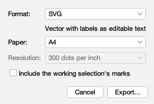
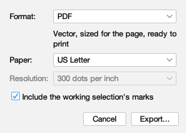
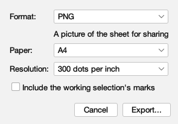
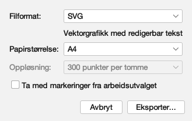
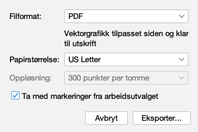
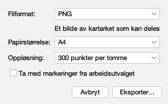

# Every word exporting a chart sheet says

Issue #350. Generated by
`juranometria.tool.ExportSheetDialogSheetMain` from
compiled application classes and their classpath
resources. Packaged acceptance separately verifies
that the interface language resources ship in the
application image.

**Norsk bokmål — reviewed.** A person who reads the language has been through these surfaces and said these are the words an atlas should use. This is linguistic judgement, not corroboration against a source: unlike the constellation names next door, these are original translations written for this application and there is no citation to check them against. Recorded in `nb-NO.manifest`, and read from there rather than written here.

**This is one machine's answer.** The packed pixel
sizes below are measured from real windows, and a
desktop with different font metrics packs them
differently; the exported byte counts are this
build's. The contract holds this to reproducing
*here*, never across two machines. Every WORD in it
is the atlas's own and is portable - that half is
held by `ExportLanguageTest`.

| the machine | |
|---|---|
| operating system | Mac OS X |
| architecture | aarch64 |
| Java | 21.0.11 |

Recorded on: `Mac OS X 26.5.2/aarch64/Homebrew 21.0.11`

The folder named in the replace question is
`~/Documents` - example reader data, chosen because it
is the same in every run. The writes this page
reports really happen, in a scratch directory that is
never named here.

## What is translated, and what is not

`SVG`, `PDF`, `PNG`, `A4` and `US Letter` are format
and paper identities: the same to every reader, handed
to sentences as arguments, and written into no
translated value. File names, folders and resolutions
are data. The byte count goes in as a NUMBER, so each
language groups it its own way.

## English (`en`)

### SVG on A4, marks off

Packed 304 × 206 px.

| shown, hovered or spoken |
|---|
| Format: |
| SVG |
| PDF |
| PNG |
| Choose SVG or PDF for a line drawing, or PNG for a picture |
| Format |
| Chooses the file the sheet is written as. SVG and PDF keep the drawing as lines; PNG is a picture at a chosen resolution. |
| Vector with labels as editable text |
| Paper: |
| A4 |
| US Letter |
| The size of the page the chart is laid out on |
| Paper |
| Chooses the paper the sheet is laid out for. The chart is fitted to it; the page you are looking at does not move. |
| Resolution: [unavailable] |
| 150 dots per inch [unavailable] |
| 300 dots per inch [unavailable] |
| 600 dots per inch [unavailable] |
| How finely a PNG is drawn; ignored by SVG and PDF [unavailable] |
| Resolution [unavailable] |
| Chooses how many dots per inch a PNG is drawn at. SVG and PDF keep the drawing as lines and ignore this. [unavailable] |
| Include the working selection's marks |
| Draw the rings and crosses on the objects you have marked |
| Include working selection marks |
| When on, the sheet carries the marks you made this session. Off by default, because a sheet outlives the session that made it. |
| Cancel |
| Closes this window without writing anything |
| Export... |
| Choose where to save the sheet |
| Export |
| Opens the file chooser and writes the sheet where you save it |

### PDF on US Letter, marks on

Packed 311 × 223 px.

| shown, hovered or spoken |
|---|
| Format: |
| SVG |
| PDF |
| PNG |
| Choose SVG or PDF for a line drawing, or PNG for a picture |
| Format |
| Chooses the file the sheet is written as. SVG and PDF keep the drawing as lines; PNG is a picture at a chosen resolution. |
| Vector, sized for the page, ready to print |
| Paper: |
| A4 |
| US Letter |
| The size of the page the chart is laid out on |
| Paper |
| Chooses the paper the sheet is laid out for. The chart is fitted to it; the page you are looking at does not move. |
| Resolution: [unavailable] |
| 150 dots per inch [unavailable] |
| 300 dots per inch [unavailable] |
| 600 dots per inch [unavailable] |
| How finely a PNG is drawn; ignored by SVG and PDF [unavailable] |
| Resolution [unavailable] |
| Chooses how many dots per inch a PNG is drawn at. SVG and PDF keep the drawing as lines and ignore this. [unavailable] |
| Include the working selection's marks |
| Draw the rings and crosses on the objects you have marked |
| Include working selection marks |
| When on, the sheet carries the marks you made this session. Off by default, because a sheet outlives the session that made it. |
| Cancel |
| Closes this window without writing anything |
| Export... |
| Choose where to save the sheet |
| Export |
| Opens the file chooser and writes the sheet where you save it |

### PNG on A4, resolution in use

Packed 295 × 206 px.

| shown, hovered or spoken |
|---|
| Format: |
| SVG |
| PDF |
| PNG |
| Choose SVG or PDF for a line drawing, or PNG for a picture |
| Format |
| Chooses the file the sheet is written as. SVG and PDF keep the drawing as lines; PNG is a picture at a chosen resolution. |
| A picture of the sheet for sharing |
| Paper: |
| A4 |
| US Letter |
| The size of the page the chart is laid out on |
| Paper |
| Chooses the paper the sheet is laid out for. The chart is fitted to it; the page you are looking at does not move. |
| Resolution: |
| 150 dots per inch |
| 300 dots per inch |
| 600 dots per inch |
| How finely a PNG is drawn; ignored by SVG and PDF |
| Resolution |
| Chooses how many dots per inch a PNG is drawn at. SVG and PDF keep the drawing as lines and ignore this. |
| Include the working selection's marks |
| Draw the rings and crosses on the objects you have marked |
| Include working selection marks |
| When on, the sheet carries the marks you made this session. Off by default, because a sheet outlives the session that made it. |
| Cancel |
| Closes this window without writing anything |
| Export... |
| Choose where to save the sheet |
| Export |
| Opens the file chooser and writes the sheet where you save it |

#### After Export is pressed

| what | words |
|---|---|
| chooser title | Export chart sheet |
| replace title | Replace the existing file? |
| replace question | orion.svg already exists in ~/Documents. / Replace it? |
| written title | Chart sheet exported |
| written message | SVG written to orion.svg (194,460 bytes) |
| refused title | The chart sheet was not written |
| refusal: no file | No file was chosen. |
| refusal: a folder | a.svg is a folder, not a file. |
| refusal: kept | orion.svg was left unchanged. |
| refusal: write failed, new file (reached in test) | fresh.svg could not be written. |
| refusal: write failed, existing file (reached in test) | orion.svg could not be written. What was already there is unchanged. |

## Norsk bokmål (`nb-NO`)

### SVG on A4, marks off

Packed 326 × 206 px.

| shown, hovered or spoken |
|---|
| Filformat: |
| SVG |
| PDF |
| PNG |
| Velg SVG eller PDF for en strektegning, eller PNG for et bilde |
| Filformat |
| Velger filformat for kartarket. SVG og PDF beholder tegningen som linjer, mens PNG lager et bilde med valgt oppløsning. |
| Vektorgrafikk med redigerbar tekst |
| Papirstørrelse: |
| A4 |
| US Letter |
| Papirstørrelsen kartarket skal tilpasses |
| Papirstørrelse |
| Velger papirstørrelsen kartarket skal tilpasses. Siden du ser på, flyttes ikke. |
| Oppløsning: [unavailable] |
| 150 punkter per tomme [unavailable] |
| 300 punkter per tomme [unavailable] |
| 600 punkter per tomme [unavailable] |
| Hvor detaljert PNG-bildet tegnes; brukes ikke for SVG og PDF [unavailable] |
| Oppløsning [unavailable] |
| Velger hvor mange punkter per tomme PNG-bildet tegnes med. SVG og PDF beholder tegningen som linjer og bruker ikke denne innstillingen. [unavailable] |
| Ta med markeringer fra arbeidsutvalget |
| Tegner ringer og kors rundt objektene du har markert |
| Når dette er slått på, tar kartarket med markeringene du gjorde i denne økten. Det er slått av som standard fordi kartarket kan vare lenger enn økten det ble laget i. |
| Avbryt |
| Lukker vinduet uten å lagre noe |
| Eksporter... |
| Velg hvor kartarket skal lagres |
| Eksporter |
| Åpner filvelgeren og lagrer kartarket der du velger |

### PDF on US Letter, marks on

Packed 333 × 223 px.

| shown, hovered or spoken |
|---|
| Filformat: |
| SVG |
| PDF |
| PNG |
| Velg SVG eller PDF for en strektegning, eller PNG for et bilde |
| Filformat |
| Velger filformat for kartarket. SVG og PDF beholder tegningen som linjer, mens PNG lager et bilde med valgt oppløsning. |
| Vektorgrafikk tilpasset siden og klar til utskrift |
| Papirstørrelse: |
| A4 |
| US Letter |
| Papirstørrelsen kartarket skal tilpasses |
| Papirstørrelse |
| Velger papirstørrelsen kartarket skal tilpasses. Siden du ser på, flyttes ikke. |
| Oppløsning: [unavailable] |
| 150 punkter per tomme [unavailable] |
| 300 punkter per tomme [unavailable] |
| 600 punkter per tomme [unavailable] |
| Hvor detaljert PNG-bildet tegnes; brukes ikke for SVG og PDF [unavailable] |
| Oppløsning [unavailable] |
| Velger hvor mange punkter per tomme PNG-bildet tegnes med. SVG og PDF beholder tegningen som linjer og bruker ikke denne innstillingen. [unavailable] |
| Ta med markeringer fra arbeidsutvalget |
| Tegner ringer og kors rundt objektene du har markert |
| Når dette er slått på, tar kartarket med markeringene du gjorde i denne økten. Det er slått av som standard fordi kartarket kan vare lenger enn økten det ble laget i. |
| Avbryt |
| Lukker vinduet uten å lagre noe |
| Eksporter... |
| Velg hvor kartarket skal lagres |
| Eksporter |
| Åpner filvelgeren og lagrer kartarket der du velger |

### PNG on A4, resolution in use

Packed 332 × 206 px.

| shown, hovered or spoken |
|---|
| Filformat: |
| SVG |
| PDF |
| PNG |
| Velg SVG eller PDF for en strektegning, eller PNG for et bilde |
| Filformat |
| Velger filformat for kartarket. SVG og PDF beholder tegningen som linjer, mens PNG lager et bilde med valgt oppløsning. |
| Et bilde av kartarket som kan deles |
| Papirstørrelse: |
| A4 |
| US Letter |
| Papirstørrelsen kartarket skal tilpasses |
| Papirstørrelse |
| Velger papirstørrelsen kartarket skal tilpasses. Siden du ser på, flyttes ikke. |
| Oppløsning: |
| 150 punkter per tomme |
| 300 punkter per tomme |
| 600 punkter per tomme |
| Hvor detaljert PNG-bildet tegnes; brukes ikke for SVG og PDF |
| Oppløsning |
| Velger hvor mange punkter per tomme PNG-bildet tegnes med. SVG og PDF beholder tegningen som linjer og bruker ikke denne innstillingen. |
| Ta med markeringer fra arbeidsutvalget |
| Tegner ringer og kors rundt objektene du har markert |
| Når dette er slått på, tar kartarket med markeringene du gjorde i denne økten. Det er slått av som standard fordi kartarket kan vare lenger enn økten det ble laget i. |
| Avbryt |
| Lukker vinduet uten å lagre noe |
| Eksporter... |
| Velg hvor kartarket skal lagres |
| Eksporter |
| Åpner filvelgeren og lagrer kartarket der du velger |

#### After Export is pressed

| what | words |
|---|---|
| chooser title | Eksporter kartark |
| replace title | Erstatte eksisterende fil? |
| replace question | orion.svg finnes allerede i ~/Documents. / Vil du erstatte den? |
| written title | Kartarket er eksportert |
| written message | SVG lagret som orion.svg (194 484 byte) |
| refused title | Kartarket ble ikke lagret |
| refusal: no file | Ingen fil ble valgt. |
| refusal: a folder | a.svg er en mappe, ikke en fil. |
| refusal: kept | orion.svg ble ikke endret. |
| refusal: write failed, new file (reached in test) | fresh.svg kunne ikke lagres. |
| refusal: write failed, existing file (reached in test) | orion.svg kunne ikke lagres. Filen som allerede lå der, er uendret. |

## Supported, but not observed here

These are whole patterns held by `ExportLanguageTest` and by a source contract. They are **not** pictures of states anyone has seen: reaching them would need architecture added solely to make the application fail on command, or filesystem permissions that are not portable.

| form | English | Norsk bokmål | why unobserved |
|---|---|---|---|
| `export.refused.notmade` | The sheet could not be made. | Kartarket kunne ikke opprettes. | the recorder and writers offer no deterministic failure input |
| `export.refused.unwritable` | orion.svg cannot be replaced because it is not writable. | orion.svg kan ikke erstattes fordi filen ikke er skrivbar. | needs a non-portable permission change |
| `export.refused.foldernotwritable` | orion.svg is not writable, so the sheet cannot be written there safely. Choose another folder, or make that one writable. | Det kan ikke skrives til orion.svg, så kartarket kan ikke lagres trygt der. Velg en annen mappe, eller gjør mappen skrivbar. | needs a non-portable permission change |
