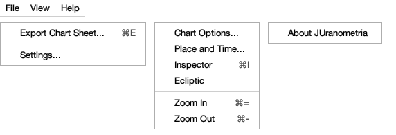
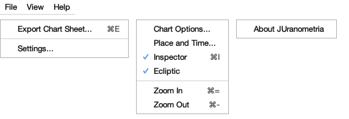
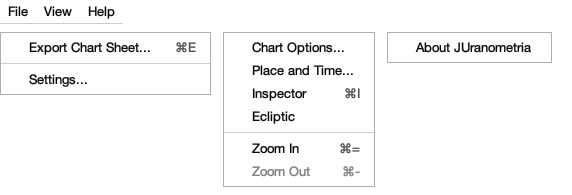
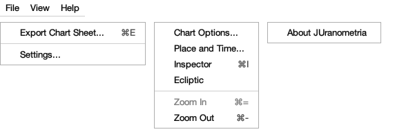
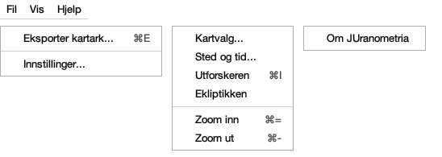
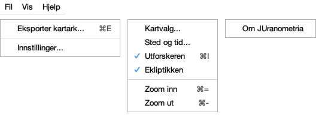
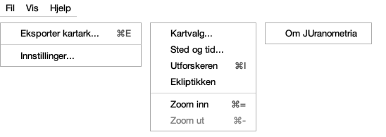
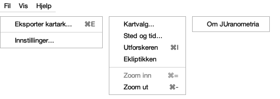

# Every word the menu bar says

Issue #350. Generated by
`juranometria.tool.MenuSheetMain` from compiled
application classes and their classpath resources,
composed through `AtlasChrome` from a stored language
choice. Packaged acceptance separately verifies that
the interface language resources ship in the
application image.

**Norsk bokmål — reviewed.** A person who reads the language has been through these surfaces and said these are the words an atlas should use. This is linguistic judgement, not corroboration against a source: unlike the constellation names next door, these are original translations written for this application and there is no citation to check them against. Recorded in `nb-NO.manifest`, and read from there rather than written here.

## Four channels, not three

Labels, accessible names and accessible descriptions
are interface language. **Accelerators** are platform
notation, spelled by the desktop, and appear in no
translated value. **Mnemonics** are language data: a
mnemonic marks a letter inside the item's own
displayed word, so `C` belongs to *Chart Options* and
`K` to *Kartvalg*. They are listed separately below
because an inventory that read only the first three
missed all five of them.

The access letters below are read from each live
menu item and validated against the label it actually
displays. They are **listed rather than underlined**
in these macOS captures, because this look and feel
does not paint mnemonic underlines: the live component
value is the evidence, and an underline drawn into the
image would be a marking the platform never shows.

There are **no tooltips** anywhere on this surface, in
either language. That is deliberate: a tooltip over an
open menu would cover the thing it explains.

## English (`en`)

### All three menus, nothing checked

Bar packed 572 × 195 px; widest popup 211 px.

| channel | words |
|---|---|
| menu label \| File |
| menu spoken name \| File menu |
| menu spoken description \| Exporting the chart and changing application settings |
| item label \| Export Chart Sheet... |
| item spoken name \| Export Chart Sheet |
| item spoken description \| Exports this chart as an SVG, PDF or PNG sheet |
| item accelerator (platform notation) \| ⌘E |
| item access letter (language) \| E |
| item label \| Settings... |
| item spoken name \| Settings |
| item spoken description \| Opens the window for appearance and for the languages used by the application and chart |
| menu label \| View |
| menu spoken name \| View menu |
| menu spoken description \| What the chart draws, where you are looking from, and how far out |
| item label \| Chart Options... |
| item spoken name \| Chart Options |
| item spoken description \| Opens the window that chooses what the chart draws and labels. Chart shortcuts begin with ⌘K. |
| item access letter (language) \| C |
| item label \| Place and Time... |
| item spoken name \| Place and Time |
| item spoken description \| Opens the window that sets your location and the instant used to draw the meridian, horizon and zenith |
| item access letter (language) \| P |
| item label \| Inspector |
| item spoken name \| Inspector |
| item spoken description \| Shows or hides the panel that describes the selected mark and what is on this page |
| item accelerator (platform notation) \| ⌘I |
| item access letter (language) \| I |
| item label \| Ecliptic |
| item spoken name \| Ecliptic |
| item spoken description \| Shows or hides the ecliptic and its equinox and solstice marks. The chart shortcut is ⌘K then I. |
| item label \| Zoom In |
| item spoken name \| Zoom In |
| item spoken description \| Shows a narrower field, with fainter stars on it |
| item accelerator (platform notation) \| ⌘= |
| item label \| Zoom Out |
| item spoken name \| Zoom Out |
| item spoken description \| Shows a wider field, with fewer stars on it |
| item accelerator (platform notation) \| ⌘- |
| menu label \| Help |
| menu spoken name \| Help menu |
| menu spoken description \| Information about this application and what it is built on |
| item label \| About JUranometria |
| item spoken name \| About JUranometria |
| item spoken description \| Opens the window with the application's name, version and the software and data it is built on |

### View with Inspector and Ecliptic on

Bar packed 572 × 195 px; widest popup 211 px.

| channel | words |
|---|---|
| menu label \| File |
| menu spoken name \| File menu |
| menu spoken description \| Exporting the chart and changing application settings |
| item label \| Export Chart Sheet... |
| item spoken name \| Export Chart Sheet |
| item spoken description \| Exports this chart as an SVG, PDF or PNG sheet |
| item accelerator (platform notation) \| ⌘E |
| item access letter (language) \| E |
| item label \| Settings... |
| item spoken name \| Settings |
| item spoken description \| Opens the window for appearance and for the languages used by the application and chart |
| menu label \| View |
| menu spoken name \| View menu |
| menu spoken description \| What the chart draws, where you are looking from, and how far out |
| item label \| Chart Options... |
| item spoken name \| Chart Options |
| item spoken description \| Opens the window that chooses what the chart draws and labels. Chart shortcuts begin with ⌘K. |
| item access letter (language) \| C |
| item label \| Place and Time... |
| item spoken name \| Place and Time |
| item spoken description \| Opens the window that sets your location and the instant used to draw the meridian, horizon and zenith |
| item access letter (language) \| P |
| item label [checked] \| Inspector |
| item spoken name \| Inspector |
| item spoken description \| Shows or hides the panel that describes the selected mark and what is on this page |
| item accelerator (platform notation) \| ⌘I |
| item access letter (language) \| I |
| item label [checked] \| Ecliptic |
| item spoken name \| Ecliptic |
| item spoken description \| Shows or hides the ecliptic and its equinox and solstice marks. The chart shortcut is ⌘K then I. |
| item label \| Zoom In |
| item spoken name \| Zoom In |
| item spoken description \| Shows a narrower field, with fainter stars on it |
| item accelerator (platform notation) \| ⌘= |
| item label \| Zoom Out |
| item spoken name \| Zoom Out |
| item spoken description \| Shows a wider field, with fewer stars on it |
| item accelerator (platform notation) \| ⌘- |
| menu label \| Help |
| menu spoken name \| Help menu |
| menu spoken description \| Information about this application and what it is built on |
| item label \| About JUranometria |
| item spoken name \| About JUranometria |
| item spoken description \| Opens the window with the application's name, version and the software and data it is built on |

### View at the widest field

Bar packed 572 × 195 px; widest popup 211 px.

| channel | words |
|---|---|
| menu label \| File |
| menu spoken name \| File menu |
| menu spoken description \| Exporting the chart and changing application settings |
| item label \| Export Chart Sheet... |
| item spoken name \| Export Chart Sheet |
| item spoken description \| Exports this chart as an SVG, PDF or PNG sheet |
| item accelerator (platform notation) \| ⌘E |
| item access letter (language) \| E |
| item label \| Settings... |
| item spoken name \| Settings |
| item spoken description \| Opens the window for appearance and for the languages used by the application and chart |
| menu label \| View |
| menu spoken name \| View menu |
| menu spoken description \| What the chart draws, where you are looking from, and how far out |
| item label \| Chart Options... |
| item spoken name \| Chart Options |
| item spoken description \| Opens the window that chooses what the chart draws and labels. Chart shortcuts begin with ⌘K. |
| item access letter (language) \| C |
| item label \| Place and Time... |
| item spoken name \| Place and Time |
| item spoken description \| Opens the window that sets your location and the instant used to draw the meridian, horizon and zenith |
| item access letter (language) \| P |
| item label \| Inspector |
| item spoken name \| Inspector |
| item spoken description \| Shows or hides the panel that describes the selected mark and what is on this page |
| item accelerator (platform notation) \| ⌘I |
| item access letter (language) \| I |
| item label \| Ecliptic |
| item spoken name \| Ecliptic |
| item spoken description \| Shows or hides the ecliptic and its equinox and solstice marks. The chart shortcut is ⌘K then I. |
| item label \| Zoom In |
| item spoken name \| Zoom In |
| item spoken description \| Shows a narrower field, with fainter stars on it |
| item accelerator (platform notation) \| ⌘= |
| item label [unavailable] \| Zoom Out |
| item spoken name [unavailable] \| Zoom Out |
| item spoken description [unavailable] \| Unavailable: this is the widest field the atlas draws |
| item accelerator (platform notation) \| ⌘- |
| menu label \| Help |
| menu spoken name \| Help menu |
| menu spoken description \| Information about this application and what it is built on |
| item label \| About JUranometria |
| item spoken name \| About JUranometria |
| item spoken description \| Opens the window with the application's name, version and the software and data it is built on |

### View at the narrowest field

Bar packed 572 × 195 px; widest popup 211 px.

| channel | words |
|---|---|
| menu label \| File |
| menu spoken name \| File menu |
| menu spoken description \| Exporting the chart and changing application settings |
| item label \| Export Chart Sheet... |
| item spoken name \| Export Chart Sheet |
| item spoken description \| Exports this chart as an SVG, PDF or PNG sheet |
| item accelerator (platform notation) \| ⌘E |
| item access letter (language) \| E |
| item label \| Settings... |
| item spoken name \| Settings |
| item spoken description \| Opens the window for appearance and for the languages used by the application and chart |
| menu label \| View |
| menu spoken name \| View menu |
| menu spoken description \| What the chart draws, where you are looking from, and how far out |
| item label \| Chart Options... |
| item spoken name \| Chart Options |
| item spoken description \| Opens the window that chooses what the chart draws and labels. Chart shortcuts begin with ⌘K. |
| item access letter (language) \| C |
| item label \| Place and Time... |
| item spoken name \| Place and Time |
| item spoken description \| Opens the window that sets your location and the instant used to draw the meridian, horizon and zenith |
| item access letter (language) \| P |
| item label \| Inspector |
| item spoken name \| Inspector |
| item spoken description \| Shows or hides the panel that describes the selected mark and what is on this page |
| item accelerator (platform notation) \| ⌘I |
| item access letter (language) \| I |
| item label \| Ecliptic |
| item spoken name \| Ecliptic |
| item spoken description \| Shows or hides the ecliptic and its equinox and solstice marks. The chart shortcut is ⌘K then I. |
| item label [unavailable] \| Zoom In |
| item spoken name [unavailable] \| Zoom In |
| item spoken description [unavailable] \| Unavailable: this is the narrowest field the atlas draws |
| item accelerator (platform notation) \| ⌘= |
| item label \| Zoom Out |
| item spoken name \| Zoom Out |
| item spoken description \| Shows a wider field, with fewer stars on it |
| item accelerator (platform notation) \| ⌘- |
| menu label \| Help |
| menu spoken name \| Help menu |
| menu spoken description \| Information about this application and what it is built on |
| item label \| About JUranometria |
| item spoken name \| About JUranometria |
| item spoken description \| Opens the window with the application's name, version and the software and data it is built on |

## Norsk bokmål (`nb-NO`)

### All three menus, nothing checked

Bar packed 548 × 195 px; widest popup 201 px.

| channel | words |
|---|---|
| menu label \| Fil |
| menu spoken name \| Fil-menyen |
| menu spoken description \| Eksport av kartet og endring av innstillinger for programmet |
| item label \| Eksporter kartark... |
| item spoken name \| Eksporter kartark |
| item spoken description \| Eksporterer dette kartet som et kartark i SVG-, PDF- eller PNG-format |
| item accelerator (platform notation) \| ⌘E |
| item access letter (language) \| E |
| item label \| Innstillinger... |
| item spoken name \| Innstillinger |
| item spoken description \| Åpner vinduet for utseende og for språkene programmet og kartet bruker |
| menu label \| Vis |
| menu spoken name \| Vis-menyen |
| menu spoken description \| Hva kartet tegner, hvor du ser fra, og hvor langt ut |
| item label \| Kartvalg... |
| item spoken name \| Kartvalg |
| item spoken description \| Åpner vinduet som velger hva kartet tegner og merker. Hurtigtaster for kartet begynner med ⌘K. |
| item access letter (language) \| K |
| item label \| Sted og tid... |
| item spoken name \| Sted og tid |
| item spoken description \| Åpner vinduet der du velger stedet og tidspunktet som brukes når meridianen, horisonten og senit tegnes |
| item access letter (language) \| S |
| item label \| Utforskeren |
| item spoken name \| Utforskeren |
| item spoken description \| Viser eller skjuler panelet som beskriver det valgte merket og hva som finnes på denne siden |
| item accelerator (platform notation) \| ⌘I |
| item access letter (language) \| U |
| item label \| Ekliptikken |
| item spoken name \| Ekliptikken |
| item spoken description \| Viser eller skjuler ekliptikken og merkene for jevndøgn og solverv. Hurtigtasten for kartet er ⌘K deretter I. |
| item label \| Zoom inn |
| item spoken name \| Zoom inn |
| item spoken description \| Viser et smalere synsfelt med svakere stjerner |
| item accelerator (platform notation) \| ⌘= |
| item label \| Zoom ut |
| item spoken name \| Zoom ut |
| item spoken description \| Viser et større synsfelt med færre stjerner |
| item accelerator (platform notation) \| ⌘- |
| menu label \| Hjelp |
| menu spoken name \| Hjelp-menyen |
| menu spoken description \| Informasjon om dette programmet og hva det er bygd på |
| item label \| Om JUranometria |
| item spoken name \| Om JUranometria |
| item spoken description \| Åpner vinduet med programmets navn, versjon og programvaren og dataene det er bygd på |

### View with Inspector and Ecliptic on

Bar packed 548 × 195 px; widest popup 201 px.

| channel | words |
|---|---|
| menu label \| Fil |
| menu spoken name \| Fil-menyen |
| menu spoken description \| Eksport av kartet og endring av innstillinger for programmet |
| item label \| Eksporter kartark... |
| item spoken name \| Eksporter kartark |
| item spoken description \| Eksporterer dette kartet som et kartark i SVG-, PDF- eller PNG-format |
| item accelerator (platform notation) \| ⌘E |
| item access letter (language) \| E |
| item label \| Innstillinger... |
| item spoken name \| Innstillinger |
| item spoken description \| Åpner vinduet for utseende og for språkene programmet og kartet bruker |
| menu label \| Vis |
| menu spoken name \| Vis-menyen |
| menu spoken description \| Hva kartet tegner, hvor du ser fra, og hvor langt ut |
| item label \| Kartvalg... |
| item spoken name \| Kartvalg |
| item spoken description \| Åpner vinduet som velger hva kartet tegner og merker. Hurtigtaster for kartet begynner med ⌘K. |
| item access letter (language) \| K |
| item label \| Sted og tid... |
| item spoken name \| Sted og tid |
| item spoken description \| Åpner vinduet der du velger stedet og tidspunktet som brukes når meridianen, horisonten og senit tegnes |
| item access letter (language) \| S |
| item label [checked] \| Utforskeren |
| item spoken name \| Utforskeren |
| item spoken description \| Viser eller skjuler panelet som beskriver det valgte merket og hva som finnes på denne siden |
| item accelerator (platform notation) \| ⌘I |
| item access letter (language) \| U |
| item label [checked] \| Ekliptikken |
| item spoken name \| Ekliptikken |
| item spoken description \| Viser eller skjuler ekliptikken og merkene for jevndøgn og solverv. Hurtigtasten for kartet er ⌘K deretter I. |
| item label \| Zoom inn |
| item spoken name \| Zoom inn |
| item spoken description \| Viser et smalere synsfelt med svakere stjerner |
| item accelerator (platform notation) \| ⌘= |
| item label \| Zoom ut |
| item spoken name \| Zoom ut |
| item spoken description \| Viser et større synsfelt med færre stjerner |
| item accelerator (platform notation) \| ⌘- |
| menu label \| Hjelp |
| menu spoken name \| Hjelp-menyen |
| menu spoken description \| Informasjon om dette programmet og hva det er bygd på |
| item label \| Om JUranometria |
| item spoken name \| Om JUranometria |
| item spoken description \| Åpner vinduet med programmets navn, versjon og programvaren og dataene det er bygd på |

### View at the widest field

Bar packed 548 × 195 px; widest popup 201 px.

| channel | words |
|---|---|
| menu label \| Fil |
| menu spoken name \| Fil-menyen |
| menu spoken description \| Eksport av kartet og endring av innstillinger for programmet |
| item label \| Eksporter kartark... |
| item spoken name \| Eksporter kartark |
| item spoken description \| Eksporterer dette kartet som et kartark i SVG-, PDF- eller PNG-format |
| item accelerator (platform notation) \| ⌘E |
| item access letter (language) \| E |
| item label \| Innstillinger... |
| item spoken name \| Innstillinger |
| item spoken description \| Åpner vinduet for utseende og for språkene programmet og kartet bruker |
| menu label \| Vis |
| menu spoken name \| Vis-menyen |
| menu spoken description \| Hva kartet tegner, hvor du ser fra, og hvor langt ut |
| item label \| Kartvalg... |
| item spoken name \| Kartvalg |
| item spoken description \| Åpner vinduet som velger hva kartet tegner og merker. Hurtigtaster for kartet begynner med ⌘K. |
| item access letter (language) \| K |
| item label \| Sted og tid... |
| item spoken name \| Sted og tid |
| item spoken description \| Åpner vinduet der du velger stedet og tidspunktet som brukes når meridianen, horisonten og senit tegnes |
| item access letter (language) \| S |
| item label \| Utforskeren |
| item spoken name \| Utforskeren |
| item spoken description \| Viser eller skjuler panelet som beskriver det valgte merket og hva som finnes på denne siden |
| item accelerator (platform notation) \| ⌘I |
| item access letter (language) \| U |
| item label \| Ekliptikken |
| item spoken name \| Ekliptikken |
| item spoken description \| Viser eller skjuler ekliptikken og merkene for jevndøgn og solverv. Hurtigtasten for kartet er ⌘K deretter I. |
| item label \| Zoom inn |
| item spoken name \| Zoom inn |
| item spoken description \| Viser et smalere synsfelt med svakere stjerner |
| item accelerator (platform notation) \| ⌘= |
| item label [unavailable] \| Zoom ut |
| item spoken name [unavailable] \| Zoom ut |
| item spoken description [unavailable] \| Utilgjengelig: dette er atlasets største synsfelt |
| item accelerator (platform notation) \| ⌘- |
| menu label \| Hjelp |
| menu spoken name \| Hjelp-menyen |
| menu spoken description \| Informasjon om dette programmet og hva det er bygd på |
| item label \| Om JUranometria |
| item spoken name \| Om JUranometria |
| item spoken description \| Åpner vinduet med programmets navn, versjon og programvaren og dataene det er bygd på |

### View at the narrowest field

Bar packed 548 × 195 px; widest popup 201 px.

| channel | words |
|---|---|
| menu label \| Fil |
| menu spoken name \| Fil-menyen |
| menu spoken description \| Eksport av kartet og endring av innstillinger for programmet |
| item label \| Eksporter kartark... |
| item spoken name \| Eksporter kartark |
| item spoken description \| Eksporterer dette kartet som et kartark i SVG-, PDF- eller PNG-format |
| item accelerator (platform notation) \| ⌘E |
| item access letter (language) \| E |
| item label \| Innstillinger... |
| item spoken name \| Innstillinger |
| item spoken description \| Åpner vinduet for utseende og for språkene programmet og kartet bruker |
| menu label \| Vis |
| menu spoken name \| Vis-menyen |
| menu spoken description \| Hva kartet tegner, hvor du ser fra, og hvor langt ut |
| item label \| Kartvalg... |
| item spoken name \| Kartvalg |
| item spoken description \| Åpner vinduet som velger hva kartet tegner og merker. Hurtigtaster for kartet begynner med ⌘K. |
| item access letter (language) \| K |
| item label \| Sted og tid... |
| item spoken name \| Sted og tid |
| item spoken description \| Åpner vinduet der du velger stedet og tidspunktet som brukes når meridianen, horisonten og senit tegnes |
| item access letter (language) \| S |
| item label \| Utforskeren |
| item spoken name \| Utforskeren |
| item spoken description \| Viser eller skjuler panelet som beskriver det valgte merket og hva som finnes på denne siden |
| item accelerator (platform notation) \| ⌘I |
| item access letter (language) \| U |
| item label \| Ekliptikken |
| item spoken name \| Ekliptikken |
| item spoken description \| Viser eller skjuler ekliptikken og merkene for jevndøgn og solverv. Hurtigtasten for kartet er ⌘K deretter I. |
| item label [unavailable] \| Zoom inn |
| item spoken name [unavailable] \| Zoom inn |
| item spoken description [unavailable] \| Utilgjengelig: dette er atlasets smaleste synsfelt |
| item accelerator (platform notation) \| ⌘= |
| item label \| Zoom ut |
| item spoken name \| Zoom ut |
| item spoken description \| Viser et større synsfelt med færre stjerner |
| item accelerator (platform notation) \| ⌘- |
| menu label \| Hjelp |
| menu spoken name \| Hjelp-menyen |
| menu spoken description \| Informasjon om dette programmet og hva det er bygd på |
| item label \| Om JUranometria |
| item spoken name \| Om JUranometria |
| item spoken description \| Åpner vinduet med programmets navn, versjon og programvaren og dataene det er bygd på |

