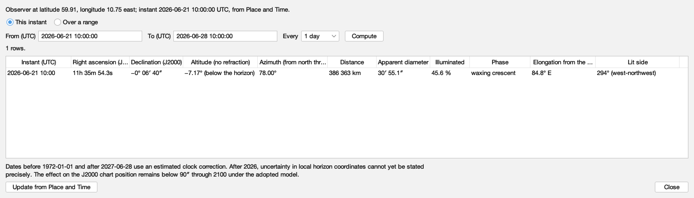
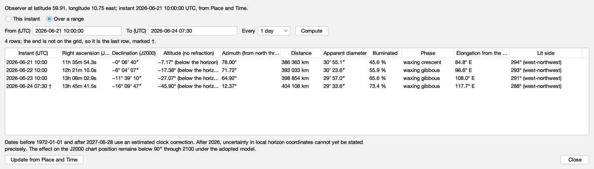
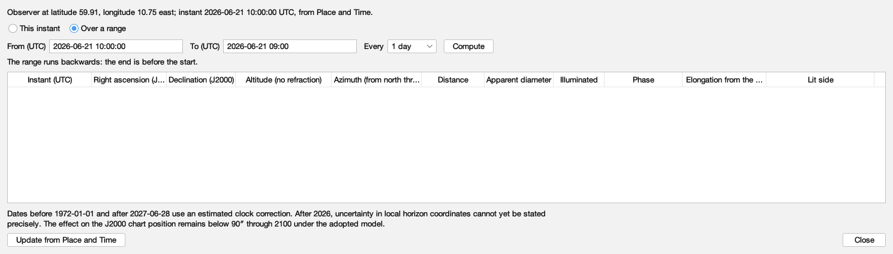
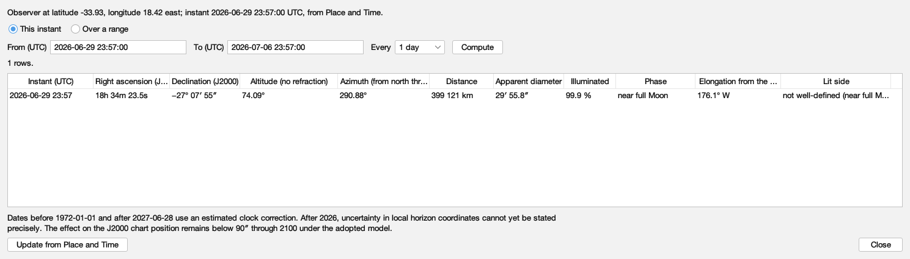
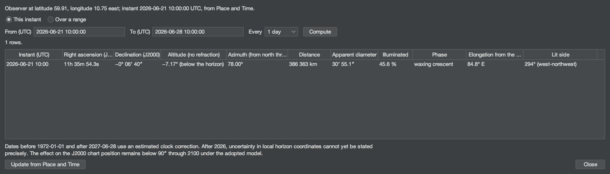
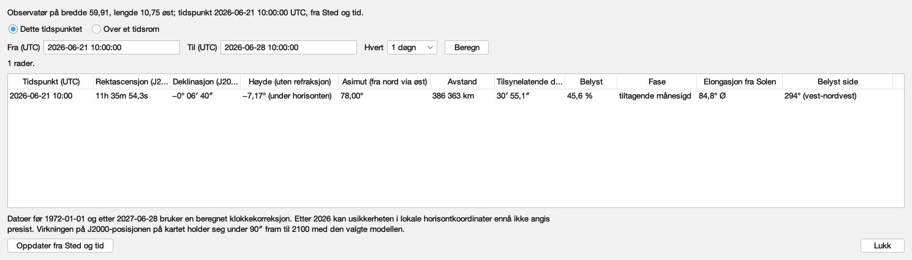
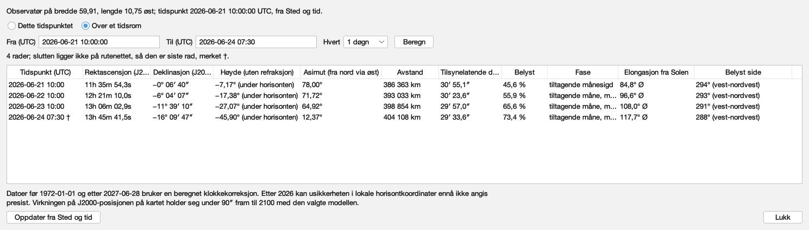
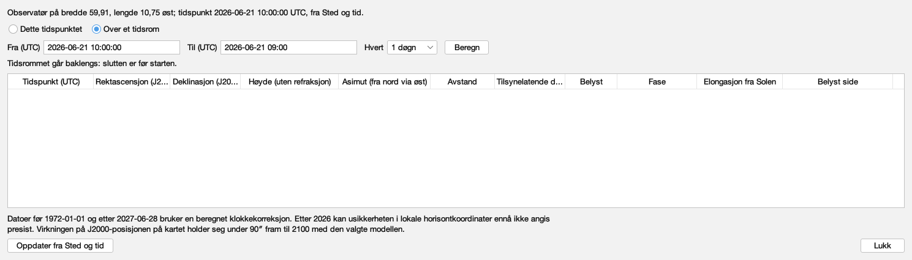
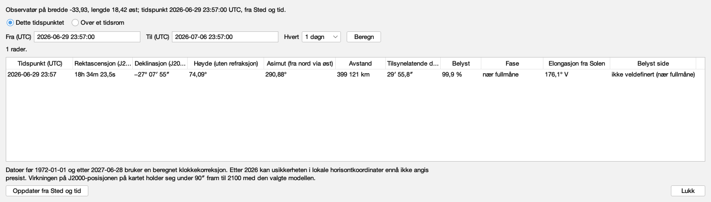
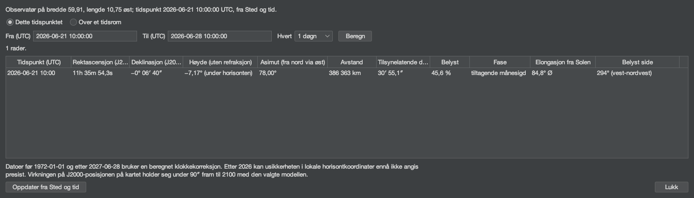

# Every word the Moon table says

Issue #408. Generated by `juranometria.tool.MoonTableSheetMain`
from compiled application classes and their classpath
resources, over the bundled Solar System pack. Packaged
acceptance separately verifies that the pack and the
interface language resources ship in the application image.

**Norsk bokmål — reviewed.** A person who reads the language has been through these surfaces and said these are the words an atlas should use. This is linguistic judgement, not corroboration against a source: unlike the constellation names next door, these are original translations written for this application and there is no citation to check them against. Recorded in `nb-NO.manifest`, and read from there rather than written here.

## The window, not a panel

Each capture is the production dialog built through
`SolarTableDialog.packedForStudy` over the Moon's columns,
which has no "English if omitted" overload. The title and
the window description are read from the `JDialog` itself;
every shown, hovered and spoken string is walked from the
content; the column headings' explanations, which a screen
reader hears and a hover shows, are listed from the model.

## What is translated here, and what is not

Every number is notation: right ascension, declination,
degrees, kilometres, the diameter, the percentage and the
instant are formatted in `Locale.ROOT` by `SunTableFormat`
and `MoonTableFormat` and are identical in both languages,
with the language's own decimal separator. The words are the
language's: the headings, the status line, the refusals, the
status below the horizon, the phase, the side of the Sun and
the compass point of the lit side. The shell's words are the
same keys the Sun table says (`solartable.*`); the Moon's own
are `moontable.*`.

## English (`en`)

### One instant, Oslo at midsummer

The fresh state: a single row at the instant Place and Time holds. A waxing crescent, 46 % lit, 85° east of the Sun, its lit side to the west-northwest.

Packed 1489 × 425 px.

| shown, hovered or spoken |
|---|
| The Moon |
| Where the Moon is, computed from the bundled ephemeris for the observing place and instant set in Place and Time: its position among the fixed stars, its height and direction above the horizon, its distance and apparent size, how much of it is lit and which way the light falls, at that instant or over a range of instants. |
| Observer at latitude 59.91, longitude 10.75 east; instant 2026-06-21 10:00:00 UTC, from Place and Time. |
| This instant |
| One row, at the instant set in Place and Time |
| Show the Moon at the instant set in Place and Time |
| Shows a single row: the Moon at the observing instant set in Place and Time. |
| Over a range |
| A row for every step from a start to an end |
| Show the Moon over a range of instants |
| Shows a row for every step from the start to the end, both included; an end that is not on the grid is added as the last row and marked. |
| From (UTC) |
| yyyy-mm-dd hh:mm or hh:mm:ss, in UTC |
| The first instant of the range, in UTC. Starts at the instant set in Place and Time. |
| To (UTC) |
| The last instant of the range, in UTC, included; if it is not on the grid it is added as the last row and marked. |
| Every |
| 1 hour |
| 6 hours |
| 1 day |
| 7 days |
| 30 days |
| The elapsed time between rows |
| Step between rows |
| The elapsed time between rows, on the UTC timeline, so a daily range does not drift across a change of civil clock. |
| Compute |
| Fill the table for the range above |
| Compute the range |
| Computes a row for every step of the range above. |
| 1 rows. |
| Instant (UTC) |
| Right ascension (J2000) |
| Declination (J2000) |
| Altitude (no refraction) |
| Azimuth (from north through east) |
| Distance |
| Apparent diameter |
| Illuminated |
| Phase |
| Elongation from the Sun |
| Lit side |
| 2026-06-21 10:00 · 11h 35m 54.3s · −0° 06′ 40″ · −7.17° (below the horizon) · 78.00° · 386 363 km · 30′ 55.1″ · 45.6 % · waxing crescent · 84.8° E · 294° (west-northwest) |
| The Moon's computed quantities |
| Each row is one instant. The columns are the instant in UTC; right ascension and declination in the J2000 frame the chart is drawn in; altitude and azimuth without refraction; distance; apparent diameter; the illuminated fraction; the phase; the elongation from the Sun with the side of the Sun the Moon is on; and the lit side, the direction the light falls from. |
| Dates before 1972-01-01 and after 2027-06-28 use an estimated clock correction. After 2026, uncertainty in local horizon coordinates cannot yet be stated precisely. The effect on the J2000 chart position remains below 90″ through 2100 under the adopted model. |
| Update from Place and Time |
| Read the place and instant from Place and Time again |
| Read the observer and instant from Place and Time again |
| Reads the observing place and instant from Place and Time again and recomputes. The table also does this when it opens and whenever it comes to the front. |
| Close |
| Close the Moon table |
| Closes the table. Nothing is changed or remembered; Place and Time keeps the place and instant. |

### A range with an appended end

Daily rows from the instant, and an end that is not on the grid, added last and marked †. The status line says so.

Packed 1489 × 425 px.

| shown, hovered or spoken |
|---|
| The Moon |
| Where the Moon is, computed from the bundled ephemeris for the observing place and instant set in Place and Time: its position among the fixed stars, its height and direction above the horizon, its distance and apparent size, how much of it is lit and which way the light falls, at that instant or over a range of instants. |
| Observer at latitude 59.91, longitude 10.75 east; instant 2026-06-21 10:00:00 UTC, from Place and Time. |
| This instant |
| One row, at the instant set in Place and Time |
| Show the Moon at the instant set in Place and Time |
| Shows a single row: the Moon at the observing instant set in Place and Time. |
| Over a range |
| A row for every step from a start to an end |
| Show the Moon over a range of instants |
| Shows a row for every step from the start to the end, both included; an end that is not on the grid is added as the last row and marked. |
| From (UTC) |
| yyyy-mm-dd hh:mm or hh:mm:ss, in UTC |
| The first instant of the range, in UTC. Starts at the instant set in Place and Time. |
| To (UTC) |
| The last instant of the range, in UTC, included; if it is not on the grid it is added as the last row and marked. |
| Every |
| 1 hour |
| 6 hours |
| 1 day |
| 7 days |
| 30 days |
| The elapsed time between rows |
| Step between rows |
| The elapsed time between rows, on the UTC timeline, so a daily range does not drift across a change of civil clock. |
| Compute |
| Fill the table for the range above |
| Compute the range |
| Computes a row for every step of the range above. |
| 4 rows; the end is not on the grid, so it is the last row, marked †. |
| Instant (UTC) |
| Right ascension (J2000) |
| Declination (J2000) |
| Altitude (no refraction) |
| Azimuth (from north through east) |
| Distance |
| Apparent diameter |
| Illuminated |
| Phase |
| Elongation from the Sun |
| Lit side |
| 2026-06-21 10:00 · 11h 35m 54.3s · −0° 06′ 40″ · −7.17° (below the horizon) · 78.00° · 386 363 km · 30′ 55.1″ · 45.6 % · waxing crescent · 84.8° E · 294° (west-northwest) |
| 2026-06-22 10:00 · 12h 21m 10.0s · −6° 04′ 07″ · −17.38° (below the horizon) · 71.72° · 393 033 km · 30′ 23.6″ · 55.9 % · waxing gibbous · 96.6° E · 293° (west-northwest) |
| 2026-06-23 10:00 · 13h 06m 02.9s · −11° 39′ 10″ · −27.07° (below the horizon) · 64.92° · 398 854 km · 29′ 57.0″ · 65.6 % · waxing gibbous · 108.0° E · 291° (west-northwest) |
| 2026-06-24 07:30 † · 13h 45m 41.5s · −16° 09′ 47″ · −45.90° (below the horizon) · 12.37° · 404 108 km · 29′ 33.6″ · 73.4 % · waxing gibbous · 117.7° E · 288° (west-northwest) |
| The Moon's computed quantities |
| Each row is one instant. The columns are the instant in UTC; right ascension and declination in the J2000 frame the chart is drawn in; altitude and azimuth without refraction; distance; apparent diameter; the illuminated fraction; the phase; the elongation from the Sun with the side of the Sun the Moon is on; and the lit side, the direction the light falls from. |
| Dates before 1972-01-01 and after 2027-06-28 use an estimated clock correction. After 2026, uncertainty in local horizon coordinates cannot yet be stated precisely. The effect on the J2000 chart position remains below 90″ through 2100 under the adopted model. |
| Update from Place and Time |
| Read the place and instant from Place and Time again |
| Read the observer and instant from Place and Time again |
| Reads the observing place and instant from Place and Time again and recomputes. The table also does this when it opens and whenever it comes to the front. |
| Close |
| Close the Moon table |
| Closes the table. Nothing is changed or remembered; Place and Time keeps the place and instant. |

### A range that runs backwards

The end is before the start. The table is empty and the status line says why; nothing is guessed.

Packed 1489 × 425 px.

| shown, hovered or spoken |
|---|
| The Moon |
| Where the Moon is, computed from the bundled ephemeris for the observing place and instant set in Place and Time: its position among the fixed stars, its height and direction above the horizon, its distance and apparent size, how much of it is lit and which way the light falls, at that instant or over a range of instants. |
| Observer at latitude 59.91, longitude 10.75 east; instant 2026-06-21 10:00:00 UTC, from Place and Time. |
| This instant |
| One row, at the instant set in Place and Time |
| Show the Moon at the instant set in Place and Time |
| Shows a single row: the Moon at the observing instant set in Place and Time. |
| Over a range |
| A row for every step from a start to an end |
| Show the Moon over a range of instants |
| Shows a row for every step from the start to the end, both included; an end that is not on the grid is added as the last row and marked. |
| From (UTC) |
| yyyy-mm-dd hh:mm or hh:mm:ss, in UTC |
| The first instant of the range, in UTC. Starts at the instant set in Place and Time. |
| To (UTC) |
| The last instant of the range, in UTC, included; if it is not on the grid it is added as the last row and marked. |
| Every |
| 1 hour |
| 6 hours |
| 1 day |
| 7 days |
| 30 days |
| The elapsed time between rows |
| Step between rows |
| The elapsed time between rows, on the UTC timeline, so a daily range does not drift across a change of civil clock. |
| Compute |
| Fill the table for the range above |
| Compute the range |
| Computes a row for every step of the range above. |
| The range runs backwards: the end is before the start. |
| Instant (UTC) |
| Right ascension (J2000) |
| Declination (J2000) |
| Altitude (no refraction) |
| Azimuth (from north through east) |
| Distance |
| Apparent diameter |
| Illuminated |
| Phase |
| Elongation from the Sun |
| Lit side |
| The Moon's computed quantities |
| Each row is one instant. The columns are the instant in UTC; right ascension and declination in the J2000 frame the chart is drawn in; altitude and azimuth without refraction; distance; apparent diameter; the illuminated fraction; the phase; the elongation from the Sun with the side of the Sun the Moon is on; and the lit side, the direction the light falls from. |
| Dates before 1972-01-01 and after 2027-06-28 use an estimated clock correction. After 2026, uncertainty in local horizon coordinates cannot yet be stated precisely. The effect on the J2000 chart position remains below 90″ through 2100 under the adopted model. |
| Update from Place and Time |
| Read the place and instant from Place and Time again |
| Read the observer and instant from Place and Time again |
| Reads the observing place and instant from Place and Time again and recomputes. The table also does this when it opens and whenever it comes to the front. |
| Close |
| Close the Moon table |
| Closes the table. Nothing is changed or remembered; Place and Time keeps the place and instant. |

### Cape Town at the June full Moon

A southern observer at Espenak's full-Moon instant: the Moon 74° high, 99.9 % lit, near full, and the lit side stated as not well-defined rather than as a false angle.

Packed 1489 × 425 px.

| shown, hovered or spoken |
|---|
| The Moon |
| Where the Moon is, computed from the bundled ephemeris for the observing place and instant set in Place and Time: its position among the fixed stars, its height and direction above the horizon, its distance and apparent size, how much of it is lit and which way the light falls, at that instant or over a range of instants. |
| Observer at latitude -33.93, longitude 18.42 east; instant 2026-06-29 23:57:00 UTC, from Place and Time. |
| This instant |
| One row, at the instant set in Place and Time |
| Show the Moon at the instant set in Place and Time |
| Shows a single row: the Moon at the observing instant set in Place and Time. |
| Over a range |
| A row for every step from a start to an end |
| Show the Moon over a range of instants |
| Shows a row for every step from the start to the end, both included; an end that is not on the grid is added as the last row and marked. |
| From (UTC) |
| yyyy-mm-dd hh:mm or hh:mm:ss, in UTC |
| The first instant of the range, in UTC. Starts at the instant set in Place and Time. |
| To (UTC) |
| The last instant of the range, in UTC, included; if it is not on the grid it is added as the last row and marked. |
| Every |
| 1 hour |
| 6 hours |
| 1 day |
| 7 days |
| 30 days |
| The elapsed time between rows |
| Step between rows |
| The elapsed time between rows, on the UTC timeline, so a daily range does not drift across a change of civil clock. |
| Compute |
| Fill the table for the range above |
| Compute the range |
| Computes a row for every step of the range above. |
| 1 rows. |
| Instant (UTC) |
| Right ascension (J2000) |
| Declination (J2000) |
| Altitude (no refraction) |
| Azimuth (from north through east) |
| Distance |
| Apparent diameter |
| Illuminated |
| Phase |
| Elongation from the Sun |
| Lit side |
| 2026-06-29 23:57 · 18h 34m 23.5s · −27° 07′ 55″ · 74.09° · 290.88° · 399 121 km · 29′ 55.8″ · 99.9 % · near full Moon · 176.1° W · not well-defined (near full Moon) |
| The Moon's computed quantities |
| Each row is one instant. The columns are the instant in UTC; right ascension and declination in the J2000 frame the chart is drawn in; altitude and azimuth without refraction; distance; apparent diameter; the illuminated fraction; the phase; the elongation from the Sun with the side of the Sun the Moon is on; and the lit side, the direction the light falls from. |
| Dates before 1972-01-01 and after 2027-06-28 use an estimated clock correction. After 2026, uncertainty in local horizon coordinates cannot yet be stated precisely. The effect on the J2000 chart position remains below 90″ through 2100 under the adopted model. |
| Update from Place and Time |
| Read the place and instant from Place and Time again |
| Read the observer and instant from Place and Time again |
| Reads the observing place and instant from Place and Time again and recomputes. The table also does this when it opens and whenever it comes to the front. |
| Close |
| Close the Moon table |
| Closes the table. Nothing is changed or remembered; Place and Time keeps the place and instant. |

### The instant, in the dark appearance

Packed 1489 × 425 px.

| shown, hovered or spoken |
|---|
| The Moon |
| Where the Moon is, computed from the bundled ephemeris for the observing place and instant set in Place and Time: its position among the fixed stars, its height and direction above the horizon, its distance and apparent size, how much of it is lit and which way the light falls, at that instant or over a range of instants. |
| Observer at latitude 59.91, longitude 10.75 east; instant 2026-06-21 10:00:00 UTC, from Place and Time. |
| This instant |
| One row, at the instant set in Place and Time |
| Show the Moon at the instant set in Place and Time |
| Shows a single row: the Moon at the observing instant set in Place and Time. |
| Over a range |
| A row for every step from a start to an end |
| Show the Moon over a range of instants |
| Shows a row for every step from the start to the end, both included; an end that is not on the grid is added as the last row and marked. |
| From (UTC) |
| yyyy-mm-dd hh:mm or hh:mm:ss, in UTC |
| The first instant of the range, in UTC. Starts at the instant set in Place and Time. |
| To (UTC) |
| The last instant of the range, in UTC, included; if it is not on the grid it is added as the last row and marked. |
| Every |
| 1 hour |
| 6 hours |
| 1 day |
| 7 days |
| 30 days |
| The elapsed time between rows |
| Step between rows |
| The elapsed time between rows, on the UTC timeline, so a daily range does not drift across a change of civil clock. |
| Compute |
| Fill the table for the range above |
| Compute the range |
| Computes a row for every step of the range above. |
| 1 rows. |
| Instant (UTC) |
| Right ascension (J2000) |
| Declination (J2000) |
| Altitude (no refraction) |
| Azimuth (from north through east) |
| Distance |
| Apparent diameter |
| Illuminated |
| Phase |
| Elongation from the Sun |
| Lit side |
| 2026-06-21 10:00 · 11h 35m 54.3s · −0° 06′ 40″ · −7.17° (below the horizon) · 78.00° · 386 363 km · 30′ 55.1″ · 45.6 % · waxing crescent · 84.8° E · 294° (west-northwest) |
| The Moon's computed quantities |
| Each row is one instant. The columns are the instant in UTC; right ascension and declination in the J2000 frame the chart is drawn in; altitude and azimuth without refraction; distance; apparent diameter; the illuminated fraction; the phase; the elongation from the Sun with the side of the Sun the Moon is on; and the lit side, the direction the light falls from. |
| Dates before 1972-01-01 and after 2027-06-28 use an estimated clock correction. After 2026, uncertainty in local horizon coordinates cannot yet be stated precisely. The effect on the J2000 chart position remains below 90″ through 2100 under the adopted model. |
| Update from Place and Time |
| Read the place and instant from Place and Time again |
| Read the observer and instant from Place and Time again |
| Reads the observing place and instant from Place and Time again and recomputes. The table also does this when it opens and whenever it comes to the front. |
| Close |
| Close the Moon table |
| Closes the table. Nothing is changed or remembered; Place and Time keeps the place and instant. |

#### The headings, and what they explain

| heading | explanation |
|---|---|
| Instant (UTC) | The instant in UTC, to the minute. "est." marks an instant whose clock correction is estimated; † marks a range end that was not on the grid. |
| Right ascension (J2000) | Hours, minutes and seconds of time, in the ICRS/J2000 frame the chart is drawn in: where the Moon is among the fixed stars, as seen from the observing place, without aberration. |
| Declination (J2000) | Degrees, minutes and seconds of arc, in the same frame. |
| Altitude (no refraction) | Degrees above the mathematical horizon, without atmospheric refraction; below the horizon the number is kept and the status is added. |
| Azimuth (from north through east) | Degrees from north through east: 90° is east, 180° south, 270° west. |
| Distance | From the observer to the Moon's centre, in kilometres. |
| Apparent diameter | How large the Moon's disc looks, in minutes and seconds of arc. |
| Illuminated | How much of the Moon's disc is lit, as a percentage of the whole disc. |
| Phase | The phase as a reader sees it: near new Moon, waxing crescent, near first quarter, waxing gibbous, near full Moon, waning gibbous, near last quarter or waning crescent. Waxing and waning follow the Moon's path around the Earth and are the same for every observer; "near" marks a band around the event, not its exact instant. |
| Elongation from the Sun | Degrees between the Sun and the Moon in the observer's sky; E when the Moon is east of the Sun there (the evening sky), W when west of it (the morning sky). |
| Lit side | The position angle of the bright limb's midpoint, from celestial north through east, with the nearest of sixteen compass points; not well-defined near new and full Moon. |

## Norsk bokmål (`nb-NO`)

### One instant, Oslo at midsummer

The fresh state: a single row at the instant Place and Time holds. A waxing crescent, 46 % lit, 85° east of the Sun, its lit side to the west-northwest.

Packed 1489 × 425 px.

| shown, hovered or spoken |
|---|
| Månen |
| Hvor Månen er, beregnet fra den medfølgende efemeriden for observasjonsstedet og tidspunktet satt i Sted og tid: posisjonen blant fiksstjernene, høyden og retningen over horisonten, avstanden og den tilsynelatende størrelsen, hvor mye av den som er belyst og hvilken vei lyset faller, ved det tidspunktet eller over et tidsrom. |
| Observatør på bredde 59,91, lengde 10,75 øst; tidspunkt 2026-06-21 10:00:00 UTC, fra Sted og tid. |
| Dette tidspunktet |
| Én rad, ved tidspunktet satt i Sted og tid |
| Vis Månen ved tidspunktet satt i Sted og tid |
| Viser én rad: Månen ved observasjonstidspunktet satt i Sted og tid. |
| Over et tidsrom |
| Én rad for hvert steg fra en start til en slutt |
| Vis Månen over et tidsrom |
| Viser én rad for hvert steg fra starten til slutten, begge medregnet; en slutt som ikke ligger på rutenettet, legges til som siste rad og merkes. |
| Fra (UTC) |
| åååå-mm-dd tt:mm eller tt:mm:ss, i UTC |
| Første tidspunkt i tidsrommet, i UTC. Starter ved tidspunktet satt i Sted og tid. |
| Til (UTC) |
| Siste tidspunkt i tidsrommet, i UTC, medregnet; ligger det ikke på rutenettet, legges det til som siste rad og merkes. |
| Hvert |
| 1 time |
| 6 timer |
| 1 døgn |
| 7 døgn |
| 30 døgn |
| Tiden som går mellom radene |
| Steg mellom radene |
| Tiden som går mellom radene, på UTC-tidslinjen, så et daglig tidsrom ikke forskyver seg ved skifte av sivil klokke. |
| Beregn |
| Fyll tabellen for tidsrommet over |
| Beregn tidsrommet |
| Beregner én rad for hvert steg i tidsrommet over. |
| 1 rader. |
| Tidspunkt (UTC) |
| Rektascensjon (J2000) |
| Deklinasjon (J2000) |
| Høyde (uten refraksjon) |
| Asimut (fra nord via øst) |
| Avstand |
| Tilsynelatende diameter |
| Belyst |
| Fase |
| Elongasjon fra Solen |
| Belyst side |
| 2026-06-21 10:00 · 11h 35m 54,3s · −0° 06′ 40″ · −7,17° (under horisonten) · 78,00° · 386 363 km · 30′ 55,1″ · 45,6 % · tiltagende månesigd · 84,8° Ø · 294° (vest-nordvest) |
| Månens beregnede størrelser |
| Hver rad er ett tidspunkt. Kolonnene er tidspunktet i UTC; rektascensjon og deklinasjon i J2000-rammen kartet tegnes i; høyde og asimut uten refraksjon; avstand; tilsynelatende diameter; belyst andel; fase; elongasjon fra Solen med hvilken side av Solen Månen står på; og belyst side, retningen lyset faller fra. |
| Datoer før 1972-01-01 og etter 2027-06-28 bruker en beregnet klokkekorreksjon. Etter 2026 kan usikkerheten i lokale horisontkoordinater ennå ikke angis presist. Virkningen på J2000-posisjonen på kartet holder seg under 90″ fram til 2100 med den valgte modellen. |
| Oppdater fra Sted og tid |
| Les sted og tidspunkt fra Sted og tid på nytt |
| Les observatør og tidspunkt fra Sted og tid på nytt |
| Leser observasjonsstedet og tidspunktet fra Sted og tid på nytt og beregner om igjen. Tabellen gjør også dette når den åpnes og hver gang den kommer fremst. |
| Lukk |
| Lukk månetabellen |
| Lukker tabellen. Ingenting endres eller huskes; Sted og tid beholder stedet og tidspunktet. |

### A range with an appended end

Daily rows from the instant, and an end that is not on the grid, added last and marked †. The status line says so.

Packed 1489 × 425 px.

| shown, hovered or spoken |
|---|
| Månen |
| Hvor Månen er, beregnet fra den medfølgende efemeriden for observasjonsstedet og tidspunktet satt i Sted og tid: posisjonen blant fiksstjernene, høyden og retningen over horisonten, avstanden og den tilsynelatende størrelsen, hvor mye av den som er belyst og hvilken vei lyset faller, ved det tidspunktet eller over et tidsrom. |
| Observatør på bredde 59,91, lengde 10,75 øst; tidspunkt 2026-06-21 10:00:00 UTC, fra Sted og tid. |
| Dette tidspunktet |
| Én rad, ved tidspunktet satt i Sted og tid |
| Vis Månen ved tidspunktet satt i Sted og tid |
| Viser én rad: Månen ved observasjonstidspunktet satt i Sted og tid. |
| Over et tidsrom |
| Én rad for hvert steg fra en start til en slutt |
| Vis Månen over et tidsrom |
| Viser én rad for hvert steg fra starten til slutten, begge medregnet; en slutt som ikke ligger på rutenettet, legges til som siste rad og merkes. |
| Fra (UTC) |
| åååå-mm-dd tt:mm eller tt:mm:ss, i UTC |
| Første tidspunkt i tidsrommet, i UTC. Starter ved tidspunktet satt i Sted og tid. |
| Til (UTC) |
| Siste tidspunkt i tidsrommet, i UTC, medregnet; ligger det ikke på rutenettet, legges det til som siste rad og merkes. |
| Hvert |
| 1 time |
| 6 timer |
| 1 døgn |
| 7 døgn |
| 30 døgn |
| Tiden som går mellom radene |
| Steg mellom radene |
| Tiden som går mellom radene, på UTC-tidslinjen, så et daglig tidsrom ikke forskyver seg ved skifte av sivil klokke. |
| Beregn |
| Fyll tabellen for tidsrommet over |
| Beregn tidsrommet |
| Beregner én rad for hvert steg i tidsrommet over. |
| 4 rader; slutten ligger ikke på rutenettet, så den er siste rad, merket †. |
| Tidspunkt (UTC) |
| Rektascensjon (J2000) |
| Deklinasjon (J2000) |
| Høyde (uten refraksjon) |
| Asimut (fra nord via øst) |
| Avstand |
| Tilsynelatende diameter |
| Belyst |
| Fase |
| Elongasjon fra Solen |
| Belyst side |
| 2026-06-21 10:00 · 11h 35m 54,3s · −0° 06′ 40″ · −7,17° (under horisonten) · 78,00° · 386 363 km · 30′ 55,1″ · 45,6 % · tiltagende månesigd · 84,8° Ø · 294° (vest-nordvest) |
| 2026-06-22 10:00 · 12h 21m 10,0s · −6° 04′ 07″ · −17,38° (under horisonten) · 71,72° · 393 033 km · 30′ 23,6″ · 55,9 % · tiltagende måne, mer enn halv · 96,6° Ø · 293° (vest-nordvest) |
| 2026-06-23 10:00 · 13h 06m 02,9s · −11° 39′ 10″ · −27,07° (under horisonten) · 64,92° · 398 854 km · 29′ 57,0″ · 65,6 % · tiltagende måne, mer enn halv · 108,0° Ø · 291° (vest-nordvest) |
| 2026-06-24 07:30 † · 13h 45m 41,5s · −16° 09′ 47″ · −45,90° (under horisonten) · 12,37° · 404 108 km · 29′ 33,6″ · 73,4 % · tiltagende måne, mer enn halv · 117,7° Ø · 288° (vest-nordvest) |
| Månens beregnede størrelser |
| Hver rad er ett tidspunkt. Kolonnene er tidspunktet i UTC; rektascensjon og deklinasjon i J2000-rammen kartet tegnes i; høyde og asimut uten refraksjon; avstand; tilsynelatende diameter; belyst andel; fase; elongasjon fra Solen med hvilken side av Solen Månen står på; og belyst side, retningen lyset faller fra. |
| Datoer før 1972-01-01 og etter 2027-06-28 bruker en beregnet klokkekorreksjon. Etter 2026 kan usikkerheten i lokale horisontkoordinater ennå ikke angis presist. Virkningen på J2000-posisjonen på kartet holder seg under 90″ fram til 2100 med den valgte modellen. |
| Oppdater fra Sted og tid |
| Les sted og tidspunkt fra Sted og tid på nytt |
| Les observatør og tidspunkt fra Sted og tid på nytt |
| Leser observasjonsstedet og tidspunktet fra Sted og tid på nytt og beregner om igjen. Tabellen gjør også dette når den åpnes og hver gang den kommer fremst. |
| Lukk |
| Lukk månetabellen |
| Lukker tabellen. Ingenting endres eller huskes; Sted og tid beholder stedet og tidspunktet. |

### A range that runs backwards

The end is before the start. The table is empty and the status line says why; nothing is guessed.

Packed 1489 × 425 px.

| shown, hovered or spoken |
|---|
| Månen |
| Hvor Månen er, beregnet fra den medfølgende efemeriden for observasjonsstedet og tidspunktet satt i Sted og tid: posisjonen blant fiksstjernene, høyden og retningen over horisonten, avstanden og den tilsynelatende størrelsen, hvor mye av den som er belyst og hvilken vei lyset faller, ved det tidspunktet eller over et tidsrom. |
| Observatør på bredde 59,91, lengde 10,75 øst; tidspunkt 2026-06-21 10:00:00 UTC, fra Sted og tid. |
| Dette tidspunktet |
| Én rad, ved tidspunktet satt i Sted og tid |
| Vis Månen ved tidspunktet satt i Sted og tid |
| Viser én rad: Månen ved observasjonstidspunktet satt i Sted og tid. |
| Over et tidsrom |
| Én rad for hvert steg fra en start til en slutt |
| Vis Månen over et tidsrom |
| Viser én rad for hvert steg fra starten til slutten, begge medregnet; en slutt som ikke ligger på rutenettet, legges til som siste rad og merkes. |
| Fra (UTC) |
| åååå-mm-dd tt:mm eller tt:mm:ss, i UTC |
| Første tidspunkt i tidsrommet, i UTC. Starter ved tidspunktet satt i Sted og tid. |
| Til (UTC) |
| Siste tidspunkt i tidsrommet, i UTC, medregnet; ligger det ikke på rutenettet, legges det til som siste rad og merkes. |
| Hvert |
| 1 time |
| 6 timer |
| 1 døgn |
| 7 døgn |
| 30 døgn |
| Tiden som går mellom radene |
| Steg mellom radene |
| Tiden som går mellom radene, på UTC-tidslinjen, så et daglig tidsrom ikke forskyver seg ved skifte av sivil klokke. |
| Beregn |
| Fyll tabellen for tidsrommet over |
| Beregn tidsrommet |
| Beregner én rad for hvert steg i tidsrommet over. |
| Tidsrommet går baklengs: slutten er før starten. |
| Tidspunkt (UTC) |
| Rektascensjon (J2000) |
| Deklinasjon (J2000) |
| Høyde (uten refraksjon) |
| Asimut (fra nord via øst) |
| Avstand |
| Tilsynelatende diameter |
| Belyst |
| Fase |
| Elongasjon fra Solen |
| Belyst side |
| Månens beregnede størrelser |
| Hver rad er ett tidspunkt. Kolonnene er tidspunktet i UTC; rektascensjon og deklinasjon i J2000-rammen kartet tegnes i; høyde og asimut uten refraksjon; avstand; tilsynelatende diameter; belyst andel; fase; elongasjon fra Solen med hvilken side av Solen Månen står på; og belyst side, retningen lyset faller fra. |
| Datoer før 1972-01-01 og etter 2027-06-28 bruker en beregnet klokkekorreksjon. Etter 2026 kan usikkerheten i lokale horisontkoordinater ennå ikke angis presist. Virkningen på J2000-posisjonen på kartet holder seg under 90″ fram til 2100 med den valgte modellen. |
| Oppdater fra Sted og tid |
| Les sted og tidspunkt fra Sted og tid på nytt |
| Les observatør og tidspunkt fra Sted og tid på nytt |
| Leser observasjonsstedet og tidspunktet fra Sted og tid på nytt og beregner om igjen. Tabellen gjør også dette når den åpnes og hver gang den kommer fremst. |
| Lukk |
| Lukk månetabellen |
| Lukker tabellen. Ingenting endres eller huskes; Sted og tid beholder stedet og tidspunktet. |

### Cape Town at the June full Moon

A southern observer at Espenak's full-Moon instant: the Moon 74° high, 99.9 % lit, near full, and the lit side stated as not well-defined rather than as a false angle.

Packed 1489 × 425 px.

| shown, hovered or spoken |
|---|
| Månen |
| Hvor Månen er, beregnet fra den medfølgende efemeriden for observasjonsstedet og tidspunktet satt i Sted og tid: posisjonen blant fiksstjernene, høyden og retningen over horisonten, avstanden og den tilsynelatende størrelsen, hvor mye av den som er belyst og hvilken vei lyset faller, ved det tidspunktet eller over et tidsrom. |
| Observatør på bredde -33,93, lengde 18,42 øst; tidspunkt 2026-06-29 23:57:00 UTC, fra Sted og tid. |
| Dette tidspunktet |
| Én rad, ved tidspunktet satt i Sted og tid |
| Vis Månen ved tidspunktet satt i Sted og tid |
| Viser én rad: Månen ved observasjonstidspunktet satt i Sted og tid. |
| Over et tidsrom |
| Én rad for hvert steg fra en start til en slutt |
| Vis Månen over et tidsrom |
| Viser én rad for hvert steg fra starten til slutten, begge medregnet; en slutt som ikke ligger på rutenettet, legges til som siste rad og merkes. |
| Fra (UTC) |
| åååå-mm-dd tt:mm eller tt:mm:ss, i UTC |
| Første tidspunkt i tidsrommet, i UTC. Starter ved tidspunktet satt i Sted og tid. |
| Til (UTC) |
| Siste tidspunkt i tidsrommet, i UTC, medregnet; ligger det ikke på rutenettet, legges det til som siste rad og merkes. |
| Hvert |
| 1 time |
| 6 timer |
| 1 døgn |
| 7 døgn |
| 30 døgn |
| Tiden som går mellom radene |
| Steg mellom radene |
| Tiden som går mellom radene, på UTC-tidslinjen, så et daglig tidsrom ikke forskyver seg ved skifte av sivil klokke. |
| Beregn |
| Fyll tabellen for tidsrommet over |
| Beregn tidsrommet |
| Beregner én rad for hvert steg i tidsrommet over. |
| 1 rader. |
| Tidspunkt (UTC) |
| Rektascensjon (J2000) |
| Deklinasjon (J2000) |
| Høyde (uten refraksjon) |
| Asimut (fra nord via øst) |
| Avstand |
| Tilsynelatende diameter |
| Belyst |
| Fase |
| Elongasjon fra Solen |
| Belyst side |
| 2026-06-29 23:57 · 18h 34m 23,5s · −27° 07′ 55″ · 74,09° · 290,88° · 399 121 km · 29′ 55,8″ · 99,9 % · nær fullmåne · 176,1° V · ikke veldefinert (nær fullmåne) |
| Månens beregnede størrelser |
| Hver rad er ett tidspunkt. Kolonnene er tidspunktet i UTC; rektascensjon og deklinasjon i J2000-rammen kartet tegnes i; høyde og asimut uten refraksjon; avstand; tilsynelatende diameter; belyst andel; fase; elongasjon fra Solen med hvilken side av Solen Månen står på; og belyst side, retningen lyset faller fra. |
| Datoer før 1972-01-01 og etter 2027-06-28 bruker en beregnet klokkekorreksjon. Etter 2026 kan usikkerheten i lokale horisontkoordinater ennå ikke angis presist. Virkningen på J2000-posisjonen på kartet holder seg under 90″ fram til 2100 med den valgte modellen. |
| Oppdater fra Sted og tid |
| Les sted og tidspunkt fra Sted og tid på nytt |
| Les observatør og tidspunkt fra Sted og tid på nytt |
| Leser observasjonsstedet og tidspunktet fra Sted og tid på nytt og beregner om igjen. Tabellen gjør også dette når den åpnes og hver gang den kommer fremst. |
| Lukk |
| Lukk månetabellen |
| Lukker tabellen. Ingenting endres eller huskes; Sted og tid beholder stedet og tidspunktet. |

### The instant, in the dark appearance

Packed 1489 × 425 px.

| shown, hovered or spoken |
|---|
| Månen |
| Hvor Månen er, beregnet fra den medfølgende efemeriden for observasjonsstedet og tidspunktet satt i Sted og tid: posisjonen blant fiksstjernene, høyden og retningen over horisonten, avstanden og den tilsynelatende størrelsen, hvor mye av den som er belyst og hvilken vei lyset faller, ved det tidspunktet eller over et tidsrom. |
| Observatør på bredde 59,91, lengde 10,75 øst; tidspunkt 2026-06-21 10:00:00 UTC, fra Sted og tid. |
| Dette tidspunktet |
| Én rad, ved tidspunktet satt i Sted og tid |
| Vis Månen ved tidspunktet satt i Sted og tid |
| Viser én rad: Månen ved observasjonstidspunktet satt i Sted og tid. |
| Over et tidsrom |
| Én rad for hvert steg fra en start til en slutt |
| Vis Månen over et tidsrom |
| Viser én rad for hvert steg fra starten til slutten, begge medregnet; en slutt som ikke ligger på rutenettet, legges til som siste rad og merkes. |
| Fra (UTC) |
| åååå-mm-dd tt:mm eller tt:mm:ss, i UTC |
| Første tidspunkt i tidsrommet, i UTC. Starter ved tidspunktet satt i Sted og tid. |
| Til (UTC) |
| Siste tidspunkt i tidsrommet, i UTC, medregnet; ligger det ikke på rutenettet, legges det til som siste rad og merkes. |
| Hvert |
| 1 time |
| 6 timer |
| 1 døgn |
| 7 døgn |
| 30 døgn |
| Tiden som går mellom radene |
| Steg mellom radene |
| Tiden som går mellom radene, på UTC-tidslinjen, så et daglig tidsrom ikke forskyver seg ved skifte av sivil klokke. |
| Beregn |
| Fyll tabellen for tidsrommet over |
| Beregn tidsrommet |
| Beregner én rad for hvert steg i tidsrommet over. |
| 1 rader. |
| Tidspunkt (UTC) |
| Rektascensjon (J2000) |
| Deklinasjon (J2000) |
| Høyde (uten refraksjon) |
| Asimut (fra nord via øst) |
| Avstand |
| Tilsynelatende diameter |
| Belyst |
| Fase |
| Elongasjon fra Solen |
| Belyst side |
| 2026-06-21 10:00 · 11h 35m 54,3s · −0° 06′ 40″ · −7,17° (under horisonten) · 78,00° · 386 363 km · 30′ 55,1″ · 45,6 % · tiltagende månesigd · 84,8° Ø · 294° (vest-nordvest) |
| Månens beregnede størrelser |
| Hver rad er ett tidspunkt. Kolonnene er tidspunktet i UTC; rektascensjon og deklinasjon i J2000-rammen kartet tegnes i; høyde og asimut uten refraksjon; avstand; tilsynelatende diameter; belyst andel; fase; elongasjon fra Solen med hvilken side av Solen Månen står på; og belyst side, retningen lyset faller fra. |
| Datoer før 1972-01-01 og etter 2027-06-28 bruker en beregnet klokkekorreksjon. Etter 2026 kan usikkerheten i lokale horisontkoordinater ennå ikke angis presist. Virkningen på J2000-posisjonen på kartet holder seg under 90″ fram til 2100 med den valgte modellen. |
| Oppdater fra Sted og tid |
| Les sted og tidspunkt fra Sted og tid på nytt |
| Les observatør og tidspunkt fra Sted og tid på nytt |
| Leser observasjonsstedet og tidspunktet fra Sted og tid på nytt og beregner om igjen. Tabellen gjør også dette når den åpnes og hver gang den kommer fremst. |
| Lukk |
| Lukk månetabellen |
| Lukker tabellen. Ingenting endres eller huskes; Sted og tid beholder stedet og tidspunktet. |

#### The headings, and what they explain

| heading | explanation |
|---|---|
| Tidspunkt (UTC) | Tidspunktet i UTC, til nærmeste minutt. «est.» merker et tidspunkt med beregnet klokkekorreksjon; † merker en slutt på tidsrommet som ikke lå på rutenettet. |
| Rektascensjon (J2000) | Timer, minutter og sekunder av tid, i ICRS/J2000-rammen kartet tegnes i: hvor Månen står blant fiksstjernene, sett fra observasjonsstedet, uten aberrasjon. |
| Deklinasjon (J2000) | Grader, bueminutter og buesekunder, i samme ramme. |
| Høyde (uten refraksjon) | Grader over den matematiske horisonten, uten atmosfærisk refraksjon; under horisonten beholdes tallet og statusen legges til. |
| Asimut (fra nord via øst) | Grader fra nord via øst: 90° er øst, 180° sør, 270° vest. |
| Avstand | Fra observatøren til Månens sentrum, i kilometer. |
| Tilsynelatende diameter | Hvor stor måneskiven ser ut, i bueminutter og buesekunder. |
| Belyst | Hvor mye av måneskiven som er belyst, i prosent av hele skiven. |
| Fase | Fasen slik leseren ser den: nær nymåne, tiltagende månesigd, nær første kvarter, tiltagende måne (mer enn halv), nær fullmåne, avtagende måne (mer enn halv), nær siste kvarter eller avtagende månesigd. Tiltagende og avtagende følger Månens bane rundt Jorden og er like for alle observatører; «nær» merker et bånd rundt hendelsen, ikke det nøyaktige tidspunktet. |
| Elongasjon fra Solen | Grader mellom Solen og Månen på observatørens himmel; Ø når Månen står øst for Solen der (kveldshimmelen), V når vest for den (morgenhimmelen). |
| Belyst side | Posisjonsvinkelen til den lyse randens midtpunkt, fra himmelens nord via øst, med den nærmeste av seksten kompassretninger; ikke veldefinert nær ny- og fullmåne. |

