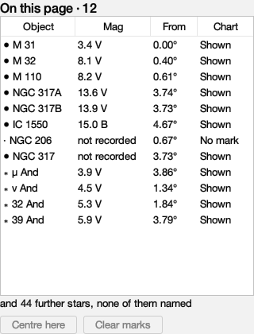
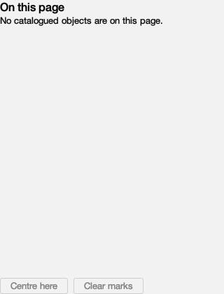
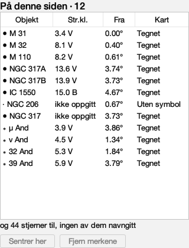
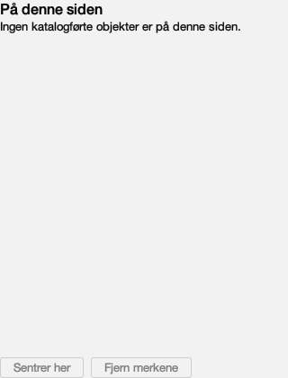

# Every word On This Page says

Issue #350. Generated by
`juranometria.tool.OnThisPageSheetMain`, in a real
window, because this surface measures its own columns.

Norwegian is **draft**.

## What is translated here, and what is not

Object designations, star proper names, magnitudes,
photometric bands and separations are catalogue data
and are untouched. `SkyNames` holds constellation
names only; a star's proper name comes from
`StarIdentity` and is canonical identity. A culturally
localised star-name system would need its own data and
its own provenance contract, and is not this issue.

`not recorded` **is** translated. It sits among
numbers and reads like data, which is how it stayed
English through two earlier passes.

## The Chart column's five answers

Each has two keys, written independently rather than
one derived from the other: a compact word a reader
scans down a column, and the whole answer on hover and
in the spoken channel.

| state | English word | English answer | Norsk ord | Norsk svar |
|---|---|---|---|---|
| `DRAWN` | Shown | drawn | Tegnet | tegnet |
| `FAMILY_HIDDEN` | Hidden | hidden by a chart option | Skjult | skjult av et kartvalg |
| `BELOW_LIMIT` | Faint | fainter than the magnitude limit | For svak | svakere enn kartets grensemagnitude |
| `NO_SYMBOL` | No mark | no chart symbol for its type | Uten symbol | ingen kartsymbol for denne typen |
| `TOO_SMALL` | Small | below the detail policy at this field | For liten | for liten til å tegnes ved dette synsfeltet |

The rows are sorted by this identity, not by translated spelling: the order runs from drawn to least drawn, and it would differ in every language if the words decided it.

## What it costs the layout

| language | Object | Mag | From | Chart | total | 320 px | 240 px |
|---|---|---|---|---|---|---|---|
| `en` | 85 | 87 | 53 | 62 | **287** | fits | scrolls |
| `nb-NO` | 85 | 81 | 53 | 83 | **302** | fits | scrolls |

Norwegian's Chart column is wider and its Mag column narrower, so the table costs 15 px in all (287 px against 302). Both languages scroll in a 240 px sidebar, as English already did before any translation: the pane scrolls rather than squeezing four columns into ellipses (#217).

## English (`en`)

### A page with objects on it

| shown or spoken |
|---|
| On this page |
| Everything the atlas holds on the page you are looking at, whether or not the chart draws it |
| On this page · 12 |
| Object |
| Mag |
| From |
| Chart |
| Objects on this page |
| Choose rows to mark them on the chart. Marking does not move the page. |
| and 44 further stars, none of them named |
| Stars with no catalogue name |
| Centre here |
| Choose a row's mark first, and this centres the chart on it |
| Unavailable until a row is marked: mark one and this moves the page to it |
| Clear marks |
| Nothing is marked yet |
| Unavailable: there are no working marks to remove |

### A page with nothing catalogued on it

| shown or spoken |
|---|
| On this page |
| Everything the atlas holds on the page you are looking at, whether or not the chart draws it |
| No catalogued objects are on this page. |
| Object |
| Mag |
| From |
| Chart |
| Objects on this page |
| Choose rows to mark them on the chart. Marking does not move the page. |
| Stars with no catalogue name |
| Centre here |
| Choose a row's mark first, and this centres the chart on it |
| Unavailable until a row is marked: mark one and this moves the page to it |
| Clear marks |
| Nothing is marked yet |
| Unavailable: there are no working marks to remove |

## Norsk bokmål (`nb-NO`)

### A page with objects on it

| shown or spoken |
|---|
| På denne siden |
| Alt atlaset har på siden du ser på, enten kartet tegner det eller ikke |
| På denne siden · 12 |
| Objekt |
| Str.kl. |
| Fra |
| Kart |
| Objekter på denne siden |
| Velg rader for å merke dem på kartet. Merking flytter ikke siden. |
| og 44 stjerner til, ingen av dem navngitt |
| Stjerner uten katalognavn |
| Sentrer her |
| Merk først en rad; da kan kartet sentreres på objektet |
| Utilgjengelig til en rad er merket. Merk en rad for å flytte siden dit. |
| Fjern merkene |
| Ingenting er merket ennå |
| Utilgjengelig: det finnes ingen arbeidsmerker å fjerne |

### A page with nothing catalogued on it

| shown or spoken |
|---|
| På denne siden |
| Alt atlaset har på siden du ser på, enten kartet tegner det eller ikke |
| Ingen katalogførte objekter er på denne siden. |
| Objekt |
| Str.kl. |
| Fra |
| Kart |
| Objekter på denne siden |
| Velg rader for å merke dem på kartet. Merking flytter ikke siden. |
| Stjerner uten katalognavn |
| Sentrer her |
| Merk først en rad; da kan kartet sentreres på objektet |
| Utilgjengelig til en rad er merket. Merk en rad for å flytte siden dit. |
| Fjern merkene |
| Ingenting er merket ennå |
| Utilgjengelig: det finnes ingen arbeidsmerker å fjerne |

