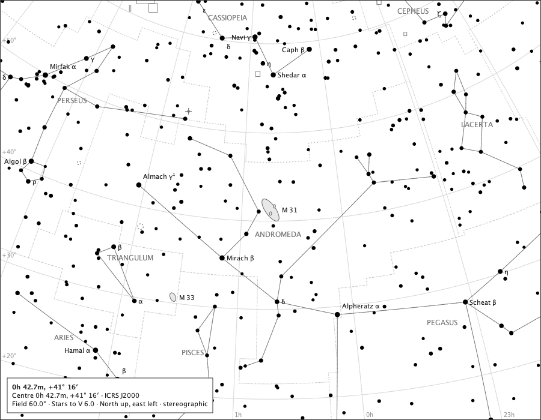
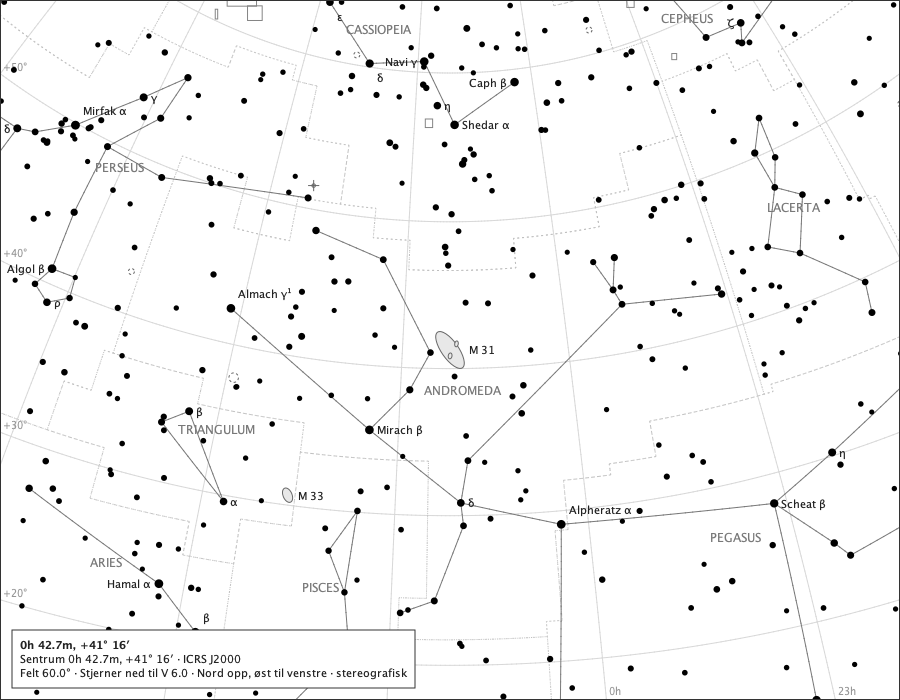
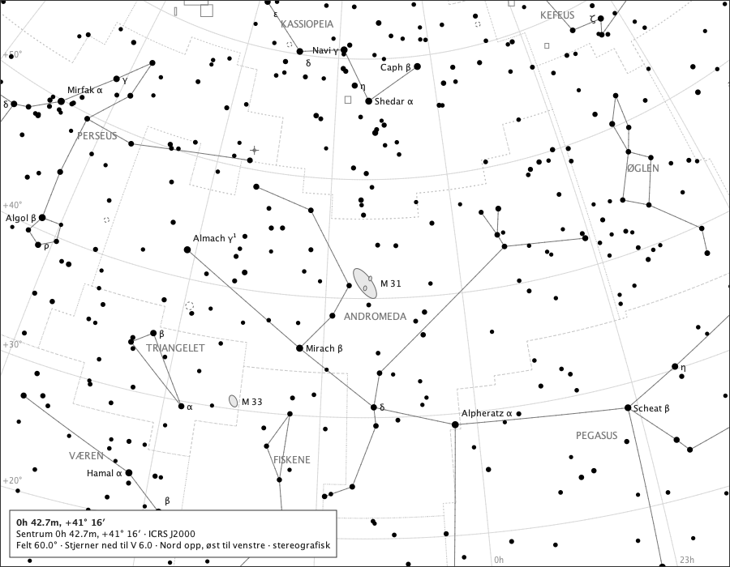

# One page, four ways: interface language × chart language

Issue #350, **draft**. Generated by
`juranometria.tool.PageLanguageSheetMain` from compiled
application classes and their classpath resources.

A sixty-degree page, because the reviewed default is
eight degrees across and names no constellations at
all - a matrix drawn there would compare two empty
skies. The generator refuses to write anything unless
both chart languages place names here.

## The two axes

| | chart: Latin/IAU | chart: `nb-NO` |
|---|---|---|
| **interface `en`** | baseline | sky renamed, chrome identical |
| **interface `nb-NO`** | chrome rewritten, sky identical | both |

Every image is drawn by the real `ChartRenderer` from
the same view and the same options; only the two
language choices differ.

### interface `en`, chart Latin/IAU

| channel | words |
|---|---|
| title line 1 — the page's own title | 0h 42.7m, +41° 16′ |
| title line 2 — centre | Centre 0h 42.7m, +41° 16′ · ICRS J2000 |
| title line 3 — facts | Field 60.0° · Stars to V 6.0 · North up, east left · stereographic |
| magnitude-key heading | Stars, visual magnitude |
| chart, spoken name | Star chart |
| chart, spoken instructions | Press and drag the chart to pan across the sky; scroll to zoom where you point; Reset view returns home. |
| page, spoken in full | 0h 42.7m, +41° 16′. Centre RA 10.6847, Dec +41.2688 (ICRS J2000). Field 60.0 degrees wide, stereographic projection. Stars to V 6.0. North up, east left. |
| exported file: title | JUranometria chart sheet: 0h 42.7m, +41° 16′ |
| exported file: description | 0h 42.7m, +41° 16′. Centre RA 10.6847, Dec +41.2688 (ICRS/J2000). Field 60 degrees wide, stereographic. Stars to V 6.0. A4 landscape, 297.0 x 210.0 mm, 12.7 mm margins, chart 271.6 x 184.6 mm. Ground: white-paper. |
| exported file: producer | JUranometria 2.0.0, https://github.com/Aha43/JUranometria - drawn by the application's own chart renderer; no external resources. |
| constellations named | Andromeda, Aries, Camelopardalis, Cassiopeia, Cepheus, Cetus, Lacerta, Pegasus, Perseus, Pisces, Triangulum |

### interface `en`, chart `nb-NO`

| channel | words |
|---|---|
| title line 1 — the page's own title | 0h 42.7m, +41° 16′ |
| title line 2 — centre | Centre 0h 42.7m, +41° 16′ · ICRS J2000 |
| title line 3 — facts | Field 60.0° · Stars to V 6.0 · North up, east left · stereographic |
| magnitude-key heading | Stars, visual magnitude |
| chart, spoken name | Star chart |
| chart, spoken instructions | Press and drag the chart to pan across the sky; scroll to zoom where you point; Reset view returns home. |
| page, spoken in full | 0h 42.7m, +41° 16′. Centre RA 10.6847, Dec +41.2688 (ICRS J2000). Field 60.0 degrees wide, stereographic projection. Stars to V 6.0. North up, east left. |
| exported file: title | JUranometria chart sheet: 0h 42.7m, +41° 16′ |
| exported file: description | 0h 42.7m, +41° 16′. Centre RA 10.6847, Dec +41.2688 (ICRS/J2000). Field 60 degrees wide, stereographic. Stars to V 6.0. A4 landscape, 297.0 x 210.0 mm, 12.7 mm margins, chart 271.6 x 184.6 mm. Ground: white-paper. |
| exported file: producer | JUranometria 2.0.0, https://github.com/Aha43/JUranometria - drawn by the application's own chart renderer; no external resources. |
| constellations named | Andromeda, Fiskene, Hvalen, Kassiopeia, Kefeus, Pegasus, Perseus, Sjiraffen, Triangelet, Væren, Øglen |

### interface `nb-NO`, chart Latin/IAU

| channel | words |
|---|---|
| title line 1 — the page's own title | 0h 42.7m, +41° 16′ |
| title line 2 — centre | Sentrum 0h 42.7m, +41° 16′ · ICRS J2000 |
| title line 3 — facts | Felt 60.0° · Stjerner ned til V 6.0 · Nord opp, øst til venstre · stereografisk |
| magnitude-key heading | Stjerner, visuell magnitude |
| chart, spoken name | Stjernekart |
| chart, spoken instructions | Trykk og dra i kartet for å panorere over himmelen; rull for å zoome der du peker; Tilbakestill visningen tar deg tilbake til utgangspunktet. |
| page, spoken in full | 0h 42.7m, +41° 16′. Sentrum RA 10.6847, Dec +41.2688 (ICRS J2000). Felt 60.0 grader bredt, stereografisk projeksjon. Stjerner ned til V 6.0. Nord opp, øst til venstre. |
| exported file: title | JUranometria kartark: 0h 42.7m, +41° 16′ |
| exported file: description | 0h 42.7m, +41° 16′. Sentrum RA 10.6847, Dec +41.2688 (ICRS/J2000). Felt 60 grader bredt, stereografisk. Stjerner ned til V 6.0. A4 i liggende format, 297.0 x 210.0 mm, marger på 12.7 mm, kart 271.6 x 184.6 mm. Bakgrunn: hvitt papir. |
| exported file: producer | JUranometria 2.0.0, https://github.com/Aha43/JUranometria – tegnet av programmets egen kartmotor; ingen eksterne ressurser. |
| constellations named | Andromeda, Aries, Camelopardalis, Cassiopeia, Cepheus, Cetus, Lacerta, Pegasus, Perseus, Pisces, Triangulum |

### interface `nb-NO`, chart `nb-NO`

| channel | words |
|---|---|
| title line 1 — the page's own title | 0h 42.7m, +41° 16′ |
| title line 2 — centre | Sentrum 0h 42.7m, +41° 16′ · ICRS J2000 |
| title line 3 — facts | Felt 60.0° · Stjerner ned til V 6.0 · Nord opp, øst til venstre · stereografisk |
| magnitude-key heading | Stjerner, visuell magnitude |
| chart, spoken name | Stjernekart |
| chart, spoken instructions | Trykk og dra i kartet for å panorere over himmelen; rull for å zoome der du peker; Tilbakestill visningen tar deg tilbake til utgangspunktet. |
| page, spoken in full | 0h 42.7m, +41° 16′. Sentrum RA 10.6847, Dec +41.2688 (ICRS J2000). Felt 60.0 grader bredt, stereografisk projeksjon. Stjerner ned til V 6.0. Nord opp, øst til venstre. |
| exported file: title | JUranometria kartark: 0h 42.7m, +41° 16′ |
| exported file: description | 0h 42.7m, +41° 16′. Sentrum RA 10.6847, Dec +41.2688 (ICRS/J2000). Felt 60 grader bredt, stereografisk. Stjerner ned til V 6.0. A4 i liggende format, 297.0 x 210.0 mm, marger på 12.7 mm, kart 271.6 x 184.6 mm. Bakgrunn: hvitt papir. |
| exported file: producer | JUranometria 2.0.0, https://github.com/Aha43/JUranometria – tegnet av programmets egen kartmotor; ingen eksterne ressurser. |
| constellations named | Andromeda, Fiskene, Hvalen, Kassiopeia, Kefeus, Pegasus, Perseus, Sjiraffen, Triangelet, Væren, Øglen |

## What moved, and what did not

| comparison | result |
|---|---|
| interface changed, marks and positions | identical (372 marks) |
| interface changed, non-text ink | identical (12158 lit pixels) |
| interface changed, constellation names | identical (the chart language did not move) |
| chart language changed, title line 2 | identical |
| chart language changed, title line 3 | identical |
| chart language changed, constellation names | renamed: 11 names |
| chart values under a Norwegian interface | dot-decimal, unchanged |

## The two grounds

Only white paper is exported above; a reader who chooses a black sky exports the other, so both phrases are recorded.

| stored token | `en` | `nb-NO` |
|---|---|---|
| `white-paper` | white-paper | hvitt papir |
| `black-sky` | black-sky | svart himmel |

The English phrase for `white-paper` is `white-paper` on purpose: every exported file the atlas has written says `Ground: white-paper.`, and the seam was not an output change.

## What is refused

| asked for | `en` | `nb-NO` |
|---|---|---|
| projection `gnomonic` | gnomonic | gnomonisk |
| projection `spherical-mercator` | *refused* | *refused* |
| ground `grey-dusk` | *refused* | *refused* |

An id that reached a title block would look like a word to everything except a reader.
