# Every word Place and Time says

Issue #350. Generated by
`juranometria.tool.PlaceAndTimeSheetMain` from compiled
application classes and their classpath resources.
Packaged acceptance separately verifies that the
interface language resources ship in the application
image.

Norwegian is **draft**.

## The window, not a panel

Each capture is the production dialog built through
`PlaceAndTimeDialog.packedForStudy`, which has no
"English if omitted" overload: a caller that forgets a
language does not compile. The title and the window
description below are read from the `JDialog` itself,
because a window says things no walk of its content
pane will find - the gap this issue met at the export
dialog and then repeated here.

Each is photographed at the reviewed 420 px width,
which is the width a reader gets. An unshown packed
dialog is pulled back to 326 px one event cycle after
it is built, because the peer never received the
floor - there is no window on screen to resize. A
shown dialog holds 420 px in both languages, measured
before concluding this was the photographer's problem
and not the reader's, and the generator restores the
floor before painting. Without that, three runs
produced three different sets of images.

## What is translated here, and what is not

Coordinates, the instant, `UTC` and the keystroke
glyphs are canonical. The degrees and the instant
round-trip through `Locale.ROOT` because a reader
edits them; a decimal comma in a field that must parse
back is a lost place, not a translation. `UTC` is
handed to the instant's label as an argument rather
than written inside it.

Access letters ARE language. A mnemonic marks a letter
in the item's own displayed word, and the displayed
word is translated: `L` is in "Latitude" and nowhere
in "Breddegrad". All eight are listed per language
below, and the application refuses a letter that is
not in the label it marks rather than guessing one.

## English (`en`)

### Nothing remembered

The released default: the equator at Greenwich. Neutral, and honest about being nobody's home. Both coordinates read zero, which is the one place a sign convention cannot be seen - which is why the next two states exist.

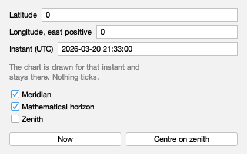

Packed 420 × 263 px, `en`.

| channel | words |
|---|---|
| window title | Place and Time |
| window, spoken | Set where you are and the frozen instant the reference lines are drawn for |
| shown or hovered | Latitude |
| shown or hovered | 0 |
| shown or hovered | Degrees north of the equator, e.g. 59.913; south is negative, -90 to 90 |
| shown or hovered | Longitude, east positive |
| shown or hovered | Degrees east of Greenwich, e.g. 10.752; west is negative |
| shown or hovered | Instant (UTC) |
| shown or hovered | 2026-03-20 21:33:00 |
| shown or hovered | The moment the lines are drawn for, as 2026-03-20 21:33:00 |
| shown or hovered | The chart is drawn for that instant and stays there. Nothing ticks. |
| shown or hovered | Meridian |
| shown or hovered | Draw the great circle through both celestial poles and your zenith (⌘K then R) |
| shown or hovered | Mathematical horizon |
| shown or hovered | Draw where the sky meets a perfectly flat, transparent Earth (⌘K then H) |
| shown or hovered | Zenith |
| shown or hovered | Mark the point overhead |
| shown or hovered | Now |
| shown or hovered | Reads the clock once and freezes the chart at that instant |
| shown or hovered | Centre on zenith |
| shown or hovered | Move the chart to the point overhead |
| spoken | Latitude |
| spoken | Degrees north of the equator, negative south, -90 to 90 |
| spoken | Longitude, east positive |
| spoken | Degrees east of Greenwich; west is negative |
| spoken | Instant (UTC) |
| spoken | The instant used to draw the reference lines. Time does not advance until you change it. |
| spoken | The chart is drawn for that instant and stays there. Nothing ticks. |
| spoken | Show Meridian |
| spoken | Draws the line that runs from due north, through the point overhead, to due south. It lasts as long as this session. |
| spoken | Show Mathematical horizon |
| spoken | Draws the circle where the sky would meet a flat and transparent Earth; your own horizon has hills and air in it. It lasts as long as this session. |
| spoken | Show Zenith |
| spoken | Marks the point directly above you. It is drawn with the observer's lines and has no shortcut of its own. |
| spoken | Now |
| spoken | Freezes the reference lines at the present moment. The clock is read once; nothing moves afterwards. |
| spoken | Centre on zenith |
| spoken | Moves the page to the point directly above you. This is the only control in this window that moves the chart. |
| access letters | L G U M H Z N C |

### Oslo — north and east

East longitude is positive. The number and its sign are notation and are identical in both languages; only the words around them change.

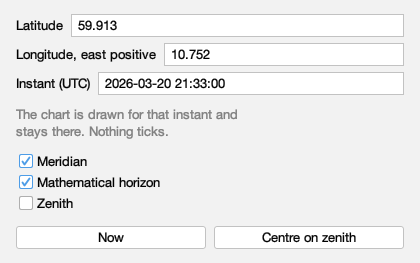

Packed 420 × 263 px, `en`.

| channel | words |
|---|---|
| window title | Place and Time |
| window, spoken | Set where you are and the frozen instant the reference lines are drawn for |
| shown or hovered | Latitude |
| shown or hovered | 59.913 |
| shown or hovered | Degrees north of the equator, e.g. 59.913; south is negative, -90 to 90 |
| shown or hovered | Longitude, east positive |
| shown or hovered | 10.752 |
| shown or hovered | Degrees east of Greenwich, e.g. 10.752; west is negative |
| shown or hovered | Instant (UTC) |
| shown or hovered | 2026-03-20 21:33:00 |
| shown or hovered | The moment the lines are drawn for, as 2026-03-20 21:33:00 |
| shown or hovered | The chart is drawn for that instant and stays there. Nothing ticks. |
| shown or hovered | Meridian |
| shown or hovered | Draw the great circle through both celestial poles and your zenith (⌘K then R) |
| shown or hovered | Mathematical horizon |
| shown or hovered | Draw where the sky meets a perfectly flat, transparent Earth (⌘K then H) |
| shown or hovered | Zenith |
| shown or hovered | Mark the point overhead |
| shown or hovered | Now |
| shown or hovered | Reads the clock once and freezes the chart at that instant |
| shown or hovered | Centre on zenith |
| shown or hovered | Move the chart to the point overhead |
| spoken | Latitude |
| spoken | Degrees north of the equator, negative south, -90 to 90 |
| spoken | Longitude, east positive |
| spoken | Degrees east of Greenwich; west is negative |
| spoken | Instant (UTC) |
| spoken | The instant used to draw the reference lines. Time does not advance until you change it. |
| spoken | The chart is drawn for that instant and stays there. Nothing ticks. |
| spoken | Show Meridian |
| spoken | Draws the line that runs from due north, through the point overhead, to due south. It lasts as long as this session. |
| spoken | Show Mathematical horizon |
| spoken | Draws the circle where the sky would meet a flat and transparent Earth; your own horizon has hills and air in it. It lasts as long as this session. |
| spoken | Show Zenith |
| spoken | Marks the point directly above you. It is drawn with the observer's lines and has no shortcut of its own. |
| spoken | Now |
| spoken | Freezes the reference lines at the present moment. The clock is read once; nothing moves afterwards. |
| spoken | Centre on zenith |
| spoken | Moves the page to the point directly above you. This is the only control in this window that moves the chart. |
| access letters | L G U M H Z N C |

### Santiago — south and west

South latitude and west longitude are negative. A translation that rendered a minus sign differently would put a reader on the wrong side of the planet, so it does not: the field round-trips through Locale.ROOT.

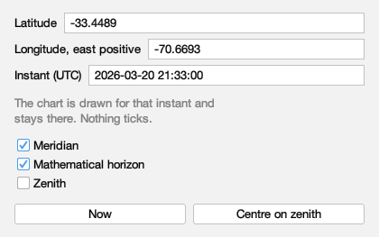

Packed 420 × 263 px, `en`.

| channel | words |
|---|---|
| window title | Place and Time |
| window, spoken | Set where you are and the frozen instant the reference lines are drawn for |
| shown or hovered | Latitude |
| shown or hovered | -33.4489 |
| shown or hovered | Degrees north of the equator, e.g. 59.913; south is negative, -90 to 90 |
| shown or hovered | Longitude, east positive |
| shown or hovered | -70.6693 |
| shown or hovered | Degrees east of Greenwich, e.g. 10.752; west is negative |
| shown or hovered | Instant (UTC) |
| shown or hovered | 2026-03-20 21:33:00 |
| shown or hovered | The moment the lines are drawn for, as 2026-03-20 21:33:00 |
| shown or hovered | The chart is drawn for that instant and stays there. Nothing ticks. |
| shown or hovered | Meridian |
| shown or hovered | Draw the great circle through both celestial poles and your zenith (⌘K then R) |
| shown or hovered | Mathematical horizon |
| shown or hovered | Draw where the sky meets a perfectly flat, transparent Earth (⌘K then H) |
| shown or hovered | Zenith |
| shown or hovered | Mark the point overhead |
| shown or hovered | Now |
| shown or hovered | Reads the clock once and freezes the chart at that instant |
| shown or hovered | Centre on zenith |
| shown or hovered | Move the chart to the point overhead |
| spoken | Latitude |
| spoken | Degrees north of the equator, negative south, -90 to 90 |
| spoken | Longitude, east positive |
| spoken | Degrees east of Greenwich; west is negative |
| spoken | Instant (UTC) |
| spoken | The instant used to draw the reference lines. Time does not advance until you change it. |
| spoken | The chart is drawn for that instant and stays there. Nothing ticks. |
| spoken | Show Meridian |
| spoken | Draws the line that runs from due north, through the point overhead, to due south. It lasts as long as this session. |
| spoken | Show Mathematical horizon |
| spoken | Draws the circle where the sky would meet a flat and transparent Earth; your own horizon has hills and air in it. It lasts as long as this session. |
| spoken | Show Zenith |
| spoken | Marks the point directly above you. It is drawn with the observer's lines and has no shortcut of its own. |
| spoken | Now |
| spoken | Freezes the reference lines at the present moment. The clock is read once; nothing moves afterwards. |
| spoken | Centre on zenith |
| spoken | Moves the page to the point directly above you. This is the only control in this window that moves the chart. |
| access letters | L G U M H Z N C |

### Every line off

All three switches clear. The words do not change with the switch - a checkbox says what it would draw, not what it is drawing.

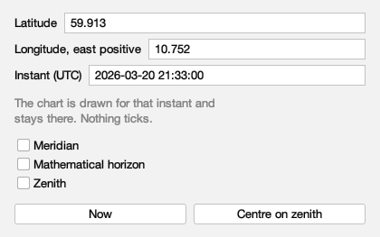

Packed 420 × 263 px, `en`.

| channel | words |
|---|---|
| window title | Place and Time |
| window, spoken | Set where you are and the frozen instant the reference lines are drawn for |
| shown or hovered | Latitude |
| shown or hovered | 59.913 |
| shown or hovered | Degrees north of the equator, e.g. 59.913; south is negative, -90 to 90 |
| shown or hovered | Longitude, east positive |
| shown or hovered | 10.752 |
| shown or hovered | Degrees east of Greenwich, e.g. 10.752; west is negative |
| shown or hovered | Instant (UTC) |
| shown or hovered | 2026-03-20 21:33:00 |
| shown or hovered | The moment the lines are drawn for, as 2026-03-20 21:33:00 |
| shown or hovered | The chart is drawn for that instant and stays there. Nothing ticks. |
| shown or hovered | Meridian |
| shown or hovered | Draw the great circle through both celestial poles and your zenith (⌘K then R) |
| shown or hovered | Mathematical horizon |
| shown or hovered | Draw where the sky meets a perfectly flat, transparent Earth (⌘K then H) |
| shown or hovered | Zenith |
| shown or hovered | Mark the point overhead |
| shown or hovered | Now |
| shown or hovered | Reads the clock once and freezes the chart at that instant |
| shown or hovered | Centre on zenith |
| shown or hovered | Move the chart to the point overhead |
| spoken | Latitude |
| spoken | Degrees north of the equator, negative south, -90 to 90 |
| spoken | Longitude, east positive |
| spoken | Degrees east of Greenwich; west is negative |
| spoken | Instant (UTC) |
| spoken | The instant used to draw the reference lines. Time does not advance until you change it. |
| spoken | The chart is drawn for that instant and stays there. Nothing ticks. |
| spoken | Show Meridian |
| spoken | Draws the line that runs from due north, through the point overhead, to due south. It lasts as long as this session. |
| spoken | Show Mathematical horizon |
| spoken | Draws the circle where the sky would meet a flat and transparent Earth; your own horizon has hills and air in it. It lasts as long as this session. |
| spoken | Show Zenith |
| spoken | Marks the point directly above you. It is drawn with the observer's lines and has no shortcut of its own. |
| spoken | Now |
| spoken | Freezes the reference lines at the present moment. The clock is read once; nothing moves afterwards. |
| spoken | Centre on zenith |
| spoken | Moves the page to the point directly above you. This is the only control in this window that moves the chart. |
| access letters | L G U M H Z N C |

### Every line on

All three set, the zenith included. The zenith has no keystroke of its own and its hover does not promise one: the chart keyboard refuses it deliberately (#312), and a tooltip offering a key would be a promise that decision does not make.

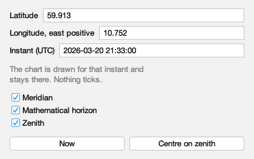

Packed 420 × 263 px, `en`.

| channel | words |
|---|---|
| window title | Place and Time |
| window, spoken | Set where you are and the frozen instant the reference lines are drawn for |
| shown or hovered | Latitude |
| shown or hovered | 59.913 |
| shown or hovered | Degrees north of the equator, e.g. 59.913; south is negative, -90 to 90 |
| shown or hovered | Longitude, east positive |
| shown or hovered | 10.752 |
| shown or hovered | Degrees east of Greenwich, e.g. 10.752; west is negative |
| shown or hovered | Instant (UTC) |
| shown or hovered | 2026-03-20 21:33:00 |
| shown or hovered | The moment the lines are drawn for, as 2026-03-20 21:33:00 |
| shown or hovered | The chart is drawn for that instant and stays there. Nothing ticks. |
| shown or hovered | Meridian |
| shown or hovered | Draw the great circle through both celestial poles and your zenith (⌘K then R) |
| shown or hovered | Mathematical horizon |
| shown or hovered | Draw where the sky meets a perfectly flat, transparent Earth (⌘K then H) |
| shown or hovered | Zenith |
| shown or hovered | Mark the point overhead |
| shown or hovered | Now |
| shown or hovered | Reads the clock once and freezes the chart at that instant |
| shown or hovered | Centre on zenith |
| shown or hovered | Move the chart to the point overhead |
| spoken | Latitude |
| spoken | Degrees north of the equator, negative south, -90 to 90 |
| spoken | Longitude, east positive |
| spoken | Degrees east of Greenwich; west is negative |
| spoken | Instant (UTC) |
| spoken | The instant used to draw the reference lines. Time does not advance until you change it. |
| spoken | The chart is drawn for that instant and stays there. Nothing ticks. |
| spoken | Show Meridian |
| spoken | Draws the line that runs from due north, through the point overhead, to due south. It lasts as long as this session. |
| spoken | Show Mathematical horizon |
| spoken | Draws the circle where the sky would meet a flat and transparent Earth; your own horizon has hills and air in it. It lasts as long as this session. |
| spoken | Show Zenith |
| spoken | Marks the point directly above you. It is drawn with the observer's lines and has no shortcut of its own. |
| spoken | Now |
| spoken | Freezes the reference lines at the present moment. The clock is read once; nothing moves afterwards. |
| spoken | Centre on zenith |
| spoken | Moves the page to the point directly above you. This is the only control in this window that moves the chart. |
| access letters | L G U M H Z N C |

### The frozen note, dark

The one sentence here a reader can only
read. It is quiet **visually** and not
quiet to a screen reader: `setEnabled(false)`
announced it as unavailable, so the weight
now comes from the theme's own subdued
colour, which is resolved per theme. A
colour written down once would be right in
one theme and wrong in the other, and the
Norwegian sentence is longer than the
English one - so it is worth seeing wrapped
in the palette where low contrast is
easiest to get wrong.

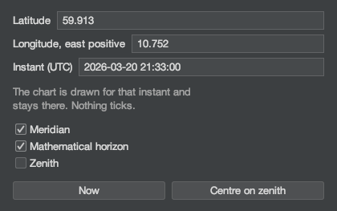

Packed 420 × 263 px, `en`.

| channel | words |
|---|---|
| window title | Place and Time |
| window, spoken | Set where you are and the frozen instant the reference lines are drawn for |
| shown or hovered | Latitude |
| shown or hovered | 59.913 |
| shown or hovered | Degrees north of the equator, e.g. 59.913; south is negative, -90 to 90 |
| shown or hovered | Longitude, east positive |
| shown or hovered | 10.752 |
| shown or hovered | Degrees east of Greenwich, e.g. 10.752; west is negative |
| shown or hovered | Instant (UTC) |
| shown or hovered | 2026-03-20 21:33:00 |
| shown or hovered | The moment the lines are drawn for, as 2026-03-20 21:33:00 |
| shown or hovered | The chart is drawn for that instant and stays there. Nothing ticks. |
| shown or hovered | Meridian |
| shown or hovered | Draw the great circle through both celestial poles and your zenith (⌘K then R) |
| shown or hovered | Mathematical horizon |
| shown or hovered | Draw where the sky meets a perfectly flat, transparent Earth (⌘K then H) |
| shown or hovered | Zenith |
| shown or hovered | Mark the point overhead |
| shown or hovered | Now |
| shown or hovered | Reads the clock once and freezes the chart at that instant |
| shown or hovered | Centre on zenith |
| shown or hovered | Move the chart to the point overhead |
| spoken | Latitude |
| spoken | Degrees north of the equator, negative south, -90 to 90 |
| spoken | Longitude, east positive |
| spoken | Degrees east of Greenwich; west is negative |
| spoken | Instant (UTC) |
| spoken | The instant used to draw the reference lines. Time does not advance until you change it. |
| spoken | The chart is drawn for that instant and stays there. Nothing ticks. |
| spoken | Show Meridian |
| spoken | Draws the line that runs from due north, through the point overhead, to due south. It lasts as long as this session. |
| spoken | Show Mathematical horizon |
| spoken | Draws the circle where the sky would meet a flat and transparent Earth; your own horizon has hills and air in it. It lasts as long as this session. |
| spoken | Show Zenith |
| spoken | Marks the point directly above you. It is drawn with the observer's lines and has no shortcut of its own. |
| spoken | Now |
| spoken | Freezes the reference lines at the present moment. The clock is read once; nothing moves afterwards. |
| spoken | Centre on zenith |
| spoken | Moves the page to the point directly above you. This is the only control in this window that moves the chart. |
| access letters | L G U M H Z N C |

#### The eight access letters

| control | word shown | letter |
|---|---|---|
| `placeandtime.latitude` | Latitude | L |
| `placeandtime.longitude` | Longitude, east positive | G |
| `placeandtime.instant` | Instant (UTC) | U |
| `placeandtime.meridian` | Meridian | M |
| `placeandtime.horizon` | Mathematical horizon | H |
| `placeandtime.zenith` | Zenith | Z |
| `placeandtime.now` | Now | N |
| `placeandtime.centre` | Centre on zenith | C |

#### Not shown, because it does not exist

A coordinate field that cannot parse what was typed
**reverts to its last good value and says nothing**.
No picture of a refusal appears above, because the
application does not draw one; staging a mock-up of a
message nobody has written would put a promise in the
evidence that is not in the atlas. It is recorded as a
separate issue, not resolved here.

## Norsk bokmål (`nb-NO`)

### Nothing remembered

The released default: the equator at Greenwich. Neutral, and honest about being nobody's home. Both coordinates read zero, which is the one place a sign convention cannot be seen - which is why the next two states exist.

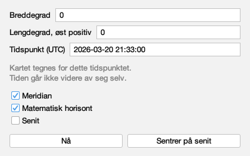

Packed 420 × 263 px, `nb-NO`.

| channel | words |
|---|---|
| window title | Sted og tid |
| window, spoken | Angi hvor du er, og hvilket tidspunkt referanselinjene skal tegnes for |
| shown or hovered | Breddegrad |
| shown or hovered | 0 |
| shown or hovered | Grader nord for ekvator, f.eks. 59.913; sørlige breddegrader er negative, -90 til 90 |
| shown or hovered | Lengdegrad, øst positiv |
| shown or hovered | Grader øst for Greenwich, f.eks. 10.752; vestlige lengdegrader er negative |
| shown or hovered | Tidspunkt (UTC) |
| shown or hovered | 2026-03-20 21:33:00 |
| shown or hovered | Tidspunktet linjene tegnes for, som 2026-03-20 21:33:00 |
| shown or hovered | Kartet tegnes for dette tidspunktet. Tiden går ikke videre av seg selv. |
| shown or hovered | Meridian |
| shown or hovered | Tegn storsirkelen gjennom begge himmelpolene og senit (⌘K deretter R) |
| shown or hovered | Matematisk horisont |
| shown or hovered | Tegn der himmelen møter en helt flat og gjennomsiktig jord (⌘K deretter H) |
| shown or hovered | Senit |
| shown or hovered | Marker punktet rett over deg |
| shown or hovered | Nå |
| shown or hovered | Les klokken én gang og sett kartets tidspunkt til nå |
| shown or hovered | Sentrer på senit |
| shown or hovered | Flytt kartet til punktet rett over deg |
| spoken | Breddegrad |
| spoken | Grader nord for ekvator; sørlige breddegrader er negative, -90 til 90 |
| spoken | Lengdegrad, øst positiv |
| spoken | Grader øst for Greenwich; vestlige lengdegrader er negative |
| spoken | Tidspunkt (UTC) |
| spoken | Tidspunktet som brukes til å tegne referanselinjene. Tiden går ikke videre før du endrer tidspunktet. |
| spoken | Kartet tegnes for dette tidspunktet. Tiden går ikke videre av seg selv. |
| spoken | Vis meridianen |
| spoken | Tegner linjen som går fra rett nord, gjennom punktet rett over deg, til rett sør. Valget gjelder ut denne økten. |
| spoken | Vis matematisk horisont |
| spoken | Tegner sirkelen der himmelen ville ha møtt en flat og gjennomsiktig jord; din egen horisont har åser og luft i seg. Valget gjelder ut denne økten. |
| spoken | Vis senit |
| spoken | Markerer punktet rett over deg. Det tegnes sammen med observatørens linjer og har ingen egen hurtigtast. |
| spoken | Nå |
| spoken | Tegner referanselinjene for tidspunktet nå. Klokken leses én gang; tiden går ikke videre etterpå. |
| spoken | Sentrer på senit |
| spoken | Flytter siden til punktet rett over deg. Dette er den eneste knappen i dette vinduet som flytter kartet. |
| access letters | B L T M H S N R |

### Oslo — north and east

East longitude is positive. The number and its sign are notation and are identical in both languages; only the words around them change.

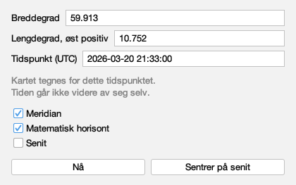

Packed 420 × 263 px, `nb-NO`.

| channel | words |
|---|---|
| window title | Sted og tid |
| window, spoken | Angi hvor du er, og hvilket tidspunkt referanselinjene skal tegnes for |
| shown or hovered | Breddegrad |
| shown or hovered | 59.913 |
| shown or hovered | Grader nord for ekvator, f.eks. 59.913; sørlige breddegrader er negative, -90 til 90 |
| shown or hovered | Lengdegrad, øst positiv |
| shown or hovered | 10.752 |
| shown or hovered | Grader øst for Greenwich, f.eks. 10.752; vestlige lengdegrader er negative |
| shown or hovered | Tidspunkt (UTC) |
| shown or hovered | 2026-03-20 21:33:00 |
| shown or hovered | Tidspunktet linjene tegnes for, som 2026-03-20 21:33:00 |
| shown or hovered | Kartet tegnes for dette tidspunktet. Tiden går ikke videre av seg selv. |
| shown or hovered | Meridian |
| shown or hovered | Tegn storsirkelen gjennom begge himmelpolene og senit (⌘K deretter R) |
| shown or hovered | Matematisk horisont |
| shown or hovered | Tegn der himmelen møter en helt flat og gjennomsiktig jord (⌘K deretter H) |
| shown or hovered | Senit |
| shown or hovered | Marker punktet rett over deg |
| shown or hovered | Nå |
| shown or hovered | Les klokken én gang og sett kartets tidspunkt til nå |
| shown or hovered | Sentrer på senit |
| shown or hovered | Flytt kartet til punktet rett over deg |
| spoken | Breddegrad |
| spoken | Grader nord for ekvator; sørlige breddegrader er negative, -90 til 90 |
| spoken | Lengdegrad, øst positiv |
| spoken | Grader øst for Greenwich; vestlige lengdegrader er negative |
| spoken | Tidspunkt (UTC) |
| spoken | Tidspunktet som brukes til å tegne referanselinjene. Tiden går ikke videre før du endrer tidspunktet. |
| spoken | Kartet tegnes for dette tidspunktet. Tiden går ikke videre av seg selv. |
| spoken | Vis meridianen |
| spoken | Tegner linjen som går fra rett nord, gjennom punktet rett over deg, til rett sør. Valget gjelder ut denne økten. |
| spoken | Vis matematisk horisont |
| spoken | Tegner sirkelen der himmelen ville ha møtt en flat og gjennomsiktig jord; din egen horisont har åser og luft i seg. Valget gjelder ut denne økten. |
| spoken | Vis senit |
| spoken | Markerer punktet rett over deg. Det tegnes sammen med observatørens linjer og har ingen egen hurtigtast. |
| spoken | Nå |
| spoken | Tegner referanselinjene for tidspunktet nå. Klokken leses én gang; tiden går ikke videre etterpå. |
| spoken | Sentrer på senit |
| spoken | Flytter siden til punktet rett over deg. Dette er den eneste knappen i dette vinduet som flytter kartet. |
| access letters | B L T M H S N R |

### Santiago — south and west

South latitude and west longitude are negative. A translation that rendered a minus sign differently would put a reader on the wrong side of the planet, so it does not: the field round-trips through Locale.ROOT.

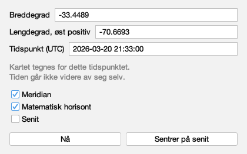

Packed 420 × 263 px, `nb-NO`.

| channel | words |
|---|---|
| window title | Sted og tid |
| window, spoken | Angi hvor du er, og hvilket tidspunkt referanselinjene skal tegnes for |
| shown or hovered | Breddegrad |
| shown or hovered | -33.4489 |
| shown or hovered | Grader nord for ekvator, f.eks. 59.913; sørlige breddegrader er negative, -90 til 90 |
| shown or hovered | Lengdegrad, øst positiv |
| shown or hovered | -70.6693 |
| shown or hovered | Grader øst for Greenwich, f.eks. 10.752; vestlige lengdegrader er negative |
| shown or hovered | Tidspunkt (UTC) |
| shown or hovered | 2026-03-20 21:33:00 |
| shown or hovered | Tidspunktet linjene tegnes for, som 2026-03-20 21:33:00 |
| shown or hovered | Kartet tegnes for dette tidspunktet. Tiden går ikke videre av seg selv. |
| shown or hovered | Meridian |
| shown or hovered | Tegn storsirkelen gjennom begge himmelpolene og senit (⌘K deretter R) |
| shown or hovered | Matematisk horisont |
| shown or hovered | Tegn der himmelen møter en helt flat og gjennomsiktig jord (⌘K deretter H) |
| shown or hovered | Senit |
| shown or hovered | Marker punktet rett over deg |
| shown or hovered | Nå |
| shown or hovered | Les klokken én gang og sett kartets tidspunkt til nå |
| shown or hovered | Sentrer på senit |
| shown or hovered | Flytt kartet til punktet rett over deg |
| spoken | Breddegrad |
| spoken | Grader nord for ekvator; sørlige breddegrader er negative, -90 til 90 |
| spoken | Lengdegrad, øst positiv |
| spoken | Grader øst for Greenwich; vestlige lengdegrader er negative |
| spoken | Tidspunkt (UTC) |
| spoken | Tidspunktet som brukes til å tegne referanselinjene. Tiden går ikke videre før du endrer tidspunktet. |
| spoken | Kartet tegnes for dette tidspunktet. Tiden går ikke videre av seg selv. |
| spoken | Vis meridianen |
| spoken | Tegner linjen som går fra rett nord, gjennom punktet rett over deg, til rett sør. Valget gjelder ut denne økten. |
| spoken | Vis matematisk horisont |
| spoken | Tegner sirkelen der himmelen ville ha møtt en flat og gjennomsiktig jord; din egen horisont har åser og luft i seg. Valget gjelder ut denne økten. |
| spoken | Vis senit |
| spoken | Markerer punktet rett over deg. Det tegnes sammen med observatørens linjer og har ingen egen hurtigtast. |
| spoken | Nå |
| spoken | Tegner referanselinjene for tidspunktet nå. Klokken leses én gang; tiden går ikke videre etterpå. |
| spoken | Sentrer på senit |
| spoken | Flytter siden til punktet rett over deg. Dette er den eneste knappen i dette vinduet som flytter kartet. |
| access letters | B L T M H S N R |

### Every line off

All three switches clear. The words do not change with the switch - a checkbox says what it would draw, not what it is drawing.

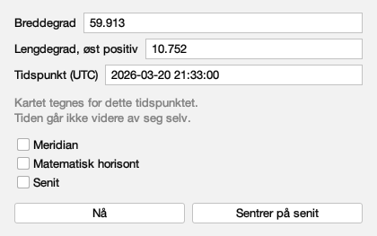

Packed 420 × 263 px, `nb-NO`.

| channel | words |
|---|---|
| window title | Sted og tid |
| window, spoken | Angi hvor du er, og hvilket tidspunkt referanselinjene skal tegnes for |
| shown or hovered | Breddegrad |
| shown or hovered | 59.913 |
| shown or hovered | Grader nord for ekvator, f.eks. 59.913; sørlige breddegrader er negative, -90 til 90 |
| shown or hovered | Lengdegrad, øst positiv |
| shown or hovered | 10.752 |
| shown or hovered | Grader øst for Greenwich, f.eks. 10.752; vestlige lengdegrader er negative |
| shown or hovered | Tidspunkt (UTC) |
| shown or hovered | 2026-03-20 21:33:00 |
| shown or hovered | Tidspunktet linjene tegnes for, som 2026-03-20 21:33:00 |
| shown or hovered | Kartet tegnes for dette tidspunktet. Tiden går ikke videre av seg selv. |
| shown or hovered | Meridian |
| shown or hovered | Tegn storsirkelen gjennom begge himmelpolene og senit (⌘K deretter R) |
| shown or hovered | Matematisk horisont |
| shown or hovered | Tegn der himmelen møter en helt flat og gjennomsiktig jord (⌘K deretter H) |
| shown or hovered | Senit |
| shown or hovered | Marker punktet rett over deg |
| shown or hovered | Nå |
| shown or hovered | Les klokken én gang og sett kartets tidspunkt til nå |
| shown or hovered | Sentrer på senit |
| shown or hovered | Flytt kartet til punktet rett over deg |
| spoken | Breddegrad |
| spoken | Grader nord for ekvator; sørlige breddegrader er negative, -90 til 90 |
| spoken | Lengdegrad, øst positiv |
| spoken | Grader øst for Greenwich; vestlige lengdegrader er negative |
| spoken | Tidspunkt (UTC) |
| spoken | Tidspunktet som brukes til å tegne referanselinjene. Tiden går ikke videre før du endrer tidspunktet. |
| spoken | Kartet tegnes for dette tidspunktet. Tiden går ikke videre av seg selv. |
| spoken | Vis meridianen |
| spoken | Tegner linjen som går fra rett nord, gjennom punktet rett over deg, til rett sør. Valget gjelder ut denne økten. |
| spoken | Vis matematisk horisont |
| spoken | Tegner sirkelen der himmelen ville ha møtt en flat og gjennomsiktig jord; din egen horisont har åser og luft i seg. Valget gjelder ut denne økten. |
| spoken | Vis senit |
| spoken | Markerer punktet rett over deg. Det tegnes sammen med observatørens linjer og har ingen egen hurtigtast. |
| spoken | Nå |
| spoken | Tegner referanselinjene for tidspunktet nå. Klokken leses én gang; tiden går ikke videre etterpå. |
| spoken | Sentrer på senit |
| spoken | Flytter siden til punktet rett over deg. Dette er den eneste knappen i dette vinduet som flytter kartet. |
| access letters | B L T M H S N R |

### Every line on

All three set, the zenith included. The zenith has no keystroke of its own and its hover does not promise one: the chart keyboard refuses it deliberately (#312), and a tooltip offering a key would be a promise that decision does not make.

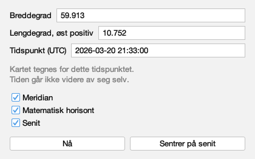

Packed 420 × 263 px, `nb-NO`.

| channel | words |
|---|---|
| window title | Sted og tid |
| window, spoken | Angi hvor du er, og hvilket tidspunkt referanselinjene skal tegnes for |
| shown or hovered | Breddegrad |
| shown or hovered | 59.913 |
| shown or hovered | Grader nord for ekvator, f.eks. 59.913; sørlige breddegrader er negative, -90 til 90 |
| shown or hovered | Lengdegrad, øst positiv |
| shown or hovered | 10.752 |
| shown or hovered | Grader øst for Greenwich, f.eks. 10.752; vestlige lengdegrader er negative |
| shown or hovered | Tidspunkt (UTC) |
| shown or hovered | 2026-03-20 21:33:00 |
| shown or hovered | Tidspunktet linjene tegnes for, som 2026-03-20 21:33:00 |
| shown or hovered | Kartet tegnes for dette tidspunktet. Tiden går ikke videre av seg selv. |
| shown or hovered | Meridian |
| shown or hovered | Tegn storsirkelen gjennom begge himmelpolene og senit (⌘K deretter R) |
| shown or hovered | Matematisk horisont |
| shown or hovered | Tegn der himmelen møter en helt flat og gjennomsiktig jord (⌘K deretter H) |
| shown or hovered | Senit |
| shown or hovered | Marker punktet rett over deg |
| shown or hovered | Nå |
| shown or hovered | Les klokken én gang og sett kartets tidspunkt til nå |
| shown or hovered | Sentrer på senit |
| shown or hovered | Flytt kartet til punktet rett over deg |
| spoken | Breddegrad |
| spoken | Grader nord for ekvator; sørlige breddegrader er negative, -90 til 90 |
| spoken | Lengdegrad, øst positiv |
| spoken | Grader øst for Greenwich; vestlige lengdegrader er negative |
| spoken | Tidspunkt (UTC) |
| spoken | Tidspunktet som brukes til å tegne referanselinjene. Tiden går ikke videre før du endrer tidspunktet. |
| spoken | Kartet tegnes for dette tidspunktet. Tiden går ikke videre av seg selv. |
| spoken | Vis meridianen |
| spoken | Tegner linjen som går fra rett nord, gjennom punktet rett over deg, til rett sør. Valget gjelder ut denne økten. |
| spoken | Vis matematisk horisont |
| spoken | Tegner sirkelen der himmelen ville ha møtt en flat og gjennomsiktig jord; din egen horisont har åser og luft i seg. Valget gjelder ut denne økten. |
| spoken | Vis senit |
| spoken | Markerer punktet rett over deg. Det tegnes sammen med observatørens linjer og har ingen egen hurtigtast. |
| spoken | Nå |
| spoken | Tegner referanselinjene for tidspunktet nå. Klokken leses én gang; tiden går ikke videre etterpå. |
| spoken | Sentrer på senit |
| spoken | Flytter siden til punktet rett over deg. Dette er den eneste knappen i dette vinduet som flytter kartet. |
| access letters | B L T M H S N R |

### The frozen note, dark

The one sentence here a reader can only
read. It is quiet **visually** and not
quiet to a screen reader: `setEnabled(false)`
announced it as unavailable, so the weight
now comes from the theme's own subdued
colour, which is resolved per theme. A
colour written down once would be right in
one theme and wrong in the other, and the
Norwegian sentence is longer than the
English one - so it is worth seeing wrapped
in the palette where low contrast is
easiest to get wrong.

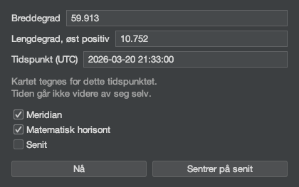

Packed 420 × 263 px, `nb-NO`.

| channel | words |
|---|---|
| window title | Sted og tid |
| window, spoken | Angi hvor du er, og hvilket tidspunkt referanselinjene skal tegnes for |
| shown or hovered | Breddegrad |
| shown or hovered | 59.913 |
| shown or hovered | Grader nord for ekvator, f.eks. 59.913; sørlige breddegrader er negative, -90 til 90 |
| shown or hovered | Lengdegrad, øst positiv |
| shown or hovered | 10.752 |
| shown or hovered | Grader øst for Greenwich, f.eks. 10.752; vestlige lengdegrader er negative |
| shown or hovered | Tidspunkt (UTC) |
| shown or hovered | 2026-03-20 21:33:00 |
| shown or hovered | Tidspunktet linjene tegnes for, som 2026-03-20 21:33:00 |
| shown or hovered | Kartet tegnes for dette tidspunktet. Tiden går ikke videre av seg selv. |
| shown or hovered | Meridian |
| shown or hovered | Tegn storsirkelen gjennom begge himmelpolene og senit (⌘K deretter R) |
| shown or hovered | Matematisk horisont |
| shown or hovered | Tegn der himmelen møter en helt flat og gjennomsiktig jord (⌘K deretter H) |
| shown or hovered | Senit |
| shown or hovered | Marker punktet rett over deg |
| shown or hovered | Nå |
| shown or hovered | Les klokken én gang og sett kartets tidspunkt til nå |
| shown or hovered | Sentrer på senit |
| shown or hovered | Flytt kartet til punktet rett over deg |
| spoken | Breddegrad |
| spoken | Grader nord for ekvator; sørlige breddegrader er negative, -90 til 90 |
| spoken | Lengdegrad, øst positiv |
| spoken | Grader øst for Greenwich; vestlige lengdegrader er negative |
| spoken | Tidspunkt (UTC) |
| spoken | Tidspunktet som brukes til å tegne referanselinjene. Tiden går ikke videre før du endrer tidspunktet. |
| spoken | Kartet tegnes for dette tidspunktet. Tiden går ikke videre av seg selv. |
| spoken | Vis meridianen |
| spoken | Tegner linjen som går fra rett nord, gjennom punktet rett over deg, til rett sør. Valget gjelder ut denne økten. |
| spoken | Vis matematisk horisont |
| spoken | Tegner sirkelen der himmelen ville ha møtt en flat og gjennomsiktig jord; din egen horisont har åser og luft i seg. Valget gjelder ut denne økten. |
| spoken | Vis senit |
| spoken | Markerer punktet rett over deg. Det tegnes sammen med observatørens linjer og har ingen egen hurtigtast. |
| spoken | Nå |
| spoken | Tegner referanselinjene for tidspunktet nå. Klokken leses én gang; tiden går ikke videre etterpå. |
| spoken | Sentrer på senit |
| spoken | Flytter siden til punktet rett over deg. Dette er den eneste knappen i dette vinduet som flytter kartet. |
| access letters | B L T M H S N R |

#### The eight access letters

| control | word shown | letter |
|---|---|---|
| `placeandtime.latitude` | Breddegrad | B |
| `placeandtime.longitude` | Lengdegrad, øst positiv | L |
| `placeandtime.instant` | Tidspunkt (UTC) | T |
| `placeandtime.meridian` | Meridian | M |
| `placeandtime.horizon` | Matematisk horisont | H |
| `placeandtime.zenith` | Senit | S |
| `placeandtime.now` | Nå | N |
| `placeandtime.centre` | Sentrer på senit | R |

#### Not shown, because it does not exist

A coordinate field that cannot parse what was typed
**reverts to its last good value and says nothing**.
No picture of a refusal appears above, because the
application does not draw one; staging a mock-up of a
message nobody has written would put a promise in the
evidence that is not in the atlas. It is recorded as a
separate issue, not resolved here.

