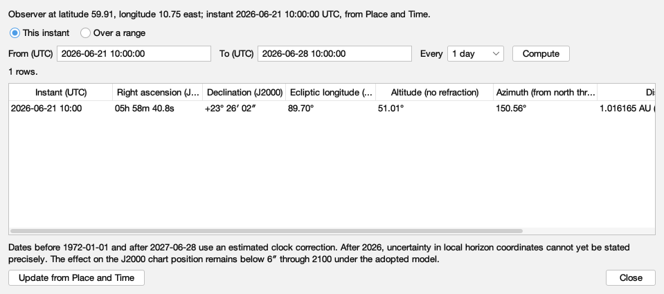
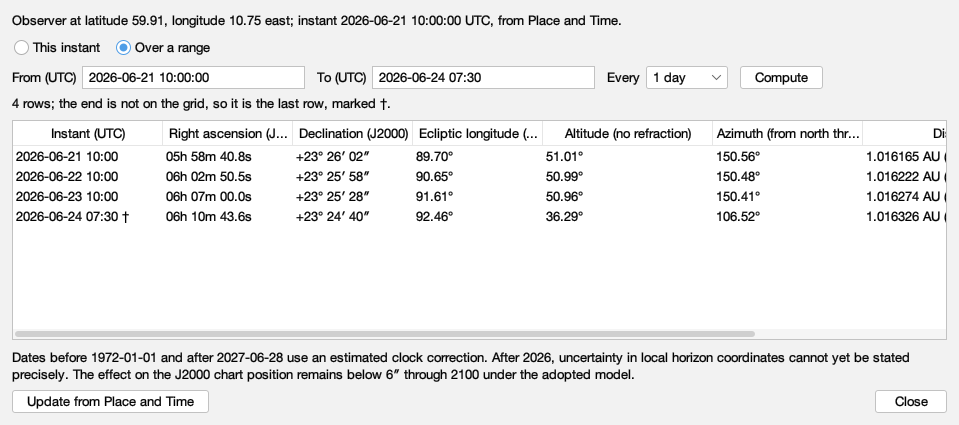
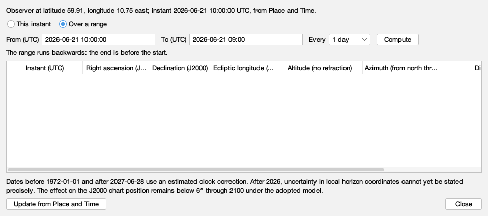
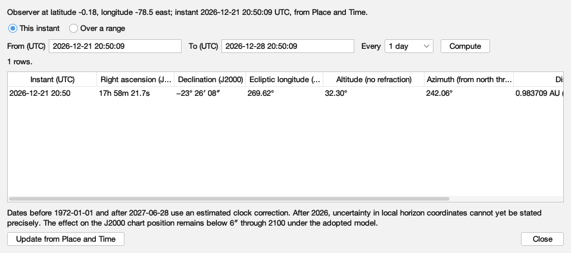
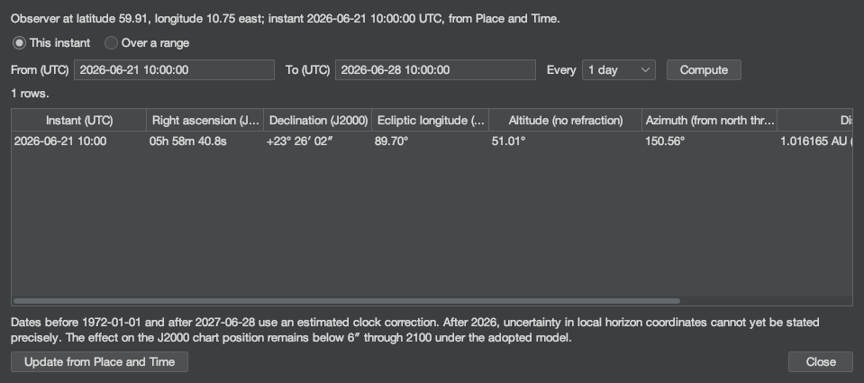
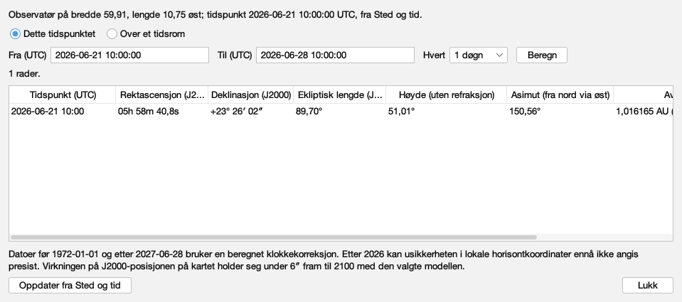
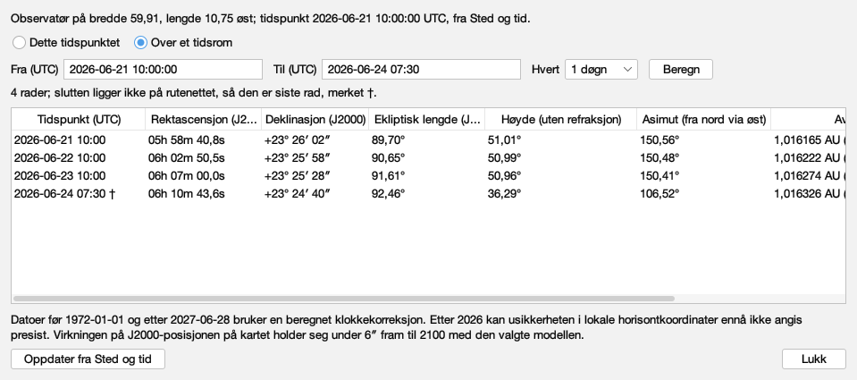
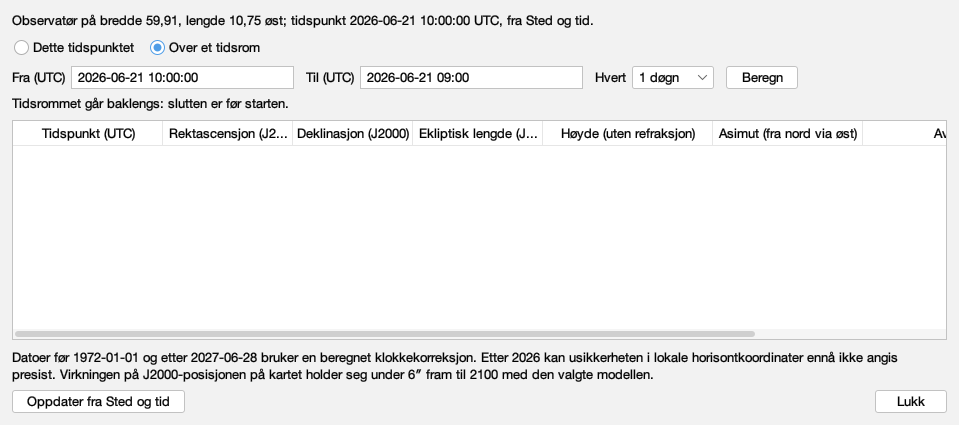
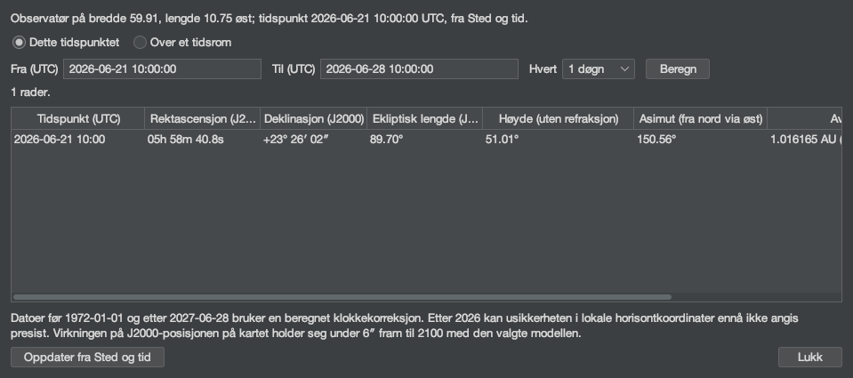

# Every word the Sun table says

Issue #400. Generated by `juranometria.tool.SunTableSheetMain`
from compiled application classes and their classpath
resources, over the bundled Solar System pack. Packaged
acceptance separately verifies that the pack and the
interface language resources ship in the application image.

**Norsk bokmål — reviewed.** A person who reads the language has been through these surfaces and said these are the words an atlas should use. This is linguistic judgement, not corroboration against a source: unlike the constellation names next door, these are original translations written for this application and there is no citation to check them against. Recorded in `nb-NO.manifest`, and read from there rather than written here.

## The window, not a panel

Each capture is the production dialog built through
`SunTableDialog.packedForStudy`, which has no "English if
omitted" overload. The title and the window description are
read from the `JDialog` itself; every shown, hovered and
spoken string is walked from the content; the column
headings' explanations, which a screen reader hears and a
hover shows, are listed from the model.

## What is translated here, and what is not

Every number is notation: right ascension, declination,
degrees, distance, diameter and the instant are formatted
in `Locale.ROOT` by `SunTableFormat` and are identical in
both languages, because a value must parse if a reader
carries it into Place and Time. The words are the
language's: the headings, the status line, the refusals,
and the status below the horizon. Access letters are
language too, and no two controls share one.

## English (`en`)

### One instant, Oslo at midsummer

The fresh state: a single row at the instant Place and Time holds. The Sun stands 51° high to the south-east.

Packed 959 × 425 px.

| shown, hovered or spoken |
|---|
| The Sun |
| Where the Sun is, computed from the bundled ephemeris for the observing place and instant set in Place and Time: its position among the fixed stars, its height and direction above the mathematical horizon, its distance and how large it looks. One row for that instant, or a row for every step of a range. Nothing is drawn on the chart. |
| Observer at latitude 59.91, longitude 10.75 east; instant 2026-06-21 10:00:00 UTC, from Place and Time. |
| This instant |
| One row, at the instant set in Place and Time |
| Show the Sun at the instant set in Place and Time |
| Shows a single row: the Sun at the observing instant set in Place and Time. |
| Over a range |
| A row for every step from a start to an end |
| Show the Sun over a range of instants |
| Shows a row for every step from the start to the end, both included; an end that is not on the grid is added as the last row and marked. |
| From (UTC) |
| yyyy-mm-dd hh:mm or hh:mm:ss, in UTC |
| The first instant of the range, in UTC. Starts at the instant set in Place and Time. |
| To (UTC) |
| The last instant of the range, in UTC, included; if it is not on the grid it is added as the last row and marked. |
| Every |
| 1 hour |
| 6 hours |
| 1 day |
| 7 days |
| 30 days |
| The elapsed time between rows |
| Step between rows |
| The elapsed time between rows, on the UTC timeline, so a daily range does not drift across a change of civil clock. |
| Compute |
| Fill the table for the range above |
| Compute the range |
| Computes a row for every step of the range above. |
| 1 rows. |
| Instant (UTC) |
| Right ascension (J2000) |
| Declination (J2000) |
| Ecliptic longitude (J2000) |
| Altitude (no refraction) |
| Azimuth (from north through east) |
| Distance |
| Apparent diameter |
| 2026-06-21 10:00 · 05h 58m 40.8s · +23° 26′ 02″ · 89.70° · 51.01° · 150.56° · 1.016165 AU (152.016 mill. km) · 31′ 27.9″ |
| The Sun's computed quantities |
| Each row is one instant. The columns are the instant in UTC; right ascension and declination in the J2000 frame the chart is drawn in; ecliptic longitude on the J2000 ecliptic; altitude above the mathematical horizon and azimuth from north through east, without refraction; distance from the observer; and the apparent diameter of the disc. |
| Dates before 1972-01-01 and after 2027-06-28 use an estimated clock correction. After 2026, uncertainty in local horizon coordinates cannot yet be stated precisely. The effect on the J2000 chart position remains below 6″ through 2100 under the adopted model. |
| Update from Place and Time |
| Read the place and instant from Place and Time again |
| Read the observer and instant from Place and Time again |
| Reads the observing place and instant from Place and Time again and recomputes. The table also does this when it opens and whenever it comes to the front. |
| Close |
| Close the Sun table |
| Closes the table. Nothing is changed or remembered; Place and Time keeps the place and instant. |

### A range with an appended end

Daily rows from the instant, and an end that is not on the grid, added last and marked †. The status line says so.

Packed 959 × 425 px.

| shown, hovered or spoken |
|---|
| The Sun |
| Where the Sun is, computed from the bundled ephemeris for the observing place and instant set in Place and Time: its position among the fixed stars, its height and direction above the mathematical horizon, its distance and how large it looks. One row for that instant, or a row for every step of a range. Nothing is drawn on the chart. |
| Observer at latitude 59.91, longitude 10.75 east; instant 2026-06-21 10:00:00 UTC, from Place and Time. |
| This instant |
| One row, at the instant set in Place and Time |
| Show the Sun at the instant set in Place and Time |
| Shows a single row: the Sun at the observing instant set in Place and Time. |
| Over a range |
| A row for every step from a start to an end |
| Show the Sun over a range of instants |
| Shows a row for every step from the start to the end, both included; an end that is not on the grid is added as the last row and marked. |
| From (UTC) |
| yyyy-mm-dd hh:mm or hh:mm:ss, in UTC |
| The first instant of the range, in UTC. Starts at the instant set in Place and Time. |
| To (UTC) |
| The last instant of the range, in UTC, included; if it is not on the grid it is added as the last row and marked. |
| Every |
| 1 hour |
| 6 hours |
| 1 day |
| 7 days |
| 30 days |
| The elapsed time between rows |
| Step between rows |
| The elapsed time between rows, on the UTC timeline, so a daily range does not drift across a change of civil clock. |
| Compute |
| Fill the table for the range above |
| Compute the range |
| Computes a row for every step of the range above. |
| 4 rows; the end is not on the grid, so it is the last row, marked †. |
| Instant (UTC) |
| Right ascension (J2000) |
| Declination (J2000) |
| Ecliptic longitude (J2000) |
| Altitude (no refraction) |
| Azimuth (from north through east) |
| Distance |
| Apparent diameter |
| 2026-06-21 10:00 · 05h 58m 40.8s · +23° 26′ 02″ · 89.70° · 51.01° · 150.56° · 1.016165 AU (152.016 mill. km) · 31′ 27.9″ |
| 2026-06-22 10:00 · 06h 02m 50.5s · +23° 25′ 58″ · 90.65° · 50.99° · 150.48° · 1.016222 AU (152.025 mill. km) · 31′ 27.8″ |
| 2026-06-23 10:00 · 06h 07m 00.0s · +23° 25′ 28″ · 91.61° · 50.96° · 150.41° · 1.016274 AU (152.032 mill. km) · 31′ 27.7″ |
| 2026-06-24 07:30 † · 06h 10m 43.6s · +23° 24′ 40″ · 92.46° · 36.29° · 106.52° · 1.016326 AU (152.040 mill. km) · 31′ 27.6″ |
| The Sun's computed quantities |
| Each row is one instant. The columns are the instant in UTC; right ascension and declination in the J2000 frame the chart is drawn in; ecliptic longitude on the J2000 ecliptic; altitude above the mathematical horizon and azimuth from north through east, without refraction; distance from the observer; and the apparent diameter of the disc. |
| Dates before 1972-01-01 and after 2027-06-28 use an estimated clock correction. After 2026, uncertainty in local horizon coordinates cannot yet be stated precisely. The effect on the J2000 chart position remains below 6″ through 2100 under the adopted model. |
| Update from Place and Time |
| Read the place and instant from Place and Time again |
| Read the observer and instant from Place and Time again |
| Reads the observing place and instant from Place and Time again and recomputes. The table also does this when it opens and whenever it comes to the front. |
| Close |
| Close the Sun table |
| Closes the table. Nothing is changed or remembered; Place and Time keeps the place and instant. |

### A range that runs backwards

The end is before the start. The table is empty and the status line says why; nothing is guessed.

Packed 959 × 425 px.

| shown, hovered or spoken |
|---|
| The Sun |
| Where the Sun is, computed from the bundled ephemeris for the observing place and instant set in Place and Time: its position among the fixed stars, its height and direction above the mathematical horizon, its distance and how large it looks. One row for that instant, or a row for every step of a range. Nothing is drawn on the chart. |
| Observer at latitude 59.91, longitude 10.75 east; instant 2026-06-21 10:00:00 UTC, from Place and Time. |
| This instant |
| One row, at the instant set in Place and Time |
| Show the Sun at the instant set in Place and Time |
| Shows a single row: the Sun at the observing instant set in Place and Time. |
| Over a range |
| A row for every step from a start to an end |
| Show the Sun over a range of instants |
| Shows a row for every step from the start to the end, both included; an end that is not on the grid is added as the last row and marked. |
| From (UTC) |
| yyyy-mm-dd hh:mm or hh:mm:ss, in UTC |
| The first instant of the range, in UTC. Starts at the instant set in Place and Time. |
| To (UTC) |
| The last instant of the range, in UTC, included; if it is not on the grid it is added as the last row and marked. |
| Every |
| 1 hour |
| 6 hours |
| 1 day |
| 7 days |
| 30 days |
| The elapsed time between rows |
| Step between rows |
| The elapsed time between rows, on the UTC timeline, so a daily range does not drift across a change of civil clock. |
| Compute |
| Fill the table for the range above |
| Compute the range |
| Computes a row for every step of the range above. |
| The range runs backwards: the end is before the start. |
| Instant (UTC) |
| Right ascension (J2000) |
| Declination (J2000) |
| Ecliptic longitude (J2000) |
| Altitude (no refraction) |
| Azimuth (from north through east) |
| Distance |
| Apparent diameter |
| The Sun's computed quantities |
| Each row is one instant. The columns are the instant in UTC; right ascension and declination in the J2000 frame the chart is drawn in; ecliptic longitude on the J2000 ecliptic; altitude above the mathematical horizon and azimuth from north through east, without refraction; distance from the observer; and the apparent diameter of the disc. |
| Dates before 1972-01-01 and after 2027-06-28 use an estimated clock correction. After 2026, uncertainty in local horizon coordinates cannot yet be stated precisely. The effect on the J2000 chart position remains below 6″ through 2100 under the adopted model. |
| Update from Place and Time |
| Read the place and instant from Place and Time again |
| Read the observer and instant from Place and Time again |
| Reads the observing place and instant from Place and Time again and recomputes. The table also does this when it opens and whenever it comes to the front. |
| Close |
| Close the Sun table |
| Closes the table. Nothing is changed or remembered; Place and Time keeps the place and instant. |

### Quito at the December solstice

An equatorial observer at the IMCCE's solstice instant: the Sun is up, 32° high; the instant is shown to the minute, rounded.

Packed 959 × 425 px.

| shown, hovered or spoken |
|---|
| The Sun |
| Where the Sun is, computed from the bundled ephemeris for the observing place and instant set in Place and Time: its position among the fixed stars, its height and direction above the mathematical horizon, its distance and how large it looks. One row for that instant, or a row for every step of a range. Nothing is drawn on the chart. |
| Observer at latitude -0.18, longitude -78.5 east; instant 2026-12-21 20:50:09 UTC, from Place and Time. |
| This instant |
| One row, at the instant set in Place and Time |
| Show the Sun at the instant set in Place and Time |
| Shows a single row: the Sun at the observing instant set in Place and Time. |
| Over a range |
| A row for every step from a start to an end |
| Show the Sun over a range of instants |
| Shows a row for every step from the start to the end, both included; an end that is not on the grid is added as the last row and marked. |
| From (UTC) |
| yyyy-mm-dd hh:mm or hh:mm:ss, in UTC |
| The first instant of the range, in UTC. Starts at the instant set in Place and Time. |
| To (UTC) |
| The last instant of the range, in UTC, included; if it is not on the grid it is added as the last row and marked. |
| Every |
| 1 hour |
| 6 hours |
| 1 day |
| 7 days |
| 30 days |
| The elapsed time between rows |
| Step between rows |
| The elapsed time between rows, on the UTC timeline, so a daily range does not drift across a change of civil clock. |
| Compute |
| Fill the table for the range above |
| Compute the range |
| Computes a row for every step of the range above. |
| 1 rows. |
| Instant (UTC) |
| Right ascension (J2000) |
| Declination (J2000) |
| Ecliptic longitude (J2000) |
| Altitude (no refraction) |
| Azimuth (from north through east) |
| Distance |
| Apparent diameter |
| 2026-12-21 20:50 · 17h 58m 21.7s · −23° 26′ 08″ · 269.62° · 32.30° · 242.06° · 0.983709 AU (147.161 mill. km) · 32′ 30.2″ |
| The Sun's computed quantities |
| Each row is one instant. The columns are the instant in UTC; right ascension and declination in the J2000 frame the chart is drawn in; ecliptic longitude on the J2000 ecliptic; altitude above the mathematical horizon and azimuth from north through east, without refraction; distance from the observer; and the apparent diameter of the disc. |
| Dates before 1972-01-01 and after 2027-06-28 use an estimated clock correction. After 2026, uncertainty in local horizon coordinates cannot yet be stated precisely. The effect on the J2000 chart position remains below 6″ through 2100 under the adopted model. |
| Update from Place and Time |
| Read the place and instant from Place and Time again |
| Read the observer and instant from Place and Time again |
| Reads the observing place and instant from Place and Time again and recomputes. The table also does this when it opens and whenever it comes to the front. |
| Close |
| Close the Sun table |
| Closes the table. Nothing is changed or remembered; Place and Time keeps the place and instant. |

### The instant, in the dark appearance

Packed 959 × 425 px.

| shown, hovered or spoken |
|---|
| The Sun |
| Where the Sun is, computed from the bundled ephemeris for the observing place and instant set in Place and Time: its position among the fixed stars, its height and direction above the mathematical horizon, its distance and how large it looks. One row for that instant, or a row for every step of a range. Nothing is drawn on the chart. |
| Observer at latitude 59.91, longitude 10.75 east; instant 2026-06-21 10:00:00 UTC, from Place and Time. |
| This instant |
| One row, at the instant set in Place and Time |
| Show the Sun at the instant set in Place and Time |
| Shows a single row: the Sun at the observing instant set in Place and Time. |
| Over a range |
| A row for every step from a start to an end |
| Show the Sun over a range of instants |
| Shows a row for every step from the start to the end, both included; an end that is not on the grid is added as the last row and marked. |
| From (UTC) |
| yyyy-mm-dd hh:mm or hh:mm:ss, in UTC |
| The first instant of the range, in UTC. Starts at the instant set in Place and Time. |
| To (UTC) |
| The last instant of the range, in UTC, included; if it is not on the grid it is added as the last row and marked. |
| Every |
| 1 hour |
| 6 hours |
| 1 day |
| 7 days |
| 30 days |
| The elapsed time between rows |
| Step between rows |
| The elapsed time between rows, on the UTC timeline, so a daily range does not drift across a change of civil clock. |
| Compute |
| Fill the table for the range above |
| Compute the range |
| Computes a row for every step of the range above. |
| 1 rows. |
| Instant (UTC) |
| Right ascension (J2000) |
| Declination (J2000) |
| Ecliptic longitude (J2000) |
| Altitude (no refraction) |
| Azimuth (from north through east) |
| Distance |
| Apparent diameter |
| 2026-06-21 10:00 · 05h 58m 40.8s · +23° 26′ 02″ · 89.70° · 51.01° · 150.56° · 1.016165 AU (152.016 mill. km) · 31′ 27.9″ |
| The Sun's computed quantities |
| Each row is one instant. The columns are the instant in UTC; right ascension and declination in the J2000 frame the chart is drawn in; ecliptic longitude on the J2000 ecliptic; altitude above the mathematical horizon and azimuth from north through east, without refraction; distance from the observer; and the apparent diameter of the disc. |
| Dates before 1972-01-01 and after 2027-06-28 use an estimated clock correction. After 2026, uncertainty in local horizon coordinates cannot yet be stated precisely. The effect on the J2000 chart position remains below 6″ through 2100 under the adopted model. |
| Update from Place and Time |
| Read the place and instant from Place and Time again |
| Read the observer and instant from Place and Time again |
| Reads the observing place and instant from Place and Time again and recomputes. The table also does this when it opens and whenever it comes to the front. |
| Close |
| Close the Sun table |
| Closes the table. Nothing is changed or remembered; Place and Time keeps the place and instant. |

#### The headings, and what they explain

| heading | explanation |
|---|---|
| Instant (UTC) | The instant in UTC, to the minute. "est." marks an instant whose clock correction is estimated; † marks a range end that was not on the grid. |
| Right ascension (J2000) | Hours, minutes and seconds of time, in the ICRS/J2000 frame the chart is drawn in: where the Sun is among the fixed stars, as seen from the observing place, without aberration. |
| Declination (J2000) | Degrees, minutes and seconds of arc, in the same frame. |
| Ecliptic longitude (J2000) | Degrees along the J2000 ecliptic, measured from the fixed J2000 equinox. The equinoxes and solstices of a later year fall near, not exactly at, 0°, 90°, 180° and 270°, because the equinox itself moves. |
| Altitude (no refraction) | Degrees above the mathematical horizon, without atmospheric refraction; below the horizon the number is kept and the status is added. |
| Azimuth (from north through east) | Degrees from north through east: 90° is east, 180° south, 270° west. |
| Distance | From the observer to the Sun's centre, in astronomical units and in millions of kilometres. |
| Apparent diameter | How large the Sun's disc looks, in minutes and seconds of arc. |

## Norsk bokmål (`nb-NO`)

### One instant, Oslo at midsummer

The fresh state: a single row at the instant Place and Time holds. The Sun stands 51° high to the south-east.

Packed 959 × 425 px.

| shown, hovered or spoken |
|---|
| Solen |
| Hvor Solen er, beregnet fra den medfølgende efemeriden for observasjonsstedet og tidspunktet satt i Sted og tid: posisjonen blant fiksstjernene, høyden og retningen over den matematiske horisonten, avstanden og hvor stor den ser ut. Én rad for det tidspunktet, eller én rad for hvert steg i et tidsrom. Ingenting tegnes på kartet. |
| Observatør på bredde 59,91, lengde 10,75 øst; tidspunkt 2026-06-21 10:00:00 UTC, fra Sted og tid. |
| Dette tidspunktet |
| Én rad, ved tidspunktet satt i Sted og tid |
| Vis Solen ved tidspunktet satt i Sted og tid |
| Viser én rad: Solen ved observasjonstidspunktet satt i Sted og tid. |
| Over et tidsrom |
| Én rad for hvert steg fra en start til en slutt |
| Vis Solen over et tidsrom |
| Viser én rad for hvert steg fra starten til slutten, begge medregnet; en slutt som ikke ligger på rutenettet, legges til som siste rad og merkes. |
| Fra (UTC) |
| åååå-mm-dd tt:mm eller tt:mm:ss, i UTC |
| Første tidspunkt i tidsrommet, i UTC. Starter ved tidspunktet satt i Sted og tid. |
| Til (UTC) |
| Siste tidspunkt i tidsrommet, i UTC, medregnet; ligger det ikke på rutenettet, legges det til som siste rad og merkes. |
| Hvert |
| 1 time |
| 6 timer |
| 1 døgn |
| 7 døgn |
| 30 døgn |
| Tiden som går mellom radene |
| Steg mellom radene |
| Tiden som går mellom radene, på UTC-tidslinjen, så et daglig tidsrom ikke forskyver seg ved skifte av sivil klokke. |
| Beregn |
| Fyll tabellen for tidsrommet over |
| Beregn tidsrommet |
| Beregner én rad for hvert steg i tidsrommet over. |
| 1 rader. |
| Tidspunkt (UTC) |
| Rektascensjon (J2000) |
| Deklinasjon (J2000) |
| Ekliptisk lengde (J2000) |
| Høyde (uten refraksjon) |
| Asimut (fra nord via øst) |
| Avstand |
| Tilsynelatende diameter |
| 2026-06-21 10:00 · 05h 58m 40,8s · +23° 26′ 02″ · 89,70° · 51,01° · 150,56° · 1,016165 AU (152,016 mill. km) · 31′ 27,9″ |
| Solens beregnede størrelser |
| Hver rad er ett tidspunkt. Kolonnene er tidspunktet i UTC; rektascensjon og deklinasjon i J2000-rammen kartet tegnes i; ekliptisk lengde på J2000-ekliptikken; høyde over den matematiske horisonten og asimut fra nord via øst, uten refraksjon; avstand fra observatøren; og skivens tilsynelatende diameter. |
| Datoer før 1972-01-01 og etter 2027-06-28 bruker en beregnet klokkekorreksjon. Etter 2026 kan usikkerheten i lokale horisontkoordinater ennå ikke angis presist. Virkningen på J2000-posisjonen på kartet holder seg under 6″ fram til 2100 med den valgte modellen. |
| Oppdater fra Sted og tid |
| Les sted og tidspunkt fra Sted og tid på nytt |
| Les observatør og tidspunkt fra Sted og tid på nytt |
| Leser observasjonsstedet og tidspunktet fra Sted og tid på nytt og beregner om igjen. Tabellen gjør også dette når den åpnes og hver gang den kommer fremst. |
| Lukk |
| Lukk soltabellen |
| Lukker tabellen. Ingenting endres eller huskes; Sted og tid beholder stedet og tidspunktet. |

### A range with an appended end

Daily rows from the instant, and an end that is not on the grid, added last and marked †. The status line says so.

Packed 959 × 425 px.

| shown, hovered or spoken |
|---|
| Solen |
| Hvor Solen er, beregnet fra den medfølgende efemeriden for observasjonsstedet og tidspunktet satt i Sted og tid: posisjonen blant fiksstjernene, høyden og retningen over den matematiske horisonten, avstanden og hvor stor den ser ut. Én rad for det tidspunktet, eller én rad for hvert steg i et tidsrom. Ingenting tegnes på kartet. |
| Observatør på bredde 59,91, lengde 10,75 øst; tidspunkt 2026-06-21 10:00:00 UTC, fra Sted og tid. |
| Dette tidspunktet |
| Én rad, ved tidspunktet satt i Sted og tid |
| Vis Solen ved tidspunktet satt i Sted og tid |
| Viser én rad: Solen ved observasjonstidspunktet satt i Sted og tid. |
| Over et tidsrom |
| Én rad for hvert steg fra en start til en slutt |
| Vis Solen over et tidsrom |
| Viser én rad for hvert steg fra starten til slutten, begge medregnet; en slutt som ikke ligger på rutenettet, legges til som siste rad og merkes. |
| Fra (UTC) |
| åååå-mm-dd tt:mm eller tt:mm:ss, i UTC |
| Første tidspunkt i tidsrommet, i UTC. Starter ved tidspunktet satt i Sted og tid. |
| Til (UTC) |
| Siste tidspunkt i tidsrommet, i UTC, medregnet; ligger det ikke på rutenettet, legges det til som siste rad og merkes. |
| Hvert |
| 1 time |
| 6 timer |
| 1 døgn |
| 7 døgn |
| 30 døgn |
| Tiden som går mellom radene |
| Steg mellom radene |
| Tiden som går mellom radene, på UTC-tidslinjen, så et daglig tidsrom ikke forskyver seg ved skifte av sivil klokke. |
| Beregn |
| Fyll tabellen for tidsrommet over |
| Beregn tidsrommet |
| Beregner én rad for hvert steg i tidsrommet over. |
| 4 rader; slutten ligger ikke på rutenettet, så den er siste rad, merket †. |
| Tidspunkt (UTC) |
| Rektascensjon (J2000) |
| Deklinasjon (J2000) |
| Ekliptisk lengde (J2000) |
| Høyde (uten refraksjon) |
| Asimut (fra nord via øst) |
| Avstand |
| Tilsynelatende diameter |
| 2026-06-21 10:00 · 05h 58m 40,8s · +23° 26′ 02″ · 89,70° · 51,01° · 150,56° · 1,016165 AU (152,016 mill. km) · 31′ 27,9″ |
| 2026-06-22 10:00 · 06h 02m 50,5s · +23° 25′ 58″ · 90,65° · 50,99° · 150,48° · 1,016222 AU (152,025 mill. km) · 31′ 27,8″ |
| 2026-06-23 10:00 · 06h 07m 00,0s · +23° 25′ 28″ · 91,61° · 50,96° · 150,41° · 1,016274 AU (152,032 mill. km) · 31′ 27,7″ |
| 2026-06-24 07:30 † · 06h 10m 43,6s · +23° 24′ 40″ · 92,46° · 36,29° · 106,52° · 1,016326 AU (152,040 mill. km) · 31′ 27,6″ |
| Solens beregnede størrelser |
| Hver rad er ett tidspunkt. Kolonnene er tidspunktet i UTC; rektascensjon og deklinasjon i J2000-rammen kartet tegnes i; ekliptisk lengde på J2000-ekliptikken; høyde over den matematiske horisonten og asimut fra nord via øst, uten refraksjon; avstand fra observatøren; og skivens tilsynelatende diameter. |
| Datoer før 1972-01-01 og etter 2027-06-28 bruker en beregnet klokkekorreksjon. Etter 2026 kan usikkerheten i lokale horisontkoordinater ennå ikke angis presist. Virkningen på J2000-posisjonen på kartet holder seg under 6″ fram til 2100 med den valgte modellen. |
| Oppdater fra Sted og tid |
| Les sted og tidspunkt fra Sted og tid på nytt |
| Les observatør og tidspunkt fra Sted og tid på nytt |
| Leser observasjonsstedet og tidspunktet fra Sted og tid på nytt og beregner om igjen. Tabellen gjør også dette når den åpnes og hver gang den kommer fremst. |
| Lukk |
| Lukk soltabellen |
| Lukker tabellen. Ingenting endres eller huskes; Sted og tid beholder stedet og tidspunktet. |

### A range that runs backwards

The end is before the start. The table is empty and the status line says why; nothing is guessed.

Packed 959 × 425 px.

| shown, hovered or spoken |
|---|
| Solen |
| Hvor Solen er, beregnet fra den medfølgende efemeriden for observasjonsstedet og tidspunktet satt i Sted og tid: posisjonen blant fiksstjernene, høyden og retningen over den matematiske horisonten, avstanden og hvor stor den ser ut. Én rad for det tidspunktet, eller én rad for hvert steg i et tidsrom. Ingenting tegnes på kartet. |
| Observatør på bredde 59,91, lengde 10,75 øst; tidspunkt 2026-06-21 10:00:00 UTC, fra Sted og tid. |
| Dette tidspunktet |
| Én rad, ved tidspunktet satt i Sted og tid |
| Vis Solen ved tidspunktet satt i Sted og tid |
| Viser én rad: Solen ved observasjonstidspunktet satt i Sted og tid. |
| Over et tidsrom |
| Én rad for hvert steg fra en start til en slutt |
| Vis Solen over et tidsrom |
| Viser én rad for hvert steg fra starten til slutten, begge medregnet; en slutt som ikke ligger på rutenettet, legges til som siste rad og merkes. |
| Fra (UTC) |
| åååå-mm-dd tt:mm eller tt:mm:ss, i UTC |
| Første tidspunkt i tidsrommet, i UTC. Starter ved tidspunktet satt i Sted og tid. |
| Til (UTC) |
| Siste tidspunkt i tidsrommet, i UTC, medregnet; ligger det ikke på rutenettet, legges det til som siste rad og merkes. |
| Hvert |
| 1 time |
| 6 timer |
| 1 døgn |
| 7 døgn |
| 30 døgn |
| Tiden som går mellom radene |
| Steg mellom radene |
| Tiden som går mellom radene, på UTC-tidslinjen, så et daglig tidsrom ikke forskyver seg ved skifte av sivil klokke. |
| Beregn |
| Fyll tabellen for tidsrommet over |
| Beregn tidsrommet |
| Beregner én rad for hvert steg i tidsrommet over. |
| Tidsrommet går baklengs: slutten er før starten. |
| Tidspunkt (UTC) |
| Rektascensjon (J2000) |
| Deklinasjon (J2000) |
| Ekliptisk lengde (J2000) |
| Høyde (uten refraksjon) |
| Asimut (fra nord via øst) |
| Avstand |
| Tilsynelatende diameter |
| Solens beregnede størrelser |
| Hver rad er ett tidspunkt. Kolonnene er tidspunktet i UTC; rektascensjon og deklinasjon i J2000-rammen kartet tegnes i; ekliptisk lengde på J2000-ekliptikken; høyde over den matematiske horisonten og asimut fra nord via øst, uten refraksjon; avstand fra observatøren; og skivens tilsynelatende diameter. |
| Datoer før 1972-01-01 og etter 2027-06-28 bruker en beregnet klokkekorreksjon. Etter 2026 kan usikkerheten i lokale horisontkoordinater ennå ikke angis presist. Virkningen på J2000-posisjonen på kartet holder seg under 6″ fram til 2100 med den valgte modellen. |
| Oppdater fra Sted og tid |
| Les sted og tidspunkt fra Sted og tid på nytt |
| Les observatør og tidspunkt fra Sted og tid på nytt |
| Leser observasjonsstedet og tidspunktet fra Sted og tid på nytt og beregner om igjen. Tabellen gjør også dette når den åpnes og hver gang den kommer fremst. |
| Lukk |
| Lukk soltabellen |
| Lukker tabellen. Ingenting endres eller huskes; Sted og tid beholder stedet og tidspunktet. |

### Quito at the December solstice

An equatorial observer at the IMCCE's solstice instant: the Sun is up, 32° high; the instant is shown to the minute, rounded.

Packed 959 × 425 px.

| shown, hovered or spoken |
|---|
| Solen |
| Hvor Solen er, beregnet fra den medfølgende efemeriden for observasjonsstedet og tidspunktet satt i Sted og tid: posisjonen blant fiksstjernene, høyden og retningen over den matematiske horisonten, avstanden og hvor stor den ser ut. Én rad for det tidspunktet, eller én rad for hvert steg i et tidsrom. Ingenting tegnes på kartet. |
| Observatør på bredde -0,18, lengde -78,5 øst; tidspunkt 2026-12-21 20:50:09 UTC, fra Sted og tid. |
| Dette tidspunktet |
| Én rad, ved tidspunktet satt i Sted og tid |
| Vis Solen ved tidspunktet satt i Sted og tid |
| Viser én rad: Solen ved observasjonstidspunktet satt i Sted og tid. |
| Over et tidsrom |
| Én rad for hvert steg fra en start til en slutt |
| Vis Solen over et tidsrom |
| Viser én rad for hvert steg fra starten til slutten, begge medregnet; en slutt som ikke ligger på rutenettet, legges til som siste rad og merkes. |
| Fra (UTC) |
| åååå-mm-dd tt:mm eller tt:mm:ss, i UTC |
| Første tidspunkt i tidsrommet, i UTC. Starter ved tidspunktet satt i Sted og tid. |
| Til (UTC) |
| Siste tidspunkt i tidsrommet, i UTC, medregnet; ligger det ikke på rutenettet, legges det til som siste rad og merkes. |
| Hvert |
| 1 time |
| 6 timer |
| 1 døgn |
| 7 døgn |
| 30 døgn |
| Tiden som går mellom radene |
| Steg mellom radene |
| Tiden som går mellom radene, på UTC-tidslinjen, så et daglig tidsrom ikke forskyver seg ved skifte av sivil klokke. |
| Beregn |
| Fyll tabellen for tidsrommet over |
| Beregn tidsrommet |
| Beregner én rad for hvert steg i tidsrommet over. |
| 1 rader. |
| Tidspunkt (UTC) |
| Rektascensjon (J2000) |
| Deklinasjon (J2000) |
| Ekliptisk lengde (J2000) |
| Høyde (uten refraksjon) |
| Asimut (fra nord via øst) |
| Avstand |
| Tilsynelatende diameter |
| 2026-12-21 20:50 · 17h 58m 21,7s · −23° 26′ 08″ · 269,62° · 32,30° · 242,06° · 0,983709 AU (147,161 mill. km) · 32′ 30,2″ |
| Solens beregnede størrelser |
| Hver rad er ett tidspunkt. Kolonnene er tidspunktet i UTC; rektascensjon og deklinasjon i J2000-rammen kartet tegnes i; ekliptisk lengde på J2000-ekliptikken; høyde over den matematiske horisonten og asimut fra nord via øst, uten refraksjon; avstand fra observatøren; og skivens tilsynelatende diameter. |
| Datoer før 1972-01-01 og etter 2027-06-28 bruker en beregnet klokkekorreksjon. Etter 2026 kan usikkerheten i lokale horisontkoordinater ennå ikke angis presist. Virkningen på J2000-posisjonen på kartet holder seg under 6″ fram til 2100 med den valgte modellen. |
| Oppdater fra Sted og tid |
| Les sted og tidspunkt fra Sted og tid på nytt |
| Les observatør og tidspunkt fra Sted og tid på nytt |
| Leser observasjonsstedet og tidspunktet fra Sted og tid på nytt og beregner om igjen. Tabellen gjør også dette når den åpnes og hver gang den kommer fremst. |
| Lukk |
| Lukk soltabellen |
| Lukker tabellen. Ingenting endres eller huskes; Sted og tid beholder stedet og tidspunktet. |

### The instant, in the dark appearance

Packed 959 × 425 px.

| shown, hovered or spoken |
|---|
| Solen |
| Hvor Solen er, beregnet fra den medfølgende efemeriden for observasjonsstedet og tidspunktet satt i Sted og tid: posisjonen blant fiksstjernene, høyden og retningen over den matematiske horisonten, avstanden og hvor stor den ser ut. Én rad for det tidspunktet, eller én rad for hvert steg i et tidsrom. Ingenting tegnes på kartet. |
| Observatør på bredde 59,91, lengde 10,75 øst; tidspunkt 2026-06-21 10:00:00 UTC, fra Sted og tid. |
| Dette tidspunktet |
| Én rad, ved tidspunktet satt i Sted og tid |
| Vis Solen ved tidspunktet satt i Sted og tid |
| Viser én rad: Solen ved observasjonstidspunktet satt i Sted og tid. |
| Over et tidsrom |
| Én rad for hvert steg fra en start til en slutt |
| Vis Solen over et tidsrom |
| Viser én rad for hvert steg fra starten til slutten, begge medregnet; en slutt som ikke ligger på rutenettet, legges til som siste rad og merkes. |
| Fra (UTC) |
| åååå-mm-dd tt:mm eller tt:mm:ss, i UTC |
| Første tidspunkt i tidsrommet, i UTC. Starter ved tidspunktet satt i Sted og tid. |
| Til (UTC) |
| Siste tidspunkt i tidsrommet, i UTC, medregnet; ligger det ikke på rutenettet, legges det til som siste rad og merkes. |
| Hvert |
| 1 time |
| 6 timer |
| 1 døgn |
| 7 døgn |
| 30 døgn |
| Tiden som går mellom radene |
| Steg mellom radene |
| Tiden som går mellom radene, på UTC-tidslinjen, så et daglig tidsrom ikke forskyver seg ved skifte av sivil klokke. |
| Beregn |
| Fyll tabellen for tidsrommet over |
| Beregn tidsrommet |
| Beregner én rad for hvert steg i tidsrommet over. |
| 1 rader. |
| Tidspunkt (UTC) |
| Rektascensjon (J2000) |
| Deklinasjon (J2000) |
| Ekliptisk lengde (J2000) |
| Høyde (uten refraksjon) |
| Asimut (fra nord via øst) |
| Avstand |
| Tilsynelatende diameter |
| 2026-06-21 10:00 · 05h 58m 40,8s · +23° 26′ 02″ · 89,70° · 51,01° · 150,56° · 1,016165 AU (152,016 mill. km) · 31′ 27,9″ |
| Solens beregnede størrelser |
| Hver rad er ett tidspunkt. Kolonnene er tidspunktet i UTC; rektascensjon og deklinasjon i J2000-rammen kartet tegnes i; ekliptisk lengde på J2000-ekliptikken; høyde over den matematiske horisonten og asimut fra nord via øst, uten refraksjon; avstand fra observatøren; og skivens tilsynelatende diameter. |
| Datoer før 1972-01-01 og etter 2027-06-28 bruker en beregnet klokkekorreksjon. Etter 2026 kan usikkerheten i lokale horisontkoordinater ennå ikke angis presist. Virkningen på J2000-posisjonen på kartet holder seg under 6″ fram til 2100 med den valgte modellen. |
| Oppdater fra Sted og tid |
| Les sted og tidspunkt fra Sted og tid på nytt |
| Les observatør og tidspunkt fra Sted og tid på nytt |
| Leser observasjonsstedet og tidspunktet fra Sted og tid på nytt og beregner om igjen. Tabellen gjør også dette når den åpnes og hver gang den kommer fremst. |
| Lukk |
| Lukk soltabellen |
| Lukker tabellen. Ingenting endres eller huskes; Sted og tid beholder stedet og tidspunktet. |

#### The headings, and what they explain

| heading | explanation |
|---|---|
| Tidspunkt (UTC) | Tidspunktet i UTC, til nærmeste minutt. «est.» merker et tidspunkt med beregnet klokkekorreksjon; † merker en slutt på tidsrommet som ikke lå på rutenettet. |
| Rektascensjon (J2000) | Timer, minutter og sekunder av tid, i ICRS/J2000-rammen kartet tegnes i: hvor Solen står blant fiksstjernene, sett fra observasjonsstedet, uten aberrasjon. |
| Deklinasjon (J2000) | Grader, bueminutter og buesekunder, i samme ramme. |
| Ekliptisk lengde (J2000) | Grader langs J2000-ekliptikken, målt fra det faste J2000-vårjevndøgnspunktet. Jevndøgn og solverv i et senere år faller nær, ikke nøyaktig på, 0°, 90°, 180° og 270°, fordi jevndøgnspunktet selv flytter seg. |
| Høyde (uten refraksjon) | Grader over den matematiske horisonten, uten atmosfærisk refraksjon; under horisonten beholdes tallet og statusen legges til. |
| Asimut (fra nord via øst) | Grader fra nord via øst: 90° er øst, 180° sør, 270° vest. |
| Avstand | Fra observatøren til Solens sentrum, i astronomiske enheter og i millioner kilometer. |
| Tilsynelatende diameter | Hvor stor solskiven ser ut, i bueminutter og buesekunder. |

