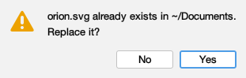
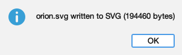
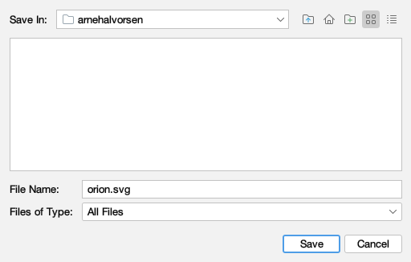
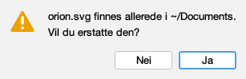
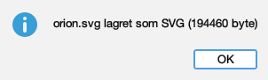
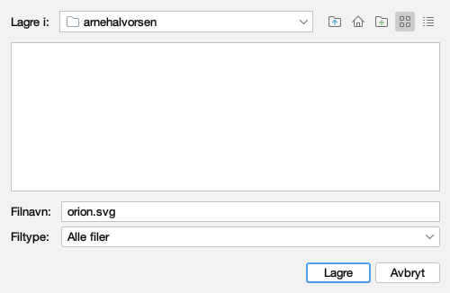

# The toolkit's own words, in both languages

Issue #350, **draft**. Generated by
`juranometria.tool.SwingChromeSheetMain` from compiled
application classes and their classpath resources.

Swing supplies the buttons, labels, hovers and spoken
names of these three dialogs from its own resource
bundle, resolved against `Locale.getDefault()` - the
**operating system**, not the language the reader
chose. The JDK ships no Norwegian bundle at all, so a
Norwegian reader met English here on every machine,
and a reader on a German desktop met German under
Norwegian sentences.

The atlas installs its own over them, in **both**
languages: an English interface on a German desktop
had the same defect in the other direction.

Forty-one keys. **Access keys are not among them** -
Swing's `…Mnemonic` entries stay with the eighteen
access letters already deferred.

## English (`en`)

### The question a reader answers

Asked before an existing file is replaced. The question was always the atlas's; the two buttons beneath it were the toolkit's.

311 × 99 px, `en`.

| what a reader meets |
|---|
| shown: orion.svg already exists in ~/Documents. |
| shown: Replace it? |
| shown: Yes |
| spoken: Yes |
| shown: No |
| spoken: No |

### What happened, reported

Shown after a sheet is written. One button, and `OK` is the same word in both languages - which is why it proves nothing on its own and the confirmation above is the telling one.

302 × 91 px, `en`.

| what a reader meets |
|---|
| shown: orion.svg written to SVG (194460 bytes) |
| shown: OK |
| spoken: OK |

### Where the sheet is put

The largest of the three: thirty-four of the forty-one keys. Six of its buttons say one thing to a pointer and another to a screen reader, and both halves are listed in the companion.

512 × 326 px, `en`.

| what a reader meets |
|---|
| hovered: Up One Level |
| spoken: Up |
| hovered: Home |
| spoken: Home |
| hovered: Create New Folder |
| spoken: New Folder |
| hovered: List |
| spoken: List |
| hovered: Details |
| spoken: Details |
| shown: Save In: |
| shown: File Name: |
| shown: Files of Type: |
| shown: Save |
| hovered: Save selected file |
| spoken: Save |
| shown: Cancel |
| hovered: Abort file chooser dialog |
| spoken: Cancel |

## Norsk bokmål (`nb-NO`)

### The question a reader answers

Asked before an existing file is replaced. The question was always the atlas's; the two buttons beneath it were the toolkit's.

307 × 99 px, `nb-NO`.

| what a reader meets |
|---|
| shown: orion.svg finnes allerede i ~/Documents. |
| shown: Vil du erstatte den? |
| shown: Ja |
| spoken: Ja |
| shown: Nei |
| spoken: Nei |

### What happened, reported

Shown after a sheet is written. One button, and `OK` is the same word in both languages - which is why it proves nothing on its own and the confirmation above is the telling one.

302 × 91 px, `nb-NO`.

| what a reader meets |
|---|
| shown: orion.svg lagret som SVG (194460 byte) |
| shown: OK |
| spoken: OK |

### Where the sheet is put

The largest of the three: thirty-four of the forty-one keys. Six of its buttons say one thing to a pointer and another to a screen reader, and both halves are listed in the companion.

500 × 326 px, `nb-NO`.

| what a reader meets |
|---|
| hovered: Opp ett nivå |
| spoken: Opp |
| hovered: Hjem |
| spoken: Hjem |
| hovered: Opprett ny mappe |
| spoken: Ny mappe |
| hovered: Liste |
| spoken: Liste |
| hovered: Detaljer |
| spoken: Detaljer |
| shown: Lagre i: |
| shown: Filnavn: |
| shown: Filtype: |
| shown: Lagre |
| hovered: Lagre den valgte filen |
| spoken: Lagre |
| shown: Avbryt |
| hovered: Lukk filvelgeren uten å velge |
| spoken: Avbryt |

## Every key the atlas installs

| toolkit key | channel | `en` | `nb-NO` |
|---|---|---|---|
| `OptionPane.okButtonText` | shown | OK | OK |
| `OptionPane.cancelButtonText` | shown | Cancel | Avbryt |
| `OptionPane.yesButtonText` | shown | Yes | Ja |
| `OptionPane.noButtonText` | shown | No | Nei |
| `OptionPane.titleText` | shown | Select an Option | Velg et alternativ |
| `OptionPane.messageDialogTitle` | shown | Message | Melding |
| `OptionPane.inputDialogTitle` | shown | Input | Inndata |
| `FileChooser.saveButtonText` | shown | Save | Lagre |
| `FileChooser.openButtonText` | shown | Open | Åpne |
| `FileChooser.cancelButtonText` | shown | Cancel | Avbryt |
| `FileChooser.updateButtonText` | shown | Update | Oppdater |
| `FileChooser.helpButtonText` | shown | Help | Hjelp |
| `FileChooser.saveButtonToolTipText` | hovered | Save selected file | Lagre den valgte filen |
| `FileChooser.openButtonToolTipText` | hovered | Open selected file | Åpne den valgte filen |
| `FileChooser.cancelButtonToolTipText` | hovered | Abort file chooser dialog | Lukk filvelgeren uten å velge |
| `FileChooser.updateButtonToolTipText` | hovered | Update directory listing | Oppdater mappevisningen |
| `FileChooser.helpButtonToolTipText` | hovered | FileChooser help | Hjelp for filvelgeren |
| `FileChooser.saveDialogTitleText` | shown | Save | Lagre |
| `FileChooser.openDialogTitleText` | shown | Open | Åpne |
| `FileChooser.lookInLabelText` | shown | Look In: | Se i: |
| `FileChooser.saveInLabelText` | shown | Save In: | Lagre i: |
| `FileChooser.fileNameLabelText` | shown | File Name: | Filnavn: |
| `FileChooser.filesOfTypeLabelText` | shown | Files of Type: | Filtype: |
| `FileChooser.upFolderToolTipText` | hovered | Up One Level | Opp ett nivå |
| `FileChooser.upFolderAccessibleName` | spoken | Up | Opp |
| `FileChooser.homeFolderToolTipText` | hovered | Home | Hjem |
| `FileChooser.homeFolderAccessibleName` | spoken | Home | Hjem |
| `FileChooser.newFolderToolTipText` | hovered | Create New Folder | Opprett ny mappe |
| `FileChooser.newFolderAccessibleName` | spoken | New Folder | Ny mappe |
| `FileChooser.listViewButtonToolTipText` | hovered | List | Liste |
| `FileChooser.listViewButtonAccessibleName` | spoken | List | Liste |
| `FileChooser.detailsViewButtonToolTipText` | hovered | Details | Detaljer |
| `FileChooser.detailsViewButtonAccessibleName` | spoken | Details | Detaljer |
| `FileChooser.fileNameHeaderText` | shown | Name | Navn |
| `FileChooser.fileSizeHeaderText` | shown | Size | Størrelse |
| `FileChooser.fileTypeHeaderText` | shown | Type | Type |
| `FileChooser.fileDateHeaderText` | shown | Modified | Endret |
| `FileChooser.acceptAllFileFilterText` | shown | All Files | Alle filer |
| `FileChooser.directoryOpenButtonText` | shown | Open | Åpne |
| `FileChooser.newFolderErrorText` | shown | Error creating new folder | Kunne ikke opprette ny mappe |
| `FileChooser.other.newFolder` | shown | NewFolder | Ny mappe |

**41 keys.**
