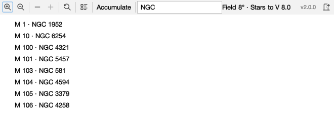
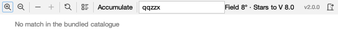
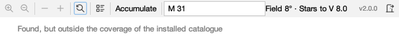
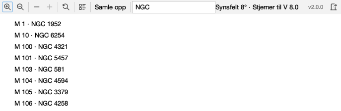
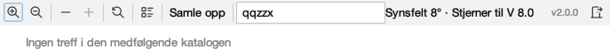
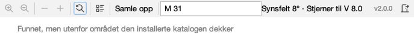

# Every word the toolbar and its search field say

Issue #350. Generated by
`juranometria.tool.ToolbarSheetMain` from compiled
application classes and their classpath resources.
Packaged acceptance separately verifies that the
interface language resources ship in the application
image.

Norwegian is **draft**.

## Composed, not requested

Each capture is built through `AtlasControls`, the
application's own composition seam, starting from a
language written to a preference node and read once by
`SkyLanguageSession`. Neither control is constructed
here.

That is deliberate. A sheet that asked each component
for Norwegian would have photographed a correct
toolbar during the whole period when the application
was handing it English - which is exactly what
happened, and what `AtlasControlsCompositionTest` now
holds.

## What is translated here, and what is not

Keystrokes are the platform's and appear as this
desktop spells them. Catalogue designations, the search
examples, every result's `label · identity`, magnitudes,
the degree sign and the version value are canonical and
are handed to sentences as arguments. `V`, `·` and the
numbers are notation.

## English (`en`)

### The bar at rest

The shipped catalogue, nothing typed.

| shown, hovered or spoken |
|---|
| Zoom in (⌘=) |
| Zoom in |
| Shows a narrower field, with fainter stars on it |
| Zoom out (⌘-) |
| Zoom out |
| Shows a wider field, with fewer stars on it |
| Show fewer stars with a brighter magnitude limit |
| Fewer stars |
| Draws only the brighter stars, one step at a time |
| Unavailable: V 8.0 is the faintest magnitude limit |
| More stars |
| Unavailable: V 8.0 is the faintest magnitude limit the atlas draws |
| Reset view: back to the atlas's first page |
| Reset view |
| Returns the chart to where every reader begins, and clears the search; what the chart draws is left as you chose it |
| Show the Inspector: what the selected mark is (⌘I) |
| Inspector |
| Hidden; press to open the panel that identifies what you selected and lists what is on this page. |
| Accumulate |
| When on, choosing objects adds them to the working selection and choosing them again removes them, instead of replacing the selection. The platform's add-to-selection modifier always works. |
| Accumulate selection |
| Off, each object you choose replaces the working selection; on, it is added to it, and choosing it again takes it out. Holding the platform's add-to-selection modifier does the same whether this is on or off. |
| Search |
| Find an object or coordinates, e.g. M 31, NGC 224, TYC 2801-2090-1, or 0:42:44 +41:16:09 |
| Search the atlas |
| Type a Messier or NGC number, a star's catalogue identity, or a right ascension and declination, then press Enter; the chart goes there and marks it |
| Field 8° · Stars to V 8.0 |
| v2.0.0 |
| JUranometria version 2.0.0 |
| Exit JUranometria |
| Closes the atlas; what you chose is remembered |

### A query with several answers

The shipped catalogue. Every row is a catalogue identity pair and is not translated.

| shown, hovered or spoken |
|---|
| Zoom in (⌘=) |
| Zoom in |
| Shows a narrower field, with fainter stars on it |
| Zoom out (⌘-) |
| Zoom out |
| Shows a wider field, with fewer stars on it |
| Show fewer stars with a brighter magnitude limit |
| Fewer stars |
| Draws only the brighter stars, one step at a time |
| Unavailable: V 8.0 is the faintest magnitude limit |
| More stars |
| Unavailable: V 8.0 is the faintest magnitude limit the atlas draws |
| Reset view: back to the atlas's first page |
| Reset view |
| Returns the chart to where every reader begins, and clears the search; what the chart draws is left as you chose it |
| Show the Inspector: what the selected mark is (⌘I) |
| Inspector |
| Hidden; press to open the panel that identifies what you selected and lists what is on this page. |
| Accumulate |
| When on, choosing objects adds them to the working selection and choosing them again removes them, instead of replacing the selection. The platform's add-to-selection modifier always works. |
| Accumulate selection |
| Off, each object you choose replaces the working selection; on, it is added to it, and choosing it again takes it out. Holding the platform's add-to-selection modifier does the same whether this is on or off. |
| Search |
| Find an object or coordinates, e.g. M 31, NGC 224, TYC 2801-2090-1, or 0:42:44 +41:16:09 |
| Search the atlas |
| Type a Messier or NGC number, a star's catalogue identity, or a right ascension and declination, then press Enter; the chart goes there and marks it |
| Field 8° · Stars to V 8.0 |
| v2.0.0 |
| JUranometria version 2.0.0 |
| Exit JUranometria |
| Closes the atlas; what you chose is remembered |
| M 1 · NGC 1952 |
| Goes to M 1 and marks it |
| M 10 · NGC 6254 |
| Goes to M 10 and marks it |
| M 100 · NGC 4321 |
| Goes to M 100 and marks it |
| M 101 · NGC 5457 |
| Goes to M 101 and marks it |
| M 103 · NGC 581 |
| Goes to M 103 and marks it |
| M 104 · NGC 4594 |
| Goes to M 104 and marks it |
| M 105 · NGC 3379 |
| Goes to M 105 and marks it |
| M 106 · NGC 4258 |
| Goes to M 106 and marks it |

### A query that finds nothing

The shipped catalogue. The item is disabled because there really is nothing to choose.

| shown, hovered or spoken |
|---|
| Zoom in (⌘=) |
| Zoom in |
| Shows a narrower field, with fainter stars on it |
| Zoom out (⌘-) |
| Zoom out |
| Shows a wider field, with fewer stars on it |
| Show fewer stars with a brighter magnitude limit |
| Fewer stars |
| Draws only the brighter stars, one step at a time |
| Unavailable: V 8.0 is the faintest magnitude limit |
| More stars |
| Unavailable: V 8.0 is the faintest magnitude limit the atlas draws |
| Reset view: back to the atlas's first page |
| Reset view |
| Returns the chart to where every reader begins, and clears the search; what the chart draws is left as you chose it |
| Show the Inspector: what the selected mark is (⌘I) |
| Inspector |
| Hidden; press to open the panel that identifies what you selected and lists what is on this page. |
| Accumulate |
| When on, choosing objects adds them to the working selection and choosing them again removes them, instead of replacing the selection. The platform's add-to-selection modifier always works. |
| Accumulate selection |
| Off, each object you choose replaces the working selection; on, it is added to it, and choosing it again takes it out. Holding the platform's add-to-selection modifier does the same whether this is on or off. |
| Search |
| Find an object or coordinates, e.g. M 31, NGC 224, TYC 2801-2090-1, or 0:42:44 +41:16:09 |
| Search the atlas |
| Type a Messier or NGC number, a star's catalogue identity, or a right ascension and declination, then press Enter; the chart goes there and marks it |
| Field 8° · Stars to V 8.0 |
| v2.0.0 |
| JUranometria version 2.0.0 |
| Exit JUranometria |
| Closes the atlas; what you chose is remembered |
| No match in the bundled catalogue |
| Nothing to choose: the bundled catalogue has no match. Try another name or coordinates. |

### A result outside the catalogue's coverage — synthetic

**Synthetic.** The shipped catalogue is all-sky and cannot produce this: NO_FIT is returned only when no field width fits a result's position. Reached with a real regional catalogue - a ten-degree cone around Orion - searching for M 31 in Andromeda.

| shown, hovered or spoken |
|---|
| Zoom in (⌘=) |
| Zoom in |
| Unavailable: this is the narrowest field the atlas draws |
| Zoom out (⌘-) |
| Zoom out |
| Unavailable: this is the widest field the atlas draws |
| Unavailable: V 8.0 is the brightest magnitude limit |
| Fewer stars |
| Unavailable: V 8.0 is the brightest magnitude limit the atlas draws |
| Unavailable: V 8.0 is the faintest magnitude limit |
| More stars |
| Unavailable: V 8.0 is the faintest magnitude limit the atlas draws |
| Reset view: back to the atlas's first page |
| Reset view |
| Returns the chart to where every reader begins, and clears the search; what the chart draws is left as you chose it |
| Show the Inspector: what the selected mark is (⌘I) |
| Inspector |
| Hidden; press to open the panel that identifies what you selected and lists what is on this page. |
| Accumulate |
| When on, choosing objects adds them to the working selection and choosing them again removes them, instead of replacing the selection. The platform's add-to-selection modifier always works. |
| Accumulate selection |
| Off, each object you choose replaces the working selection; on, it is added to it, and choosing it again takes it out. Holding the platform's add-to-selection modifier does the same whether this is on or off. |
| Search |
| Find an object or coordinates, e.g. M 31, NGC 224, TYC 2801-2090-1, or 0:42:44 +41:16:09 |
| Search the atlas |
| Type a Messier or NGC number, a star's catalogue identity, or a right ascension and declination, then press Enter; the chart goes there and marks it |
| Field 8° · Stars to V 8.0 |
| v2.0.0 |
| JUranometria version 2.0.0 |
| Exit JUranometria |
| Closes the atlas; what you chose is remembered |
| Found, but outside the coverage of the installed catalogue |
| Nothing to choose: the installed catalogue does not cover that position. The chart was not moved. |

## Norsk bokmål (`nb-NO`)

### The bar at rest

The shipped catalogue, nothing typed.

| shown, hovered or spoken |
|---|
| Zoom inn (⌘=) |
| Zoom inn |
| Viser et smalere synsfelt med svakere stjerner |
| Zoom ut (⌘-) |
| Zoom ut |
| Viser et større synsfelt med færre stjerner |
| Vis færre stjerner med en lysere grensemagnitude |
| Færre stjerner |
| Tegner bare lysere stjerner, ett steg om gangen |
| Utilgjengelig: V 8.0 er den svakeste grensemagnituden |
| Flere stjerner |
| Utilgjengelig: V 8.0 er atlasets svakeste grensemagnitude |
| Tilbakestill visningen: tilbake til atlasets første side |
| Tilbakestill visningen |
| Fører kartet tilbake til startsiden og tømmer søket; det du har valgt å vise på kartet, endres ikke |
| Vis utforskeren: hva det valgte merket er (⌘I) |
| Utforskeren |
| Skjult; trykk for å åpne panelet som viser hva du har valgt og hva som finnes på denne siden |
| Samle opp |
| Når denne er på, legges objektene du velger til i arbeidsutvalget. Velger du et objekt på nytt, tas det ut. Plattformens tast for å legge til i utvalget virker alltid. |
| Samle opp valgte objekter |
| Når denne er av, erstatter hvert nytt objekt arbeidsutvalget. Når den er på, legges objektet til; velger du det på nytt, tas det ut. Plattformens tast for å legge til i utvalget virker i begge tilfeller. |
| Søk |
| Finn et objekt eller koordinater, f.eks. M 31, NGC 224, TYC 2801-2090-1 eller 0:42:44 +41:16:09 |
| Søk i atlaset |
| Skriv et Messier- eller NGC-nummer, en stjernes katalogidentitet eller en rektascensjon og deklinasjon, og trykk Enter. Kartet flyttes dit og objektet markeres. |
| Synsfelt 8° · Stjerner til V 8.0 |
| v2.0.0 |
| JUranometria versjon 2.0.0 |
| Avslutt JUranometria |
| Lukker atlaset; det du valgte blir husket |

### A query with several answers

The shipped catalogue. Every row is a catalogue identity pair and is not translated.

| shown, hovered or spoken |
|---|
| Zoom inn (⌘=) |
| Zoom inn |
| Viser et smalere synsfelt med svakere stjerner |
| Zoom ut (⌘-) |
| Zoom ut |
| Viser et større synsfelt med færre stjerner |
| Vis færre stjerner med en lysere grensemagnitude |
| Færre stjerner |
| Tegner bare lysere stjerner, ett steg om gangen |
| Utilgjengelig: V 8.0 er den svakeste grensemagnituden |
| Flere stjerner |
| Utilgjengelig: V 8.0 er atlasets svakeste grensemagnitude |
| Tilbakestill visningen: tilbake til atlasets første side |
| Tilbakestill visningen |
| Fører kartet tilbake til startsiden og tømmer søket; det du har valgt å vise på kartet, endres ikke |
| Vis utforskeren: hva det valgte merket er (⌘I) |
| Utforskeren |
| Skjult; trykk for å åpne panelet som viser hva du har valgt og hva som finnes på denne siden |
| Samle opp |
| Når denne er på, legges objektene du velger til i arbeidsutvalget. Velger du et objekt på nytt, tas det ut. Plattformens tast for å legge til i utvalget virker alltid. |
| Samle opp valgte objekter |
| Når denne er av, erstatter hvert nytt objekt arbeidsutvalget. Når den er på, legges objektet til; velger du det på nytt, tas det ut. Plattformens tast for å legge til i utvalget virker i begge tilfeller. |
| Søk |
| Finn et objekt eller koordinater, f.eks. M 31, NGC 224, TYC 2801-2090-1 eller 0:42:44 +41:16:09 |
| Søk i atlaset |
| Skriv et Messier- eller NGC-nummer, en stjernes katalogidentitet eller en rektascensjon og deklinasjon, og trykk Enter. Kartet flyttes dit og objektet markeres. |
| Synsfelt 8° · Stjerner til V 8.0 |
| v2.0.0 |
| JUranometria versjon 2.0.0 |
| Avslutt JUranometria |
| Lukker atlaset; det du valgte blir husket |
| M 1 · NGC 1952 |
| Flytter kartet til M 1 og markerer objektet |
| M 10 · NGC 6254 |
| Flytter kartet til M 10 og markerer objektet |
| M 100 · NGC 4321 |
| Flytter kartet til M 100 og markerer objektet |
| M 101 · NGC 5457 |
| Flytter kartet til M 101 og markerer objektet |
| M 103 · NGC 581 |
| Flytter kartet til M 103 og markerer objektet |
| M 104 · NGC 4594 |
| Flytter kartet til M 104 og markerer objektet |
| M 105 · NGC 3379 |
| Flytter kartet til M 105 og markerer objektet |
| M 106 · NGC 4258 |
| Flytter kartet til M 106 og markerer objektet |

### A query that finds nothing

The shipped catalogue. The item is disabled because there really is nothing to choose.

| shown, hovered or spoken |
|---|
| Zoom inn (⌘=) |
| Zoom inn |
| Viser et smalere synsfelt med svakere stjerner |
| Zoom ut (⌘-) |
| Zoom ut |
| Viser et større synsfelt med færre stjerner |
| Vis færre stjerner med en lysere grensemagnitude |
| Færre stjerner |
| Tegner bare lysere stjerner, ett steg om gangen |
| Utilgjengelig: V 8.0 er den svakeste grensemagnituden |
| Flere stjerner |
| Utilgjengelig: V 8.0 er atlasets svakeste grensemagnitude |
| Tilbakestill visningen: tilbake til atlasets første side |
| Tilbakestill visningen |
| Fører kartet tilbake til startsiden og tømmer søket; det du har valgt å vise på kartet, endres ikke |
| Vis utforskeren: hva det valgte merket er (⌘I) |
| Utforskeren |
| Skjult; trykk for å åpne panelet som viser hva du har valgt og hva som finnes på denne siden |
| Samle opp |
| Når denne er på, legges objektene du velger til i arbeidsutvalget. Velger du et objekt på nytt, tas det ut. Plattformens tast for å legge til i utvalget virker alltid. |
| Samle opp valgte objekter |
| Når denne er av, erstatter hvert nytt objekt arbeidsutvalget. Når den er på, legges objektet til; velger du det på nytt, tas det ut. Plattformens tast for å legge til i utvalget virker i begge tilfeller. |
| Søk |
| Finn et objekt eller koordinater, f.eks. M 31, NGC 224, TYC 2801-2090-1 eller 0:42:44 +41:16:09 |
| Søk i atlaset |
| Skriv et Messier- eller NGC-nummer, en stjernes katalogidentitet eller en rektascensjon og deklinasjon, og trykk Enter. Kartet flyttes dit og objektet markeres. |
| Synsfelt 8° · Stjerner til V 8.0 |
| v2.0.0 |
| JUranometria versjon 2.0.0 |
| Avslutt JUranometria |
| Lukker atlaset; det du valgte blir husket |
| Ingen treff i den medfølgende katalogen |
| Ingenting å velge. Den medfølgende katalogen har ingen treff. Prøv et annet navn eller koordinater. |

### A result outside the catalogue's coverage — synthetic

**Synthetic.** The shipped catalogue is all-sky and cannot produce this: NO_FIT is returned only when no field width fits a result's position. Reached with a real regional catalogue - a ten-degree cone around Orion - searching for M 31 in Andromeda.

| shown, hovered or spoken |
|---|
| Zoom inn (⌘=) |
| Zoom inn |
| Utilgjengelig: dette er atlasets smaleste synsfelt |
| Zoom ut (⌘-) |
| Zoom ut |
| Utilgjengelig: dette er atlasets største synsfelt |
| Utilgjengelig: V 8.0 er den lyseste grensemagnituden |
| Færre stjerner |
| Utilgjengelig: V 8.0 er atlasets lyseste grensemagnitude |
| Utilgjengelig: V 8.0 er den svakeste grensemagnituden |
| Flere stjerner |
| Utilgjengelig: V 8.0 er atlasets svakeste grensemagnitude |
| Tilbakestill visningen: tilbake til atlasets første side |
| Tilbakestill visningen |
| Fører kartet tilbake til startsiden og tømmer søket; det du har valgt å vise på kartet, endres ikke |
| Vis utforskeren: hva det valgte merket er (⌘I) |
| Utforskeren |
| Skjult; trykk for å åpne panelet som viser hva du har valgt og hva som finnes på denne siden |
| Samle opp |
| Når denne er på, legges objektene du velger til i arbeidsutvalget. Velger du et objekt på nytt, tas det ut. Plattformens tast for å legge til i utvalget virker alltid. |
| Samle opp valgte objekter |
| Når denne er av, erstatter hvert nytt objekt arbeidsutvalget. Når den er på, legges objektet til; velger du det på nytt, tas det ut. Plattformens tast for å legge til i utvalget virker i begge tilfeller. |
| Søk |
| Finn et objekt eller koordinater, f.eks. M 31, NGC 224, TYC 2801-2090-1 eller 0:42:44 +41:16:09 |
| Søk i atlaset |
| Skriv et Messier- eller NGC-nummer, en stjernes katalogidentitet eller en rektascensjon og deklinasjon, og trykk Enter. Kartet flyttes dit og objektet markeres. |
| Synsfelt 8° · Stjerner til V 8.0 |
| v2.0.0 |
| JUranometria versjon 2.0.0 |
| Avslutt JUranometria |
| Lukker atlaset; det du valgte blir husket |
| Funnet, men utenfor området den installerte katalogen dekker |
| Ingenting å velge. Den installerte katalogen dekker ikke denne posisjonen. Kartet ble ikke flyttet. |

