# Jupiter and the Galilean moons on the page: measurements and mockups

Sprint 45, issue #482. What a cartography rule would mean on the atlas's own pages, measured through the production projections and the accepted Jovian service (#473), with the ruled marks drawn by this study over pages the production composition painted, as the Sun-Moon study did (#414). Nothing here is production rendering; every image is a mockup and says so in its corner. Regenerate with `make jovian-cartography-study`.

## A. True scale on every page

Over 2000-2100 (5270 weekly geocentric instants from the service): Jupiter's equatorial diameter is 30.5-49.9″ and its polar diameter 28.6-46.6″; Io 0.78-1.28″, Europa 0.67-1.09″, Ganymede 1.12-1.84″, Callisto 1.03-1.69″; the system's largest extent is a moon 655″ (10.9′) from Jupiter's centre (CALLISTO 2057-09-08). The atlas's smallest star mark is 1.4 px across and its largest 10.0 px (the production star policy).

Pixels on the 900 × 700 page at its centre (each field's own projection); millimetres on the A4 sheet's chart area (272 mm wide, 3208 px at 300 dpi) and the Letter sheet's (254 mm).

| field | Jupiter equator px (min-max) | polar px (max) | equator − polar px (max) | largest moon px | system extent px | Jupiter on A4 mm (max) | extent on A4 mm | Jupiter on Letter mm (max) |
|---:|---|---:|---:|---:|---:|---:|---:|---:|
| 180° | 0.05-0.08 | 0.07 | 0.005 | 0.0028 | 1.0 | 0.021 | 0.27 | 0.020 |
| 120° | 0.06-0.09 | 0.09 | 0.006 | 0.0035 | 1.2 | 0.031 | 0.41 | 0.029 |
| 90° | 0.08-0.13 | 0.12 | 0.009 | 0.0048 | 1.7 | 0.042 | 0.55 | 0.039 |
| 60° | 0.12-0.20 | 0.19 | 0.013 | 0.0075 | 2.7 | 0.063 | 0.82 | 0.059 |
| 42° | 0.17-0.28 | 0.27 | 0.018 | 0.0104 | 3.7 | 0.090 | 1.18 | 0.084 |
| 36° | 0.21-0.33 | 0.31 | 0.022 | 0.0123 | 4.4 | 0.105 | 1.37 | 0.098 |
| 24° | 0.31-0.51 | 0.48 | 0.033 | 0.0189 | 6.7 | 0.157 | 2.06 | 0.147 |
| 18° | 0.42-0.69 | 0.64 | 0.045 | 0.0253 | 9.0 | 0.209 | 2.75 | 0.195 |
| 12° | 0.63-1.04 | 0.97 | 0.067 | 0.0381 | 13.6 | 0.314 | 4.12 | 0.293 |
| 8° | 0.95-1.56 | 1.45 | 0.101 | 0.0573 | 20.4 | 0.470 | 6.18 | 0.440 |
| 6° | 1.27-2.08 | 1.94 | 0.135 | 0.0765 | 27.3 | 0.627 | 8.24 | 0.586 |
| 4° | 1.91-3.12 | 2.91 | 0.202 | 0.1148 | 40.9 | 0.941 | 12.35 | 0.880 |
| 3° | 2.55-4.15 | 3.89 | 0.270 | 0.1531 | 54.6 | 1.254 | 16.47 | 1.173 |
| 2° | 3.82-6.23 | 5.83 | 0.404 | 0.2297 | 81.9 | 1.881 | 24.71 | 1.759 |
| 1° | 7.64-12.47 | 11.66 | 0.809 | 0.4594 | 163.7 | 3.762 | 49.41 | 3.519 |

## B. Where things become resolvable or separable

- **Jupiter's disc reaches the atlas's smallest star mark** (1.4 px) at 8.9° at its largest and 5.5° at its smallest; it reaches the largest star mark (10.0 px) at 1.25° and 0.76°.
- **Jupiter's disc is a shape, not a dot** (3 px across) from 4.2° at its largest, 2.5° at its smallest; it reaches the ruled 6 px minimum mark at 2.08° and 1.27°.
- **Jupiter's oblateness is honestly resolved** - the equatorial and polar diameters a whole pixel apart - only at 0.81° on the 900 px page at its largest (0.81 px apart at 1°): **below the atlas's smallest field**. At 1° the true disc is 7.6-12.5 px across, a disc whose oblate outline is within a pixel of a circle. On the A4 sheet at 300 dpi it is resolved from 2.9°. Drawing the outline oblate is truthful at any size; seeing it needs a field below 1° (#481) or paper.
- **The moons' true discs are below a pixel on every page** (Ganymede, the largest, 0.46 px at 1°): any moon mark is a symbol. Proposed symbol 3 px; two symbols are separable 6 px apart (centre to centre).

**Each moon decided on its own (the ruled rule 4).** Over 2026 (every 6 hours at Oslo, 1 460 configurations, 5 840 moon places) each moon is decided independently by the study's `decide`: behind Jupiter, omitted; at the chart's normal minimum field (1°, read from the chart and never assumed permanent) every other moon drawn at its exact J2000 place, overlap allowed; above it, a moon drawn only when its own 3 px mark is distinguishable - 6 px from Jupiter's drawn edge and from every higher-priority moon already drawn (in front, then clear, then shadowed; then Ganymede, Callisto, Io, Europa), and a moon in front only when Jupiter's drawn disc is at least 12 px. A collision suppresses only the lower-priority mark. Shares are of the moon places that are not behind Jupiter.

| field | drawn | at Jupiter's edge | collides | in front, unresolved | configurations with a moon drawn | one suppressed, another drawn |
|---:|---:|---:|---:|---:|---:|---:|
| 12° | 11.4 % | 85.5 % | 0.0 % | 3.1 % | 44.2 % | 646 |
| 8° | 22.4 % | 73.1 % | 1.4 % | 3.1 % | 74.0 % | 1079 |
| 6° | 32.5 % | 61.2 % | 3.2 % | 3.1 % | 89.5 % | 1303 |
| 4° | 47.9 % | 42.6 % | 6.4 % | 3.1 % | 97.7 % | 1392 |
| 3° | 60.1 % | 28.7 % | 8.1 % | 3.1 % | 99.3 % | 1342 |
| 2° | 72.5 % | 15.1 % | 9.3 % | 3.1 % | 99.9 % | 1150 |
| 1° | 100.0 % | 0.0 % | 0.0 % | 0.0 % | 100.0 % | 0 |

**Labels, decided separately from marks (the ruled rule 6).** For every drawn moon, a label request through the production `LabelPlacement`, with production's eight adjacent candidates (LabelGeometry's order, 3 px gap), every drawn mark and Jupiter's label as obstacles, on an otherwise empty 900 × 700 page; a label is refused when none of its candidates is free - where production would place it under duress over the least ink - and withdrawn, so it blocks no other label. *Moved* counts labels that took a candidate other than the right-hand one.

| field | moon labels placed | of which moved | refused | configurations with both | configurations with every moon label refused |
|---:|---:|---:|---:|---:|---:|
| 12° | 646 | 337 | 0 | 0 | 0 |
| 8° | 1271 | 814 | 0 | 0 | 0 |
| 6° | 1840 | 1361 | 1 | 1 | 0 |
| 4° | 2661 | 2133 | 49 | 49 | 0 |
| 3° | 3319 | 2647 | 84 | 84 | 0 |
| 2° | 4031 | 3014 | 73 | 72 | 0 |
| 1° | 5437 | 3245 | 225 | 223 | 0 |

The rejected all-or-nothing rule (every moon drawn only when the whole system is separable) is no longer measured; its figures are in the history of PR #489.

## C. The frame contract

The chart is J2000 (ICRS); the table's X/Y and pole angle are apparent and of date. The study does **not** rotate the table's values by an assumed correction. As ruled, `JovianChartFrameTest` holds:

- **Positions**: each body's own astrometric J2000 place from the service - Jupiter's and each moon's - through the page's ordinary projection, as every star's and the Sun's and the Moon's.
- **Jupiter's pole for the ellipse**: the PCK's pole vector is stated in the ICRS, the chart's frame, so its direction on the sky at Jupiter's J2000 place is derived there, from J2000 north through east, and turned onto the page by the page's projected north and east at that place (the Moon's phase contract, C3). Measured over 2000-2100: the derived angle agrees with the table's of-date pole angle carried back by the atlas's own of-date-to-J2000 rotation to **0.0029°**; the two frames' angles themselves differ by up to 0.58° - which is why the table's angle is never drawn as it stands.
- **The table's offsets are not the page's**: a moon's J2000 offset from Jupiter differs from the table's apparent X/Y by up to **6.00″** over the century - the frames' rotation at Callisto's distance - so a page draws each moon at its own J2000 place, never at Jupiter's place plus X/Y.
- **Round trip and neighbours**: every body's J2000 place projected and unprojected returns to itself; a moon's page offset from Jupiter equals its J2000 offset turned by the page's tangents, across the sky (the poles, the equator, RA 0/24h) and through Jupiter's JUP365 segment boundary at 1997-01-16 (Jupiter only: the moons answer from 2000).
- **Agreement**: the page position of each body is the service's J2000 position, not a second computation; the test compares them directly.

## D. Mockups on the atlas's own pages

Each page is painted by the production composition (`ChartComponent` over the bundled catalogue, with the meridian module where the page has a horizon). Over it this study draws, from the service's J2000 places for the instant and observer stated, by the owner's rulings (section E): **Jupiter** as a disc at its true equatorial diameter or the 6 px minimum - a cartographic symbol, not Jupiter's apparent diameter - whichever is larger, its outline turning from a circle to the true oblate ellipse as the true disc grows past the minimum, the minor axis along the pole derived in the chart's frame; **each moon** as a 3 px symbol at its own J2000 place, decided on its own (section B), in state vocabulary A; **labels** through the production `LabelPlacement` with its eight adjacent candidates and the page's own text and marks as obstacles, each refused alone when no candidate is free. Where the true system is a few pixels across, an inset magnifies it - a **study magnification, not a field the atlas offers** - so the states can be judged; the page itself is unmagnified, and every caption ends with what the page itself drew.

### The triple transit, 2026-12-11 22:45 UTC at Oslo, 36° field

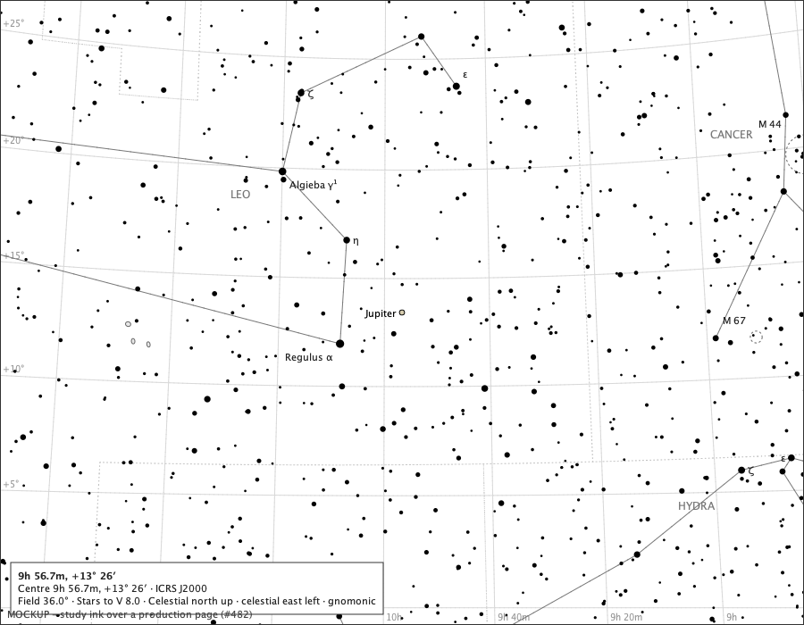

Jupiter's true disc is 0.3 px here; above the normal minimum field each moon is drawn only where its own mark is distinguishable; the inset shows the arrangement. Drawn on the page: Jupiter at (450, 350), true 0.3 × 0.3 px, drawn 6.0 × 6.0 px (the minimum mark: a cartographic symbol); Io in front unresolved, not drawn; Europa in front unresolved, not drawn; Ganymede at jupiter, not drawn; Callisto in front unresolved, not drawn; Jupiter's label at candidate 1;

### The triple transit, 2026-12-11 22:45 UTC at Oslo, 8° field

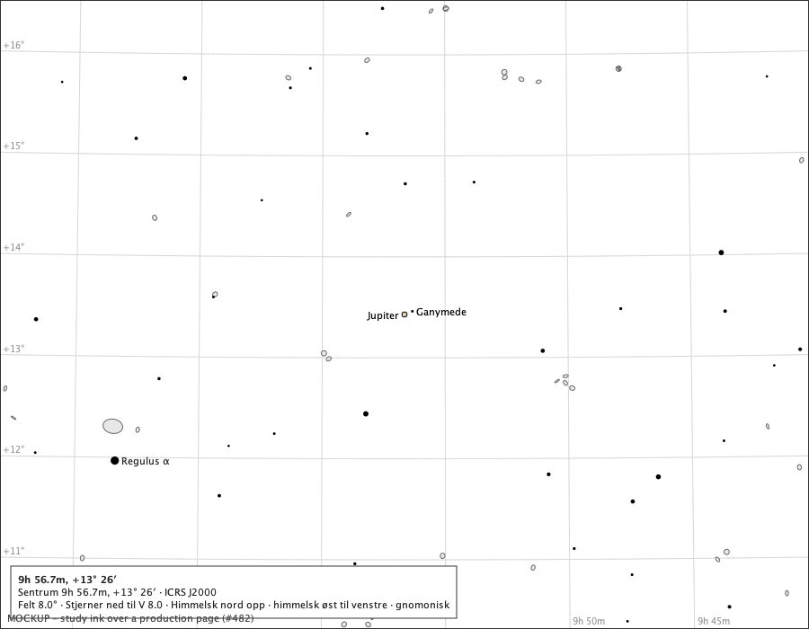

Jupiter's true disc is 1.3 px here; above the normal minimum field each moon is drawn only where its own mark is distinguishable; the inset shows the arrangement. Drawn on the page: Jupiter at (450, 350), true 1.3 × 1.2 px, drawn 6.0 × 6.0 px (the minimum mark: a cartographic symbol); Io in front unresolved, not drawn; Europa in front unresolved, not drawn; Ganymede at (459, 346) clear; Callisto in front unresolved, not drawn; Jupiter's label at candidate 1;

### The triple transit, 2026-12-11 22:45 UTC at Oslo, 3° field

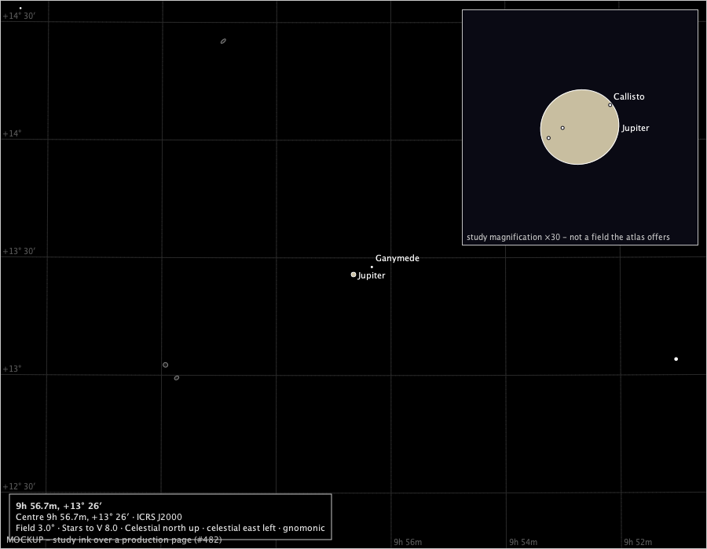

Jupiter's true disc is 3.4 px here; above the normal minimum field each moon is drawn only where its own mark is distinguishable; the inset shows the arrangement. Drawn on the page: Jupiter at (450, 350), true 3.4 × 3.2 px, drawn 6.0 × 6.0 px (the minimum mark: a cartographic symbol); Io in front unresolved, not drawn; Europa in front unresolved, not drawn; Ganymede at (473, 340) clear; Callisto in front unresolved, not drawn; Ganymede's label at candidate 2;

### The triple transit, 2026-12-11 22:45 UTC at Oslo, 1° field

Jupiter's true disc is 10.1 px here; at the normal minimum field every moon not behind Jupiter is drawn at its exact place, the three in front overlapping Jupiter's mark on purpose. Drawn on the page: Jupiter at (450, 350), true 10.1 × 9.5 px, drawn 10.1 × 9.7 px; Io at (446, 351) in front; Europa at (448, 350) in front; Ganymede at (520, 321) clear; Callisto at (454, 347) in front; Io's label at candidate 1; Europa's label refused; Callisto's label at candidate 2;

### The 11 December 2026 sequence at 22:30 UTC, Oslo, 1° field

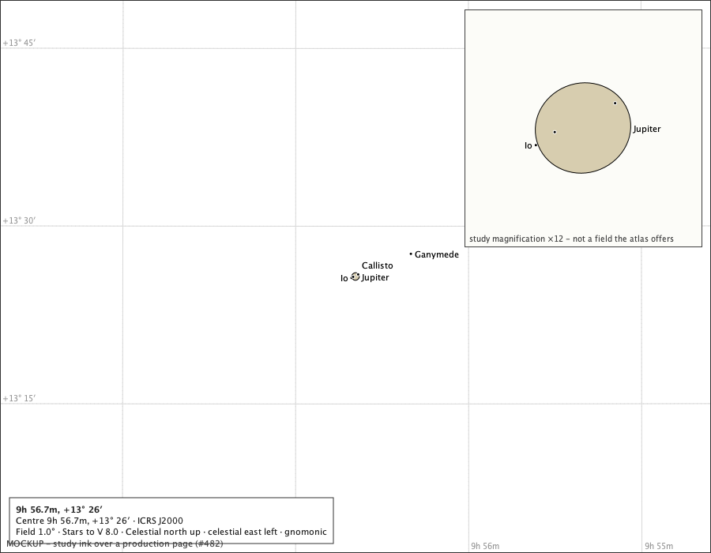

States: Io clear of jupiter; Europa in front of jupiter; Ganymede clear of jupiter; Callisto in front of jupiter; Drawn on the page: Jupiter at (450, 350), true 10.1 × 9.5 px, drawn 10.1 × 9.7 px; Io at (445, 352) clear; Europa at (447, 350) in front; Ganymede at (520, 321) clear; Callisto at (453, 347) in front; Io's label at candidate 1; Europa's label refused; Callisto's label at candidate 2;

### The 11 December 2026 sequence at 22:45 UTC, Oslo, 1° field

States: Io in front of jupiter; Europa in front of jupiter; Ganymede clear of jupiter; Callisto in front of jupiter; Drawn on the page: Jupiter at (450, 350), true 10.1 × 9.5 px, drawn 10.1 × 9.7 px; Io at (446, 351) in front; Europa at (448, 350) in front; Ganymede at (520, 321) clear; Callisto at (454, 347) in front; Io's label at candidate 1; Europa's label refused; Callisto's label at candidate 2;

### The 11 December 2026 sequence at 22:55 UTC, Oslo, 1° field

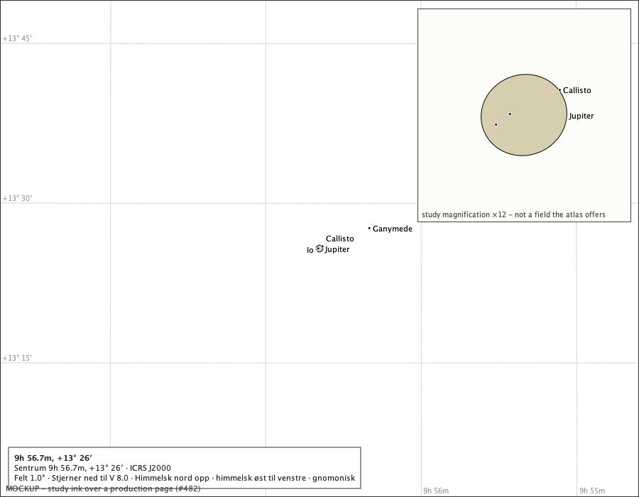

States: Io in front of jupiter; Europa in front of jupiter; Ganymede clear of jupiter; Callisto in front of jupiter; Drawn on the page: Jupiter at (450, 350), true 10.1 × 9.5 px, drawn 10.1 × 9.7 px; Io at (447, 351) in front; Europa at (448, 350) in front; Ganymede at (520, 321) clear; Callisto at (454, 347) in front; Io's label at candidate 1; Europa's label refused; Callisto's label at candidate 2;

### The 11 December 2026 sequence at 23:00 UTC, Oslo, 1° field

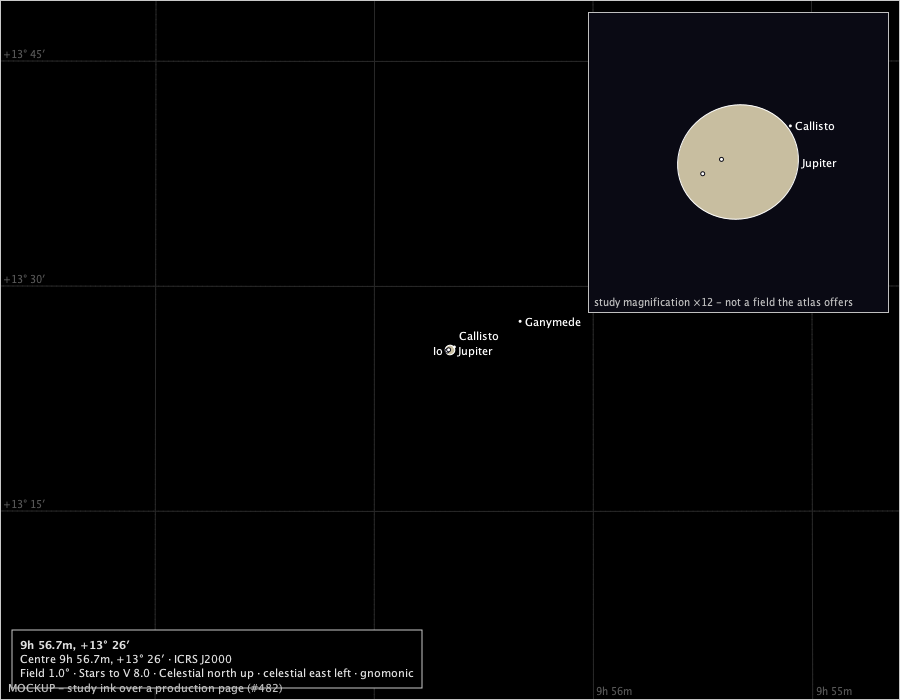

States: Io in front of jupiter; Europa in front of jupiter; Ganymede clear of jupiter; Callisto clear of jupiter; Drawn on the page: Jupiter at (450, 350), true 10.1 × 9.5 px, drawn 10.1 × 9.7 px; Io at (447, 351) in front; Europa at (449, 350) in front; Ganymede at (520, 321) clear; Callisto at (454, 347) clear; Io's label at candidate 1; Europa's label refused; Callisto's label at candidate 2;

### Io behind Jupiter (Horizons O at this hour), 2026-12-02 07:00 UTC, 1° field

States: Io behind jupiter; Europa clear of jupiter; Ganymede clear of jupiter; Callisto clear of jupiter; Drawn on the page: Jupiter at (450, 350), true 9.8 × 9.2 px, drawn 9.8 × 9.4 px; Io behind, not drawn; Europa at (492, 333) clear; Ganymede at (410, 366) clear; Callisto at (501, 331) clear; Europa's label at candidate 1;

### Io wholly in Jupiter's shadow (Horizons u), 2026-12-02 04:00 UTC, 1° field

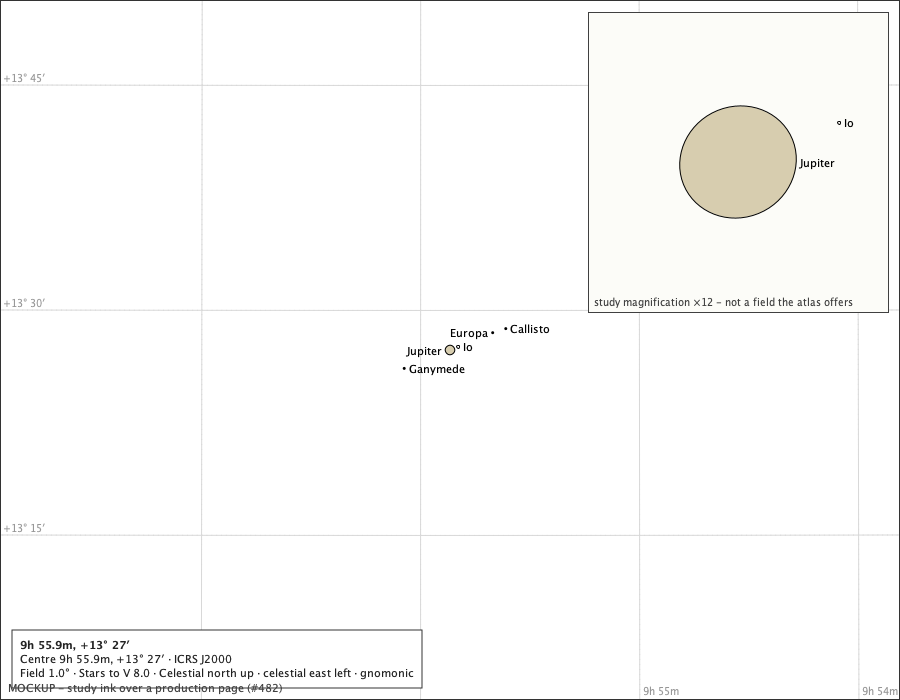

States: Io in jupiters shadow; Europa clear of jupiter; Ganymede clear of jupiter; Callisto clear of jupiter; Drawn on the page: Jupiter at (450, 350), true 9.8 × 9.2 px, drawn 9.8 × 9.4 px; Io at (458, 347) shadowed; Europa at (493, 333) clear; Ganymede at (404, 368) clear; Callisto at (506, 329) clear; Jupiter's label at candidate 1; Europa's label at candidate 1;

### Io partly in Jupiter's shadow (Horizons p), 2026-12-21 15:00 UTC, 1° field

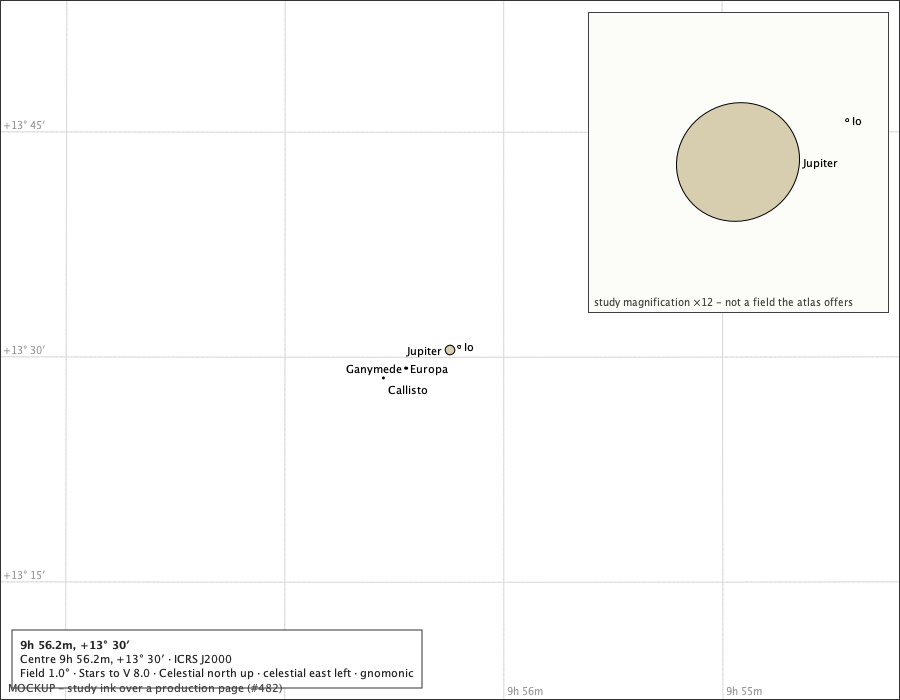

States: Io partly in jupiters shadow; Europa clear of jupiter; Ganymede clear of jupiter; Callisto clear of jupiter; Drawn on the page: Jupiter at (450, 350), true 10.4 × 9.7 px, drawn 10.4 × 9.9 px; Io at (459, 347) shadowed; Europa at (406, 368) clear; Ganymede at (407, 368) clear; Callisto at (383, 378) clear; Jupiter's label at candidate 1; Ganymede's label at candidate 1; Callisto's label at candidate 4;

### State vocabulary A, as ruled, on both palettes

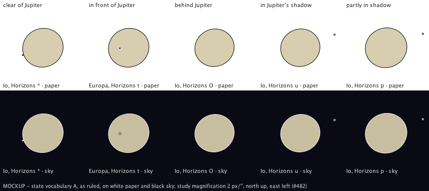

One cell per state, each a real configuration at Oslo (Horizons' visibility code at that hour named), Jupiter's true oblate outline and pole and the moon at its true J2000 offset, at a study magnification of 2 px per arcsecond, on white paper above and black sky below: clear a filled dot; in front a filled dot ringed in the paper's own colour over the disc; behind not drawn; wholly or partly in shadow a hollow ring (the table keeps the distinction). Drawn: clear of Jupiter: Io, Horizons * at 2026-12-11 22:30 UTC, offset 19.9″ east, -7.2″ north; in front of Jupiter: Europa, Horizons t at 2026-12-11 22:45 UTC, offset 8.7″ east, -0.4″ north; behind Jupiter: Io, Horizons O at 2026-12-02 07:00 UTC, offset 13.0″ east, -6.0″ north; in Jupiter's shadow: Io, Horizons u at 2026-12-02 04:00 UTC, offset -33.8″ east, 13.0″ north; partly in shadow: Io, Horizons p at 2026-12-21 15:00 UTC, offset -36.4″ east, 13.9″ north;

### Jupiter just below the drawn horizon, 2026-12-01 12:20 UTC, Oslo, 8°

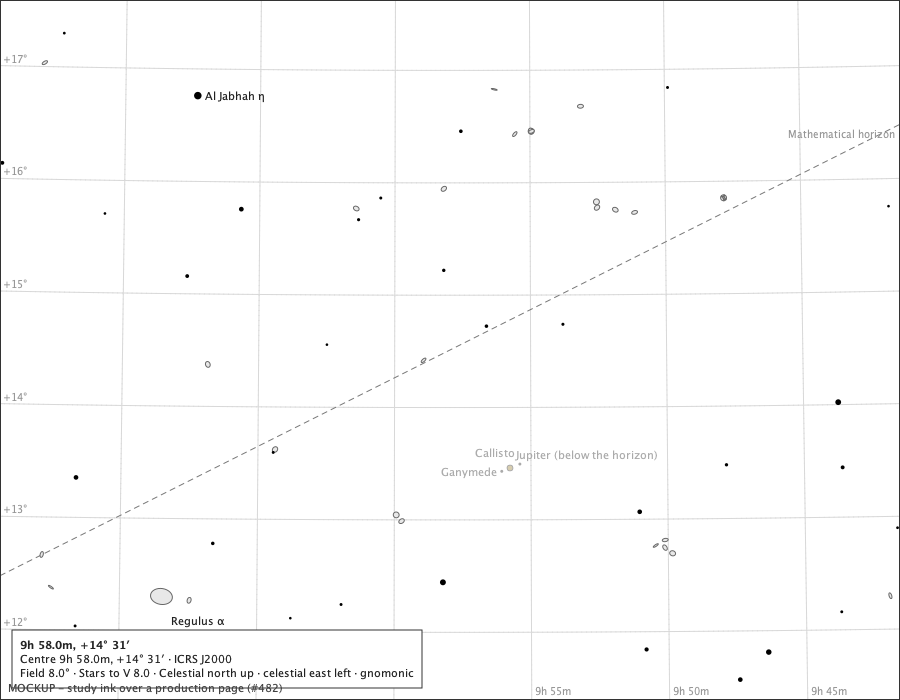

Jupiter at -1.2° altitude, drawn in the ground's dimmed ink with its status, as the Sun's and the Moon's ruling (C4) has it. Drawn on the page: Jupiter at (510, 468), true 1.2 × 1.1 px, drawn 6.0 × 6.0 px (the minimum mark: a cartographic symbol); Io at jupiter, not drawn; Europa at jupiter, not drawn; Ganymede at (502, 471) clear; Callisto at (520, 464) clear; Jupiter (below the horizon)'s label at candidate 2; Ganymede's label at candidate 1; Callisto's label at candidate 3;

### The same instant with the horizon hidden

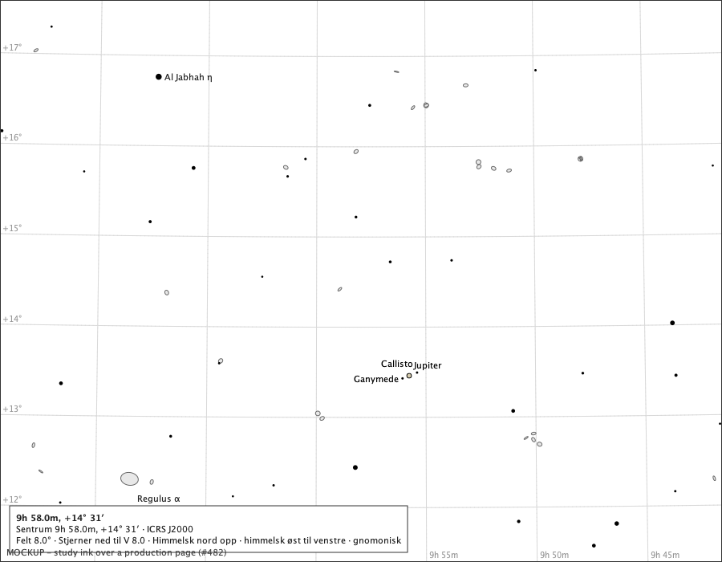

With no horizon drawn the celestial chart draws Jupiter normally (C4). Drawn on the page: Jupiter at (510, 468), true 1.2 × 1.1 px, drawn 6.0 × 6.0 px (the minimum mark: a cartographic symbol); Io at jupiter, not drawn; Europa at jupiter, not drawn; Ganymede at (502, 471) clear; Callisto at (520, 464) clear; Jupiter's label at candidate 2; Ganymede's label at candidate 1; Callisto's label at candidate 3;

### The most crowded 2026 configuration with all four moons clear, 3° field

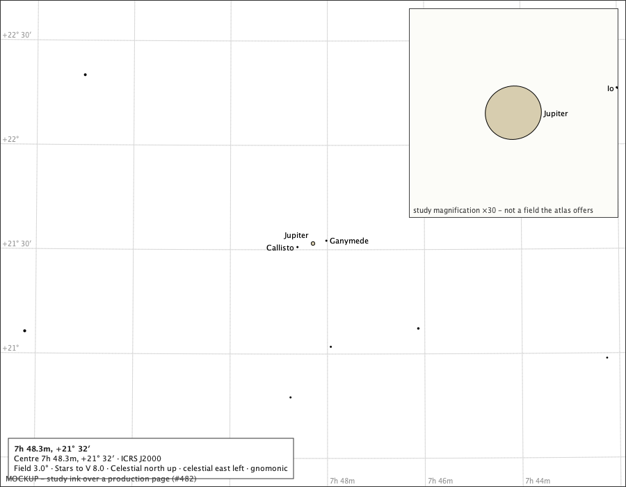

Each mark and each label is decided on its own: a label with no free candidate is refused alone, and the others stand; the inset shows the moons. Drawn on the page: Jupiter at (450, 350), true 2.7 × 2.5 px, drawn 6.0 × 6.0 px (the minimum mark: a cartographic symbol); Io at jupiter, not drawn; Europa at jupiter, not drawn; Ganymede at (469, 346) clear; Callisto at (428, 355) clear; Jupiter's label at candidate 3; Callisto's label at candidate 1;

### A crowded pair at 3°: only the lower-priority mark is suppressed

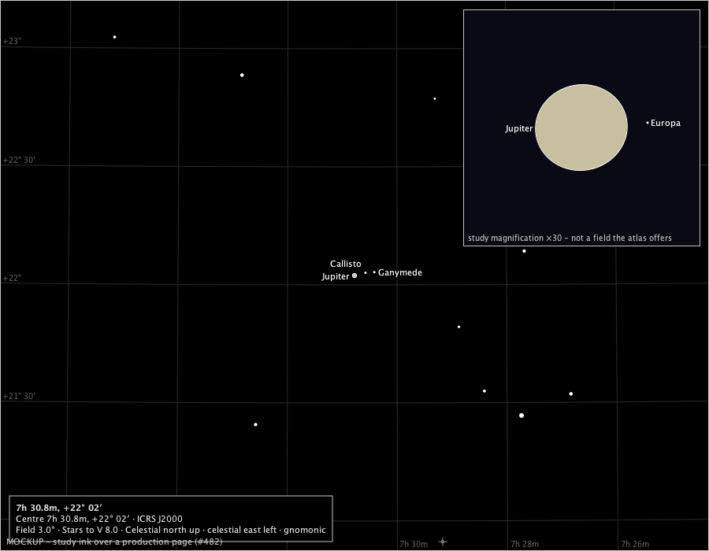

2026-01-01 06:00 UTC at Oslo. Two moons collide at this field: the lower-priority one is not drawn, while every other distinguishable moon is. Drawn on the page: Jupiter at (450, 350), true 3.9 × 3.6 px, drawn 6.0 × 6.0 px (the minimum mark: a cartographic symbol); Io collides, not drawn; Europa at jupiter, not drawn; Ganymede at (475, 346) clear; Callisto at (464, 346) clear; Jupiter's label at candidate 1; Callisto's label at candidate 3;

### Labels on adjacent candidates around Jupiter, 1° field

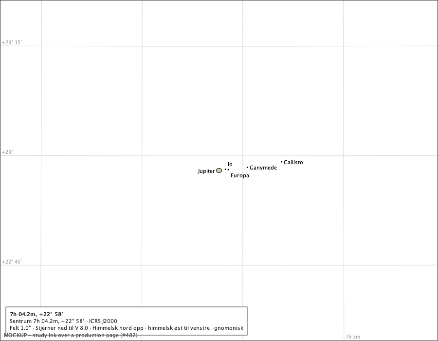

2026-03-06 06:00 UTC at Oslo. Each label takes the first of its eight adjacent candidates that covers no mark or text; a crowded one is refused alone. Drawn on the page: Jupiter at (450, 350), true 10.5 × 9.9 px, drawn 10.5 × 10.0 px; Io at (463, 348) clear; Europa at (469, 348) clear; Ganymede at (508, 344) clear; Callisto at (578, 332) clear; Jupiter's label at candidate 1; Io's label at candidate 2; Europa's label at candidate 4;

### Jupiter beside Regulus's label, 2027-01-15 22:00 UTC, 8° field

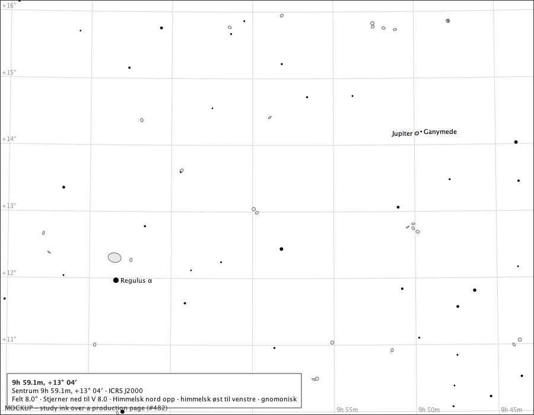

Jupiter 5.0° from Regulus: its label takes a free adjacent place or is refused; it never overwrites the star's. Drawn on the page: Jupiter at (702, 225), true 1.4 × 1.3 px, drawn 6.0 × 6.0 px (the minimum mark: a cartographic symbol); Io at jupiter, not drawn; Europa at jupiter, not drawn; Ganymede at (710, 222) clear; Callisto collides, not drawn; Jupiter's label at candidate 1;

### The system near the page's left edge, 3° field

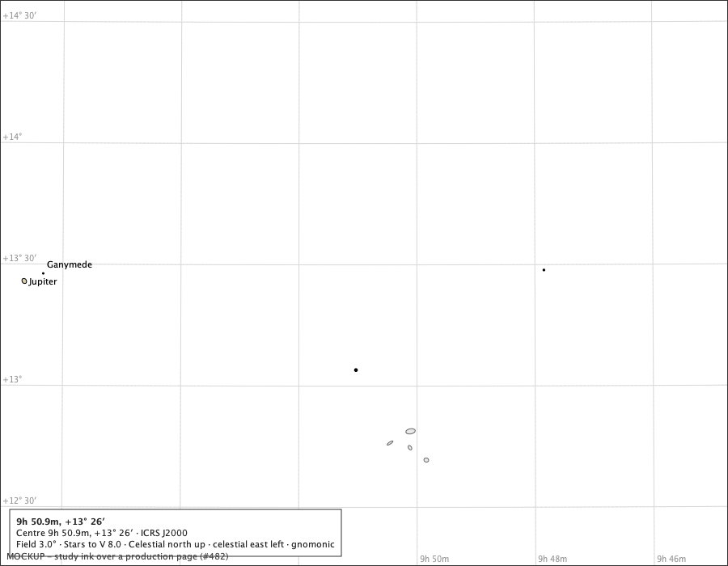

Bodies off the page are not drawn, as stars are not (C4). Drawn on the page: Jupiter at (30, 348), true 3.4 × 3.2 px, drawn 6.0 × 6.0 px (the minimum mark: a cartographic symbol); Io in front unresolved, not drawn; Europa in front unresolved, not drawn; Ganymede at (53, 338) clear; Callisto in front unresolved, not drawn; Ganymede's label at candidate 2;

### The A4 sheet's chart area at 150 dpi (1754 × 1090 px), 8° field

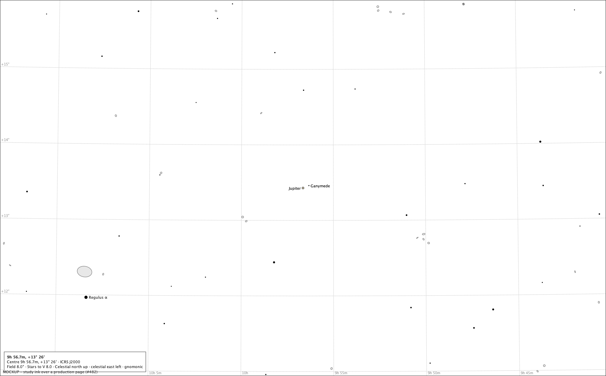

Jupiter's true disc is 0.38 mm on the sheet: the minimum mark stands for it. Drawn on the page: Jupiter at (877, 545), true 2.5 × 2.3 px, drawn 6.0 × 6.0 px (the minimum mark: a cartographic symbol); Io in front unresolved, not drawn; Europa in front unresolved, not drawn; Ganymede at (894, 538) clear; Callisto in front unresolved, not drawn; Jupiter's label at candidate 1;

## E. The owner's rulings, with their measured reasons

The issue's product questions, as the owner ruled them on #482. Nothing is built here: production rendering is #484.

1. **One switch, `Jupiter and moons on the chart`, off by default and remembered** - the Sun's and the Moon's model.
2. **Jupiter's mark is 6 px or its true size, whichever is larger.** True scale alone would lose it: its true disc is 0.95-1.56 px at 8°, below the atlas's smallest star mark (1.4 px) at every field above 8.9°. The evidence and the accessible text call the minimum *a cartographic symbol, not Jupiter's apparent diameter*.
3. **The true figure and pole, through the continuous transition and the J2000-derived pole.** The mark is a circle at its 6 px minimum and reaches the true axis ratio (0.935) as the true disc grows to twice that; the minor axis lies along the pole derived in the chart's frame. No bands, Great Red Spot or rotation. **The flattening is not visibly resolved at the current 1° floor**: there the true disc is 7.6-12.5 px and its two axes under a pixel apart.
4. **Moons are 3 px symbolic marks, each decided on its own** (section B). At the normal minimum field every moon not behind Jupiter is drawn at its exact J2000 place, overlap allowed; a moon in front of Jupiter overlaps it on purpose; a moon behind is omitted; outside the disc a collision suppresses only the lower-priority mark; above the minimum a moon is drawn only when its own mark is distinguishable. The rejected rule - all moons only when the whole system is separable - is gone; the 22:45 triple transit keeps its three in-front marks at 1° (section D).
5. **State vocabulary A** (section D, both palettes): clear, a filled dot; in front, a filled dot with a paper or background ring; behind, omitted; wholly or partly in shadow, a hollow ring (the two share it; the table keeps the difference). No ghost. No satellite shadow spots on Jupiter: the service does not compute them.
6. **Labels through adjacent candidates and the existing collision machinery**, decided separately from marks: production's eight candidates, the page's own text and marks as obstacles, a label refused alone when none of its candidates is free. No fixed right-hand rule; one crowded pair never suppresses every moon label.
7. **Horizon, page edge, stars, clicks and export**: dimmed below a drawn horizon; drawn normally with the horizon hidden; nothing off the page; the symbolic mark never erases a real star; its hit area never exposes a hidden star; export draws through the same module.
8. **Centre on chart for Jupiter** through #483's accepted seam; its button lands with the visible module (#484).
9. **Future close zoom (#481)**: no geometry, label or evidence code may assume 1° is permanent. The study reads the chart's normal minimum field rather than naming 1°; the mark's minimum, the transition and the distinguishability distances are in pixels and the positions in J2000.

