# Jupiter and the Galilean moons on the chart

Sprint 45, issue #486. The production composition - `ChartComponent` over the bundled catalogue with the Jovian module (#484, #485) attached and *Jupiter and moons on the chart* on - on the journeys #485 names. Production ink only. Jupiter is drawn at its true size or as a 6 px cartographic symbol, whichever is larger; each moon as a 3 px cartographic symbol, never its apparent diameter, which is below a pixel on every page. Positions are the Jovian service's astrometric J2000 places for the instant and observer stated (Oslo, 59.913° N, 10.752° E). Regenerate with `make jupiter-on-the-chart-study`; where each name went is in `platform.md`.

## The triple transit, 2026-12-11 22:45 UTC, 36° field

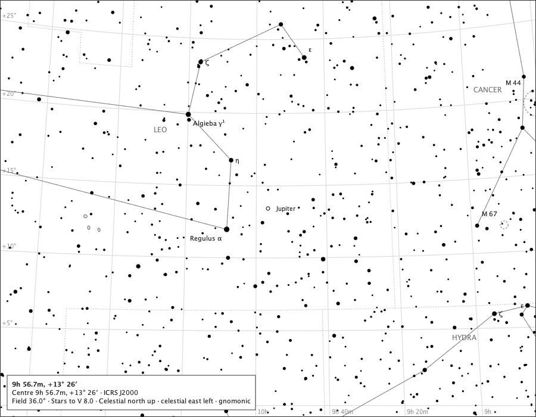

White paper, English. Jupiter 18.1° above the horizon.

| body | state | page decision | drawn at (px) | off the service's place (px) | mark |
|---|---|---|---|---:|---|
| Jupiter | - | drawn | (450.0, 350.0) | 0.0000 | 6 px cartographic symbol, 6.0 px |
| Io | in front of jupiter | in front unresolved | - | - | not drawn |
| Europa | in front of jupiter | in front unresolved | - | - | not drawn |
| Ganymede | clear of jupiter | at primary | - | - | not drawn |
| Callisto | in front of jupiter | in front unresolved | - | - | not drawn |

Spoken: Jupiter (a cartographic symbol, not Jupiter's apparent diameter).

## The triple transit, 2026-12-11 22:45 UTC, 8° field

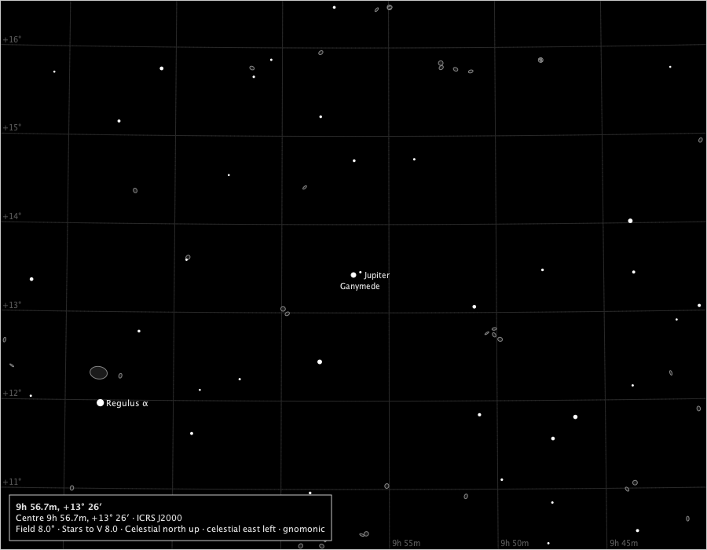

Black sky, English. Jupiter 18.1° above the horizon.

| body | state | page decision | drawn at (px) | off the service's place (px) | mark |
|---|---|---|---|---:|---|
| Jupiter | - | drawn | (450.0, 350.0) | 0.0000 | 6 px cartographic symbol, 6.0 px |
| Io | in front of jupiter | in front unresolved | - | - | not drawn |
| Europa | in front of jupiter | in front unresolved | - | - | not drawn |
| Ganymede | clear of jupiter | drawn | (458.7, 346.4) | 0.0000 | 3 px symbol |
| Callisto | in front of jupiter | in front unresolved | - | - | not drawn |

Spoken: Jupiter (a cartographic symbol, not Jupiter's apparent diameter). Ganymede (a cartographic symbol, not Ganymede's apparent diameter).

## The triple transit, 2026-12-11 22:45 UTC, 3° field

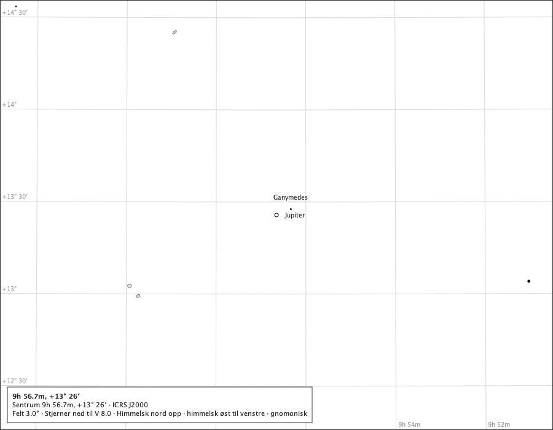

White paper, Norwegian. Jupiter 18.1° above the horizon.

| body | state | page decision | drawn at (px) | off the service's place (px) | mark |
|---|---|---|---|---:|---|
| Jupiter | - | drawn | (450.0, 350.0) | 0.0000 | 6 px cartographic symbol, 6.0 px |
| Io | in front of jupiter | in front unresolved | - | - | not drawn |
| Europa | in front of jupiter | in front unresolved | - | - | not drawn |
| Ganymede | clear of jupiter | drawn | (473.4, 340.4) | 0.0000 | 3 px symbol |
| Callisto | in front of jupiter | in front unresolved | - | - | not drawn |

Spoken: Jupiter (et kartografisk symbol, ikke Jupiters tilsynelatende diameter). Ganymedes (et kartografisk symbol, ikke Ganymedes' tilsynelatende diameter).

## The triple transit, 2026-12-11 22:45 UTC, 1° field

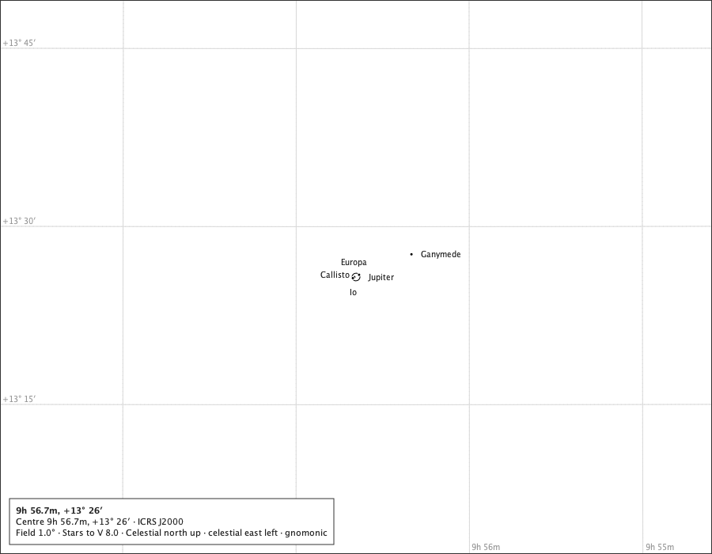

White paper, English. Jupiter 18.1° above the horizon.

| body | state | page decision | drawn at (px) | off the service's place (px) | mark |
|---|---|---|---|---:|---|
| Jupiter | - | drawn | (450.0, 350.0) | 0.0000 | true disc, 10.1 px |
| Io | in front of jupiter | drawn | (446.0, 351.4) | 0.0000 | 3 px symbol, inFront |
| Europa | in front of jupiter | drawn | (447.8, 350.1) | 0.0000 | 3 px symbol, inFront |
| Ganymede | clear of jupiter | drawn | (520.1, 321.3) | 0.0000 | 3 px symbol |
| Callisto | in front of jupiter | drawn | (453.9, 347.2) | 0.0000 | 3 px symbol, inFront |

Spoken: Jupiter. Ganymede (a cartographic symbol, not Ganymede's apparent diameter). Europa, in front of Jupiter (a cartographic symbol, not Europa's apparent diameter). Io, in front of Jupiter (a cartographic symbol, not Io's apparent diameter). Callisto, in front of Jupiter (a cartographic symbol, not Callisto's apparent diameter).

## The 11 December 2026 sequence at 22:30 UTC, 1° field

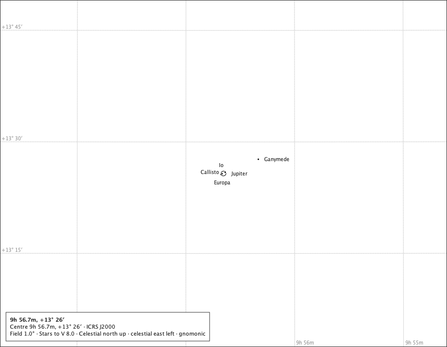

White paper, English. Jupiter 16.2° above the horizon.

| body | state | page decision | drawn at (px) | off the service's place (px) | mark |
|---|---|---|---|---:|---|
| Jupiter | - | drawn | (450.0, 350.0) | 0.0000 | true disc, 10.1 px |
| Io | clear of jupiter | drawn | (445.0, 351.8) | 0.0000 | 3 px symbol |
| Europa | in front of jupiter | drawn | (447.0, 350.4) | 0.0000 | 3 px symbol, inFront |
| Ganymede | clear of jupiter | drawn | (520.1, 321.3) | 0.0000 | 3 px symbol |
| Callisto | in front of jupiter | drawn | (453.4, 347.4) | 0.0000 | 3 px symbol, inFront |

Spoken: Jupiter. Io (a cartographic symbol, not Io's apparent diameter). Ganymede (a cartographic symbol, not Ganymede's apparent diameter). Europa, in front of Jupiter (a cartographic symbol, not Europa's apparent diameter). Callisto, in front of Jupiter (a cartographic symbol, not Callisto's apparent diameter).

## The 11 December 2026 sequence at 22:55 UTC, 1° field

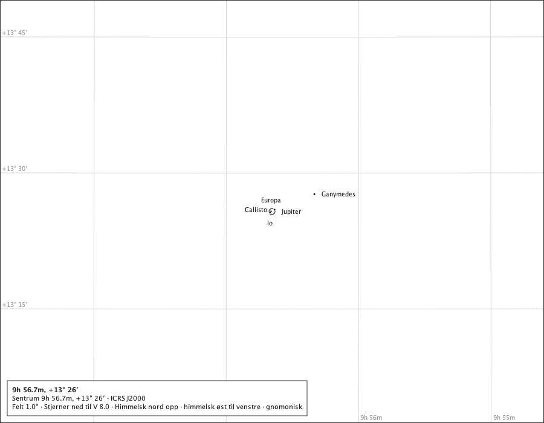

White paper, Norwegian. Jupiter 19.3° above the horizon.

| body | state | page decision | drawn at (px) | off the service's place (px) | mark |
|---|---|---|---|---:|---|
| Jupiter | - | drawn | (450.0, 350.0) | 0.0000 | true disc, 10.1 px |
| Io | in front of jupiter | drawn | (446.7, 351.1) | 0.0000 | 3 px symbol, inFront |
| Europa | in front of jupiter | drawn | (448.4, 349.9) | 0.0000 | 3 px symbol, inFront |
| Ganymede | clear of jupiter | drawn | (520.1, 321.3) | 0.0000 | 3 px symbol |
| Callisto | in front of jupiter | drawn | (454.2, 347.1) | 0.0000 | 3 px symbol, inFront |

Spoken: Jupiter. Ganymedes (et kartografisk symbol, ikke Ganymedes' tilsynelatende diameter). Europa, foran Jupiter (et kartografisk symbol, ikke Europas tilsynelatende diameter). Io, foran Jupiter (et kartografisk symbol, ikke Ios tilsynelatende diameter). Callisto, foran Jupiter (et kartografisk symbol, ikke Callistos tilsynelatende diameter).

## The 11 December 2026 sequence at 23:00 UTC, 1° field

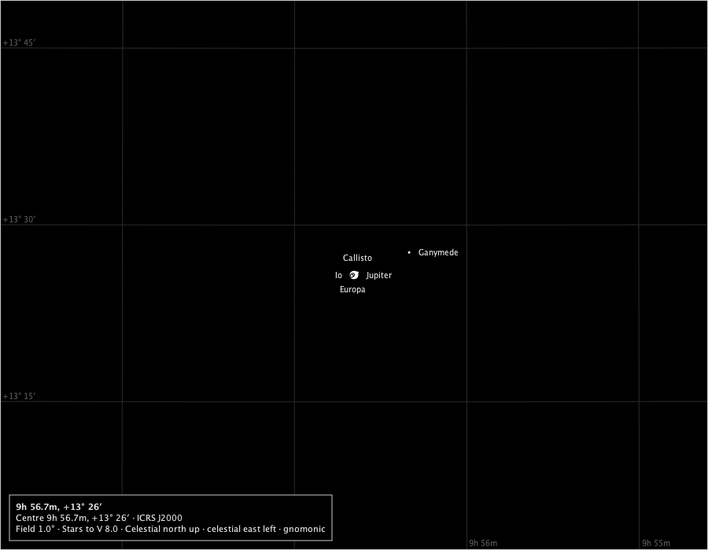

Black sky, English. Jupiter 19.9° above the horizon.

| body | state | page decision | drawn at (px) | off the service's place (px) | mark |
|---|---|---|---|---:|---|
| Jupiter | - | drawn | (450.0, 350.0) | 0.0000 | true disc, 10.1 px |
| Io | in front of jupiter | drawn | (447.1, 351.0) | 0.0000 | 3 px symbol, inFront |
| Europa | in front of jupiter | drawn | (448.6, 349.8) | 0.0000 | 3 px symbol, inFront |
| Ganymede | clear of jupiter | drawn | (520.1, 321.3) | 0.0000 | 3 px symbol |
| Callisto | clear of jupiter | drawn | (454.4, 347.0) | 0.0000 | 3 px symbol |

Spoken: Jupiter. Callisto (a cartographic symbol, not Callisto's apparent diameter). Ganymede (a cartographic symbol, not Ganymede's apparent diameter). Europa, in front of Jupiter (a cartographic symbol, not Europa's apparent diameter). Io, in front of Jupiter (a cartographic symbol, not Io's apparent diameter).

## A normal spread, all four clear, 2026-03-06 06:00 UTC, 1° field

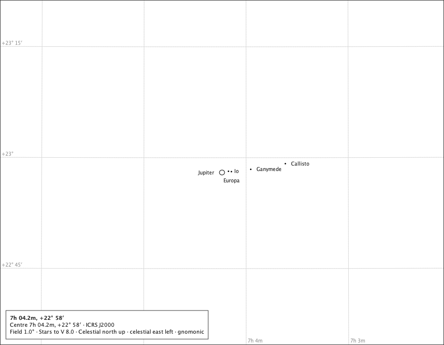

White paper, English. Jupiter 5.3° below the horizon.

| body | state | page decision | drawn at (px) | off the service's place (px) | mark |
|---|---|---|---|---:|---|
| Jupiter | - | drawn | (450.0, 350.0) | 0.0000 | true disc, 10.5 px |
| Io | clear of jupiter | drawn | (463.1, 347.5) | 0.0000 | 3 px symbol |
| Europa | clear of jupiter | drawn | (469.1, 348.2) | 0.0000 | 3 px symbol |
| Ganymede | clear of jupiter | drawn | (508.3, 343.6) | 0.0000 | 3 px symbol |
| Callisto | clear of jupiter | drawn | (578.4, 332.1) | 0.0000 | 3 px symbol |

Spoken: Jupiter. Europa (a cartographic symbol, not Europa's apparent diameter). Io (a cartographic symbol, not Io's apparent diameter). Callisto (a cartographic symbol, not Callisto's apparent diameter). Ganymede (a cartographic symbol, not Ganymede's apparent diameter).

## The same spread at 3° on the black sky

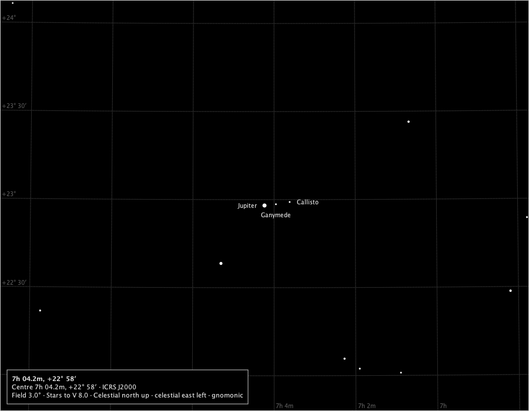

Black sky, English. Jupiter 5.3° below the horizon.

| body | state | page decision | drawn at (px) | off the service's place (px) | mark |
|---|---|---|---|---:|---|
| Jupiter | - | drawn | (450.0, 350.0) | 0.0000 | 6 px cartographic symbol, 6.0 px |
| Io | clear of jupiter | at primary | - | - | not drawn |
| Europa | clear of jupiter | at primary | - | - | not drawn |
| Ganymede | clear of jupiter | drawn | (469.4, 347.9) | 0.0000 | 3 px symbol |
| Callisto | clear of jupiter | drawn | (492.8, 344.0) | 0.0000 | 3 px symbol |

Spoken: Jupiter (a cartographic symbol, not Jupiter's apparent diameter). Callisto (a cartographic symbol, not Callisto's apparent diameter). Ganymede (a cartographic symbol, not Ganymede's apparent diameter).

## Io behind Jupiter (Horizons O), 2026-12-02 07:00 UTC, 1° field

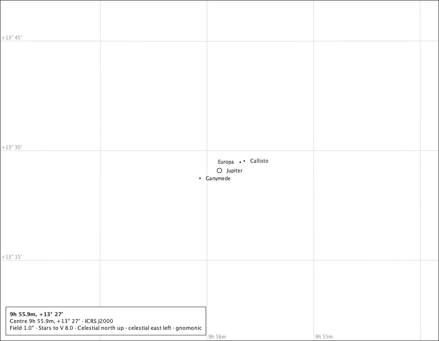

White paper, English. Jupiter 35.9° above the horizon.

| body | state | page decision | drawn at (px) | off the service's place (px) | mark |
|---|---|---|---|---:|---|
| Jupiter | - | drawn | (450.0, 350.0) | 0.0000 | true disc, 9.8 px |
| Io | behind jupiter | behind | - | - | not drawn |
| Europa | clear of jupiter | drawn | (492.4, 332.9) | 0.0000 | 3 px symbol |
| Ganymede | clear of jupiter | drawn | (410.0, 366.0) | 0.0000 | 3 px symbol |
| Callisto | clear of jupiter | drawn | (500.8, 330.6) | 0.0000 | 3 px symbol |

Spoken: Jupiter. Europa (a cartographic symbol, not Europa's apparent diameter). Callisto (a cartographic symbol, not Callisto's apparent diameter). Ganymede (a cartographic symbol, not Ganymede's apparent diameter).

## Io wholly in Jupiter's shadow (Horizons u), 2026-12-02 04:00 UTC, 1° field

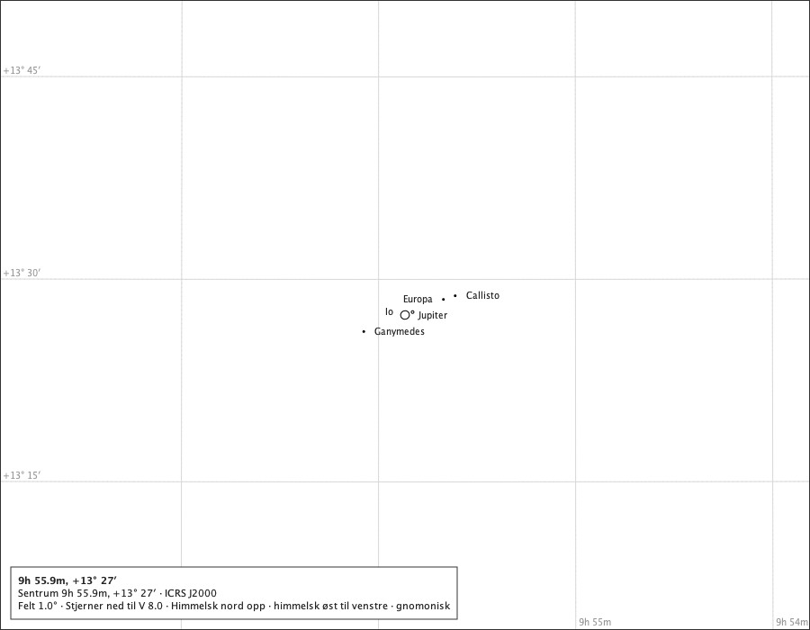

White paper, Norwegian. Jupiter 43.1° above the horizon.

| body | state | page decision | drawn at (px) | off the service's place (px) | mark |
|---|---|---|---|---:|---|
| Jupiter | - | drawn | (450.0, 350.0) | 0.0000 | true disc, 9.8 px |
| Io | in jupiters shadow | drawn | (458.5, 346.7) | 0.0000 | 3 px symbol, shadowed |
| Europa | clear of jupiter | drawn | (492.7, 332.7) | 0.0000 | 3 px symbol |
| Ganymede | clear of jupiter | drawn | (404.2, 368.4) | 0.0000 | 3 px symbol |
| Callisto | clear of jupiter | drawn | (505.8, 328.6) | 0.0000 | 3 px symbol |

Spoken: Jupiter. Io, i Jupiters skygge (et kartografisk symbol, ikke Ios tilsynelatende diameter). Europa (et kartografisk symbol, ikke Europas tilsynelatende diameter). Callisto (et kartografisk symbol, ikke Callistos tilsynelatende diameter). Ganymedes (et kartografisk symbol, ikke Ganymedes' tilsynelatende diameter).

## Io partly in Jupiter's shadow (Horizons p), 2026-12-21 15:00 UTC, 1° field

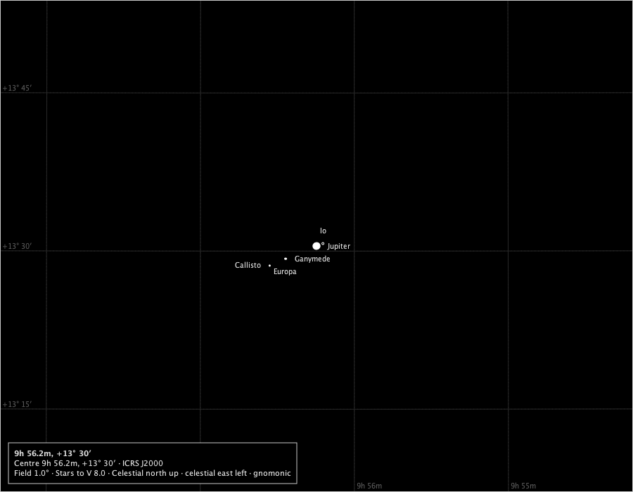

Black sky, English. Jupiter 16.7° below the horizon.

| body | state | page decision | drawn at (px) | off the service's place (px) | mark |
|---|---|---|---|---:|---|
| Jupiter | - | drawn | (450.0, 350.0) | 0.0000 | true disc, 10.3 px |
| Io | partly in jupiters shadow | drawn | (459.1, 346.5) | 0.0000 | 3 px symbol, shadowed |
| Europa | clear of jupiter | drawn | (405.5, 368.1) | 0.0000 | 3 px symbol |
| Ganymede | clear of jupiter | drawn | (406.6, 368.2) | 0.0000 | 3 px symbol |
| Callisto | clear of jupiter | drawn | (383.4, 377.9) | 0.0000 | 3 px symbol |

Spoken: Jupiter. Io, in Jupiter's shadow (a cartographic symbol, not Io's apparent diameter). Europa (a cartographic symbol, not Europa's apparent diameter). Callisto (a cartographic symbol, not Callisto's apparent diameter). Ganymede (a cartographic symbol, not Ganymede's apparent diameter).

## Jupiter below the drawn horizon, 2026-12-01 12:20 UTC, 8° field

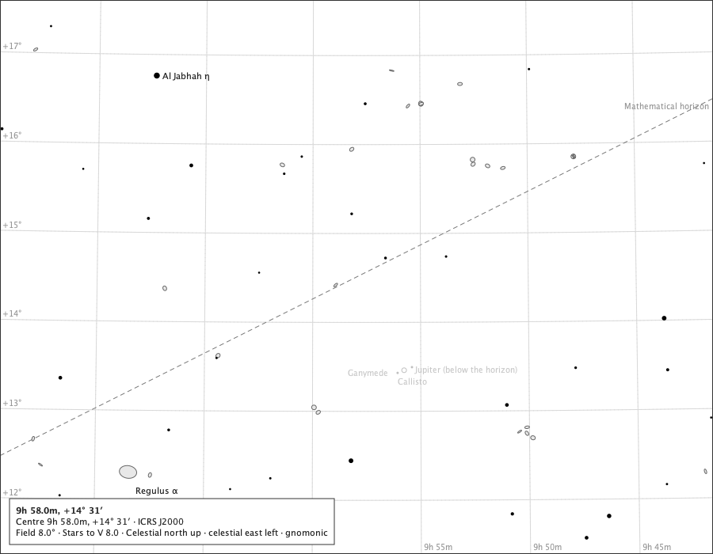

White paper, English. Jupiter 1.2° below the horizon.

| body | state | page decision | drawn at (px) | off the service's place (px) | mark |
|---|---|---|---|---:|---|
| Jupiter | below the horizon | drawn | (510.1, 467.8) | 0.0000 | 6 px cartographic symbol, 6.0 px |
| Io | clear of jupiter | at primary | - | - | not drawn |
| Europa | clear of jupiter | at primary | - | - | not drawn |
| Ganymede | clear of jupiter | drawn | (501.9, 471.2) | 0.0000 | 3 px symbol |
| Callisto | clear of jupiter | drawn | (520.0, 463.9) | 0.0000 | 3 px symbol |

Spoken: Jupiter (below the horizon) (a cartographic symbol, not Jupiter's apparent diameter). Callisto (a cartographic symbol, not Callisto's apparent diameter). Ganymede (a cartographic symbol, not Ganymede's apparent diameter).

## The same page with the horizon hidden

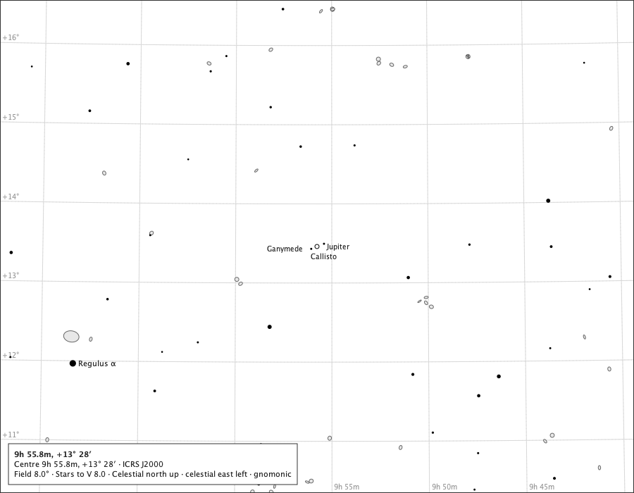

White paper, English. Jupiter 1.2° below the horizon.

| body | state | page decision | drawn at (px) | off the service's place (px) | mark |
|---|---|---|---|---:|---|
| Jupiter | - | drawn | (450.0, 350.0) | 0.0000 | 6 px cartographic symbol, 6.0 px |
| Io | clear of jupiter | at primary | - | - | not drawn |
| Europa | clear of jupiter | at primary | - | - | not drawn |
| Ganymede | clear of jupiter | drawn | (441.8, 353.3) | 0.0000 | 3 px symbol |
| Callisto | clear of jupiter | drawn | (459.9, 346.1) | 0.0000 | 3 px symbol |

Spoken: Jupiter (a cartographic symbol, not Jupiter's apparent diameter). Callisto (a cartographic symbol, not Callisto's apparent diameter). Ganymede (a cartographic symbol, not Ganymede's apparent diameter).

## What resolves at each scale

On the 900 × 700 page. A moon not drawn above the normal minimum field is recorded with its reason - at Jupiter's edge, colliding with a higher-precedence moon, or in front of a disc too small to hold its mark - never silently enlarged. At the normal minimum field every moon not behind Jupiter is drawn.

| instant | field | Jupiter | Io | Europa | Ganymede | Callisto |
|---|---:|---|---|---|---|---|
| 2026-12-11 22:45 | 36° | 6 px symbol | in front unresolved | in front unresolved | at primary | in front unresolved |
| 2026-12-11 22:45 | 24° | 6 px symbol | in front unresolved | in front unresolved | at primary | in front unresolved |
| 2026-12-11 22:45 | 12° | 6 px symbol | in front unresolved | in front unresolved | at primary | in front unresolved |
| 2026-12-11 22:45 | 8° | 6 px symbol | in front unresolved | in front unresolved | drawn | in front unresolved |
| 2026-12-11 22:45 | 6° | 6 px symbol | in front unresolved | in front unresolved | drawn | in front unresolved |
| 2026-12-11 22:45 | 4° | 6 px symbol | in front unresolved | in front unresolved | drawn | in front unresolved |
| 2026-12-11 22:45 | 3° | 6 px symbol | in front unresolved | in front unresolved | drawn | in front unresolved |
| 2026-12-11 22:45 | 2° | 6 px symbol | in front unresolved | in front unresolved | drawn | in front unresolved |
| 2026-12-11 22:45 | 1° | true disc | drawn | drawn | drawn | drawn |
| 2026-03-06 06:00 | 36° | 6 px symbol | at primary | at primary | at primary | at primary |
| 2026-03-06 06:00 | 24° | 6 px symbol | at primary | at primary | at primary | at primary |
| 2026-03-06 06:00 | 12° | 6 px symbol | at primary | at primary | at primary | drawn |
| 2026-03-06 06:00 | 8° | 6 px symbol | at primary | at primary | at primary | drawn |
| 2026-03-06 06:00 | 6° | 6 px symbol | at primary | at primary | drawn | drawn |
| 2026-03-06 06:00 | 4° | 6 px symbol | at primary | at primary | drawn | drawn |
| 2026-03-06 06:00 | 3° | 6 px symbol | at primary | at primary | drawn | drawn |
| 2026-03-06 06:00 | 2° | 6 px symbol | at primary | drawn | drawn | drawn |
| 2026-03-06 06:00 | 1° | true disc | drawn | drawn | drawn | drawn |

## The exported sheet, at a measured scale

The existing two-body sheet is 42° wide; the four moons do not resolve there. The sheet's field is measured instead: at the triple transit (2026-12-11 22:45 UTC, Oslo), on the A4 sheet's own page, each supported field from the widest, and the first at which every moon not behind Jupiter is drawn. Moons in front of Jupiter need a disc that can hold their marks, which the sheet reaches only at the normal minimum field.

| field | Io | Europa | Ganymede | Callisto |
|---:|---|---|---|---|
| 42° | in front unresolved | in front unresolved | at primary | in front unresolved |
| 36° | in front unresolved | in front unresolved | at primary | in front unresolved |
| 24° | in front unresolved | in front unresolved | at primary | in front unresolved |
| 18° | in front unresolved | in front unresolved | at primary | in front unresolved |
| 12° | in front unresolved | in front unresolved | at primary | in front unresolved |
| 8° | in front unresolved | in front unresolved | drawn | in front unresolved |
| 6° | in front unresolved | in front unresolved | drawn | in front unresolved |
| 4° | in front unresolved | in front unresolved | drawn | in front unresolved |
| 3° | in front unresolved | in front unresolved | drawn | in front unresolved |
| 2° | in front unresolved | in front unresolved | drawn | in front unresolved |
| 1° | drawn | drawn | drawn | drawn |

**The sheet: A4, 1°**, centred on Jupiter, as `sheet-a4-jovian.png` (300 dpi, 3508 × 2480 px) and `sheet-a4-jovian.pdf`. On paper Jupiter's true disc is 3.1 mm and each moon's mark 1.1 mm; the screen and the exported sheet draw the same Jupiter centre, pole, figure, moon positions, states and names - the packaged journey *jovian sheet OK* holds them pixel for pixel.

