# The Moon on the chart

Sprint 37, issue #416. The production composition - `ChartComponent` over the bundled catalogue, with the Solar System module attached and the Moon switched on - under the #414 ruling: a true-scale phased disc in the page's own ink, its dark side inked, its lit side turned to the bright limb χ through the page's own north and east at the Moon, the terminator a half-ellipse of axis ratio |cos i|; its name in an adjacent box or not at all; dimmed below a drawn horizon. The instants are the named events of `docs/studies/solar-system/moon-events-2026.txt`; positions and phases are the ephemeris's for the instant and observer stated. Regenerate with `make moon-on-the-chart-study`.

## The June 2026 lunation, Oslo, 3° pages

### The new Moon, 2026-06-15T02:54:00Z

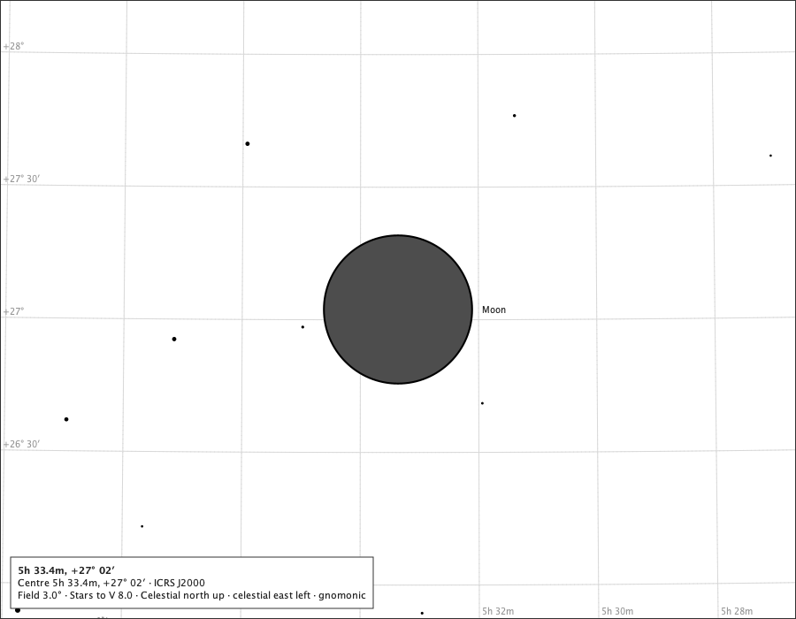

The Moon table: 0.1 % lit, near new Moon; lit side not well-defined (near new Moon); diameter 33′ 31.3″. Drawn: Moon at (450.0, 350.0), disc 167.6 px, name placed;

### First quarter, 2026-06-21T21:55:00Z

The Moon table: 50.1 % lit, near first quarter; lit side 293° (west-northwest); diameter 30′ 48.9″. Drawn: Moon at (450.0, 350.0), disc 154.0 px, name placed;

### The full Moon, 2026-06-29T23:57:00Z

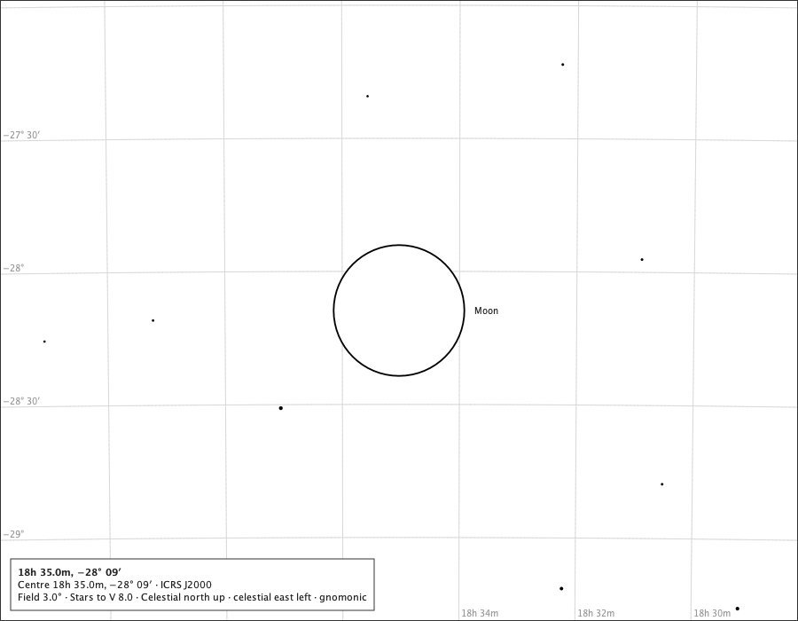

The Moon table: 99.8 % lit, near full Moon; lit side not well-defined (near full Moon); diameter 29′ 29.7″. Drawn: Moon at (450.0, 350.0), disc 147.4 px, name placed;

### Last quarter, 2026-07-07T19:29:00Z

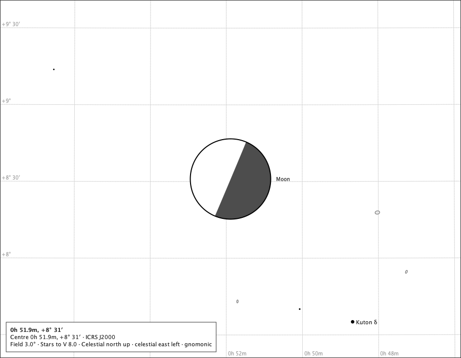

The Moon table: 50.2 % lit, near last quarter; lit side 67° (east-northeast); diameter 31′ 24.8″. Drawn: Moon at (450.0, 350.0), disc 157.0 px, name placed;

### First quarter from Cape Town (33.93° S)

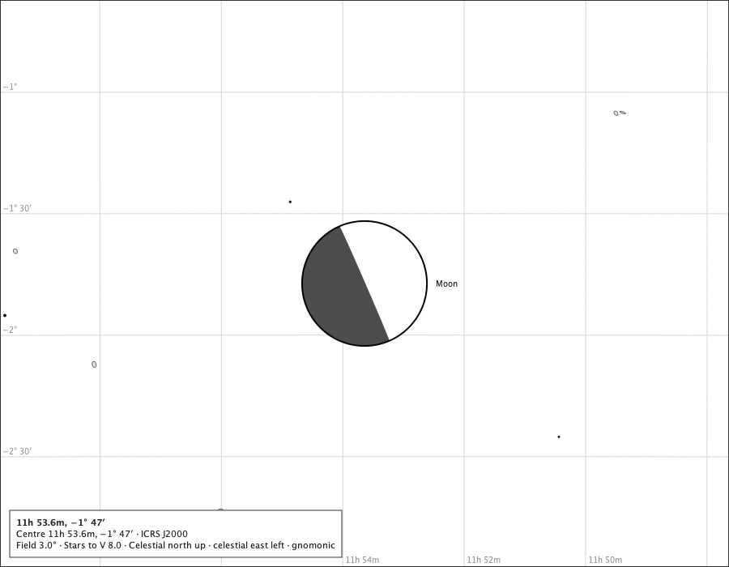

The chart is the sky's, north up and east left wherever the reader stands: the lit side is where χ puts it, and a southern reader who turns to face the Moon sees the same disc turned over. The Moon table: 49.3 % lit, near first quarter; lit side 293° (west-northwest); diameter 30′ 50.9″. Drawn: Moon at (450.0, 350.0), disc 154.2 px, name placed;

### First quarter on the black sky

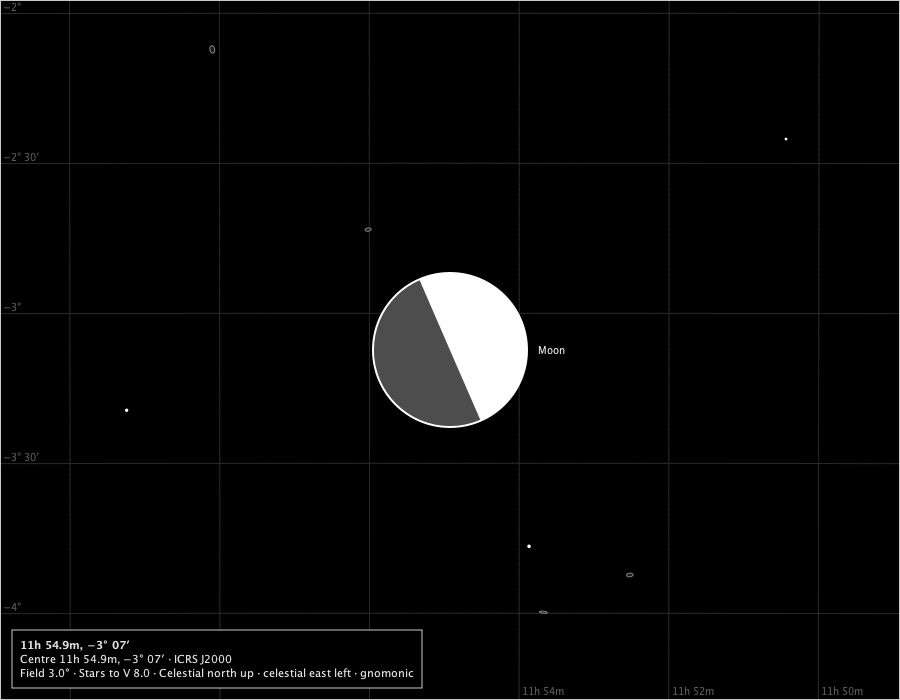

The lit side in the black sky's star ink, the dark side a little above the sky's ground. Drawn: Moon at (450.0, 350.0), disc 154.0 px, name placed;

### Første kvarter, 8°, the page's words in Norwegian

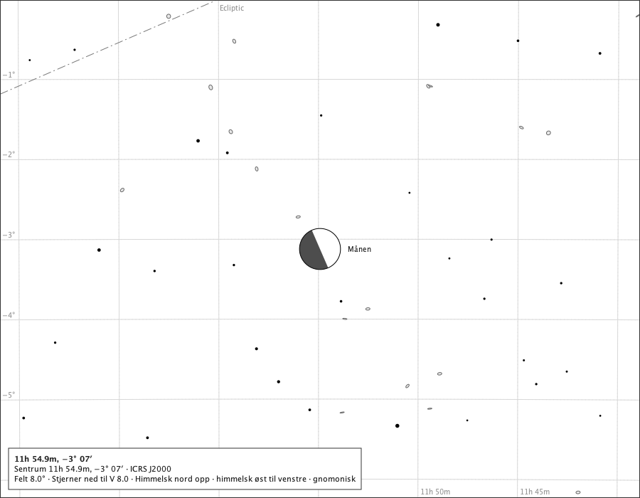

The Moon table: 50,1 % lit, nær første kvarter; lit side 293° (vest-nordvest); diameter 30′ 48,9″. Drawn: Månen at (450.0, 350.0), disc 57.7 px, name placed;

## The year's nearest perigee and farthest apogee, Oslo, 3° pages

### The year's nearest perigee, 2026-06-14T23:18:00Z

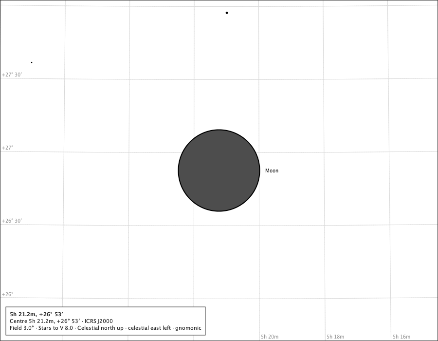

Seen from Oslo the Moon is 357507 km away and 2004.8″ across; the disc is drawn at that size. Drawn: Moon at (450.0, 350.0), disc 167.0 px, name placed;

### The year's farthest apogee, 2026-12-11T06:46:00Z

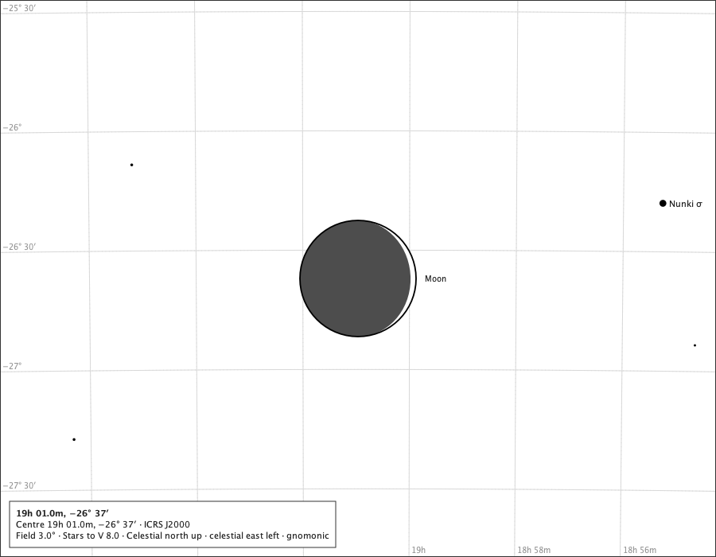

Seen from Oslo the Moon is 409024 km away and 1752.3″ across; the disc is drawn at that size. Drawn: Moon at (450.0, 350.0), disc 146.0 px, name placed;

## The new Moon beside the Sun, and the Moon below the horizon

### The new Moon of June 2026 with the Sun, 12°

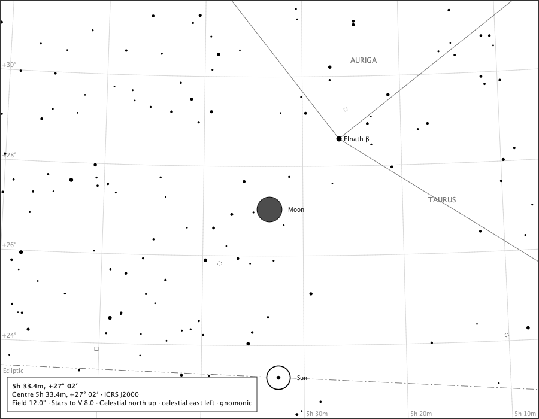

The Moon 3.8° from the Sun, 0.1 % lit: a disc of dark side beside the Sun's ring. Where the two overlap, the nearer covers the farther. Drawn: Sun at (465.0, 631.1), disc 39.4 px, name placed; Moon at (450.0, 350.0), disc 41.8 px, name placed;

### Last quarter at Oslo, the horizon drawn, 36°

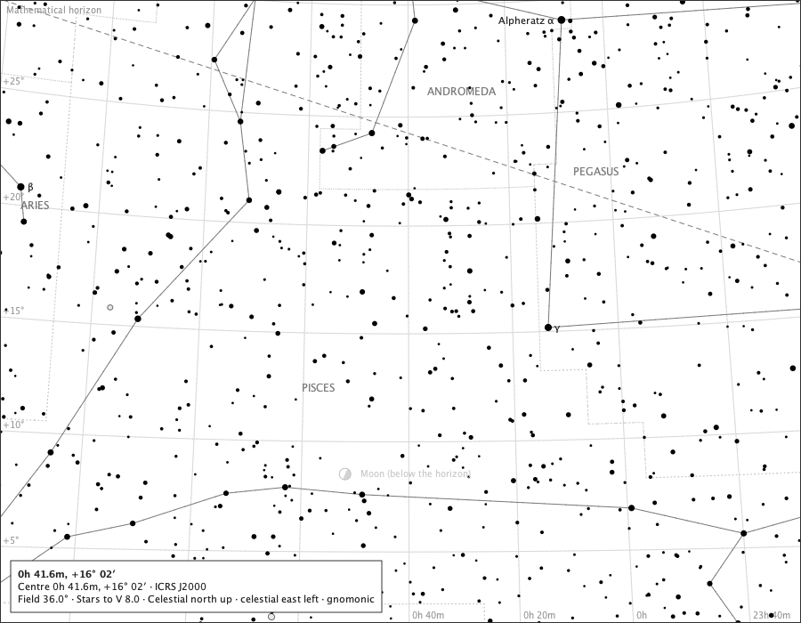

The Moon at -15.9° of altitude, the page centred halfway between it and the drawn horizon nearest it: dimmed towards the ground, its name carrying the status. Drawn: Moon (below the horizon) at (387.7, 532.6), disc 12.9 px, name placed;

## The June 2026 lunation as a row of phases

From the fixture's new Moon, 2026-06-15T02:54:00Z, every 24 hours, Oslo: each disc cut from its own 6° page drawn by the production component (left to right, ten to a row). Beside the Moon table's own cells, what the rendered pixels of the same Moon on its own 1° page show - the disc some 480 px across, every pixel classed as lit, dark side or the limb's own ink, which is left out: the share of the disc drawn lit, and the direction the lit side faces - the lit pixels' centroid for a crescent, the opposite of the dark pixels' for a gibbous disc - read back through the page's north and east at the Moon.

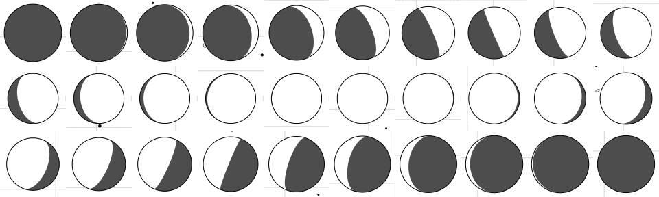

| day | instant (UTC) | table: lit | table: phase | table: lit side | drawn: lit | drawn: facing | agrees |
|---:|---|---:|---|---|---:|---|---|
| 0 | 2026-06-15T02:54:00Z | 0.1 % | near new Moon | not well-defined (near new Moon) | 0.0 % | - | yes (share) |
| 1 | 2026-06-16T02:54:00Z | 1.7 % | near new Moon | not well-defined (near new Moon) | 0.8 % | - | yes (share) |
| 2 | 2026-06-17T02:54:00Z | 6.2 % | waxing crescent | 276° (west) | 5.2 % | 277° west | yes |
| 3 | 2026-06-18T02:54:00Z | 13.2 % | waxing crescent | 284° (west-northwest) | 12.2 % | 284° west-northwest | yes |
| 4 | 2026-06-19T02:54:00Z | 21.9 % | waxing crescent | 289° (west-northwest) | 21.1 % | 289° west-northwest | yes |
| 5 | 2026-06-20T02:54:00Z | 31.7 % | waxing crescent | 292° (west-northwest) | 31.1 % | 292° west-northwest | yes |
| 6 | 2026-06-21T02:54:00Z | 42.0 % | waxing crescent | 294° (west-northwest) | 41.7 % | 294° west-northwest | yes |
| 7 | 2026-06-22T02:54:00Z | 52.3 % | waxing gibbous | 293° (west-northwest) | 52.2 % | 293° west-northwest | yes |
| 8 | 2026-06-23T02:54:00Z | 62.2 % | waxing gibbous | 292° (west-northwest) | 62.3 % | 292° west-northwest | yes |
| 9 | 2026-06-24T02:54:00Z | 71.4 % | waxing gibbous | 289° (west-northwest) | 71.7 % | 289° west-northwest | yes |
| 10 | 2026-06-25T02:54:00Z | 79.6 % | waxing gibbous | 285° (west-northwest) | 80.1 % | 285° west-northwest | yes |
| 11 | 2026-06-26T02:54:00Z | 86.7 % | waxing gibbous | 279° (west) | 87.3 % | 279° west | yes |
| 12 | 2026-06-27T02:54:00Z | 92.3 % | waxing gibbous | 272° (west) | 93.0 % | 272° west | yes |
| 13 | 2026-06-28T02:54:00Z | 96.5 % | waxing gibbous | 262° (west) | 97.2 % | 262° west | yes |
| 14 | 2026-06-29T02:54:00Z | 99.0 % | near full Moon | not well-defined (near full Moon) | 99.5 % | - | yes (share) |
| 15 | 2026-06-30T02:54:00Z | 99.8 % | near full Moon | not well-defined (near full Moon) | 99.6 % | - | yes (share) |
| 16 | 2026-07-01T02:54:00Z | 98.8 % | near full Moon | not well-defined (near full Moon) | 99.3 % | - | yes (share) |
| 17 | 2026-07-02T02:54:00Z | 96.0 % | waning gibbous | 84° (east) | 96.7 % | 84° east | yes |
| 18 | 2026-07-03T02:54:00Z | 91.4 % | waning gibbous | 76° (east-northeast) | 92.0 % | 76° east-northeast | yes |
| 19 | 2026-07-04T02:54:00Z | 85.0 % | waning gibbous | 71° (east-northeast) | 85.6 % | 71° east-northeast | yes |
| 20 | 2026-07-05T02:54:00Z | 77.2 % | waning gibbous | 68° (east-northeast) | 77.6 % | 68° east-northeast | yes |
| 21 | 2026-07-06T02:54:00Z | 68.0 % | waning gibbous | 66° (east-northeast) | 68.2 % | 66° east-northeast | yes |
| 22 | 2026-07-07T02:54:00Z | 57.7 % | waning gibbous | 66° (east-northeast) | 57.7 % | 66° east-northeast | yes |
| 23 | 2026-07-08T02:54:00Z | 46.7 % | waning crescent | 68° (east-northeast) | 46.5 % | 68° east-northeast | yes |
| 24 | 2026-07-09T02:54:00Z | 35.6 % | waning crescent | 71° (east-northeast) | 35.2 % | 71° east-northeast | yes |
| 25 | 2026-07-10T02:54:00Z | 24.9 % | waning crescent | 76° (east-northeast) | 24.3 % | 76° east-northeast | yes |
| 26 | 2026-07-11T02:54:00Z | 15.4 % | waning crescent | 83° (east) | 14.5 % | 83° east | yes |
| 27 | 2026-07-12T02:54:00Z | 7.7 % | waning crescent | 91° (east) | 6.7 % | 91° east | yes |
| 28 | 2026-07-13T02:54:00Z | 2.5 % | waning crescent | 102° (east-southeast) | 1.5 % | 102° east-southeast | yes |
| 29 | 2026-07-14T02:54:00Z | 0.1 % | near new Moon | not well-defined (near new Moon) | 0.0 % | - | yes (share) |

Where the table states a lit side, the drawn disc faces the table's compass point and shows its lit share within 2 percentage points on 24 of 24 days.

