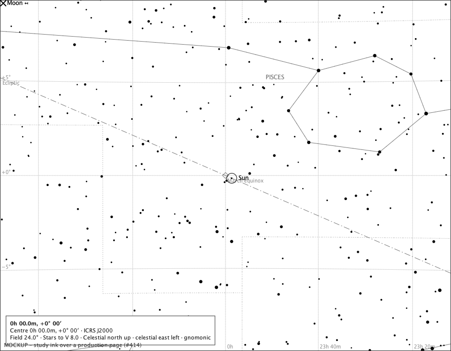
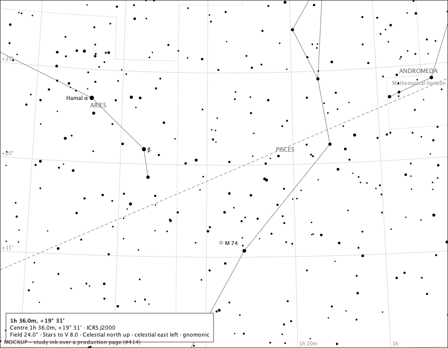
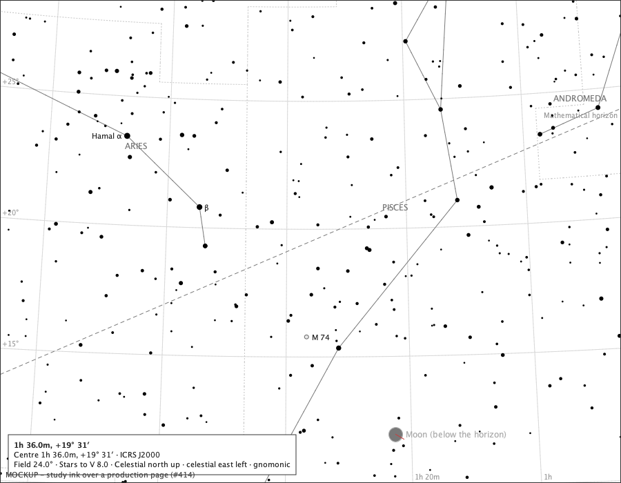
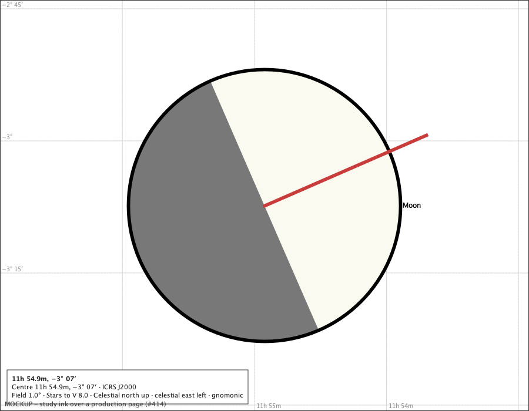
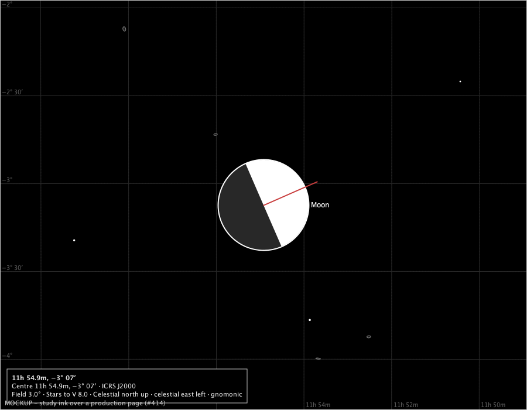
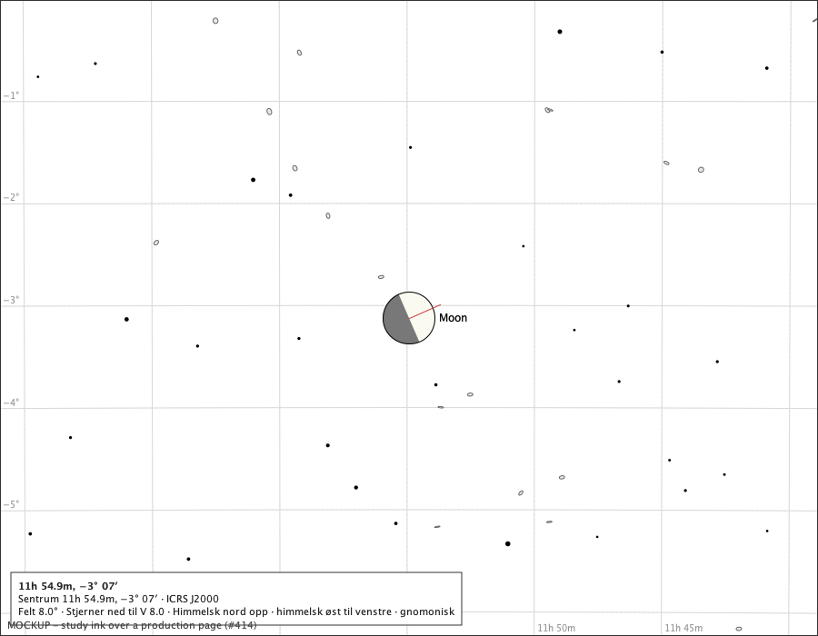
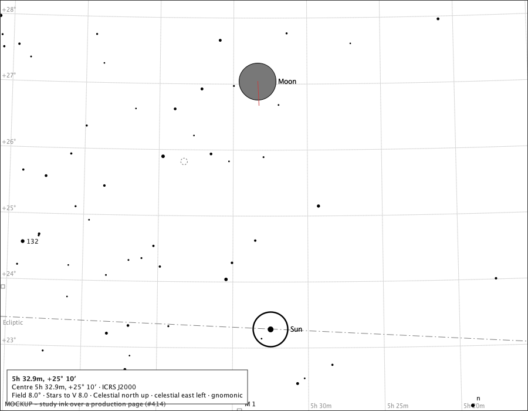
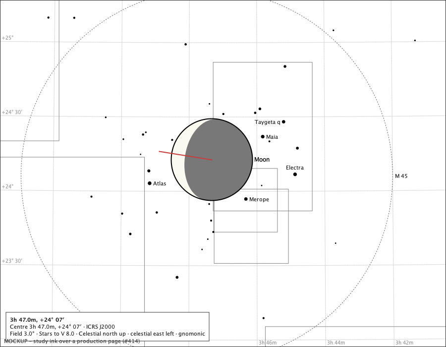
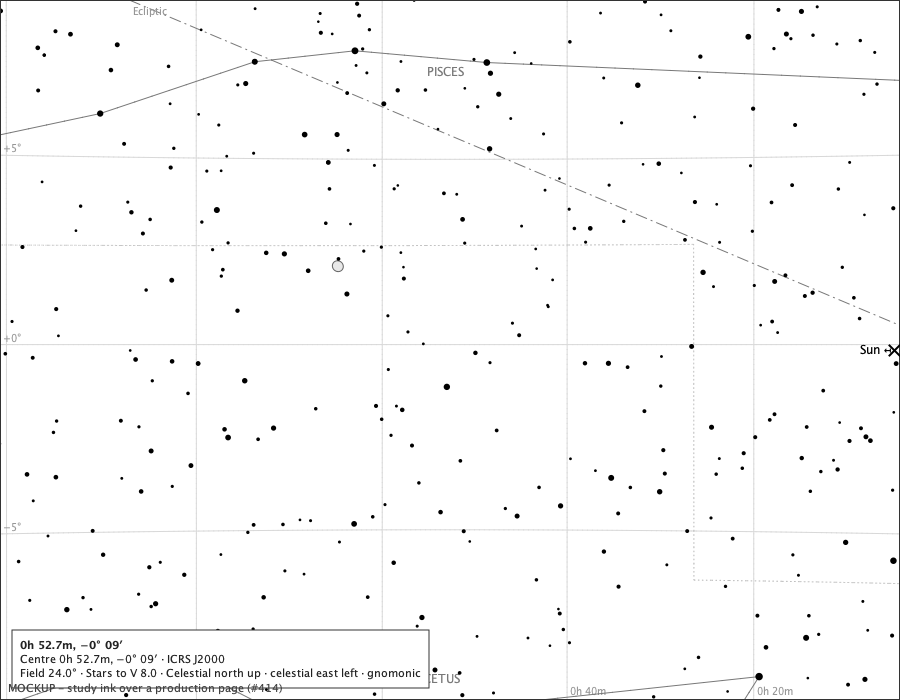

# The Sun and the Moon on the page: measurements and mockups

Sprint 37, issue #414. What a cartography rule would mean on the atlas's own pages, measured through the production projections and the bundled ephemeris, with candidate marks drawn by this study over pages the production composition painted. Nothing here is production rendering; every image is a mockup, and says so in its corner. Regenerate with `make solar-cartography-study`.

## A. A true-scale disc on every page the atlas draws

The Sun's disc spans 31′ 28″ to 32′ 31″ over the year (`docs/studies/solar-system/measurements.md`); the Moon's, 29′ 08″ at the farthest apogee to 33′ 42″ at the nearest perigee (`moon-measurements.md`). The table takes a nominal **32′** disc and measures it through the projection each field uses, at the page centre and at the page's corner, where a tangent projection stretches most. Pages: the released component and the gallery at 900 × 700 px; the printable sheet on A4 and US Letter at 300 dpi, whose chart rectangles are 271.6 × 184.6 mm and 254.0 × 190.5 mm. The brightest star the atlas draws is a disc of 10 px; the faintest, 1.4 px, which is the atlas's minimum visible ink.

| field | projection | 900 × 700 px: centre | corner | A4 sheet: centre | corner (mm) | Letter sheet: centre |
|---:|---|---:|---:|---:|---:|---:|
| 180° | orthographic | 2.9 px | 2.9 px | 9.1 px = 0.77 mm | 0.77 mm | 0.80 mm |
| 120° | stereographic | 3.6 px | 4.7 px | 12.9 px = 1.09 mm | 1.39 mm | 1.02 mm |
| 90° | stereographic | 5.1 px | 5.8 px | 18.0 px = 1.53 mm | 1.74 mm | 1.43 mm |
| 60° | stereographic | 7.8 px | 8.3 px | 27.9 px = 2.36 mm | 2.50 mm | 2.21 mm |
| 42° | gnomonic | 10.9 px | 11.9 px | 38.9 px = 3.29 mm | 3.55 mm | 3.08 mm |
| 36° | gnomonic | 12.9 px | 13.7 px | 46.0 px = 3.89 mm | 4.11 mm | 3.64 mm |
| 24° | gnomonic | 19.7 px | 20.3 px | 70.2 px = 5.95 mm | 6.09 mm | 5.56 mm |
| 18° | gnomonic | 26.4 px | 26.9 px | 94.3 px = 7.98 mm | 8.09 mm | 7.46 mm |
| 12° | gnomonic | 39.9 px | 40.1 px | 142.1 px = 12.03 mm | 12.10 mm | 11.25 mm |
| 8° | gnomonic | 59.9 px | 60.1 px | 213.5 px = 18.08 mm | 18.13 mm | 16.91 mm |
| 6° | gnomonic | 79.9 px | 80.1 px | 284.9 px = 24.12 mm | 24.16 mm | 22.56 mm |
| 4° | gnomonic | 120.0 px | 120.0 px | 427.6 px = 36.20 mm | 36.22 mm | 33.85 mm |
| 3° | gnomonic | 160.0 px | 160.0 px | 570.2 px = 48.28 mm | 48.29 mm | 45.15 mm |
| 2° | gnomonic | 240.0 px | 240.0 px | 855.4 px = 72.42 mm | 72.43 mm | 67.73 mm |
| 1° | gnomonic | 480.0 px | 480.0 px | 1710.9 px = 144.86 mm | 144.86 mm | 135.46 mm |

The sheet's pixel widths: A4 3508 px across the paper, 3208 px across the chart rectangle; Letter 3000 px across the chart rectangle. At 42°, the sheet's own field, the two discs on paper are about 3.3 mm across - a lentil, not a dot.

## B. Where north points on the page

A position angle is measured from celestial north through east. On the page, north is straight up only at the centre of a page whose centre is on the equator; elsewhere the projected meridian turns. The bright-limb angle χ of the Moon table is an angle from *celestial* north, so drawing the lit side means turning χ by the angle between page-up and the projected north at the Moon's own position - never recomputing χ from J2000 positions, as ruled (#406, M2). Measured here: the turn of north at the page's corner (three quarters of the way along the diagonal) for pages centred on the equator, at +45° and at +75° of declination.

| field | centre dec 0°: corner turn | dec +45°: corner turn | dec +75°: corner turn | east ⟂ north at the +45° corner? |
|---:|---:|---:|---:|---:|
| 36° | -0.00° | -16.73° | -72.16° | 88.30° |
| 24° | -0.00° | -10.31° | -47.92° | 89.07° |
| 8° | -0.00° | -3.13° | -13.00° | 89.88° |
| 3° | -0.00° | -1.14° | -4.44° | 89.98° |
| 1° | -0.00° | -0.38° | -1.43° | 90.00° |

**The rotation contract, stated.** At the body's projected position P, take the unit page vectors n̂ (towards increasing declination) and ê (towards increasing right ascension), found by projecting the position displaced by one arcsecond in each. The lit side's direction on the page is cos χ · n̂ + sin χ · ê; the terminator's axis ratio is |cos i|. The round trip recovers χ as atan2(d·ê, d·n̂) from the drawn direction d, and a reference test holds it at the page centre (where it is the identity on an equatorial page), at the corners of the table above, and near the pole. Away from the centre ê and n̂ are not exactly perpendicular on a tangent projection (the last column), which is why the contract uses both vectors rather than one angle.

## C. Mockups on the atlas's own pages

Each page is assembled and painted by the production composition (`ChartComponent` over the bundled catalogue, the meridian and ecliptic modules where the page has them); the candidate marks are drawn over the painted page by this study, at true scale, from the ephemeris's positions for the instant and observer stated. The Sun is drawn as a ring with a centre dot - the astronomical symbol's geometry at the disc's true size - and the Moon as its disc with the terminator from the table's illuminated fraction and bright-limb angle, turned into the page's north basis by the contract of section B.

### The March equinox page at the IMCCE's equinox instant

The Sun on the ecliptic at RA 0h, at true scale (a 20 px disc), its label colliding with the ecliptic's own equinox landmark - a label question the contract must answer; the Moon, two days past new, is 20.2° east of it and 3.1 % lit, off this page to the upper left, where the edge-hint candidate marks it. Drawn: Sun at (462, 355) r=9.9 px; Moon off the page at (-197, -54), edge hint drawn;

### The horizon page nearest the Moon, 2026-03-20 21:33 UTC at Oslo: bodies below the horizon omitted

Candidate 1: a body below the drawn horizon is not drawn at all - the Sun stands at -26.2° and the Moon at -8.2°; only what is above the ground is inked. Drawn: 

### The same page: bodies below the horizon dimmed

Candidate 2: a body below the horizon is drawn in the ground's dimmed ink, where it is, so a reader sees where it will rise from; the page must then say it is below the horizon. Drawn: Sun off the page at (1454, 1102), nothing drawn; Moon at (574, 630) r=10.2 px;

### The Moon at first quarter (Espenak, 2026-06-21 21:55 UTC), Oslo, 1° field

The disc 462 px across, 50.1 % lit, the bright limb at χ = 293° turned into the page's north basis. Drawn: Moon at (450, 350) r=231.1 px;

### The Moon at first quarter (Espenak, 2026-06-21 21:55 UTC), Oslo, 3° field

The disc 154 px across, 50.1 % lit, the bright limb at χ = 293° turned into the page's north basis; on the black sky. Drawn: Moon at (450, 350) r=77.0 px;

### The Moon at first quarter (Espenak, 2026-06-21 21:55 UTC), Oslo, 8° field

The disc 58 px across, 50.1 % lit, the bright limb at χ = 293° turned into the page's north basis; the page's words in Norwegian. Drawn: Moon at (450, 350) r=28.8 px;

### The new Moon (Espenak, 2026-06-15 02:54 UTC), Oslo, 8° field

Both bodies at true scale, 3.8° apart, the Moon 0.1 % lit: a disc with almost no lit side is its dark disc, inked, so the new Moon is neither invisible nor falsely bright. What draws over what when the two overlap arises at an eclipse only. Drawn: Sun at (461, 561) r=29.5 px; Moon at (439, 139) r=31.4 px;

### The Moon's closest approach to the Pleiades in 2026, Oslo, 3° field

Found by stepping 2026 hourly for the least separation between the Moon's centre and the cluster's: 2026-07-10T23:00:00Z UTC, separation 0.12°. The disc covers stars: candidate rule, the disc is drawn over the stars it hides and its dark side is inked so the hidden stars are seen to be hidden rather than missing. Drawn: Moon at (427, 322) r=82.2 px;

### The equinox instant with the Sun 1.5° beyond the page's left edge

Candidate: a body off the page leaves a small tick and its name at the edge nearest to it, as this study draws; the alternative is nothing, as for a star off the page. Drawn: Sun off the page at (958, 350), edge hint drawn;

## D. What the measurements say, and what is proposed for ruling

1. **True angular diameter versus a minimum visible mark.** On every page the atlas draws, a true-scale disc is larger than the atlas's minimum visible ink, and at 36° and below larger than the brightest star it draws. There is no page on which the Sun or the Moon would vanish at true scale, so no minimum mark is needed and none is proposed: **the discs are drawn at true scale, always, and never enlarged.** The one place a disc becomes small is the whole-hemisphere globe, where it is still above the minimum ink.
2. **Legibility at wide fields without false enlargement.** At 36° the discs are about 13 px, which is what makes them findable, and honest: the Moon does look larger than any star. What tells a reader which body it is, is the mark's own ink, not its size: the Sun as a ring with its centre dot, the Moon as a disc with its terminator - the two astronomical signs drawn at the bodies' real size, with no glyph and no font.
3. **Phase orientation after projection.** Section B's contract: the page's n̂ and ê at the Moon's position, the lit direction cos χ · n̂ + sin χ · ê, the terminator's axis ratio |cos i|, and a round-trip reference test before rendering. The mockups at 1°, 3° and 8° draw it.
4. **Off the page, below the horizon, under other ink.** Off the page: proposal, nothing - a body is a page's object like a star, and the tables say where it is; the edge-tick mockup is the alternative. Below a drawn horizon: proposal, drawn dimmed in the ground's ink with its status in the label, so a reader sees where it will rise; the omitted mockup is the alternative. Under other ink: the disc draws over the stars it hides, its dark side inked, so hidden stars are seen to be hidden; the Sun's ring draws over stars too, and daylight is not depicted in 4.0 - the page is a chart, and the Sun on it says the sky is bright.
5. **Instant versus range.** Proposal: the page shows one instant, Place and Time's, and states it in the label; a range is the table's, not the page's, and tracks stay excluded.
6. **Selection and emphasis.** Proposal: the two bodies are one chart module contributing its marks through the existing overlay seam, not a planet framework; they are not selectable in 4.0 (the inspector's subject stays the catalogue's), and they take no part in the emphasis policy - a true-scale disc is its own emphasis and needs none.

Stop for the owner's visual and measurement ruling before any production rendering.
