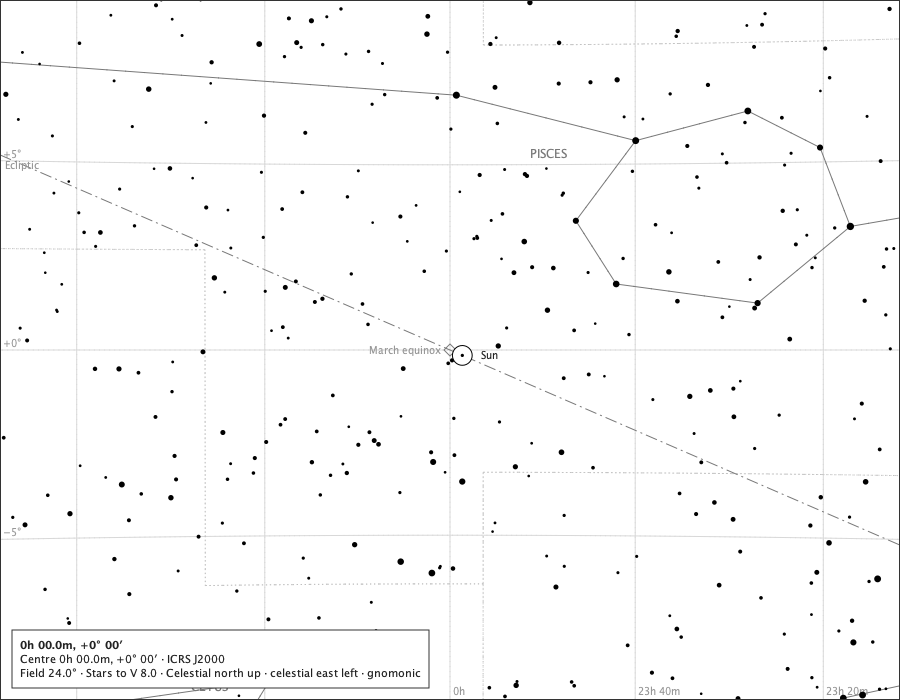
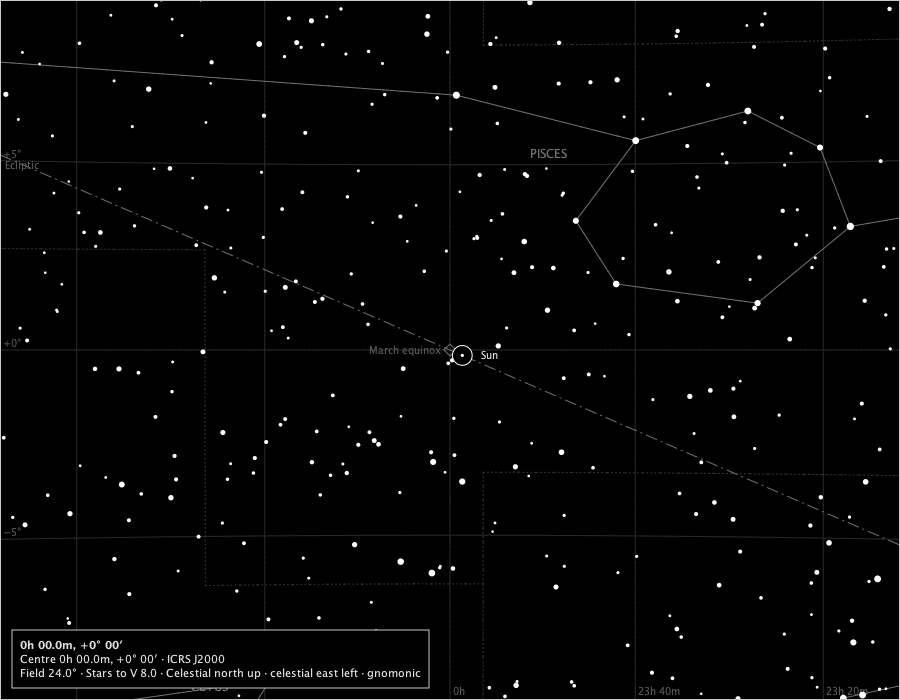
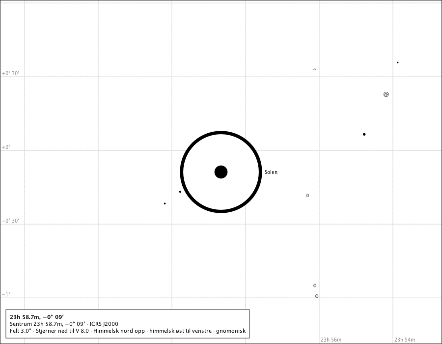
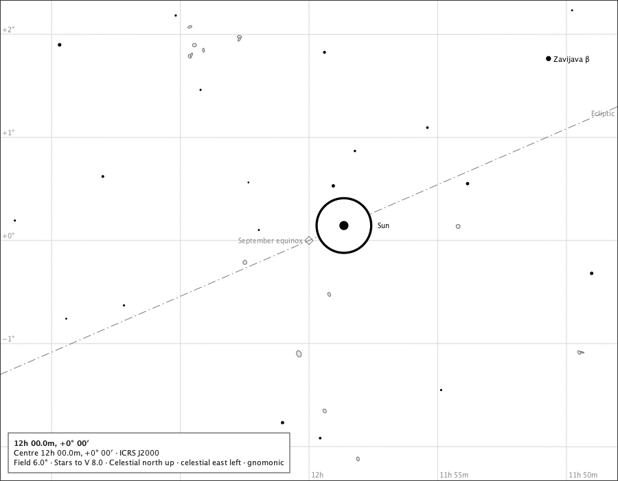
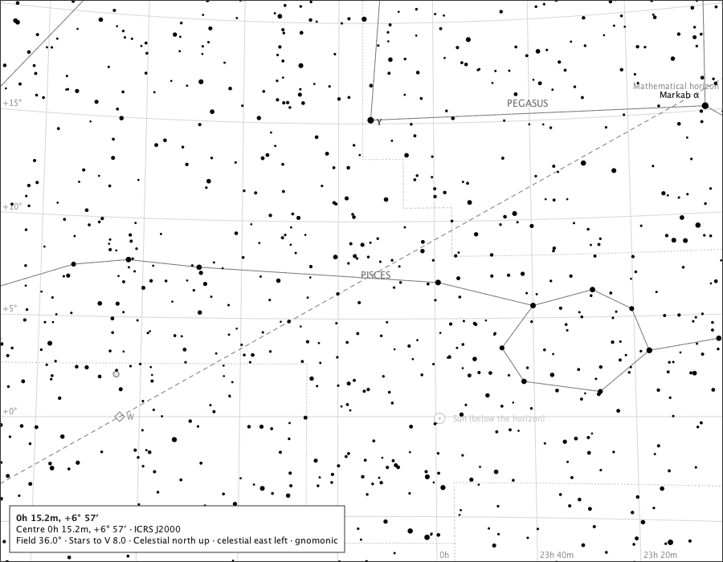
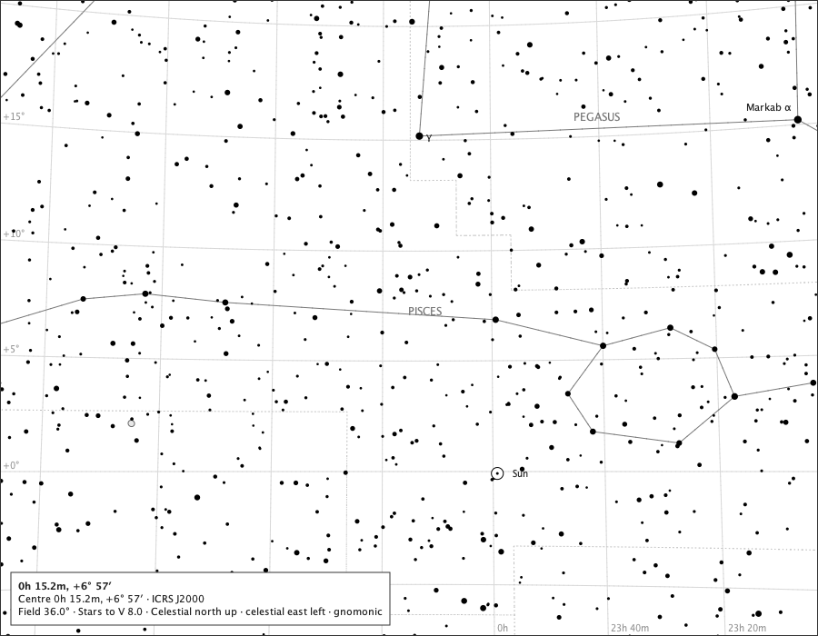

# The Sun on the chart

Sprint 37, issue #415. The production composition - `ChartComponent` over the bundled catalogue, with the Solar System module attached and the Sun switched on - on the pages the #414 ruling was made over. Production ink only: a true-scale ring with its centre dot in the page's own ink, its name in an adjacent box or not at all, dimmed below a drawn horizon. Positions are the ephemeris's for the instant and observer stated. Regenerate with `make sun-on-the-chart-study`.

## The March equinox page at the IMCCE's equinox instant, Oslo

The Sun on the ecliptic at RA 0h, 18.6° above Oslo's horizon; the ecliptic's own equinox landmark sits under it, its word takes a box clear of the disc, and the Sun's name takes another, never both meanings in one label. Drawn: Sun at (462.3, 355.4), disc 19.8 px, name placed;

## The same page on the black sky

The same ring and dot in the black sky's star ink. Drawn: Sun at (462.3, 355.4), disc 19.8 px, name placed;

## The Sun at 3°, the page's words in Norwegian

The disc at true scale, 160 px across on a 3° page, named *Solen*. Drawn: Solen at (450.0, 350.0), disc 160.5 px, name placed;

## The September equinox page at the IMCCE's equinox instant, Oslo, 6° field

The Sun at its exact position and true size, a little west of the J2000 landmark by precession; the landmark's word takes a box beside its own diamond clear of the disc, and the Sun's name yields after it. Drawn: Sun at (500.8, 328.2), disc 79.6 px, name placed;

## The horizon page nearest the Sun, 2026-03-20 18:30 UTC at Oslo, 36° field

The Sun -8.1° below the drawn mathematical horizon: dimmed towards the ground, its name carrying the status. Drawn: Sun (below the horizon) at (547.2, 521.1), disc 13.2 px, name placed;

## The same page with the horizon hidden

With no horizon drawn, the celestial chart draws the Sun normally, as ruled (C4). Drawn: Sun at (547.2, 521.1), disc 13.2 px, name placed;

